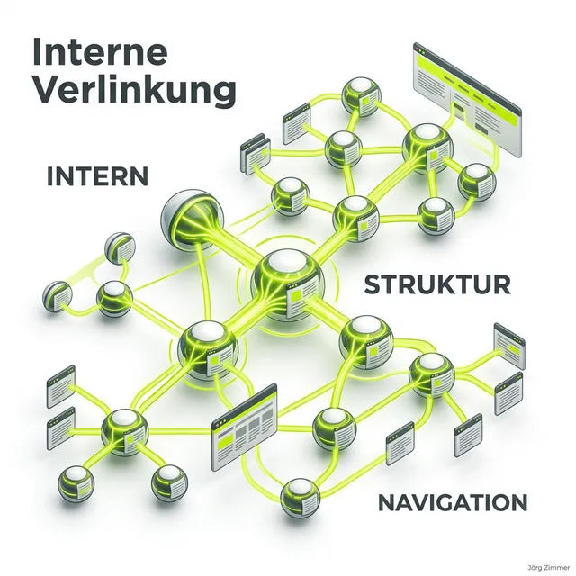

Moin! 

  
 Jörgs SEO-Klartext (LinkedIn Insights)

  
"Große Agenturen verkaufen dir gerne einen Junior für den Preis eines Seniors. Ich verkaufe dir meine 24 Jahre Erfahrung, komprimiert auf das, was funktioniert."

Viele Webseitenbetreiber vernachlässigen dieses Thema sträflich und verlassen sich rein auf ihre Hauptnavigation. Doch die wahre SEO-Magie passiert in der kontextuellen Verlinkung innerhalb deiner Texte. Die interne Verlinkung ist das Navigationssystem für den Googlebot und die wichtigste Methode, um [Linkjuice](/glossar/linkjuice/) gezielt auf deine wertvollsten Verkaufs- oder Ratgeberseiten zu lenken.

## Die drei Hauptziele interner Links

Ein strategisch klug gesetzter interner Link erfüllt drei Aufgaben gleichzeitig:

1.  **Indexierungshilfe (Crawlability):** Neue Artikel werden viel schneller von Suchmaschinen gefunden ([Crawling](/glossar/crawling-vs-indexing/)), wenn sie von der Startseite oder von starken Themen-Hubs aus verlinkt sind. Ohne interne Links entstehen "Orphan Pages" (verwaiste Seiten), die Google oft komplett ignoriert.
2.  **Nutzerführung (UX):** Interne Links halten den Nutzer länger auf der Seite. Wer einen Artikel über "Title Tags" liest, freut sich über einen weiterführenden Link zu "Meta Descriptions". Das senkt die Absprungrate (Bounce Rate) und erhöht die Verweildauer.
3.  **Autoritäts-Transfer:** Links vererben Rankingkraft. Durch interne Links sagst du Google: *"Diese Seite hier ist mein wichtigstes Experten-Stück zu diesem Thema"*.

  <h4 class="text-xl font-bold text-dark mb-2 mt-0">Best Practice: Die Silo-Struktur</h4>
  
Ordne deine Inhalte in Themen-Clustern (Silos) an. Verlinke innerhalb eines Themas (z.B. "Google Ads") so tief und oft wie möglich miteinander. Vermeide es aber, ohne triftigen inhaltlichen Grund kreuz und quer von "Hundefutter" zu "Cloud-Software" zu verlinken. Das verwässert die semantische Relevanz deines Clusters.

## So optimierst du deine interne Linkstruktur

In meinen [SEO-Beratungen in Berlin](/seo-freelancer-berlin/) ist die Reparatur der internen Verlinkung oft der erste Schritt. Hier sind die wichtigsten Regeln:

### 1. Aussagekräftige Ankertexte (Anchor Texts)
Verzichte auf Links wie "hier klicken" oder "mehr lesen". Das ist für Suchmaschinen völlig wertlos. Nutze stattdessen das Ziel-Keyword als Linktext. Wenn du auf eine Seite über SEO-Preise verlinkst, nenne den Link auch "[SEO-Freelancer Preise](/blog/se-ranking-preise/)". Professionelle SEO-Tools wie <a href="https://seranking.com/de/?ga=4169588&source=link" target="_blank" rel="noopener noreferrer">SE Ranking</a> helfen dir dabei, die Relevanz deiner Ankertexte zu optimieren.

### 2. Die Link-Tiefe minimieren
Jede wichtige Seite deiner Website sollte mit maximal drei Klicks von der Startseite aus erreichbar sein. Je tiefer eine URL in der Hierarchie vergraben ist, desto weniger Linkjuice kommt dort an und desto seltener wird sie gecrawlt.

### 3. "The Power of First": Link-Positionierung
Links, die ganz oben im Einleitungstext eines Artikels stehen, erhalten statistisch mehr Aufmerksamkeit von Nutzern und eine höhere Gewichtung durch den Google-Algorithmus als Links, die irgendwo unten im Footer oder in der Seitenleiste versteckt sind.

## Interne Verlinkung für moderne KI-Systeme ([GEO](/glossar/geo/))

KI-Suchmaschinen wie Perplexity oder ChatGPT versuchen, Themen ganzheitlich zu begreifen. Wenn du über eine "Entität" schreibt (z.B. ein spezifisches Software-Tool), helfen interne Links diesen Systemen dabei, die Grenzen deines Expertenwissens zu erkennen. 

Durch eine dichte interne Vernetzung signalisierst du, dass du nicht nur einen einzigen Artikel zu einem Schlagwort hast, sondern ein ganzes Ökosystem an Wissen (Topical Authority). In KI-generierten Antworten wirst du eher als Primärquelle herangezogen, wenn die KI sieht, dass deine "Knowledge Node" (dein Wissensknotenpunkt) im Web durch viele interne Referenzen gestärkt wird. Wie man diese Sichtbarkeit in LLMs misst, erfährst du auch in meinem Beitrag zum [Rankscale AI Tracking](/blog/rankscale-ai-visibility-tracking-17-llms/).

## Mein Tacheles-Rat für dich

Die interne Verlinkung ist die unterschätzte Superkraft im On-Page SEO. Sie kostet kein Geld, erfordert keine Zustimmung von Dritten und liefert sofortige Ergebnisse. Behandle deine Website wie eine gut sortierte Bibliothek: Sorge für klare Wegweiser, verlinke verwandte Themen eng miteinander und führe deine Leser (und die Bots) behutsam zu deinen wichtigsten Inhalten. Wer seine interne Linkkraft beherrscht, beherrscht seine Sichtbarkeit.

ALOHA 🌻 

---

  <h3 class="text-2xl font-bold mb-4">Hast du ein löchriges Link-Netz?</h3>
  
Ich analysiere deine interne Verlinkung und zeige dir genau, wie wir deinen Linkjuice optimal verteilen. Lass uns deine Power maximieren.

  <a href="/kontakt/" class="btn-primary inline-flex">Jetzt Link-Audit anfragen </a>

* [Was ist eigentlich Linkjuice?](/glossar/linkjuice/)
* [Crawling vs. Indexing verstehen](/glossar/crawling-vs-indexing/)
* [Linkbuilding: Externe Links strategisch aufbauen](/glossar/linkbuilding/)
