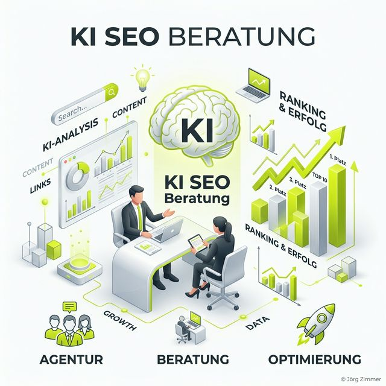

Moin! 🌻

Die SEO-Welt brennt. Und viele Agenturen rufen "Feuer!", während sie versuchen, den Brand mit Benzin (minderwertigem KI-Content) zu löschen. Wir befinden uns im größten Umbruch seit dem Go-Live von Google. Wer heute noch glaubt, dass ein bisschen Keyword-Recherche und ein paar Backlinks reichen, der hat den Schuss nicht gehört.

**KI SEO Beratung** ist heute kein "Nice-to-have" mehr. Es ist die Lebensversicherung für deine digitale Relevanz. In einer Welt, in der Nutzer Fragen stellen und direkte Antworten erhalten, statt Listen von Links zu durchsuchen, musst du als **Entität** unerschütterlich feststehen.

## Agentur, Beratung, Optimierung: Der Dreiklang des Erfolgs

Wenn wir über KI SEO sprechen, meinen wir drei Disziplinen, die nahtlos ineinandergreifen müssen:

1.  **Die Beratung (Strategie):** Hier legen wir fest, in welchen Szenarien deine Marke auftauchen muss. Geht es um Produktberatung? Um Expertenstatus? Oder um lokale Dominanz? Ohne Kompass ist jede Optimierung nur unnötiger Aufwand.
2.  **Die Optimierung (Technik & Content):** Hier wird "geschraubt". Wir machen deinen Content [RAG-ready](/glossar/rag/), bügeln den Pfusch am Bau bei den strukturierten Daten aus und sorgen dafür, dass Reasoning Engines deine Fakten glasklar extrahieren können.
3.  **Die Agentur-Leistung (Execution):** Das ist das "Machen". Die kontinuierliche Überwachung der KI-Sichtbarkeit, das Nachjustieren bei Modell-Updates und das proaktive Besetzen neuer KI-relevanter Themenfelder.

## Warum klassische Agenturen oft versagen

Die meisten Agenturen sind auf Skalierbarkeit getrimmt. KI-Optimierung ist aber das Gegenteil von Fließbandarbeit. Es ist Maßarbeit. Ein LLM (Large Language Model) bewertet Inhalte nicht nach starren Checklisten, sondern nach semantischer Tiefe und [E-E-A-T Signalen](/glossar/e-e-a-t/).

Wer hier versucht, mit "KI-Massenware vom Praktikanten" zu punkten, landet in der **AI-Trap**. Eine seriöse **KI SEO Beratung** erkennt man daran, dass sie mehr über Datenqualität und Entitäten spricht als über Wortanzahl und Keyword-Dichte.

---

## Jörgs SEO-Klartext: "Kein Platz für Bauchläden"

> **Tacheles:** Ich sehe jeden Tag Agenturen, die sich 'KI-ready' schimpfen, aber nicht einmal den Unterschied zwischen einem Index-Bot und einem KI-Crawler erklären können. Das ist gefährlich. Ein fehlerhafter Relaunch oder ein kaputtes Kategoriensystem kostet euch heute nicht nur Google-Rankings, sondern schließt euch komplett aus dem KI-Ökosystem aus. Wer keine Lust auf 'Pfusch am Bau' hat, braucht jemanden, der die Finger in die Wunde legt, bevor es weh tut. 🦖

In meiner Zeit als Goldfisch auf Espresso (ja, so fühlt sich die KI-Entwicklung manchmal an) habe ich gelernt: Die Basics sind wichtiger denn je. Aber die Basics von heute heißen nicht mehr nur `H1` und `Meta-Title`. Sie heißen **Semantic Engineering**.

## Checkliste: Was eine gute KI SEO Beratung liefern muss

1.  **Interdisziplinäres Wissen:** Verständnis von klassischem SEO, [GEO](/glossar/geo/) und den Grundlagen generativer KI.
2.  **Deterministische Daten:** Analyse auf Basis von harten Fakten, nicht auf vagen KI-Halluzinationen (siehe [GEO Audit](/glossar/geo-audit/)).
3.  **Entity-First Ansatz:** Fokus auf den Aufbau deiner Marke als verifizierbare Wissens-Entität.
4.  **Modernes Toolset:** Einsatz von KI-Tracking-Tools wie [Rankscale](/blog/rankscale-ai-visibility-tool/) für echtes Monitoring.
5.  **Senior-Begleitung:** Direkter Zugriff auf Experten-Wissen ohne "Junior-Filter".

## Fazit: Die Antwort-Ära hat begonnen

Die Suche hat sich verändert. Die Nutzer haben sich verändert. Und deine Strategie muss es auch. **KI SEO Beratung** ist der Weg, um in einer Welt von ChatGPT, Gemini und SearchGPT nicht nur ein Statist zu sein, sondern der Hauptdarsteller in den Antworten deiner Kunden.

Hört auf, für Maschinen zu schreiben. Fangt an, Antworten für Menschen zu strukturieren, die von Maschinen präsentiert werden.

ALOHA! 🌻✌️

---

  <h3 class="text-2xl font-bold mb-4">Bereit für echte KI SEO Optimierung?</h3>
  
Lass uns den Bauchladen-Ansatz beenden. Mit einer fundierten KI SEO Beratung machen wir dich zum Star in den Reasoning Engines. Seniorität, Tacheles und echtes Handwerk – ohne Praktikanten-Pfusch.

  <a href="/kontakt/" class="btn-primary inline-flex">Jetzt Beratung anfragen</a>

### Verwandte Begriffe & Leseempfehlungen
* [KI Sichtbarkeit messen mit Rankscale](/blog/rankscale-ai-visibility-tool/)
* [Was ist GEO?](/glossar/geo/)
* [RAG: Die Technik hinter den Antworten](/glossar/rag/)
* [Die Bedeutung von Entitäten](/glossar/entitaet/)
* [GEO Audit: Der Check für deine Seite](/glossar/geo-audit/)
