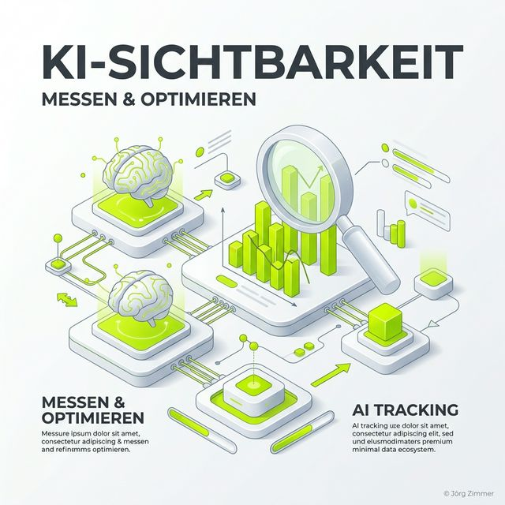

Moin! 🌻

"Jörg, brauchen wir dieses KI-SEO-Ding wirklich oder ist das nur der nächste Hype, den wir aussitzen können?"

Diese Frage höre ich in meinen Beratungsstunden fast täglich. Und ganz ehrlich: Ich verstehe die Skepsis. Wir haben in den letzten 24 Jahren so viele Trends kommen und gehen sehen. Aber dieses Mal ist es anders. Wir reden hier nicht über ein neues Google-Update, das ein bisschen am Algorithmus schraubt. Wir reden über die größte Transformation der Suche seit dem Start von Google im Jahr 1998.

Wenn du heute wissen willst, wie man die **KI Sichtbarkeit messen & optimieren** kann, dann bist du hier richtig. Wir legen den Finger in die Wunde und schauen uns an, warum dein altes Reporting in 2026 nur noch die halbe Wahrheit erzählt.

## Was ist KI-Sichtbarkeit eigentlich? (Mehr als nur Platz 1)

Vergiss für einen Moment alles, was du über "Position 1" gelernt hast. In der Welt der Large Language Models (LLMs) wie ChatGPT, Claude oder Google Gemini gibt es keine klassische Ergebnisliste mehr. Es gibt eine Antwort – und diese Antwort ist das Ergebnis aus tausenden von Quellen, die die KI in Sekundenbruchteilen gescannt hat.

**KI-Sichtbarkeit** (AI Visibility) ist der Grad, zu dem deine Marke, deine Produkte oder deine Expertise in genau diesen Antworten stattfinden. 

### Die drei Säulen der KI-Präsenz:
1.  **Citations (Zitate):** Die KI verlinkt dich explizit als Quelle. Das ist der Goldstandard, vergleichbar mit einem Backlink, nur mit deutlich höherer Klickwahrscheinlichkeit, da der Nutzer bereits im "Lösungen-Modus" ist.
2.  **Mentions (Nennungen):** Dein Name fällt, aber ohne Link. Die KI schreibt: "Experten wie Jörg Zimmer empfehlen..." – das ist extrem wertvoll für dein E-E-A-T (Experience, Expertise, Authoritativeness, Trustworthiness).
3.  **Sentiment (Stimmung):** Wie spricht die KI über dich? Bist du die "kostengünstige Alternative" oder der "Marktführer für Qualität"? Das Sentiment entscheidet darüber, ob der Nutzer am Ende bei dir kauft oder bei der Konkurrenz.

  
 💬 Jörgs SEO-Klartext (LinkedIn Insights)

  
"Rankings sind Vanity-Metriken. In der KI-Suche zählt nur noch Relevanz und Empfehlung. Wer nicht in der Antwort steht, hat für den Nutzer nicht stattgefunden. Punkt."

## Warum klassisches SEO-Tracking nicht mehr reicht

Klassische Tools wie die Google Search Console zeigen dir Klicks und Impressionen. Das ist super. Aber sie zeigen dir nicht, was die KI über dich denkt. Sie zeigen dir nicht, ob ChatGPT deinen Blogpost als Trainingsmaterial nutzt oder ob Gemini dich in den neuen **AI Overviews** (früher SGE) als Top-Lösung präsentiert.

Der Prozess der Informationssuche hat sich verändert. Früher war es: Keyword ➔ Ergebnisliste ➔ Klick. Heute ist es: Frage ➔ KI-Antwort ➔ (vielleicht) Klick. Wenn du nur den Klick misst, verpasst du 80% der Markenbildung, die bereits in der Antwort stattfindet.

### Vergleich: Klassisches SEO vs. KI Sichtbarkeit

| Feature | Klassisches SEO (SERP) | KI Sichtbarkeit (LLM) |
|---|---|---|
| **Messwert** | Position (1-100) | Citation Share / Mentions |
| **Nutzererfahrung** | Scan von Titeln & Snippets | Lesen einer zusammenhängenden Antwort |
| **Erfolgsfaktor** | Backlinks & Keywords | E-E-A-T & Entitäten-Daten |
| **Volatilität** | Moderat (Core Updates) | Hoch (Modell-Updates) |
| **Kanal** | Google, Bing | ChatGPT, Claude, Gemini, Perplexity |

## KI Sichtbarkeit messen: So bringst du Licht ins Dunkel

Wie misst man also etwas, das so dynamisch ist wie eine KI-Antwort? Früher haben wir uns manuell durch ChatGPT-Prompts geklickt, aber das ist (wie die Deutsche Bahn) unzuverlässig und dauert viel zu lange. Wir brauchen Daten im industriellen Maßstab.

Genau hier kommen Tools wie der **SE Ranking AI Tracker** ins Spiel. 

### Das Toolkit für den digitalen Senior
Wenn du deine Sichtbarkeit wirklich verstehen willst, musst du automatisieren. Ein professioneller **AI SEO Visibility Check** umfasst heute:
-   **Tracking von AI Overviews**: Erscheinst du in den neuen Google-Boxen oberhalb der organischen Ergebnisse?
-   **Link-Tracking**: Welche deiner Seiten werden von der KI als Quellen bevorzugt?
-   **Wettbewerbs-Analyse**: Wer sind die neuen Player, die du in den klassischen SERPs vielleicht gar nicht auf dem Schirm hattest, die aber in der KI dominieren?

Professionelle Tools wie <a href="https://seranking.com/de/ki-sichtbarkeit-tools.html?ga=4169588&source=link" target="_blank" rel="noopener noreferrer">SE Ranking</a> ermöglichen es dir, genau diese Daten in dein wöchentliches Reporting zu gießen. Das ist Tacheles-Marketing: Keine Vermutungen, sondern harte Zahlen.

## Optimierung: Der Weg zu mehr KI-Präsenz (GEO)

Wenn du weißt, wo du stehst, kannst du optimieren. Das nennen wir **GEO** (Generative Engine Optimization). Es ist kein Hexenwerk, sondern technisches Handwerk auf Steroiden.

### 1. Entitäten-Stärkung durch Schema Markup
Die KI muss verstehen, wer du bist und was du tust. Nutze [Technisches Schema Markup](/glossar/technisches-schema-markup/) exzessiv. Deine Website darf keine Sammlung von Texten sein, sondern muss eine Datenbank von Fakten werden. Wenn die KI deine Daten maschinenlesbar serviert bekommt, steigt die Chance auf eine Zitation massiv.

### 2. E-E-A-T: Beweise deine Autorität
KI-Modelle sind darauf trainiert, vertrauenswürdige Quellen zu bevorzugen. Wenn du über "SEO-Strategie" schreibst, solltest du beweisen, dass du seit 2001 dabei bist (so wie ich). Erwähnungen auf namhaften Portalen, Profile bei LinkedIn und konsistente Daten im Netz sind das Futter für die KI.

### 3. Informationslücken schließen
Analysiere die KI-Antworten deiner Wettbewerber. Was sagt die KI über sie, was sie über dich nicht sagt? Fehlen dir Daten, Fallstudien oder klare Definitionen? Nutze den [AI Tracker von SE Ranking](https://seranking.com/de/ki-sichtbarkeit-tools.html?ga=4169588&source=link), um diese Lücken zu identifizieren und gezielt Content nachzulegen.

  <h3 class="text-2xl font-bold mb-4">Bereit für die Zukunft der Suche?</h3>
  
Hör auf zu raten. Miss deine KI-Sichtbarkeit mit echten Daten. Mit meiner Empfehlung für SE Ranking bekommst du das volle Paket für deine AI Search Optimization – direkt vom Profi.

  <a href="https://seranking.com/de/ki-sichtbarkeit-tools.html?ga=4169588&source=link" target="_blank" rel="noopener noreferrer" class="btn-primary inline-flex">Jetzt KI-Sichtbarkeit tracken </a>

## Fazit: Wer jetzt wartet, hat schon verloren

Wir befinden uns in einer Phase der "Normalisierung des Wahnsinns". Dass etablierte Player wie SE Ranking AI-Tracking integrieren, zeigt uns: Das ist kein Trend für Nerds mehr. Es ist das neue Fundament unseres Geschäfts.

Wer heute anfängt, seine **KI Sichtbarkeit zu messen & zu optimieren**, sichert sich die Claims von morgen. Wer wartet, bis der "Praktikant mal drüberschaut", wird von der Konkurrenz rechts liegen gelassen. So einfach ist das.

In diesem Sinne: Bleib nützlich, bleib ehrlich und leg den Finger in die Wunde.

ALOHA! 🌻✌️
