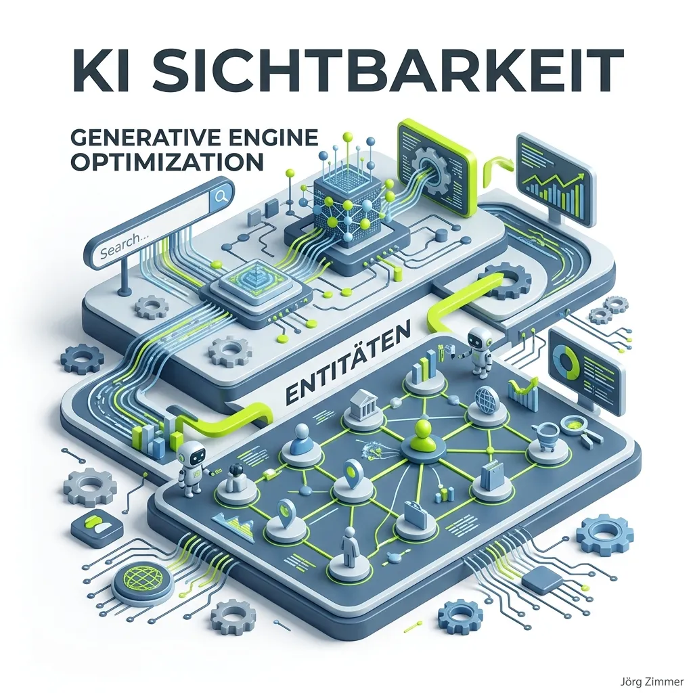

Moin! 🌻

Vergiss für einen Moment die klassischen "blauen Links" und das ewige Schielen auf Platz 1 bei Google. Wir stehen inmitten der größten Verschiebung im Suchverhalten seit der Erfindung der Suchmaschine: **KI Sichtbarkeit** (auch bekannt als Generative Engine Optimization, GEO oder AI Engine Optimization). Wenn deine Zielgruppe heute ChatGPT, Perplexity oder die Google AI Overviews nach Lösungen fragt, bist du dann die Quelle, die zitiert wird? Oder füttert die KI ihre Nutzer mit dem Wissen der Konkurrenz?

## Was bedeutet GEO und was ist KI Sichtbarkeit?

KI Sichtbarkeit beschreibt, wie stark deine Marke, deine Produkte oder deine Inhalte von generativen KI-Modellen (Large Language Models wie GPT-4 oder Claude) wahrgenommen und in deren Antworten zitiert werden.

Früher (und damit meine ich vor 2 Jahren) war das Ziel klar: Du optimierst für ein Keyword, rankst in den Top 3 und sammelst den [Traffic](/glossar/traffic/) ein. Heute beantwortet die KI die Frage direkt. Der Klick auf die Website bleibt aus ([Zero Click Content](/glossar/zero-click-content/)). Das Ziel von KI Sichtbarkeit ist es nicht zwingend, Klicks zu maximieren, sondern als **die Autorität** in den Antworten der KI stattzufinden.

  
💬 Jörgs SEO-Klartext (LinkedIn Insights)

  
"Wer heute noch glaubt, dass SEO nur daraus besteht, grüne Ampeln in Yoast zu jagen, hat den Einschlag nicht gehört. GEO, AIO, AI-SEO... nennt es wie ihr wollt, aber warum ihr bitte NICHT den Praktikanten dransetzen solltet: AI-Strategie ist Chefsache. Es geht um pure Markenmacht."

## SEO vs. GEO: Wo liegt der Unterschied?

Wir müssen Tacheles reden: Klassisches SEO ist nicht tot, es ist das zwingende Fundament. Aber Generative Engine Optimization (GEO) hat andere Spielregeln.

| Merkmal | Klassisches SEO | Generative Engine Optimization ([GEO](/glossar/geo/)) |
| :--- | :--- | :--- |
| **Primäres Ziel** | Ranking in Suchergebnissen, Klicks jagen | Erwähnungen, Zitate, Sichtbarkeit in KI-Antworten |
| **Fokus-Metriken** | Keywords, Backlinks, SERP-Positionen | Semantische Relevanz, [Entitäten](/glossar/entitaet/), Zitierfähigkeit |
| **Das Ergebnis** | Die klassischen "Blauen Links" | Synthetisierte, KI-generierte Antworttexte |

Wenn du dich nur auf Keywords fokussierst, baust du Pfusch am Bau. KI-Modelle denken nicht in Keywords, sie denken in Konzepten, Beziehungen und Wahrscheinlichkeiten.

## Wie werde ich für die KI sichtbar? (Der Blueprint)

Die Aufmerksamkeitsspanne des modernen Nutzers gleicht einem Goldfisch auf Espresso. Die KI filtert das Rauschen für ihn. Wie kommst du durch diesen Filter?

### 1. Werde zur unumstrittenen Entität
KI-Systeme lernen durch "Co-Occurrence" – das gemeinsame Auftreten von Begriffen. Wenn dein Name oder deine Marke ständig im Zusammenhang mit "SEO-Audit" oder "B2B Marketing" im Netz auftaucht, verknüpft die KI diese Konzepte. Du musst eine unmissverständliche [Entität](/glossar/entitaet/) in deinem Fachgebiet werden.

### 2. E-E-A-T ist dein bester Freund
[E-E-A-T](/glossar/e-e-a-t/) (Experience, Expertise, Authoritativeness, Trustworthiness) ist für LLMs noch wichtiger als für den klassischen Google-Algorithmus. Warum? Weil KIs halluzinieren können und deshalb (in ihren System-Prompts) angewiesen sind, besonders vertrauenswürdige Quellen zu bevorzugen.

### 3. Mach deine Inhalte "maschinenlesbar"
Strukturiere deine Inhalte radikal klar. Nutze sinnvolle H2/H3-Überschriften, kurze prägnante Zusammenfassungen und FAQ-Sektionen. Je einfacher ein LLM deine Inhalte parsen und verstehen kann, desto wahrscheinlicher das Zitat. Das richtige Schema-Markup ist hier Pflichtprogramm.

### 4. Biete echten "Information Gain"
Wenn du nur das zusammenfasst, was ohnehin schon im Netz steht, bist du für die KI nutzlos. Sie hat das alles schon in ihren Trainingsdaten. Du brauchst Originalität: Eigene Daten, harte Praxis-Cases, steile Thesen. Dinge, die man nicht aus Wikipedia abschreiben kann.

## Tacheles zum Schluss

Die "Tracking-Hölle" und das sture Zählen von Klicks wird uns in der KI-Ära nicht weiterbringen. Die Metrik der Zukunft ist Share of Voice in den KI-Engines. Wer in den Antwortboxen der KI genannt wird, hat gewonnen. Wer nicht vorkommt, existiert schlichtweg nicht.

Habe fertig.

ALOHA! 🌻✌️

### Verwandte Themen & Lese-Tipps
*   [GEO: Was ist Generative Engine Optimization?](/glossar/geo/)
*   [AI SEO: Die Zukunft der Suchmaschinenoptimierung](/glossar/ai-seo/)
*   [Entitäten: Warum Keywords ausdienen](/glossar/entitaet/)
*   [Zero Click Content: Überleben ohne Traffic](/glossar/zero-click-content/)
