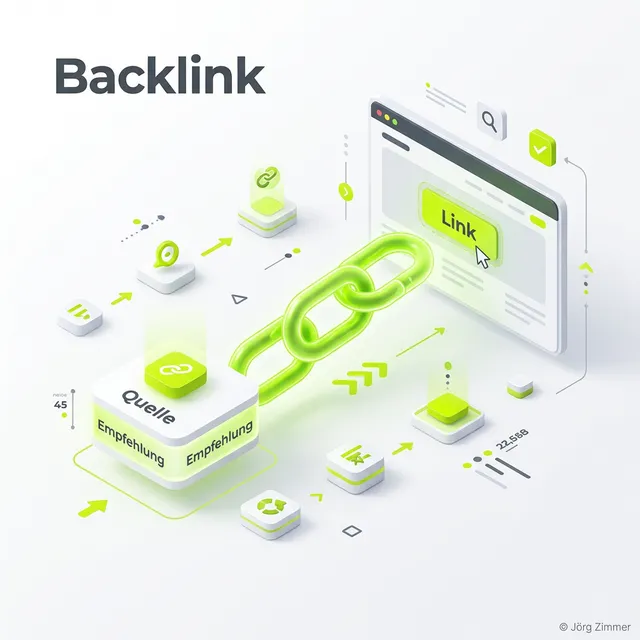

Moin! 🌻

Stell dir das World Wide Web als ein riesiges Netz aus Straßen vor. Die Straßen sind die Links. Ohne diese Verbindungen bist du eine verdammte Geisterstadt – niemand weiß, dass du existierst, weder Nutzer noch der Googlebot.

In der harten Realität der SEO unterscheiden wir zwei Disziplinen: Das **Linkbuilding** (Fremde verlinken auf dich) und die **Interne Verlinkung** (Du verlinkst auf dich selbst).

  
💬 Jörgs SEO-Klartext (LinkedIn Insights)

  
"Massenhafter Linkkauf in obskuren Netzwerken ist der schnellste Weg, deine Domain zu beerdigen. Klasse schlägt Masse. Ein einziger harter Link von einem Fachmagazin pulverisiert 1.000 Spam-Links."

---

## Linkbuilding: Deine digitale Reputation

**Linkbuilding** (OffPage-SEO) ist die brutale Königsdisziplin. Es geht darum, dass andere, starke Websites freiwillig auf deinen Content verlinken. Früher konntest du mit schrottigen Verzeichnis-Links ranken, heute ist das ein Ticket für die Google Penalty.

Warum hart verdientes Linkbuilding für dich überlebenswichtig ist:
1.  **Trust-Signal:** Ein Backlink ist eine digitale, fälschungssichere Empfehlung.
2.  **Ranking-Boost:** Ohne starke Backlinks rankst du für umkämpfte Keywords im B2B exakt nirgendwo.
3.  **Traffic:** Hochwertige Links bringen qualifizierte Nutzer direkt auf deine Money Pages.

Um diesen harten Kampf messbar zu machen, nutze ich <a href="https://seranking.com/de/?ga=4169588&source=link" target="_blank" rel="noopener noreferrer">SE Ranking</a>. Dort siehst du schonungslos, welche Backlinks dein Profil stärken und welche giftig sind.

## Interne Verlinkung: Der Masterplan für deinen Linkjuice

Beim Linkbuilding bettelst du andere um Links an. Bei der **internen Verlinkung** hast du 100% Kontrolle. Du bist der verdammte Architekt.

Dein Job ist es, den [Linkjuice](/glossar/linkjuice/) (die Ranking-Power) so clever zu steuern, dass deine Verkaufsseiten maximal davon profitieren. Eine schlaue interne Verlinkung hält den Nutzer auf der Seite und senkt die Bounce Rate – ein gigantisches Signal für deine Relevanz.

### Die eisernen Regeln der internen Verlinkung:
*   **Ankertexte:** "Hier klicken" ist Müll. Nutze harte Keywords als Linktext, z.B. "[Local SEO Strategien](/glossar/local-seo/)".
*   **Kontext:** Verlinke nur das, was dem Nutzer in exakt diesem Moment weiterhilft.
*   **Silo-Power:** Leite die Kraft deiner stärksten Ratgeber-Artikel gezielt auf deine wichtigsten Service-Seiten.

  <h4 class="text-xl font-bold text-dark mb-2 mt-0">⚠️ Warnung: Das Linkaufbau-Risiko</h4>
  
Übertreib es nicht mit exakten Money-Keyword-Ankern beim externen Linkbuilding. Zu viele harte Keywords in externen Links triggern Googles Spam-Filter. Bau dein Profil natürlich auf.

## Linkbuilding im KI-Zeitalter (Entity SEO)

In Zeiten von [Entity SEO](/glossar/entity-seo/) sind Links nicht nur "Ranking-Punkte", sondern semantische Brücken. Wenn thematisch extrem relevante Seiten auf dich verlinken, zementiert das deine [Entität](/glossar/entitaet/) im Knowledge Graph.

Das beweist deine Expertise ([E-E-A-T](/glossar/e-e-a-t/)). Und rate mal, wen KI-Modelle wie ChatGPT oder Claude als Quelle zitieren? Denjenigen, der die stärksten digitalen Empfehlungen der Branche hat.

## Mein Tacheles-Rat für dich

Mach deine Hausaufgaben: Bau erst eine makellose interne Verlinkung, bevor du auch nur einen Cent in externes Linkbuilding steckst. Und wenn du extern baust: Nutze digitale PR, erstelle krasse Studien und zwinge die Fachpresse, über dich zu berichten. Wer Links verdient, dominiert die Rankings.

ALOHA! 🌻✌️

---

  <h3 class="text-2xl font-bold mb-4">Braucht deine Domain mehr Power?</h3>
  
Lass uns deine interne Verlinkung fixen und einen Angriffsplan für sauberes, autoritäres Linkbuilding erstellen. Keine Spam-Links, nur reine Relevanz.

  <a href="/kontakt/" class="btn-primary inline-flex">Jetzt Link-Audit anfragen</a>

