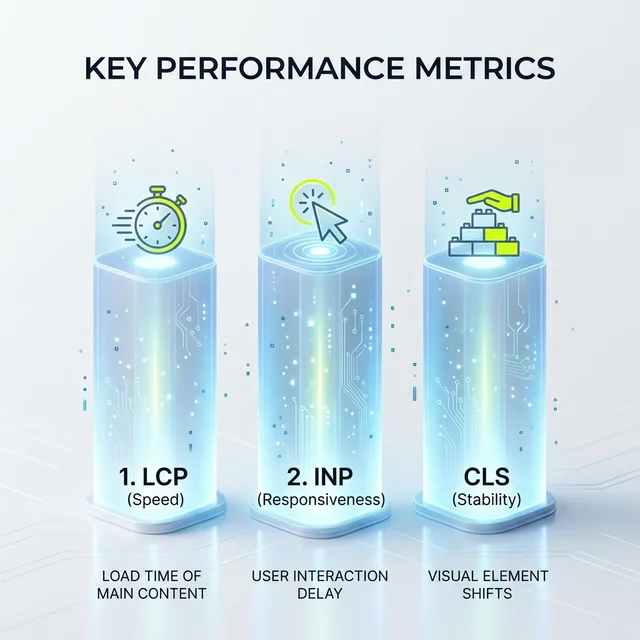

Moin!

Linkjuice (häufig auch "Linkkraft" oder "Link Equity" genannt) ist einer der mächtigsten Begriffe in der SEO. Google spricht intern trocken vom [PageRank](https://en.wikipedia.org/wiki/PageRank) – benannt nach Gründer Larry Page. In der Szene reden wir vom "Link-Saft", weil es perfekt beschreibt, wie Autorität und Vertrauen durch das Web fließen.

  
Jörgs SEO-Klartext (LinkedIn Insights)

  
"Dein Linkjuice ist dein wertvollstes On-Page Kapital. Wer Links wahllos im Footer oder in Dropdowns verschleudert, blutet Ranking-Power aus jeder Pore aus."

Jeder Hyperlink von Seite A zu Seite B ist ein hartes Vertrauensvotum. Diese Empfehlung pumpt Autorität von A nach B. Die systematische Kontrolle über diesen Fluss ist der absolute Kern von strategischer interner Verlinkung und OffPage-SEO.

## Wie der PageRank-Fluss (vereinfacht) funktioniert

Stell dir deine Website als ein Netzwerk aus Gefäßen vor. Jedes Gefäß hat eine Menge X an "Saft".

Wenn deine Startseite stark ist (weil z.B. dicke Backlinks darauf zeigen), ist ihr Gefäß randvoll. Setzt du jetzt von der Startseite einen fetten Link auf deinen neuesten Blog-Artikel, fließt dieser Saft dorthin. Der Artikel gewinnt an [Sichtbarkeit](/glossar/sichtbarkeit/). Mit Profitools wie <a href="https://seranking.com/de/?ga=4169588&source=link" target="_blank" rel="noopener noreferrer">SE Ranking</a> können wir genau diesen Zuwachs messen.

  <h3 class="text-xl font-bold text-dark mt-0 mb-4 text-center">Die knallharte Mathematik dahinter</h3>
  

    

      
1

      

        <strong class="block text-dark mb-1">Dämpfungsfaktor (The Damping Factor)</strong>
        
Keine Seite gibt 100% Kraft weiter. Der Dämpfungsfaktor liegt grob bei 0.85. Bei jedem Link-Sprung "versickert" absichtlich ein bisschen Kraft. Darum muss deine Seitenstruktur flach sein!

      

    

    

      
2

      

        <strong class="block text-dark mb-1">Verdünnung durch ausgehende Links</strong>
        
Der Juice wird durch ALLE Links auf der Seite geteilt. Hast du 10 Links, bekommt jeder grob 1/10. Ballerst du 200 Menü-Links in den Footer, verwässerst du jeden einzelnen Link auf einen winzigen Tropfen.

      

    

    

      
3

      

        <strong class="block text-dark mb-1">Der Nofollow-Mythos ist tot</strong>
        
Früher konnte man Links auf <code>rel="nofollow"</code> setzen, um den Linkjuice zu stauen und umzuleiten (PageRank Sculpting). Google hat das längst gekillt. Ein Nofollow-Link "verbrennt" heute seinen Anteil an Kraft einfach. Punkt.

      

    

  

## Faktoren für einen Link, der wirklich knallt

Linkjuice ist nicht gleich Linkjuice. Der Algorithmus ist heute clever und wertet den gesamten Kontext aus.

1.  **Thematische Autorität:** Ein Link vom Auto-Blog zur Bäckerei ist wertloser Spam. Der Linkjuice knallt nur dann richtig rein, wenn absolute fachliche Relevanz gegeben ist.
2.  **Positionierung im Content:** Ein Link direkt oben im ersten Textabschnitt gibt massiv mehr Power weiter als ein liebloser Link ganz unten im Footer.
3.  **Der Ankertext:** Verlinkt jemand auf dich mit "Bester SEO Freelancer", pusht dieser Linkjuice dich knallhart für dieses Keyword.
4.  **Die Nachbarschaft:** Kommt der Link aus einem dubiosen Casino-Netzwerk? Glückwunsch, dein Linkjuice ist toxisch und kann dich via Penalty abschießen.

## Die optimale Verteilung: Hör auf, Kraft zu verschenken

In meinen [SEO-Beratungen in Berlin](/seo-freelancer-berlin/) sehe ich es täglich: Firmen kaufen teure Backlinks, lassen den Juice aber auf der Startseite verrotten, anstatt ihn klug auf die Money Pages zu leiten. Unwichtige AGB- oder Impressumsseiten saugen über die Main Navigation die ganze Power ab.

  <h4 class="text-xl font-bold text-dark mb-2 mt-0">Best Practice: Siloing wie die Wikipedia</h4>
  
Bau Hub-Strukturen! Wenn du einen krassen Ratgeber zu "Google Ads" hast, verlinke ihn extrem engmaschig mit allen Detailartikeln. So zirkuliert der Linkjuice wie in einem geschlossenen Reaktor und Google kapiert sofort, wer der Boss in dieser Nische ist.

## Linkjuice in Zeiten von KI und GEO

Mit dem Aufkommen der KI-Suche ([Generative Engine Optimization](/glossar/geo/)) verändert sich das Spiel brutal.

LLMs berechnen keinen PageRank in Echtzeit. Sie schauen auf *Co-Occurrences* – wie oft dein Name im Trainingsdatensatz im Kontext der Nische auftaucht. Der technische "Linkjuice" wandelt sich in "Semantische Autorität". Wer das ignoriert, begeht einen der tödlichen [80% SEO-Fehler der Zukunft](/blog/80-prozent-seo-fehler-sprechstunde/). Eine dicke Erwähnung ohne Link in der "Wirtschaftswoche" ist für die KI oft wertvoller als 10 harte Backlinks von Nobodys.

## Mein Tacheles-Rat für dich

Linkjuice ist die Lebensader deiner Rankings. Kontrolliere ihn wie ein Diktator. Setze Links strategisch da, wo sie Sinn machen, reduziere irrelevante Links im Menü und bau Themen-Silos. Wer seine interne Linkkraft meistert, meistert Google.

ALOHA! 🌻✌️

---

  <h3 class="text-2xl font-bold mb-4">Verschenkst du wertvollen Linkjuice?</h3>
  
Ich zeige dir schonungslos, wo deine Power versickert. Wir bauen deine Architektur um und leiten die Autorität genau auf die Seiten, die dir Umsatz bringen.

  <a href="/kontakt/" class="btn-primary inline-flex">Jetzt Link-Audit anfragen</a>

### Verwandte Begriffe
* [Was ist Authority?](/glossar/authoritativeness-eeat/)
* [Interne Verlinkung im Detail](/glossar/interne-verlinkung/)ness-eeat/)
* [Interne Verlinkung](/glossar/interne-verlinkung/)
