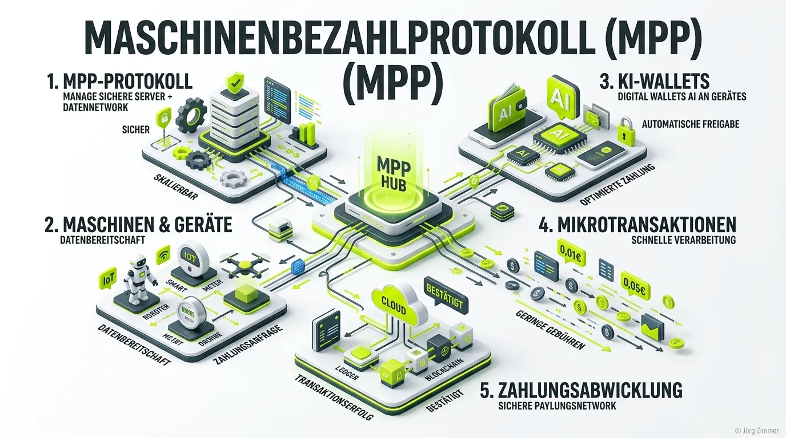

Moin! 🌻

Lass uns direkt Klartext reden. Jahrelang haben wir unsere E-Commerce-Systeme darauf getrimmt, Menschen durch den Checkout zu prügeln. Wir haben Buttons optimiert, Ladezeiten gesenkt und Vertrauenssiegel poliert. Und jetzt? Jetzt kommt die KI und wischt das alles vom Tisch. Wenn du glaubst, ein autonomer Agent klickt sich durch dein liebevoll gestaltetes PayPal-Formular, dann glaubst du auch, dass die Deutsche Bahn morgen pünktlich fährt. 

Die Realität im Juli 2026 heißt **Machine Payment Protocol (MPP)**. KI-Agenten kaufen nicht mehr wie Menschen ein. Sie verhandeln über APIs und zahlen in Echtzeit – und zwar Beträge, bei denen eine normale Banklösung lachend den Raum verlässt.

## Die Evolution der Bezahlung: Wenn Agenten shoppen gehen

Wir sind mittlerweile in einer Welt angekommen, in der ein KI-Assistent selbstständig Serverkapazitäten mietet, Datensätze einkauft oder Rechenleistung bezahlt. Die menschliche Aufmerksamkeitsspanne – auch bekannt als Goldfisch auf Espresso – spielt hier keine Rolle mehr. Es geht um pure Maschineneffizienz. 

### Warum traditionelle Payment-Rails versagen

Traditionelle Finanzwege (Visa, Mastercard, Banküberweisungen) wurden für *dich und mich* gebaut. 
- **KYC (Know Your Customer):** Eine KI hat keinen Pass, den sie hochladen kann.
- **SCA (Strong Customer Authentication):** Wer tippt die SMS-TAN ein, wenn der Server nachts um drei Daten bei einem Drittanbieter einkauft? Niemand.
- **Gebührenstruktur:** Normale Payment-Provider nehmen oft eine Grundgebühr plus Prozentwert. Wenn eine KI aber nur `0,001 Cent` für einen API-Call zahlen will, ist die Transaktionsgebühr höher als der Kaufpreis.

Das ist der klassische Pfusch am Bau in der digitalen Infrastruktur. Wer versucht, KI-Agenten über alte Stripe-Checkouts zu zwingen, wird scheitern.

<strong>Tacheles-Tipp:</strong> Bereite deine Infrastruktur jetzt auf <a href="/glossar/agent-readiness/">Agent-Readiness</a> vor. Wenn deine Services nicht maschinenlesbar bezahlt werden können, bist du für die nächste Generation von Einkäufern schlichtweg unsichtbar.

## So funktioniert das Machine Payment Protocol (MPP)

Die Lösung ist so simpel wie genial. Statt eines visuellen Checkouts läuft der gesamte Prozess über Serverprotokolle und HTTP-Statuscodes – genauer gesagt: **HTTP 402 Payment Required**. 

Hier ist der technische Ablauf in der Praxis:

| Schritt | Menschlicher Käufer (Bauchladen-Standard) | Machine Payment Protocol (Teleschmiede-Weg) |
| :--- | :--- | :--- |
| **1. Anfrage** | Surft auf der Website, legt Artikel in den Korb. | Agent sendet einen API-Request (z.B. für Daten). |
| **2. Kasse** | Füllt Formulare aus, sucht Kreditkarte. | Server antwortet mit **HTTP 402** & Preisliste. |
| **3. Zahlung** | Tippt TAN ein, wartet auf Bestätigung. | Agent nutzt sein **KI-Wallet** & signiert kryptografisch. |
| **4. Abschluss** | Sieht "Danke"-Seite, wartet auf E-Mail. | Server verifiziert Token, liefert Daten in Millisekunden. |

### Die Rolle der KI-Wallets

Damit das Ganze funktioniert, braucht der Agent Geld. Aber du gibst ihm natürlich nicht die Firmenkreditkarte mit unlimitiertem Limit. Hier kommen **KI-Wallets** ins Spiel.

Ein KI-Wallet ist ein streng limitiertes Guthabenkonto, das dem Agenten zur Verfügung steht. Du gibst der KI ein Budget (z.B. 20 Euro am Tag) und definierst genaue Regeln: "Du darfst Datenquellen einkaufen, aber maximal 0,05 Euro pro Anfrage ausgeben." 

Falls der Agent anfängt zu halluzinieren und sinnlos Geld verbrät, ist im schlimmsten Fall nur das kleine Tagesbudget weg. Kein Russisch Roulette mit dem Firmenkonto. Dieses Prinzip der sicheren Autorisierung knüpft perfekt an Systeme wie die [Auth.md](/glossar/auth-md/) Datei an, die Vertrauen im Netz regelt.

## Mikrotransaktionen: Döner-SEO für Maschinen

Das Geheimnis ist Hunger – auch bei KIs. Agenten haben permanenten Bedarf an frischen Daten. Das MPP erlaubt **Mikrotransaktionen**, also Zahlungen im Bruchteil-Cent-Bereich. 

Wir sehen das gerade auf unserer eigenen Teleschmiede-Website: Wenn ein fremder Agent unsere Premium-Datenbanken anzapfen will, schicken wir ihn nicht durch einen Abo-Prozess. Er wird über das [A2A Protocol](/glossar/a2a-protocol/) direkt verhandelt, zahlt via MPP 0,02 Cent pro gecrawltem Datensatz und fertig. So monetarisieren wir unseren Content extrem skalierbar und völlig automatisch.

💬 **Jörgs SEO-Klartext (LinkedIn Insights)**
> "Wer CEO-Sprache spricht, bekommt auch Budgets. Geht morgen zu eurem Chef und sagt: 'Wir verlieren gerade Umsatz, weil KIs unsere APIs nutzen wollen, aber nicht bezahlen können.' Baut MPP-Gateways ein oder lasst es bleiben, aber weint nachher nicht, wenn andere den M2M-Markt abräumen."

## Unterm Strich

Maschinen bezahlen Maschinen. Das ist keine Sci-Fi-Träumerei mehr, das ist die Realität. Wer heute nicht dafür sorgt, dass seine Services automatisiert und reibungslos über Protokolle wie MPP abgerechnet werden können, baut sein Business auf Treibsand. Richte KI-Wallets ein, nutze HTTP 402 und mach deine Angebote fit für die Agent Economy. 

Habe fertig.

ALOHA! 🌻✌️
