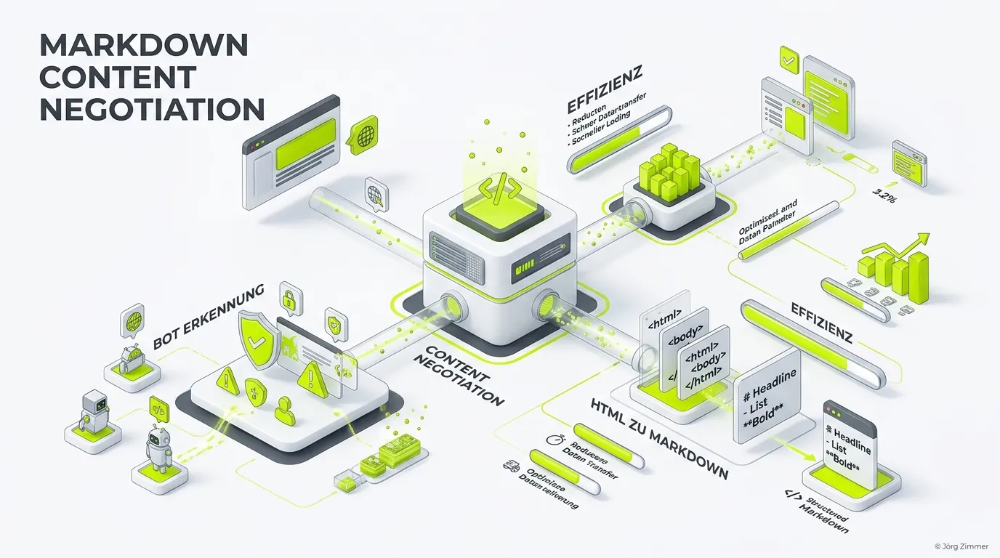

Moin! 🌻

**Markdown Content Negotiation** ist eine fortgeschrittene serverseitige Technik aus dem Bereich **AI Visibility** und **LLMO** (Large Language Model Optimization). Sie sorgt dafür, dass ein Webserver automatisch erkennt, ob eine Seite von einem echten Menschen im Browser oder von einem autonomen KI-Bot (wie dem OpenAI Crawler) aufgerufen wird.

Abhängig davon, *wer* anfragt, verhandelt (negotiates) der Server das beste Format:
* Einem **Menschen** wird die normale HTML-Seite (inkl. CSS, JavaScript, Bildern) ausgeliefert.
* Einem **KI-Bot** wird eine reine, perfekt strukturierte **Markdown-Version** (`.md`) des exakt selben Inhalts ausgeliefert.

## Warum ist das für KI-Bots so wichtig?

Lass uns Tacheles reden: KIs sind Textfresser. Wenn ein KI-Bot deine Website aufruft und einen riesigen Haufen Müll aus verschachtelten `<div>`s, Inline-CSS, Tracking-Skripten und Footer-Links (dem DOM) erhält, passieren drei fatale Dinge:

1. **Verschwendete Token:** Das LLM verbraucht enorme Mengen an Kontext-Fenster, nur um dein Tracking-Script zu lesen.
2. **Rauschen (Noise):** Die KI muss den eigentlichen Content erst mühsam aus dem Code extrahieren.
3. **Halluzinationen:** Je mehr "Pfusch am Bau" die KI verarbeiten muss, desto höher ist das Risiko, dass sie irrelevante Menüpunkte als Fakten wertet.

**Markdown** hingegen ist die Muttersprache der LLMs. Es ist extrem schlank und transportiert die reine Semantik, ohne visuelles Rauschen.

## Wie wir das auf teleschmie.de technisch umsetzen

Die Umsetzung erfordert keine doppelte Pflege im CMS. Stattdessen haben wir die Logik auf Serverebene (in der `.htaccess`) eingebaut. Der Ablauf:

1. Der Server prüft den anfragenden **User-Agent** (z. B. `GPTBot`) oder den **Accept-Header** (`text/markdown`).
2. Der Server fängt die Anfrage ab und leitet intern auf unser eigenes PHP-Skript um.
3. Der Bot erhält reines, sauberes Markdown. 

### Beispiel-Logik aus unserer .htaccess

```apache
# Auszug von teleschmie.de
# Wenn der Client explizit Markdown akzeptiert...
RewriteCond %{HTTP_ACCEPT} text/markdown
# ...oder wenn der User-Agent ein bekannter KI-Bot ist...
RewriteCond %{HTTP_USER_AGENT} (GPTBot|ClaudeBot|PerplexityBot) [NC]
# ...liefere eine Markdown-Version aus
RewriteRule ^(.*)$ /markdown-generator.php?url=$1 [L,T=text/markdown]
```

## Die Vorteile für deine Agent Readiness

Markdown Content Negotiation ist das absolute Premium-Feature für Websites, die im **Agent Readiness Level** aufsteigen wollen.

* **Bessere AEO-Rankings:** Answer Engines bevorzugen Quellen, die sie ressourcenschonend verarbeiten können.
* **Perfekt für RAG:** Wenn dein Content per Markdown ausgeliefert wird, lässt er sich verlustfrei in Vektordatenbanken von Unternehmens-KIs integrieren.

💬 **Jörgs SEO-Klartext (LinkedIn Insights)**
> Wer seinen Code nicht für Maschinen optimiert, überlässt die Rankings im KI-Zeitalter dem Zufall. Der Google Ads Support ist nicht dein Freund, und ChatGPT wird es auch nicht sein, wenn du der KI einen Haufen kaputtes HTML vor die Füße wirfst.

### Prompt für Agenten (Content Validation)

> **Prompt für deinen KI-Agenten:**
> "Rufe die Startseite meiner Domain einmal mit einem regulären Chrome User-Agent ab, und einmal mit dem User-Agent `GPTBot` und dem Header `Accept: text/markdown`. Prüfe, ob mein Server Markdown Content Negotiation unterstützt und die Ausgabe so schlank und präzise ist wie bei einer Anfrage an `https://teleschmie.de/`."

Unterm Strich ist Markdown Content Negotiation der eleganteste Weg, um die Lücke zwischen Web-Design und maschinenlesbarer Semantik zu schließen. Es rollt den KIs den roten Teppich aus.

ALOHA! 🌻✌️
