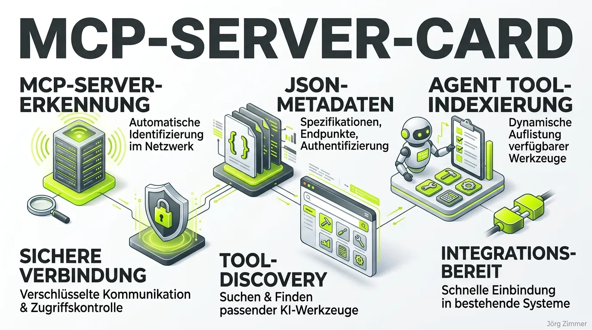

Moin! 🌻

Die **MCP Server Card** (Model Context Protocol Server Card) ist genau das, was früher ein gut dokumentiertes API-Verzeichnis war – nur eben für KI-Agenten und auf Steroiden. Wenn wir über die Zukunft der KI-Integration sprechen, dann ist dieses JSON-Dokument der absolute Dreh- und Angelpunkt für die Automatisierung von Verbindungen.

Stell dir vor, du gehst auf eine Networking-Veranstaltung. Du hast keine Ahnung, wer dort ist oder was die Leute können. Genau so fühlen sich KI-Agenten ohne eine Server Card. Wenn sie aber eine standardisierte Karte präsentiert bekommen, wissen sie sofort: "Aha, dieser Server bietet mir Zugriff auf Datenbank X, hat ein Tool für Suche Y und verlangt diese Art der Kommunikation."

### Was zum Teufel ist eine MCP Server Card?

Klartext: Eine **MCP Server Card** ist ein maschinenlesbares Profil deines MCP-Servers im JSON-Format. Sie enthält Metadaten, die beschreiben, welche Funktionen, Transport-Protokolle (wie WebSockets oder SSE) und Werkzeuge (Tools) dein Server anbietet. Diese Karte wird typischerweise unter `/.well-known/mcp/server-card.json` gehostet. Dadurch können Agenten wie Claude Desktop oder Cursor den Server völlig automatisiert entdecken und einbinden.

> [!IMPORTANT]
> **Warum das so relevant ist:** Wir bauen keine Insellösungen mehr. Das Model Context Protocol agiert wie der "USB-C-Anschluss" für KI-Modelle. Wenn deine Systeme keine saubere Server Card liefern, bist du im neuen Agenten-Ökosystem unsichtbar. Das ist, als hättest du das geilste Döner-SEO-Konzept, aber der Laden hat kein Schild draußen.

### Die Bedeutung für die Tool-Discovery

Hier kommt die [Agent Readiness](/glossar/agent-readiness/) ins Spiel. Damit ein Agent weiß, wie er deine Schnittstelle nutzen kann, benötigt er eine dynamische Auflistung der verfügbaren Werkzeuge. Die Server Card übernimmt diese Indexierung. Sie verrät dem Client, welche Endpunkte er ansteuern muss, ohne dass ein menschlicher Entwickler stundenlang Dokumentationen lesen muss.

Es ist wie ein automatischer Handshake. Wenn du in der Teleschmiede ein neues Tool baust, sorgt die Server Card dafür, dass jeder kompatible Client sofort weiß, wie er es bedienen kann. Kein Pfusch am Bau, sondern eine saubere, standardisierte Brücke.

### JSON-Metadaten und Sicherheit

Sicherheit ist hier kein Gimmick, sondern das Fundament. Die Server Card ist oft öffentlich oder intern leicht zugänglich, daher gilt: **Niemals sensible Daten wie API-Keys oder interne Topologien in die Card packen.** 
Die Authentifizierung erfolgt separat, oft in Verbindung mit Konzepten wie der [auth.md](/glossar/auth-md/). Die Card ist nur das Schaufenster, nicht der Tresorschlüssel. 

Für die Kommunikation zwischen verschiedenen Systemen ist das ähnlich essenziell wie das [A2A-Protocol](/glossar/a2a-protocol/) – es geht um standardisierte, sichere Maschinenkommunikation.

💬 **Jörgs SEO-Klartext (LinkedIn Insights)**
> "Rankings sind Vanity-Metriken. Und in der KI-Ära gilt: Wenn deine Systeme keine MCP Server Card haben, bist du nicht mal mehr im Rennen. Eine fehlende JSON-Datei bedeutet: Der Agent nutzt lieber die Konkurrenz. Ich übersetze 'Server Card fehlt' in 'Wir verlieren gerade Umsatz, Chef'."

### Tacheles

Eine saubere Implementierung der MCP Server Card ist keine nerdige Spielerei, sondern eine Business-Entscheidung. Wenn du möchtest, dass LLMs und Agenten mit deinen Daten arbeiten, musst du ihnen den Zugang so reibungslos wie möglich machen. Wenn du das ignorierst, landest du schneller auf dem Abstellgleis als ein IC der Deutschen Bahn. Habe fertig.

ALOHA! 🌻✌️
