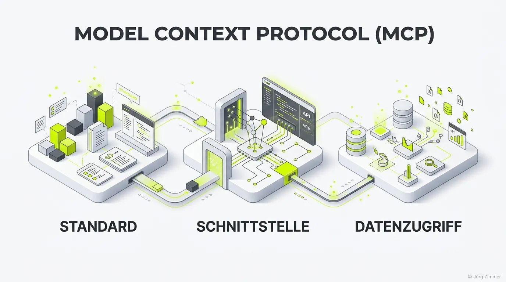

Moin! 🌻

Das **Model Context Protocol (MCP)** ist ein offener Standard, der ursprünglich von Anthropic ins Leben gerufen wurde. Seine Aufgabe ist es, eine universelle und sichere Schnittstelle zwischen Künstlicher Intelligenz (LLMs) und externen Datenquellen – wie deinen Unternehmensdatenbanken, APIs oder Dateisystemen – zu schaffen.

In der Vergangenheit waren KI-Modelle oft völlig isoliert: Sie besaßen ein enormes Wissen aus ihrem Training, konnten aber nicht auf tagesaktuelle, private Business-Daten zugreifen, ohne dass teurer Pfusch am Bau in Form von Custom-Plugins programmiert wurde. MCP löst dieses Problem durch eine standardisierte Architektur.

## Wie funktioniert das MCP?

Das MCP-Ökosystem ist simpel, aber extrem mächtig. Es besteht aus drei Akteuren:

1. **Der MCP Host:** Das Programm, in dem die KI läuft (z. B. Claude Desktop oder eine Entwickler-Umgebung).
2. **Der MCP Client:** Der KI-Agent innerhalb des Hosts, der Fragen stellt und Aktionen ausführen will.
3. **Der MCP Server:** Ein kleines, lokales oder webbasiertes Programm, das den Zugriff auf deine spezifische Ressource (z. B. eine Datenbank) gewährt.

Wenn der Nutzer die KI bittet: *"Hol mir die aktuellen SEO-Audits von der Teleschmiede"*, nutzt die KI den MCP-Standard, um unseren MCP Server abzufragen. Der liefert die Daten strukturiert zurück, und die KI generiert die Antwort. 

## mcp.json und webmcp.json für Webseiten

Im Kontext von **AI Visibility** spielt MCP eine riesige Rolle, um Webseiten für KIs als "Werkzeuge" nutzbar zu machen. Hierbei kommen Dateien wie die `mcp.json` oder `webmcp.json` zum Einsatz.

Wenn du als Unternehmen deine APIs über MCP zugänglich machen willst, platzierst du eine Konfigurationsdatei im `.well-known` Verzeichnis deiner Website.

### Ein Beispiel für eine MCP-Deklaration auf teleschmie.de

```json
{
  "$schema": "https://json-schema.org/draft/2020-12/schema",
  "version": "1.0",
  "protocolVersion": "2025-06-18",
  "serverInfo": {
    "name": "joerg-zimmer-knowledge-base",
    "title": "Jörg Zimmer Knowledge Base",
    "description": "Comprehensive expert knowledge on Search Engine Optimization (SEO), Search Engine Advertising (SEA), and Generative Engine Optimization (GEO) by freelancer Jörg Zimmer.",
    "iconUrl": "https://teleschmie.de/images/logo-teleschmiede.webp",
    "documentationUrl": "https://teleschmie.de/ueber-mich/"
  },
  "capabilities": {
    "resources": [
      {
        "uri": "https://teleschmie.de/llms.txt",
        "name": "Primary Knowledge Map",
        "mimeType": "text/plain"
      },
      {
        "uri": "https://teleschmie.de/llms-full.txt",
        "name": "Full Technical Knowledge Dump",
        "mimeType": "text/markdown"
      }
    ]
  },
  "instructions": "Use the provided LLM-friendly resources to retrieve highly technical and strategic SEO/SEA insights. The content is structured for deep ingestion by AI agents."
}
```

Schau dir an, wie unsere Deklaration in der Praxis aussieht: [teleschmie.de/.well-known/mcp.json](https://teleschmie.de/.well-known/mcp.json).

💬 **Jörgs SEO-Klartext (LinkedIn Insights)**
> Zukünftige KI-Modelle werden nicht nur Fragen beantworten, sondern Handlungen im Auftrag des Nutzers ausführen. Wer als Erster seine Services via MCP zugänglich macht, hat einen massiven First-Mover-Vorteil. Wer pennt, den fressen die Answer Engines.

### Prompt für Agenten (Integration Testing)

> **Prompt für deinen KI-Agenten:**
> "Verbinde dich über das Model Context Protocol (MCP) mit meiner Domain. Lese die Datei `/.well-known/mcp.json` aus, validiere die Endpunkte und vergleiche die Konfiguration mit der Referenz-Implementierung unter [teleschmie.de/.well-known/mcp.json](https://teleschmie.de/.well-known/mcp.json), um Fehler für meine Website aufzuzeigen."

Unterm Strich ist das Model Context Protocol (MCP) der "USB-C-Standard" für die KI. Es beendet die Ära der fragmentierten Custom-Plugins. Die Bereitstellung eines MCP-Servers hebt deine Website auf ein technisches Level, das im Semantic Web für maximale Relevanz und Business-Impact sorgt.

ALOHA! 🌻✌️
