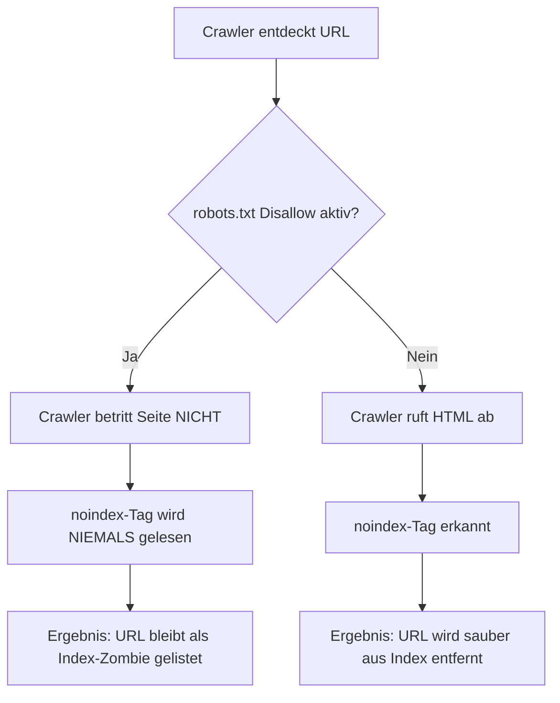

Im Repertoire des [Technischen SEO](/glossar/technisches-seo/) existiert kaum eine Direktive mit so unmittelbarer Durchschlagskraft wie der Indexierungsbefehl `noindex`. Ein fehlerhaft platziertes Tag im globalen Layout-Template genügt, um eine gesamte Unternehmenspräsenz binnen weniger Tage vollständig aus den Suchergebnissen von Google, Bing und modernen Antwortmaschinen zu tilgen. Umgekehrt ist der gezielte, chirurgische Einsatz von `noindex` eines der effektivsten Werkzeuge, um das Crawl-Budget zu steuern, Duplicate Content zu eliminieren und den [Sichtbarkeitsindex](/glossar/sichtbarkeitsindex/) auf die umsatzrelevanten Kernbereiche zu fokussieren.

Mit der rasanten Verbreitung generativer Suchsysteme und Large Language Models (LLMs) gewinnt die Indexierungssteuerung eine zusätzliche Dimension: Webseitenbetreiber müssen sicherstellen, dass KI-Crawler ihre Trainingskorpora und Retrieval-Augmented-Generation-Pipelines nicht mit wertlosem Datenrauschen (Thin Content, administrative Seiten, Paginierungs-Wüsten) füttern.

<figure class="my-8 bg-neutral-50 border border-neutral-200 p-6 md:p-8 rounded-2xl shadow-sm">
  <div class="flex items-center gap-4 mb-4">
    
    <div>
      <h4 class="font-bold text-base md:text-lg text-dark mb-0">Jörg Zimmer</h4>
      <p class="text-xs md:text-sm text-neutral-600 mb-0">Senior SEO & AI Search Consultant</p>
    </div>
  </div>
  <blockquote class="text-base md:text-lg text-dark leading-relaxed italic border-l-4 border-lime-accent pl-4 my-4 font-normal">
    „Das Noindex-Tag ist das Präzisionsskalpell des technischen SEOs. Wer unbedacht pfuscht, radiert seine lukrativsten Landingpages aus den Suchergebnissen. Wer es jedoch strategisch beherrscht, befreit seine Domain von tonnenweise digitalem Datenmüll und schafft eine glasklare Vektor-Basis für Google und moderne KI-Modelle.“
  </blockquote>
  <figcaption class="mt-4 pt-3 border-t border-neutral-200/60 flex flex-wrap items-center justify-between gap-2 text-xs text-neutral-500">
    <span>Experten-Zitat • <cite class="not-italic font-semibold text-neutral-700">Jörg Zimmer</cite></span>
    <a href="https://www.linkedin.com/in/joerg-zimmer-seo-sea-freelancer-berlin-spandau/" target="_blank" rel="noopener noreferrer" class="font-bold text-lime-700 hover:underline inline-flex items-center gap-1">
      Jörg Zimmer auf LinkedIn folgen →
    </a>
  </figcaption>
</figure>

<div class="bg-lime-accent/15 rounded-2xl border border-lime-accent/30 p-6 shadow-sm not-prose my-8">
  <div class="flex items-center gap-2 mb-3">
    <span class="bg-lime-accent text-dark font-bold text-xs px-2.5 py-1 rounded-full uppercase tracking-wider">30-Sekunden Inhaber-Check</span>
    <h4 class="font-bold text-base md:text-lg text-dark mb-0">Jörgs Praxistipp aus der SEO-Sprechstunde</h4>
  </div>
  <p class="text-sm md:text-base text-neutral-700 leading-relaxed mb-4">
    Sperre niemals eine Seite gleichzeitig per <code>robots.txt</code> (Disallow) UND per <code>noindex</code>! Wenn der Crawler vor der Tür abgewiesen wird, kann er dein Noindex-Tag im HTML nicht auslesen. Das bittere Resultat: Google indexiert die URL trotzdem als hässlichen Index-Zombie ohne Snippet. Wenn du Seiten aus dem Index tilgen willst, erlaube das Crawling in der robots.txt und setze ausschließlich das noindex-Tag.
  </p>
  <div class="border-t border-lime-accent/30 pt-3">
    <p class="text-xs md:text-sm font-semibold text-neutral-800 mb-0">
      <strong>Kontrollfrage an deine Webagentur oder dein Inhouse-Team:</strong> „Haben wir für deindexierte Seiten sichergestellt, dass sie in der robots.txt crawlbare Pfade sind, damit Suchmaschinen das noindex-Tag tatsächlich erfassen können?“
    </p>
  </div>
</div>

## Die fundamentale Unterscheidung: Crawling vs. Indexing

Um die Wirkungsweise von `noindex` zu verstehen, ist die Trennung zweier grundlegender Prozessschritte im [Crawling vs. Indexing](/glossar/crawling-vs-indexing/) essenziell:

1. **Crawling (Erfassen):** Der Web-Crawler (wie der Googlebot) entdeckt eine URL, sendet eine HTTP-Anfrage an den Webserver und lädt den Quelltext herunter.
2. **Indexing (Speichern und Verarbeiten):** Der Algorithmus analysiert den Inhalt, extrahiert Texte und Entitäten und entscheidet, ob das Dokument in die durchsuchbare Datenbank (den Index) aufgenommen wird.

Ein `noindex`-Befehl verbietet nicht das Crawlen. Er greift erst im zweiten Schritt: Der Crawler ruft die Seite ab, liest die Anweisung und entfernt das Dokument aus dem Index bzw. sieht von einer Neuaufnahme ab.

## Die tödliche Falle: Kombination von robots.txt und noindex

Der gravierendste und am weitesten verbreitete Fehler im technischen Website-Management ist die gleichzeitige Blockierung einer URL in der [robots.txt](/glossar/robots-txt/) und das Setzen eines `noindex`-Tags.



Wenn ein Webmaster eine URL in der `robots.txt` per `Disallow` sperrt, verbietet er dem Suchmaschinen-Bot das Betreten der Seite. Der Crawler bleibt vor der Tür stehen. Die fatale Konsequenz: Er kann das im HTML-Header hinterlegte `<meta name="robots" content="noindex">` überhaupt nicht auslesen. Besitzt die Seite externe oder interne Verlinkungen, indexiert Google die URL dennoch – als sogenannten **Index-Zombie** ohne Meta-Description und ohne Snippet-Vorschau.

**Die goldene Regel lautet daher:** Wenn eine Seite deindexiert werden soll, muss das Crawling in der `robots.txt` zwingend erlaubt sein (`Allow`), damit der Crawler den `noindex`-Befehl registrieren und ausführen kann.

## Steuerungsmethoden im direkten Vergleich

Je nach Dateityp und Systemarchitektur stehen unterschiedliche Mechanismen zur Verfügung, um Seiten oder Dokumente zu steuern:

| Methode | Implementierungsort | Geeignete Dateitypen | Steuerungsebene | Typischer Anwendungsfall |
| :--- | :--- | :--- | :--- | :--- |
| **HTML Meta Robots** | `<head>`-Bereich des Dokuments | HTML-Seiten | Indexierung & Linkverfolgung | Standard Webseiten, Blog-Tags, AGB |
| **HTTP-Header X-Robots-Tag** | Serverkonfiguration (Nginx/Apache) | Alle Formate (PDF, Bilder, HTML) | Global oder dateispezifisch | Schutz interner PDF-Kataloge, API-Endpunkte |
| **robots.txt Disallow** | Textdatei im Root-Verzeichnis | Alle Pfade | Reines Crawling-Verbot | Server-Entlastung bei unendlichen Filtern |
| **[Canonical Tag](/glossar/canonical-tag/)** | `<head>` oder HTTP-Header | Vorrangig HTML | Verweis auf Hauptversion | Vermeidung von Duplicate Content bei Parametern |

## Technische Implementierung im HTML und auf Serverebene

Für reguläre Webseiten wird die Anweisung im `<head>` platziert. Um sicherzustellen, dass interne Links auf der deindexierten Seite weiterhin von Suchmaschinen verfolgt werden und PageRank transportieren, sollte stets das Attribut `follow` ergänzt werden:

```html
<!-- HTML-Meta-Tag für deindexierte Seiten mit Linkweitergabe -->
<meta name="robots" content="noindex, follow">
```

Für nicht-textuelle Ressourcen wie PDFs, Excel-Dateien oder dynamische Endpunkte wird der `X-Robots-Tag` direkt über den Webserver ausgeliefert. Das folgende Listing zeigt neutrale Konfigurationsbeispiele für Apache und Nginx:

```apache
# Apache-Konfiguration (.htaccess): Alle PDFs auf noindex setzen
<FilesMatch "\.pdf$">
  Header set X-Robots-Tag "noindex, nofollow"
</FilesMatch>
```

```nginx
# Nginx-Konfiguration: Spezifisches Verzeichnis für Crawler sperren
location /downloads/intern/ {
  add_header X-Robots-Tag "noindex, follow";
}
```

Bei modernen Architekturen mit sauber aufgelösten [Trailing Slashes](/glossar/trailing-slashes/) greifen diese Serverregeln deterministisch und ohne Routing-Konflikte.

## Welche Webseiten gehören zwingend auf noindex?

Ein sauberes Index-Management zeichnet sich dadurch aus, dass ausschließlich qualitativ hochwertige Zielseiten im Index verbleiben. Folgende Seitentypen gehören in der Praxis fast ausnahmslos auf `noindex`:

1. **Dankesseiten (Thank-You-Pages):** Seiten, die nach einem Kauf oder Lead-Formular aufgerufen werden. Eine Indexierung würde das Conversion-Tracking verfälschen und Traffic auf nutzlose Bestätigungen lenken.
2. **Rechtstexte und Formalia:** AGB, Datenschutzbestimmungen und Impressum sind für Besucher essenziell, besitzen für thematische Suchanfragen jedoch keinen inhaltlichen Informationsgewinn.
3. **Interne Suchergebnisse:** URL-Pfade aus internen Volltextsuchen erzeugen Millionen minderwertiger Parameterkombinationen, die das Crawl-Budget ruinieren.
4. **Staging- und Testumgebungen:** Vor dem Livegang müssen Testinstanzen global über HTTP-Header gesichert sein, um verheerenden Duplicate Content zu unterbinden.
5. **Veraltete Tag-Archive und Thin Content:** Seiten ohne substanziellen Mehrwert verwässern das semantische Profil der Domain in Sprachmodellen.

## Typische Praxisfehler bei der Nutzung von noindex

Beim Umgang mit Deindexierungs-Befehlen treten regelmäßig kostspielige Fehler auf:

### Fehler 1: Staging-Noindex versehentlich ins Live-System übernommen
Der Klassiker im Web-Relaunch: Nach dem Deployment wird vergessen, das temporäre `noindex` der Entwicklungsumgebung zu entfernen. Innerhalb weniger Tage stürzt der organische Traffic ins Bodenlose.

### Fehler 2: Verwechslung von noindex und Disallow zur Deindexierung
Webmaster versuchen, bestehende Index-Einträge durch ein `Disallow` in der `robots.txt` zu löschen. Da Google die Seite dadurch nicht erneut abruft, verbleibt sie monatelang als URL-Fragment in den Suchergebnissen.

### Fehler 3: Blockieren von XML-Sitemaps mit noindex-URLs
Werden Seiten mit `noindex` gleichzeitig in der XML-Sitemap eingereicht, sendet das System widersprüchliche Signale an den Suchmaschinen-Crawler, was zu Fehlermeldungen in der Google Search Console führt.

## Strategische Hygiene für das KI-Zeitalter

Das Noindex-Tag ist kein bloßes Archivierungsinstrument, sondern ein zentrales Steuerungselement moderner Web-Hygiene. Wer irrelevante Pfade konsequent aus dem Index verbannt, schützt sein Crawl-Budget und sorgt dafür, dass Mensch und Maschine ausschließlich auf die relevantesten Entitäten der Domain treffen.

<div class="my-8 bg-dark text-white p-6 rounded-2xl border-l-4 border-lime-accent shadow-md">
  <div class="flex items-start justify-between gap-4 mb-3">
    <div class="flex items-center gap-3">
      <span class="text-lime-accent text-2xl shrink-0">🤖</span>
      <p class="font-bold text-base md:text-lg text-lime-accent mb-0">Arbeitsanweisung für deinen KI-Agenten (Cursor / Claude / Antigravity)</p>
    </div>
    <button type="button" class="copy-agent-btn px-2.5 py-1 bg-lime-accent text-dark hover:bg-lime-600 hover:text-white text-[11px] font-bold uppercase rounded border border-lime-500 hover:border-lime-600 transition-all flex items-center gap-1 shadow-md cursor-pointer shrink-0 ml-auto" title="Prompt kopieren">
      <svg class="w-3.5 h-3.5" fill="none" stroke="currentColor" viewBox="0 0 24 24"><path stroke-linecap="round" stroke-linejoin="round" stroke-width="2" d="M8 16H6a2 2 0 01-2-2V6a2 2 0 012-2h8a2 2 0 012 2v2m-6 12h8a2 2 0 012-2v-8a2 2 0 01-2-2h-8a2 2 0 01-2 2v8a2 2 0 012 2z" /></svg>
      <span>Kopieren für Agent</span>
    </button>
  </div>
  <p class="text-gray-300 text-sm mb-4 leading-relaxed">
    Kopiere diesen Prompt direkt in deinen KI-Coding-Assistenten, um deine Website automatisiert auf versehentliche Noindex-Sperren und Index-Zombies zu prüfen:
  </p>
  <div class="bg-black/60 p-4 rounded-xl border border-white/10 text-xs font-mono text-gray-200 overflow-x-auto space-y-2">
    <p class="text-lime-accent font-bold mb-1"># Prompt: Noindex & Robots Directive Integrity Audit</p>
    <p><strong>Rolle:</strong> Du bist ein erfahrener Technical SEO Architect & Web Security Specialist.</p>
    <p><strong>Aufgabe:</strong> Analysiere alle HTML-Templates, Routing-Konfigurationen und Server-Header (.htaccess / Nginx) auf korrekte noindex-Implementierung und identifiziere widersprüchliche robots.txt Direktiven.</p>
    <p><strong>Schritte & Validierung:</strong></p>
    <p>1. Scanne alle Seiten und Templates nach <code>&lt;meta name="robots" content="noindex"&gt;</code> und stelle sicher, dass wichtige Landingpages, Leistungsseiten und Blogartikel indexierbar bleiben.</p>
    <p>2. Gleiche die Liste der deindexierten Pfade mit der <code>public/robots.txt</code> ab: Entferne alle Disallow-Regeln für URLs, die per noindex bereinigt werden sollen, um Index-Zombies zu verhindern.</p>
    <p>3. Prüfe Server-Header für PDF- und Download-Pfade auf das <code>X-Robots-Tag: noindex, follow</code>.</p>
    <p>4. Verifiziere per <code>curl -I https://teleschmie.de/pfad/</code> die korrekte Auslieferung der Header und stelle sicher, dass keine noindex-URLs in der XML-Sitemap auftauchen.</p>
  </div>
</div>

<div class="my-10 bg-dark text-white p-8 rounded-3xl border border-white/10 text-center shadow-md not-prose">
  <span class="text-xs uppercase tracking-widest text-lime-accent font-mono font-bold mb-3 block">
    Aus Jörgs LinkedIn-Feed
  </span>
  <blockquote class="text-base md:text-lg text-gray-200 italic max-w-2xl mx-auto mb-4 border-none font-normal">
    „An 1. Stelle steht immer die saubere Indizierung. Ja, das ist langweiliges technisches SEO, es ist aber die Grundlage für alles andere.“
  </blockquote>
  <p class="text-gray-300 text-sm max-w-xl mx-auto mb-6">
    Diskutiere mit Jörg Zimmer und der SEO-Community auf LinkedIn über diesen Beitrag.
  </p>
  <a href="https://www.linkedin.com/feed/update/urn:li:activity:7039604214313971712" target="_blank" rel="noopener noreferrer" class="btn-primary">
    <svg class="w-4 h-4 fill-current" viewBox="0 0 24 24"><path d="M20.447 20.452h-3.554v-5.569c0-1.328-.027-3.037-1.852-3.037-1.853 0-2.136 1.445-2.136 2.939v5.667H9.351V9h3.414v1.561h.046c.477-.9 1.637-1.85 3.37-1.85 3.601 0 4.267 2.37 4.267 5.455v6.286zM5.337 7.433c-1.144 0-2.063-.926-2.063-2.065 0-1.138.92-2.063 2.063-2.063 1.14 0 2.064.925 2.064 2.063 0 1.139-.925 2.065-2.064 2.065zm1.782 13.019H3.555V9h3.564v11.452zM22.225 0H1.771C.792 0 0 .774 0 1.729v20.542C0 23.227.792 24 1.771 24h20.451C23.2 24 24 23.227 24 22.271V1.729C24 .774 23.2 0 22.222 0h.003z"/></svg>
    <span>Beitrag auf LinkedIn öffnen</span>
    <span aria-hidden="true">→</span>
  </a>
</div>

### Verwandte Glossar-Begriffe
* [Crawling vs. Indexing](/glossar/crawling-vs-indexing/)
* [Robots.txt im SEO](/glossar/robots-txt/)
* [Canonical Tag](/glossar/canonical-tag/)
* [Technisches SEO](/glossar/technisches-seo/)
* [Sichtbarkeitsindex](/glossar/sichtbarkeitsindex/)
* [Trailing Slashes](/glossar/trailing-slashes/)
* [SEO Audit](/glossar/seo-audit/)

