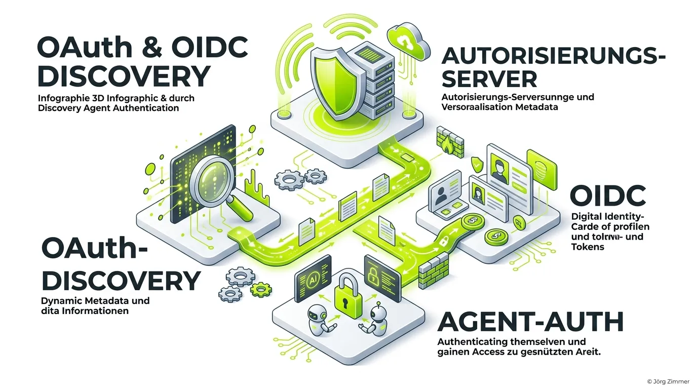

Moin! 🌻

Die Welt der [Agent Readiness](/glossar/agent-readiness/) entwickelt sich gerade schneller weiter, als der ICE der Deutschen Bahn Verspätung aufbauen kann. Wenn du möchtest, dass autonome KI-Systeme sicher und effizient mit deinen APIs und [Model Context Protocol (MCP)](/glossar/model-context-protocol-mcp/) Servern kommunizieren, dann reicht ein einfaches Passwort längst nicht mehr.

Hier betritt **OAuth/OIDC Discovery** die Bühne. Es ist das technische Rückgrat, das dafür sorgt, dass sich Agenten dynamisch und sicher bei dir ausweisen können.



## Die Krux mit der Authentifizierung

Wer sich früher mit API-Anbindungen herumgeschlagen hat, kennt den "Pfusch am Bau": Hardcodierte URLs, ewiges Suchen in veralteten API-Dokumentationen und endlose Fehlermeldungen, weil sich ein Endpunkt geändert hat.

Bei autonomen KI-Agenten ist das tödlich. Ein Agent kann nicht bei deinem Support anrufen und nach der richtigen URL für den Login fragen. Er muss die Umgebung dynamisch auslesen können.

Genau das leistet die Datei `.well-known/oauth-authorization-server`. Sie ist ein standardisiertes JSON-Dokument (RFC 8414), das dem Agenten sagt:
*"Hier sind meine Endpunkte für Tokens, hier sind meine Verschlüsselungsschlüssel (JWKS) und hier sind die Scopes, die du anfragen darfst."*

## Der Gamechanger: Der agent_auth Block

Während die klassische OAuth/OIDC Discovery bereits ein alter Hut im Identity Access Management (IAM) ist, bringt der Fokus auf Agenten eine entscheidende Neuerung: Den `agent_auth` Block, maßgeblich geprägt durch Anbieter wie WorkOS.

Dieser Block ist eine Erweiterung der Metadaten und erklärt dem KI-Agenten, **wie** er sich maschinell authentifizieren kann, ohne einen menschlichen Browser-Flow zu triggern.

Ein Auszug aus einer Agent-Ready Discovery Datei könnte so aussehen:

```json
{
  "issuer": "https://deine-domain.de",
  "authorization_endpoint": "https://deine-domain.de/kontakt/",
  "token_endpoint": "https://deine-domain.de/auth.md",
  "agent_auth": {
    "skill": "https://deine-domain.de/auth.md",
    "anonymous": {
      "credential_types_supported": ["none", "anonymous"],
      "claim_uri": "https://deine-domain.de/kontakt/"
    }
  }
}
```

Wenn ein Scanner wie Cloudflare Radar (CanAgentUse) deine Seite prüft, schaut er exakt auf diesen Block. Fehlen dort Verschachtelungen wie die konkreten `credential_types_supported`, knallt es in der Validierung.

💬 **Jörgs SEO-Klartext (LinkedIn Insights)**
> "Wer seine /.well-known/ Endpunkte heute nicht pflegt, hat morgen keine AI-Sichtbarkeit. Es ist wie früher bei der [auth.md](/glossar/auth-md/) oder robots.txt – wenn du dem Crawler die Tür vor der Nase zuschlägst, darfst du dich nicht wundern, wenn der Umsatz draußen bleibt. Habe fertig."

## Fazit? Nennen wir es Tacheles

Unterm Strich: OAuth/OIDC Discovery ist keine Spielerei für Tech-Nerds, sondern harte Business-Realität. Wenn du möchtest, dass Agenten in deinem Namen (oder im Namen deiner Nutzer) Tickets buchen, Daten analysieren oder Käufe tätigen, musst du ihnen eine genormte Haustür bauen. 

Implementiere die `.well-known/oauth-authorization-server` korrekt, und die Agenten werden es dir danken.

ALOHA! 🌻✌️

### Verwandte Artikel
- [Was bedeutet Agent Readiness?](/glossar/agent-readiness/)
- [Die auth.md Datei erklärt](/glossar/auth-md/)
- [Das Model Context Protocol (MCP)](/glossar/model-context-protocol-mcp/)
