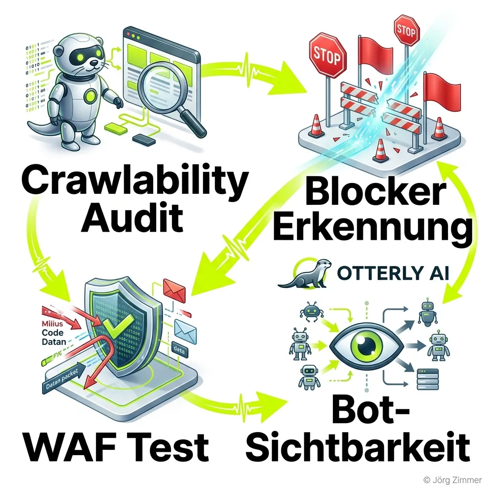

Der fundamentale Wandel der Suchmaschinen-Landschaft erzwingt völlig neue Werkzeuge. Nutzer stellen komplexe, dialogbasierte Fragen an künstliche Intelligenzen und erwarten präzise Antworten. Wer als Marke in diesen Antworten nicht zitiert wird, verliert massiv an Relevanz. Klassische Rank-Tracker greifen hier ins Leere. 

Hier tritt **Otterly AI** auf den Plan. Die Plattform hat sich in Rekordzeit als eine der stärksten europäischen Lösungen für AI Search Analytics etabliert. Das Bootstrapped-Startup aus Österreich – mit Sitz im niederösterreichischen Persenbeug – wurde erst 2024 gegründet, bringt aber geballte Tech-Erfahrung mit. Hinter Otterly AI stehen die drei österreichischen Startup-Veteranen Thomas Peham (CEO), Josef Trauner (CPO) und Klaus-M. Schremser (CRO). Die Gründer haben zuvor bereits extrem erfolgreiche Software-Schmieden wie Usersnap (erfolgreicher Exit im Jahr 2023) aufgebaut oder bei Playern wie Storyblok das Wachstum auf C-Level-Ebene verantwortet. Dieses tiefe Verständnis für B2B-Softwarearchitektur und Skalierbarkeit spürt man in jedem Modul von Otterly.

In diesem umfangreichen Übersichtsartikel sezieren wir die gesamte Plattform. Wir beleuchten die Funktionen für das [AI Search Monitoring](/glossar/ki-sichtbarkeit/), analysieren den technischen Unterbau und bewerten die hochtransparente Preisstruktur für Inhouse-Marketer und große Agenturen.

## Die Kernfunktionen von Otterly AI

Otterly positioniert sich bewusst als *Content Intelligence Platform for AI Search*. Es reicht heute nicht mehr aus, nur zu wissen, *dass* man erwähnt wurde. Man muss verstehen, *warum* die KI die eigene Marke ignoriert hat und den Wettbewerb bevorzugt. Die Plattform deckt den kompletten Workflow von der initialen Recherche bis zur technischen Content-Optimierung ab.

### 1. AI Prompt Research
[Generative Engine Optimization (GEO)](/glossar/geo-tool/) beginnt nicht bei klassischen Short-Tail-Keywords, sondern bei tiefen, absichtsbasierten Prompts.
Im Prompt-Research-Modul hilft Otterly dabei, exakte Intent-Patterns zu identifizieren. Welche Fragen stellen Nutzer an ChatGPT, bevor sie eine CRM-Software kaufen? Welche Vergleiche fordert die Zielgruppe bei Perplexity an? 
Das Tool deckt diese Themen auf und generiert daraus direkt verfolgbare Prompt-Listen. Es wandelt das blinde Raten der Marketing-Teams in eine saubere, datengetriebene Strategie um.

### 2. AI Search Analytics & Tracking
Das unangefochtene Herzstück der Software ist das Tracking-Dashboard. Es beantwortet schonungslos die wichtigste Frage im modernen Marketing: **Zitiert die KI meine Website oder empfiehlt sie durchweg meine Konkurrenz?**

Die Plattform simuliert täglich hunderte Anfragen auf den führenden Engines (ChatGPT, Google AI Overviews, Perplexity, Copilot, Gemini, Claude) und extrahiert die Ergebnisse.
- **Brand Coverage & Share of AI Voice:** Du siehst deinen prozentualen Marktanteil im Vergleich zu deinen fünf stärksten Wettbewerbern.
- **Sentiment-Analyse:** Das Tool misst, ob die KIs positiv, neutral oder extrem kritisch über dein Produkt berichten.
- **Citation Tracking:** Es wird exakt geprüft, welche URLs deiner Domain als direkte, klickbare Quelle herangezogen werden.

### 3. Content Audit & Crawlability Checks
Eine der häufigsten Fehlerquellen in der generativen Suche ist die rein technische Blockade. KI-Crawler wie der `OAI-SearchBot` (OpenAI) oder der `ClaudeBot` agieren anders als der klassische Googlebot. Blockiert deine Firewall (WAF) diese Bots versehentlich, bist du für die KIs schlichtweg unsichtbar.

Otterly AI liefert einen knallharten Content-Audit. Es prüft die Crawlability deiner Domain aus der spezifischen Sicht dieser LLM-Bots. Das System deckt auf, warum KIs deinen Content ignorieren. Es generiert auf Basis der Fehler konkrete Content-Briefings, um unsichtbare Seiten in hochgradig zitierfähige AI-Quellen zu transformieren. Ein unverzichtbares Werkzeug für jedes saubere [AI Visibility Audit](/glossar/ai-visibility-tools/).

### 4. Agent Analytics
Dieses Feature unterscheidet Otterly radikal von simplen Scraping-Tools. Mit den Agent Analytics bietet die Plattform eine tiefe Analyse-Schicht, die explizit darauf ausgelegt ist, das Verhalten von autonomen KI-Agenten zu messen. Wenn Agenten das Web durchsuchen, um für Unternehmen automatisiert Recherchen durchzuführen, hinterlassen sie völlig neue Datenspuren. Otterly verarbeitet hier (je nach Plan) Millionen von Events pro Monat, um diese neuartige Traffic-Quelle messbar zu machen.

### 5. ChatGPT Ads Tracking
Die Monetarisierung von KI-Suchen schreitet voran. Mit dem ChatGPT Ads Tracking liefert Otterly ein extrem wertvolles Modul für Performance-Marketer. Es überwacht, wann, wie oft und in welchem Kontext Werbeeinblendungen in den Chat-Verläufen generiert werden. Dadurch lässt sich präzise ableiten, wie hart der werbliche Wettbewerb auf spezifische Brand-Prompts bereits geworden ist.

### 6. MCP & API-Zugriff
Für Enterprise-Teams und Entwickler öffnet Otterly seine Plattform. Der volle API-Zugang erlaubt es, Brand-Reports und Citation-Daten direkt in eigene interne Data-Warehouses zu kippen. Zusätzlich liefert Otterly nativen Zugriff auf das Model Context Protocol (MCP), was die nahtlose Integration in moderne, agentische Workflows und IDEs ermöglicht.

## Abgrenzung: Otterly AI vs. herkömmliche SEO-Tools

Viele Marketer fragen sich: "Warum reicht mein klassischer Rank-Tracker nicht mehr aus?" Die Architektur der Suchsysteme hat sich fundamental gewandelt.

| Metrik / Konzept | Klassisches SEO (Rank-Tracker) | AI Search Monitoring (Otterly AI) |
| :--- | :--- | :--- |
| **Zielgröße** | Statische Rankings (Top 10 Links) | Zitationen, Erwähnungen & Sentiment |
| **Input-Format** | Kurze, isolierte Suchbegriffe | Komplexe Konversations-Prompts |
| **Nutzer-Intent** | Navigation & Informationssuche | Direkte, aggregierte Antworten |
| **Erfolgskennzahl** | Klickrate (CTR) & Traffic | Share of AI Voice (Marktanteil) |
| **Wettbewerb** | Andere Domains auf der SERP | LLMs, Agenten & Wettbewerber |

Herkömmliche [SEO Visibility Tools](/glossar/se-ranking/) rüsten zwar vereinzelt nach, aber eine exklusive, dedizierte Architektur wie Otterly AI liefert tiefere, rein auf LLMs zugeschnittene Metriken. Es misst nicht die reine Position einer URL auf einer statischen Liste, sondern den dynamischen Raum der generativen Antwort.

## Transparente Preismodelle (Stand 2026)

Otterly AI wählt einen extrem fairen, modularen Pricing-Ansatz. Ein massiver Vorteil der Plattform: **Es gibt in keinem einzigen Plan eine Limitierung der Nutzeranzahl (Seats).** Du kannst dein gesamtes Marketing-Team ohne absurde Aufpreise in die Plattform holen. 

Zudem bietet Otterly eine **14-tägige, kostenlose Testversion** (Free Trial) an, für die nicht einmal eine Kreditkarte hinterlegt werden muss.

### 1. Lite Plan ($29 / Monat)
Perfekt für Solo-Marketer, Nischen-Brands und kleine Teams.
- **Kosten:** $29 pro Monat ($25 bei jährlicher Zahlung).
- **Leistungsumfang:** Tracking von 15 komplexen Search Prompts auf 4 Kern-Engines (ChatGPT, Google AI Overviews, Perplexity, Copilot). Tägliche Updates.
- **Audit-Limit:** 1.000 GEO URL-Audits pro Monat. 3 automatisierte Recommendations pro Woche.

### 2. Standard Plan ($189 / Monat)
Der Sweet-Spot für KMUs und spezialisierte Marketing-Teams.
- **Kosten:** $189 pro Monat ($160 bei jährlicher Zahlung).
- **Leistungsumfang:** 100 Search Prompts, unlimitierte Workspaces, unlimitierte Recommendations. 
- **Zusatz-Features:** ChatGPT Ads Tracking, API-Zugriff (2.000 Requests), MCP-Zugriff (2.000 Requests) und massive 200.000 Agent Analytics Events.
- **Integration:** Voller Google Looker Studio Connector. 5.000 GEO URL-Audits.

### 3. Premium Plan ($489 / Monat)
Entwickelt für mittelständische Unternehmen und extrem datenhungrige Agenturen.
- **Kosten:** $489 pro Monat ($422 bei jährlicher Zahlung).
- **Leistungsumfang:** 400 Search Prompts.
- **Volumen:** 10.000 GEO URL-Audits, 5.000 API/MCP-Requests und unglaubliche 1 Million Agent Analytics Events pro Monat. Personal Onboarding Session inklusive.

### 4. Enterprise (Custom ab $1.000 / Monat)
Für globale Brands und massive Konzern-Strukturen.
- **Leistungsumfang:** Maßgeschneiderte Prompt-Limits, Single Sign-On (SSO), Custom Payment Terms und vierteljährliche GEO Health Checks mit einem dedizierten Customer Success Manager.

**Flexible Add-ons:** Wem die Prompts ausgehen, der bucht einfach Pakete hinzu (z. B. 100 Extra-Prompts für $99/Monat). Auch spezialisierte Engines wie Google AI Mode, Gemini oder Claude lassen sich modular gegen einen geringen Aufpreis in die kleinen Pläne hinzubuchen.

## Das Agency-Partnerprogramm

Otterly AI hat verstanden, dass Agenturen der größte Multiplikator im Markt sind. Mit dem Partnerprogramm (verfügbar ab dem Standard-Plan) liefert das österreichische Startup extrem starke B2B-Werkzeuge:
- **Unlimitierte Workspaces:** Vollständige Trennung von Mandanten-Daten.
- **Pitch Workspaces:** Die Möglichkeit, schnelle Audits für potenzielle Neukunden zu generieren, bevor der Vertrag unterschrieben ist. Eine massive Waffe im Vertrieb.
- **White-Labeling:** Eigene Reports via Looker Studio im Design der Agentur.

## Abschließende Bewertung

Die Zeiten, in denen SEO bedeutete, zehn blaue Links zu manipulieren, sind vorbei. Die neue, extrem umkämpfte Frontlinie im Marketing ist die Frage: Wer kontrolliert die generative Antwort?

**Otterly AI** liefert das exakte Radar für diesen neuen Markt. Es transformiert das schwammige Bauchgefühl ("Wir haben guten Content, die KI wird uns schon finden") in harte, unbestechliche Kennzahlen. Die Plattform aus Österreich glänzt durch eine extrem saubere Architektur, einen starken technischen Hintergrund der Gründer und ein absolut transparentes Preismodell, das aggressiv nach oben skaliert, ohne kleine Teams auszusperren.

Die Investition in ein solches, hochspezialisiertes Tracking-Tool ist längst keine Nischen-Spielerei mehr. Wer den Share of AI Voice heute misst und systematisch optimiert, baut einen tiefen, digitalen Burggraben für die nächsten Jahre. Otterly AI ist dafür eines der mächtigsten Werkzeuge auf dem europäischen Markt.

  
💬 Jetzt an der Diskussion teilnehmen!

  <a href="https://www.linkedin.com/in/joerg-zimmer-seo-sea-freelancer-berlin-spandau/" target="_blank" rel="noopener noreferrer" class="inline-block bg-dark text-white font-bold py-2 px-6 rounded-full hover:bg-gray-800 transition-colors">
    Beitrag auf LinkedIn öffnen
  </a>

