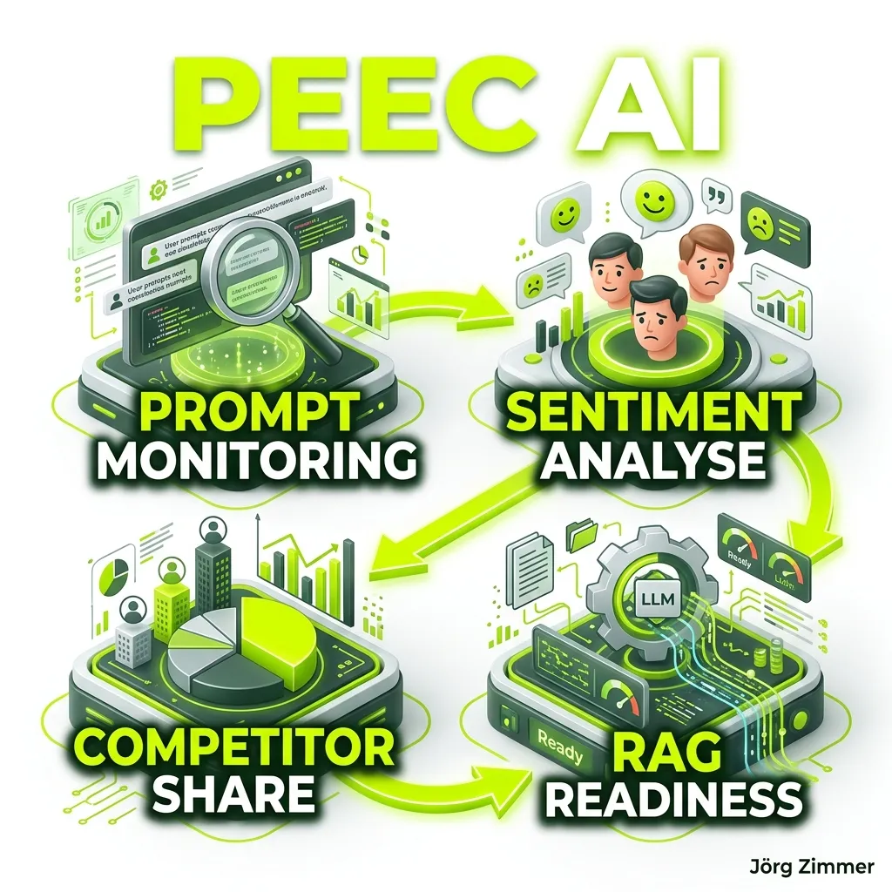

Der fundamentale Wandel der organischen Suche ist längst keine ferne Zukunftsmusik mehr. Er passiert exakt jetzt. Nutzer tippen keine isolierten, rudimentären Suchbegriffe mehr in eine Suchleiste ein, um sich dann mühsam durch zehn werbeverseuchte Links zu wühlen. Sie stellen hochkomplexe, extrem spezifische Fragen direkt an ChatGPT, Perplexity oder die Google AI Overviews (SGE) und erwarten sofort eine aggregierte, fertige Antwort. Wer in diesen generierten Antworten nicht zitiert wird, existiert in der kritischen Entscheidungsfindung der Zielgruppe schlichtweg nicht. 

Genau diese gigantische Lücke in der Messbarkeit schließt Peec AI. 

**Peec AI** (peec.ai) ist eine kompromisslose, hochspezialisierte Plattform für AI Search Analytics. Sie trackt, analysiert und optimiert die Sichtbarkeit von Marken in generativen Suchmaschinen mit analytischer Präzision. Während klassische [SEO Visibility Tools](/glossar/se-ranking/) traditionell starke Allrounder für organische Google-Rankings bleiben, bohrt sich Peec AI chirurgisch präzise in die Blackbox der Large Language Models (LLMs). In diesem monumentalen Übersichtsartikel zerlegen wir die Plattform in alle ihre Einzelteile. Wir analysieren das Feature-Set, bewerten die technischen Audits, vergleichen den Paradigmenwechsel mit dem klassischen SEO und beleuchten die extrem transparente Preisstruktur für Brands und Agenturen im Detail.

<figure class="my-8 bg-neutral-50 border border-neutral-200 p-6 md:p-8 rounded-2xl shadow-sm">
  

    
    

      <h4 class="font-bold text-base md:text-lg text-dark mb-0">Jörg Zimmer</h4>
      
Senior SEO & AI Search Consultant

    

  

  <blockquote class="text-base md:text-lg text-dark leading-relaxed italic border-l-4 border-lime-accent pl-4 my-4 font-normal">
    „Peec AI beweist, worum es im modernen SEO wirklich geht: Wer in KI-generierten Antworten wie ChatGPT oder Perplexity nicht zitiert wird, existiert in der Buyer Journey der Zielgruppe schlichtweg nicht. LLMO und Prompt-Monitoring sind keine Spielerei für Tech-Nerds, sondern das unbarmherzige Fundament für die organische Sichtbarkeit der nächsten Jahre.“
  </blockquote>
  <figcaption class="mt-4 pt-3 border-t border-neutral-200/60 flex flex-wrap items-center justify-between gap-2 text-xs text-neutral-500">
    Experten-Zitat • <cite class="not-italic font-semibold text-neutral-700">Jörg Zimmer</cite>
    <a href="https://www.linkedin.com/in/joerg-zimmer-seo-sea-freelancer-berlin-spandau/" target="_blank" rel="noopener noreferrer" class="font-bold text-lime-700 hover:underline inline-flex items-center gap-1">
      Jörg Zimmer auf LinkedIn folgen →
    </a>
  </figcaption>
</figure>

  

    30-Sekunden Inhaber-Check
  

  <h3 class="text-lg font-bold text-dark mb-2">Jörgs Praxistipp aus der SEO-Sprechstunde</h3>
  

    Klassische Rank-Tracker zeigen dir stolz Platz 1 auf Google, während dein Lead-Volumen im B2B wegbricht. Warum? Weil Entscheidungsträger keine Keywords mehr googeln, sondern ChatGPT fragen: <em>„Welche B2B-Plattform löst Problem X am zuverlässigsten?“</em> Wenn dein Unternehmen in diesen Antworten nicht als Primärquelle zitiert wird, gewinnt der Wettbewerber mit dem besseren Digital-PR-Profil den Deal.
  

  

    
🔍 Schneller Check in deiner Marketing-Routine:

    
1. Definiere die 5 wichtigsten Kaufentscheidungs-Prompts deiner Zielgruppe und teste sie direkt in ChatGPT, Perplexity und Claude.

    
2. Prüfe, welche Vergleichsportale (z. B. OMR Reviews, G2) oder Fachartikel von der KI als Zitate herangezogen werden.

    
3. Nutze ein Tool wie <strong>Peec AI</strong> oder <strong>SE Ranking</strong>, um deinen Share of Voice und das Zitations-Sentiment fortlaufend zu überwachen.

    
<strong>Kontrollfrage an dein Content-Team:</strong> <em>„Überwachen wir systematisch, in welchen Prompt-Antworten unsere Marke empfohlen wird, und welche externen Quellen wir mit gezieltem Seeding aufbauen müssen?“</em>

  

## Die Kernfunktionen von Peec AI im Detail

Ein echtes, hochperformantes [AI Visibility Tool](/glossar/ai-visibility-tools/) muss heute weit mehr leisten, als nur einfache, statische Chat-Verläufe in ein Excel-Dokument zu exportieren. Die verlässliche Messbarkeit von KI-Antworten erfordert eine granulare Auswertung auf Prompt-Ebene, gepaart mit einer massiven Rechenleistung im Hintergrund. Peec AI liefert hierfür ein brachiales Arsenal an Werkzeugen.

### 1. AI Visibility & Citation Tracking
Das unangefochtene Herzstück der Software ist das Visibility-Modul. Es beantwortet schonungslos die zentrale Frage: **Wird meine Marke von der KI empfohlen – oder empfiehlt sie durchweg meine Konkurrenz?**

Die Plattform misst den sogenannten *Share of Voice*. Du siehst exakt, wie hoch der prozentuale Anteil deiner Nennungen im Vergleich zum gesamten simulierten Suchvolumen deiner Branche ist. Dies ist der härteste KPI im Zeitalter der LLMs.

- **Tiefe Quellen-Analyse:** Das System trackt nicht nur die plumpe Nennung im generierten Text, sondern analysiert die harten Zitationen (Citations). Verlinkt Perplexity tatsächlich auf deine Landingpage? Nutzt ChatGPT deine Domain als primäre, vertrauenswürdige Quelle? Welcher Satz aus deinem Content wurde vom Modell extrahiert?
- **Intelligente Sentiment-Analyse:** Eine Erwähnung ist komplett nutzlos (und im schlimmsten Fall geschäftsschädigend), wenn die KI negativ über das Produkt spricht. Peec AI bewertet das Sentiment (positiv, neutral, negativ) jeder einzelnen Nennung vollautomatisch. So weißt du, ob ein Modell dich als "Marktführer" oder als "veraltete, überteuerte Lösung" brandmarkt.

### 2. Prompt Monitoring

Klassisches SEO nutzt Suchvolumina. [Generative Engine Optimization (GEO)](/glossar/geo-tool/) nutzt Prompts.
Im Prompt Monitoring legst du exakte, ausformulierte Nutzerfragen an, die tief im Funnel liegen. Zum Beispiel: *"Vergleiche die Softwarelösung A mit der Softwarelösung B hinsichtlich der europäischen Datenschutzkonformität und der Preisstruktur für Teams über 50 Personen"*. Peec AI simuliert diese komplexen Abfragen periodisch über verschiedene KI-Engines hinweg.

Du erhältst lückenlose historische Verlaufsdaten. Fällt deine Marke nach einem Core-Update plötzlich aus den Empfehlungen von Claude heraus, schlägt das System Alarm. Die gesammelten Daten helfen dir extrem gezielt dabei, deinen Content exakt so umzuschreiben, dass die KIs dich wieder als dominierende Autorität einstufen. Dieses Reverse-Engineering der KI-Antworten ist pures Gold für Content-Strategen.

### 3. Gnadenloses Competitor Benchmarking
SEO ist und bleibt ein brutaler Verdrängungswettbewerb. Das gilt zu 100 Prozent auch für das [AI Visibility Tracking](/glossar/ki-sichtbarkeit/).
Die Plattform erlaubt den direkten, ungeschönten Abgleich mit deinen härtesten Wettbewerbern auf exakt derselben Datengrundlage.

- **Marktanteils-Analyse:** Wer dominiert die Antworten zu den lukrativsten kommerziellen Prompts?
- **Informationsquellen-Mapping:** Welche Informationsquellen (z. B. Wikipedia, G2, OMR Reviews, Fachmagazine, Foren) nutzt die KI primär, um den Konkurrenten zu empfehlen? Dieses Wissen erlaubt es dir, PR-Kampagnen extrem zielgerichtet genau auf diesen Drittplattformen zu platzieren.
- **Blind-Spot-Erkennung:** Wo liegen thematische Lücken (Blind Spots) beim Wettbewerb, die du mit extrem tiefgründigen, eigenen Inhalten (z. B. in Form einer [Grounding Page](/glossar/grounding-page/)) füllen kannst?

### 4. AI Shopping Tracking & Product Visibility
Für E-Commerce-Brands hat sich das Spielfeld im letzten Jahr radikal verschoben. KIs generieren heute proaktiv visuelle Produkt-Karussells und knallharte Preisvergleiche direkt im Chatfenster des Nutzers. Ein Klick auf die Website findet oft gar nicht mehr statt.

Peec AI überwacht diese brandneuen, dynamischen Shopping-Integrationen akribisch. Das Tool trackt, ob deine Produkte überhaupt in den visuellen Empfehlungen auftauchen, ob die angezeigten Preise (und Rabattaktionen) korrekt gezogen werden und wie die KI die Produktspezifikationen im Vergleich zur Konkurrenz darstellt. Wer im [AI Search Visibility](/glossar/ki-sichtbarkeit/) Game für E-Commerce heute noch gewinnen will, kommt an diesem speziellen E-Commerce-Modul schlichtweg nicht mehr vorbei. Es entscheidet über direkten Umsatz.

### 5. Crawlability Checks & Bot-Audits
KI-Bots verhalten sich fundamental anders als der klassische, alteingesessene Googlebot. OpenAI, Anthropic und Perplexity nutzen völlig eigene, extrem aggressive Crawler (z. B. `OAI-SearchBot`, `ClaudeBot`, `PerplexityBot`), um das Web in Echtzeit zu durchsuchen und ihre Modelle mit frischen Daten zu füttern (RAG - Retrieval-Augmented Generation).

Wenn deine `robots.txt` oder deine serverseitige Web Application Firewall (WAF) diese Bots versehentlich (oder durch alte Security-Regeln) blockiert, bist du für die Modelle unsichtbar. Deine Marke existiert in der KI-Welt dann schlichtweg nicht. Peec AI bringt ein tiefgreifendes, technisches Audit-Tool mit, das deine gesamte Domain gegen über 40 spezifische AI-Bots auf Herz und Nieren testet. 

Es simuliert Zugriffe aus verschiedenen Rechenzentren. Es prüft HTTP-Statuscodes. Es deckt erbarmungslos auf, ob serverseitiges Rendering (SSR) bei JavaScript-lastigen Seiten korrekt konfiguriert ist, damit LLMs die Text-Inhalte überhaupt parsen können. Ein absolutes, essenzielles Basis-Werkzeug für jedes ernstzunehmende [AI Visibility Audit](/glossar/ai-visibility-tools/).

## Peec AI vs. klassisches SEO: Der radikale Paradigmenwechsel

Viele Entscheider stellen sich die berechtigte Frage: "Warum reicht mein herkömmliches SEO-Tool, für das ich jeden Monat Hunderte Euro zahle, nicht mehr aus?" Die ehrliche Antwort liegt in der völlig anderen Architektur der modernen Suchsysteme. Wir vergleichen Äpfel mit Flugzeugen.

| Metrik / Konzept | Klassisches SEO (Rank-Tracker) | Generative AI Search (Peec AI) |
| :--- | :--- | :--- |
| **Zielgröße** | Rankings (Top 10 blaue Links) | Zitationen & Textuelle Nennungen |
| **Input-Format** | Short-Tail Keywords ("SEO Agentur Berlin") | Komplexe Konversations-Prompts |
| **Nutzer-Intent** | Navigation & Suche nach Quellen | Direkte Antwort & Synthese im Chat |
| **Erfolgskennzahl** | Klickrate (CTR) & Organischer Traffic | Share of Voice (Marktanteil) & Sentiment |
| **Wettbewerb** | Andere Domains auf der SERP | Die KI selbst (Zero-Click-Content) |

Die Metriken sind schlicht nicht kompatibel. Wer ernsthaft versucht, seine moderne KI-Sichtbarkeit mit einem Rank-Tracker aus dem Jahr 2015 zu messen, wird kläglich scheitern und in völliger Dunkelheit tappen. Moderne, ganzheitliche Plattformen wie [SE Ranking](/glossar/se-ranking/) rüsten zwar mittlerweile mit eigenen AI-Modulen nach, aber eine exklusive, hochspezialisierte Architektur wie die von Peec AI liefert oft tiefere, rein auf LLMs und GEO zugeschnittene Insights, ohne Kompromisse bei Altlasten machen zu müssen.

## Preise und Paket-Struktur (Stand 2026)

Herausragende Technologie hat ihren Preis, aber Peec AI wählt hier einen extrem fairen, skalierbaren Ansatz. Peec AI strukturiert seine Kosten primär nach der Zielgruppe: **Brands** (Inhouse-Teams, Solo-Selbstständige) und **Agencies** (SEO-Dienstleister, PR-Agenturen). Die exakten Konditionen schwanken leicht durch saisonale Angebote, doch die Kernarchitektur der Pakete hat sich im Markt etabliert.

Eine massive Stärke der Plattform, die man extrem lobend hervorheben muss: Sie limitiert in den meisten Plänen **nicht** die Anzahl der aktiven Nutzer (Seats). Das ist ein radikaler, kundenfreundlicher Vorteil gegenüber vielen Legacy-Tools, die für jeden weiteren Account absurde Summen verlangen.

### 1. Der Starter Plan (Brand Focus)
Perfekt für Einzelunternehmen, kleine Nischen-Brands oder Inhouse-SEOs, die den sprichwörtlichen Fuß in die Tür der KI-Optimierung bekommen wollen, ohne direkt ein gigantisches Budget freizugeben.
- **Typische Kosten:** ca. $85 – $100 pro Monat.
- **Leistungsumfang:** Basis-Tracking einer definierten, begrenzten Anzahl von Prompts und den wichtigsten Kern-Wettbewerbern.
- **Fokus:** Tägliches Monitoring der wichtigsten Brand-Keywords in ChatGPT und Google AI Overviews. Ideal, um erste Daten für das C-Level zu sammeln.

### 2. Der Pro Plan (Growth Focus)
Ausgelegt auf ehrgeizige Performance-Marketing-Teams, die tiefgehende Analysen fahren und Content-Strategien streng datengetrieben anpassen müssen.
- **Typische Kosten:** ca. $200 – $250 pro Monat.
- **Leistungsumfang:** Deutlich erhöhtes Prompt-Limit, volles Shopping-Tracking-Modul und tiefergehende API-Exporte für interne Dashboards (z. B. via Looker Studio oder PowerBI).
- **Fokus:** Harte Skalierung von GEO-Strategien über Hunderte von extrem spitzen Long-Tail-Anfragen.

### 3. Enterprise / Agency Pläne
Für große Agenturen, die Dutzende von Mandanten betreuen, White-Label-Reporting benötigen und riesige Datenmengen verarbeiten, beginnt das Pricing naturgemäß in höheren Sphären.
- **Typische Kosten:** ab $400+ pro Monat (stark modular anpassbar je nach Prompt-Volumen).
- **Leistungsumfang:** Unlimitierte Seats, gigantische Prompt-Volumina, absolute Mandanten-Trennung (Workspaces), ein dedizierter Customer Success Manager, bevorzugter Support und unlimitierte API-Zugriffe für Custom Dashboards.
- **Fokus:** Bereitstellung einer B2B-Infrastruktur für Agenturen, die KI-Sichtbarkeit als neue, extrem hochpreisige Dienstleistung (Retainer) an ihre Endkunden verkaufen.

Die Plattform bietet klassischerweise eine **7-Tage-Testversion** an. Ein harter, schonungsloser Testlauf mit echten, schmutzigen Daten aus dem eigenen Geschäftsfeld ist meiner Meinung nach absolute Pflicht, bevor man Budgets freigibt und sich längerfristig bindet.

## Für wen ist Peec AI ein absolutes Muss?

Müssen wir alle in Panik verfallen und sofort KI-Tools buchen? Nein. Nicht jedes Unternehmen benötigt heute schon ein dediziertes KI-Tracking. Wer lokale, sehr banale Dienstleistungen anbietet ("Schlüsseldienst Bottrop" oder "Pizzeria um die Ecke"), für den bleiben Google Maps und starkes Local SEO vorerst der wichtigste Hebel.

Peec AI entfaltet seine rohe Gewalt und seinen wahren ROI bei hochgradig erklärungsbedürftigen B2B-Softwareprodukten (SaaS), im margenstarken, kompetitiven E-Commerce und im Affiliate-Marketing. Wenn die Zielgruppe intensiv recherchiert, tagelang vergleicht und KIs als persönliche Berater nutzt, ist der Blindflug brandgefährlich. Wer hier seine Nennungen und das Sentiment nicht präzise misst, überlässt den Wettbewerbern völlig kampflos das lukrativste Feld der nächsten Dekade. 

## Alternativen zu Peec AI

Wer nach alternativen Systemen sucht, sollte sich genau ansehen, wo der Fokus der jeweiligen Software liegt.
Viele traditionelle Plattformen bauen das Feature an, sind aber historisch in der alten Welt verwurzelt.
- **SE Ranking (SE Visible):** Wie bereits erwähnt, bietet [SE Ranking](/glossar/se-ranking/) ein exzellentes, voll integriertes KI-Modul (SE Visible) an. Wer ohnehin ein All-in-One-Tool für Backlinks, Audits und klassische Rankings sucht, findet hier oft das perfekte Kombi-Paket zu einem extrem starken Preis-Leistungs-Verhältnis.
- **Rankscale:** Ein direkter, sehr aggressiver Mitbewerber auf dem reinen AI-Tracking-Markt. Der Fokus von Rankscale liegt oft auf einer extrem sauberen API-Architektur für Entwickler.
- Andere Agentur-Software-Lösungen integrieren zunehmend ähnliche Share-of-Voice-Metriken, oft aber (Stand 2026) noch sehr rudimentär und ohne die tiefen Crawler-Audits, die Peec AI bietet.

  

    

      🤖
      
Arbeitsanweisung für deinen KI-Agenten (Cursor / Claude / Antigravity)

    

    <button type="button" class="copy-agent-btn px-2.5 py-1 bg-lime-accent text-dark hover:bg-lime-600 hover:text-white text-[11px] font-bold uppercase rounded border border-lime-500 hover:border-lime-600 transition-all flex items-center gap-1 shadow-md cursor-pointer shrink-0 ml-auto" title="Prompt kopieren">
      <svg class="w-3.5 h-3.5" fill="none" stroke="currentColor" viewBox="0 0 24 24"><path stroke-linecap="round" stroke-linejoin="round" stroke-width="2" d="M8 16H6a2 2 0 01-2-2V6a2 2 0 012-2h8a2 2 0 012 2v2m-6 12h8a2 2 0 012-2v-8a2 2 0 01-2-2h-8a2 2 0 01-2 2v8a2 2 0 012 2z" /></svg>
      Kopieren für Agent
    </button>
  

  

    Kopiere diesen Prompt direkt in deinen KI-Coding-Assistenten, um die Anforderungen automatisiert für dein Webprojekt umzusetzen:
  

  

    
# Prompt: AI Search Visibility & GEO Tracking Setup

    
<strong>Rolle:</strong> Du bist ein erfahrener AI Search & GEO Data Architect.

    
<strong>Aufgabe:</strong> Richte ein automatisiertes Prompt-Monitoring- und Zitations-Tracking-Framework ein, um Marken-Erwähnungen in generativen KIs zu erfassen.

    
<strong>Schritte & Validierung:</strong>

    <ul class="list-disc pl-4 space-y-1 text-gray-300">
      <li>Prompt-Cluster definieren: Identifiziere 30 kaufrelevante Nutzer-Prompts (Commercial Intent) inklusive Wettbewerber-Vergleiche.</li>
      <li>API-Anbindung: Konfiguriere Webhooks oder API-Endpunkte für Peec AI, Rankscale oder synthetische LLM-Runs zur wöchentlichen Abfrage.</li>
      <li>Sentiment- & Citation-Parsing: Extrahiere verlinkte Quell-Domains und klassifiziere Erwähnungen nach Sentiment (positiv/neutral/negativ).</li>
      <li>Crawler-Check: Validiere in der <code>robots.txt</code>, dass <code>OAI-SearchBot</code>, <code>ClaudeBot</code> und <code>PerplexityBot</code> vollständigen Lesezugriff auf Content-Ressourcen haben.</li>
    </ul>
    
<strong>Output:</strong> Liefere ein Schema für das Dashboard-Reporting und ein Skript zur automatisierten Alerting-Pipeline bei Sichtbarkeitsverlusten.

  

## Abschließende Bewertung

Die reine Textgenerierung durch künstliche Intelligenz ist mittlerweile ein gelöstes, fast schon banales Problem geworden. Die neue, extrem umkämpfte Frontlinie im digitalen Marketing ist die Distribution. Wer kontrolliert die Antworten? 

**Peec AI** liefert exakt das nötige Radar für diesen völlig neuen Kriegsschauplatz. Es transformiert das bisher extrem schwammige, unsichere Bauchgefühl ("Ich glaube, ChatGPT mag unsere Marke eigentlich ganz gern") in harte, unbestechliche, board-room-taugliche Kennzahlen. 

Die Plattform zwingt Marketer dazu, radikal umzudenken. Weg vom blinden, massenhaften Linkbuilding, hin zu echten Content-Signalen, exzellenten Experten-Interviews und extrem starkem E-E-A-T. Wer den Share of Voice in generativen Systemen heute erobert und verteidigt, baut einen gigantischen digitalen Burggraben auf, der in den nächsten Jahren extrem schwer zu überwinden sein wird. Die Investition in ein solches, hochspezialisiertes Tool ist daher bei Weitem nicht nur eine lästige Budgetfrage für das Marketing-Team, sondern eine absolut kritische, strategische Wette auf die Zukunft der Informationsbeschaffung.

  
    Aus Jörgs LinkedIn-Feed
  
  <blockquote class="text-base md:text-lg text-gray-200 italic max-w-2xl mx-auto mb-4 border-none font-normal">
    „Das Spielfeld wird dominiert von Webseiten, die ihren Job verstehen.“
  </blockquote>
  

    Diskutiere mit Jörg Zimmer und der SEO-Community auf LinkedIn über diesen Beitrag.
  

  <a href="https://www.linkedin.com/feed/update/urn:li:activity:6997882103384154112" target="_blank" rel="noopener noreferrer" class="btn-primary">
    <svg class="w-4 h-4 fill-current" viewBox="0 0 24 24"><path d="M20.447 20.452h-3.554v-5.569c0-1.328-.027-3.037-1.852-3.037-1.853 0-2.136 1.445-2.136 2.939v5.667H9.351V9h3.414v1.561h.046c.477-.9 1.637-1.85 3.37-1.85 3.601 0 4.267 2.37 4.267 5.455v6.286zM5.337 7.433c-1.144 0-2.063-.926-2.063-2.065 0-1.138.92-2.063 2.063-2.063 1.14 0 2.064.925 2.064 2.063 0 1.139-.925 2.065-2.064 2.065zm1.782 13.019H3.555V9h3.564v11.452zM22.225 0H1.771C.792 0 0 .774 0 1.729v20.542C0 23.227.792 24 1.771 24h20.451C23.2 24 24 23.227 24 22.271V1.729C24 .774 23.2 0 22.222 0h.003z"/></svg>
    Beitrag auf LinkedIn öffnen
    →
  </a>

### Verwandte Glossar-Einträge
* [AI Visibility Tools im Überblick](/glossar/ai-visibility-tools/)
* [GEO Tool: Generative Engine Optimization](/glossar/geo-tool/)
* [KI-Sichtbarkeit messen und steigern](/glossar/ki-sichtbarkeit/)
* [Grounding Page für LLM-Zitationen](/glossar/grounding-page/)
* [SE Ranking als All-in-One SEO Suite](/glossar/se-ranking/)
* [Perplexity-Sichtbarkeit gezielt aufbauen](/glossar/perplexity-sichtbarkeit/)
* [AI Rank Tracker im Detail](/glossar/ai-rank-tracker/)
