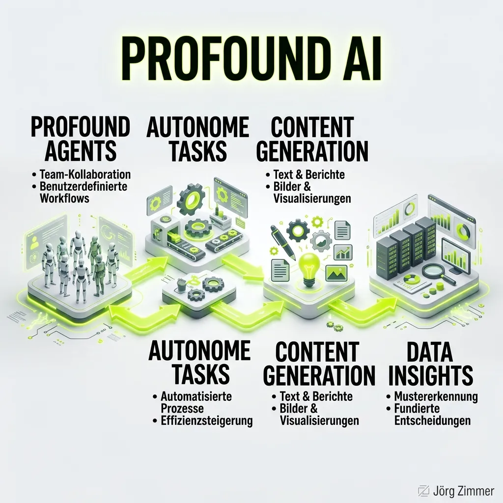

Der Wandel der digitalen Suche vollzieht sich in atemberaubender Geschwindigkeit. Über 100 Millionen Menschen nutzen täglich Künstliche Intelligenz, um Produkte zu entdecken, Vergleiche zu ziehen und Kaufentscheidungen zu treffen. Marken, die in diesen KI-generierten Antworten nicht vorkommen, verlieren rasant an Marktanteilen.

Aus dem Herzen von New York City formte sich genau für dieses Problem eine der extremsten Erfolgsgeschichten der letzten Jahre: **Profound** (`tryprofound.com`). Gegründet erst im August 2024 von James Cadwallader (CEO) und Dylan Babbs (CTO), legte das Startup ein Wachstum hin, das selbst im Silicon Valley für Aufsehen sorgte. Getrieben von massiven Venture-Capital-Investitionen durchbrechen die Amerikaner bereits im Frühjahr 2026 die magische Bewertungsgrenze von 1 Milliarde US-Dollar (Unicorn-Status). Profound weigert sich, ein bloßer "Rank-Tracker" zu sein. Die Plattform prägt den Begriff der [Answer Engine Optimization (AEO)](/glossar/geo-tool/) radikal neu und versteht sich als "Full Stack Marketing Platform" für den KI-Sektor.

In diesem tiefgehenden Übersichtsartikel dekonstruieren wir die Milliarden-Dollar-Plattform. Wir analysieren die Module vom klassischen [AI Search Monitoring](/glossar/ki-sichtbarkeit/) bis hin zu den autonomen KI-Agenten und bewerten die amerikanische Preisstruktur.

## Die Kernfunktionen von Profound

Die Architektur von Profound ist kompromisslos auf Enterprise-Skalierung ausgelegt. Die Plattform trackt, analysiert und – das ist der massive Unterschied zur Konkurrenz – baut den Content zur Behebung der Lücken oft gleich selbst.

### 1. Answer Engine Insights
Das Basis-Dashboard von Profound überwacht die Sichtbarkeit der eigenen Marke über das gesamte Spektrum der Answer Engines. Je nach Plan trackt die Plattform bis zu neun (!) verschiedene Modelle simultan: ChatGPT, Perplexity, Google AI Overviews, Google Gemini, Microsoft Copilot, Grok, DeepSeek und Anthropic Claude.
- **Brand Sentiment & Citations:** Du erkennst in Echtzeit, ob die KI-Modelle deine Marke positiv empfehlen oder kritisieren.
- **Competitor Rankings:** Wer dominiert den Share of Voice? Profound zeigt präzise, an welche Konkurrenten die KI wertvollen Traffic weiterleitet.

### 2. Prompt Volumes
Eines der größten Probleme im KI-Marketing ist das blinde Raten. Niemand wusste bislang genau, wie oft Nutzer eine bestimmte Frage an ChatGPT stellen.
Mit dem Feature "Prompt Volumes" bricht Profound diese Blackbox auf. Das System zeigt, was Millionen von Menschen die KIs fragen, und verknüpft diese Konversationen mit harten, datengestützten Volumen-Metriken. So können Marketing-Teams ihre Strategie nicht mehr nach Bauchgefühl, sondern nach echter Nachfrage ausrichten.

### 3. Profound Agents & Sheets

Hier zeigt das Unicorn seine wahre Macht. Ein Agent bei Profound ist ein autonomer, digitaler Mitarbeiter (Worker), der eine spezifische Funktion übernimmt.
Ein Praxisbeispiel: Der "AEO-Optimierte FAQ Generator". Du gibst dem Agenten die URL deiner Landingpage und den Kern-Suchbegriff (z.B. "Best Running Shoes"). Der Agent durchforstet Perplexity, analysiert die dort gestellten Fragen der Nutzer, gleicht sie mit deiner Website ab und generiert vollautomatisch einen perfekten FAQ-Bereich, der exakt auf die Informationsbedürfnisse der KI zugeschnitten ist.
Mit "Profound Sheets" lassen sich diese Agenten auf hunderte URLs gleichzeitig skalieren. Es ist Content-Produktion auf Steroiden.

### 4. ChatGPT Shopping & Agent Analytics
Die Monetarisierung von ChatGPT schreitet extrem voran. Für E-Commerce-Brands bietet Profound ein exklusives (Enterprise) Modul: Das Tracking der direkten Produkt- und Preisempfehlungen innerhalb der ChatGPT-Shopping-Oberfläche.
Zusätzlich liefert das Modul "Agent Analytics" tiefe Einblicke, wie und wann die Bot-Crawler der großen Modelle (z.B. der GPTBot) die eigene Server-Infrastruktur durchsuchen.

### 5. Das Aim-Modul
"Aim" ist die strategische Kommandozentrale. Das System analysiert Millionen von Datenpunkten und präsentiert dem Marketing-Team jede Woche die Aufgaben mit dem höchsten Impact. "Ergänze FAQ-Schema auf /pricing" oder "Sorge für eine Erwähnung auf g2.com, da dies die Hauptquelle für Perplexity in deiner Nische ist." 

## Abgrenzung: Profound vs. klassische SEO-Infrastruktur

Warum verlagern globale Marken ihr Budget massiv in Plattformen wie Profound?

| Metrik / Paradigma | Traditionelles SEO | Profound (Full Stack AEO) |
| :--- | :--- | :--- |
| **Erfolgsfaktor** | Position in den SERPs (1-10) | Nennung und Sentiment im direkten Chat |
| **Suchanfrage** | Kurze, fragmentierte Keywords | Lange, interaktive Konversations-Prompts |
| **Workflow** | Tracking -> Manuelles Briefing -> Texten | Tracking -> Autonome Agenten -> Generierung |
| **Sichtbarkeit** | Fokus auf den Googlebot | Abdeckung von bis zu 9 autonomen LLM-Systemen |
| **Traffic-Wert** | Hoch | Extrem hoch (Nutzer stehen kurz vor der Conversion) |

Während klassische [SEO Visibility Tools](/glossar/se-ranking/) den Status quo der blauen Links vermessen, agiert Profound proaktiv in der neuen Konversations-Ära.

## Die Preisstruktur (Stand 2026)

Profound fokussiert sich klar auf ambitionierte Teams und Enterprise-Kunden. Die Abrechnung erfolgt über eine Kombination aus getrackten Prompts und "Credits", welche für den Einsatz der autonomen Agenten benötigt werden.

### 1. Starter Plan ($99 / Monat)
Der Einstieg in die Welt von Profound.
- **Kosten:** $99 pro Monat (jährliche Abrechnung, 2 Monate gratis).
- **Leistungsumfang:** 50 getrackte Prompts, ausschließlich auf **ChatGPT**.
- **Kapazität:** 1.500 analysierte KI-Antworten pro Monat.
- **Ressourcen:** 100 Agenten-Credits pro Monat und 1 Team-Seat.
- **Zielgruppe:** Sehr kleine Unternehmen, die erste Gehversuche im ChatGPT-Monitoring unternehmen wollen.

### 2. Growth Plan ($399 / Monat)
Der beliebteste Plan für skalierende Content- und AEO-Teams.
- **Kosten:** $399 pro Monat.
- **Leistungsumfang:** 100 getrackte Prompts auf 3 Engines (**ChatGPT, Perplexity, Google AI Overviews**).
- **Kapazität:** 9.000 analysierte KI-Antworten pro Monat.
- **Ressourcen:** 400 Agenten-Credits pro Monat, 3 Team-Seats.
- **Bonus:** Enthält das mächtige "Prompt Volumes"-Feature.

### 3. Enterprise (Custom Pricing)
Maßgeschneiderte Pakete für globale Agenturen und Konzerne.
- **Leistungsumfang:** Tracking auf bis zu 9 Answer Engines (inkl. Gemini, Copilot, Grok, Claude, DeepSeek).
- **Kapazität:** Custom Limits für Prompts und analysierte Antworten.
- **Exklusive Features:** ChatGPT Shopping-Tracking, Aim (Task-Priorisierung), API-Zugriff, SSO/SAML und dedizierter Slack-Support.
- **Integrationen:** Tiefe System-Integrationen (AWS, Cloudflare, Fastly, Google Analytics).

## Abschließende Bewertung: Die Milliarden-Wette auf Agenten

Die rasante Bewertung von 1 Milliarde US-Dollar innerhalb von nicht einmal zwei Jahren kommt nicht von ungefähr. Die Gründer James Cadwallader und Dylan Babbs haben verstanden, dass die Zukunft des Marketings nicht im reinen *Messen* von KI-Daten liegt, sondern im proaktiven *Handeln*.

**Profound** ist keine einfache Analytics-Software, es ist ein komplettes Marketing-Betriebssystem für die Ära der generativen Suche. Die Kombination aus extrem tiefen Zitations-Daten (inklusive echter Prompt-Suchvolumina) und den autonomen "Profound Agents", die den nötigen Content zur Lückenfüllung direkt mitschreiben, ist in dieser Form einmalig auf dem Markt. 

Für kleine Solo-Marketer mag der Starter-Plan durch die reine Limitierung auf ChatGPT etwas starr wirken. Doch für wachsende Brands und globale Enterprise-Unternehmen ist Profound aktuell eine der schärfsten Waffen im globalen Wettlauf um die KI-Sichtbarkeit. Wer hier nicht frühzeitig investiert, überlässt den direktesten Zugang zum Endkunden schlichtweg der Konkurrenz.

  
💬 Jetzt an der Diskussion teilnehmen!

  <a href="https://www.linkedin.com/in/joerg-zimmer-seo-sea-freelancer-berlin-spandau/" target="_blank" rel="noopener noreferrer" class="inline-block bg-dark text-white font-bold py-2 px-6 rounded-full hover:bg-gray-800 transition-colors">
    Beitrag auf LinkedIn öffnen
  </a>

