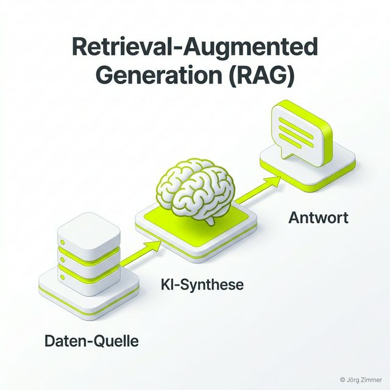

Moin! 🌻

Wir alle kennen das: Man fragt ChatGPT nach einem aktuellen Fakt, und die KI schwurbelt sich irgendwas zusammen, das zwar glaubwürdig klingt, aber leider komplett erfunden ist. In der Tech-Welt nennen wir das eine Halluzination. In der echten Welt nennen wir das: Unbrauchbar.

Genau hier kommt **RAG** ins Spiel. **Retrieval-Augmented Generation** ist das sprichwörtliche Sicherheitsseil für künstliche Intelligenzen. Es ist der Grund, warum KI-Tools heute plötzlich so präzise auf Unternehmendaten antworten können. Wer im Jahr 2026 im Digital Marketing mitspielen will, muss verstehen, wie er seine Inhalte so aufbereitet, dass sie für den RAG-Prozess "lecker" sind.

## Was ist RAG (Retrieval-Augmented Generation)?

RAG ist ein Architektur-Muster in der KI-Entwicklung, das ein Large Language Model (wie GPT-4 oder Claude) mit einer externen Datenquelle verknüpft. Statt sich nur auf das in den Parametern gespeicherte Wissen zu verlassen, geht die KI in drei Schritten vor:

1.  **Retrieval (Abrufen):** Basierend auf der Nutzerfrage sucht die KI in einer Datenbank (meist eine Vektordatenbank) nach den relevantesten Informationen.
2.  **Augmentation (Anreichern):** Die gefundenen Informationen werden dem ursprünglichen Nutzer-Prompt hinzugefügt. Die KI bekommt also den Befehl: "Beantworte diese Frage *nur* auf Basis der folgenden Texte..."
3.  **Generation (Generieren):** Das LLM schreibt eine Antwort, die auf den echten Fakten aus dem Retrieval-Schritt basiert.

## Warum RAG der SEO-Gamechanger ist

Früher haben wir Texte für den Googlebot geschrieben, damit er sie indexiert. Heute schreiben wir Texte für den RAG-Prozess. Wenn dein Inhalt nicht so strukturiert ist, dass eine KI ihn in kleinen "Chunks" (Informations-Häppchen) extrahieren kann, dann bist du raus.

### Die Vorteile von RAG für deine Website:
*   **Aktualität:** Deine KI-Antworten basieren auf dem neuesten Stand deiner Dokumente, nicht auf dem Trainings-Cutoff des Modells.
*   **Transparenz & Citations:** Da die KI weiß, woher sie die Info hat, kann sie eine klickbare [Citation](/glossar/citation/) setzen. Das ist der heilige Gral im [ChatGPT SEO](/glossar/chatgpt-seo/).
*   **Vertrauen:** Du verringerst das Risiko von Falschaussagen über deine Produkte oder Dienstleistungen massiv.

---

## Jörgs SEO-Klartext: "RAG oder Tod"

> **Tacheles:** Wer heute noch glaubt, dass eine einfache Text wüste auf der Website reicht, der hat die Kontrolle über seine digitale Sichtbarkeit verloren. RAG braucht Struktur. KIs brauchen klare Entitäten und logische Daten-Cluster. Wer hier 'Pfusch am Bau' betreibt, wird von den Reasoning Engines dieser Welt gnadenlos aussortiert. 🌻

In meiner täglichen Arbeit sehe ich oft, dass Unternehmen Unmengen an Geld in KI-Projekte stecken, aber das Fundament – die Datenqualität und die RAG-Fähigkeit – vernachlässigen. Das ist wie ein Porsche mit leerem Tank. Sieht gut aus, bewegt sich aber keinen Millimeter.

## 3 Schritte zur RAG-Optimierung deines Contents

Damit deine Seite im RAG-Prozess von Perplexity, SearchGPT und Co. bevorzugt wird, musst du dein Handwerk beherrschen:

1.  **Semantisches Chunking:** Nutze H2/H3 Überschriften nicht nur für die Optik, sondern als klare Trenner für Informationseinheiten. Ein Chunk sollte ein abgeschlossenes Thema behandeln.
2.  **Strukturierte Daten:** JSON-LD ist die Maschinensprache. Je besser du deine Daten via [Schema.org](/glossar/strukturierte-daten/) auszeichnest, desto leichter hat es der Retrieval-Algorithmus.
3.  **Entity Branding:** Sorge dafür, dass deine Marke und deine Kernbegriffe als eindeutige [Entitäten](/glossar/entitaet/) erkannt werden. Verlinke auf Autoritäten und nutze klare, unmissverständliche Sprache.

## Bottom Line: Die Zukunft gehört den Daten-Ankern

RAG ist nicht nur ein technischer Begriff, es ist eine strategische Notwendigkeit. Wir bewegen uns weg vom rein generativen Schreiben hin zum faktenbasierten Antworten. Wer seine Website als "Knowledge Base" für KIs versteht, der baut ein digitales Asset, das über Jahre hinweg Wert generiert.

Hört auf zu hoffen, dass die KI euch schon irgendwie finden wird. Gebt ihr den Anker, den sie braucht.

ALOHA! 🌻✌️

---

  <h3 class="text-2xl font-bold mb-4">Wird dein Content zitiert?</h3>
  
Lass uns prüfen, ob deine Website fit für den RAG-Prozess der großen KI-Modelle ist. Mit einem tiefen Audit beenden wir den Blindflug und machen dich zur primären Datenquelle.

  <a href="/kontakt/" class="btn-primary inline-flex">Jetzt RAG-Check anfragen</a>

### Verwandte Begriffe & Leseempfehlungen
* [Was ist GEO?](/glossar/geo/)
* [ChatGPT SEO Strategien](/glossar/chatgpt-seo/)
* [Die Rolle von Entitäten](/glossar/entitaet/)
* [AI Visibility messen](/blog/rankscale-ai-visibility-tool/)
* [Strukturierte Daten für KIs](/glossar/strukturierte-daten/)
