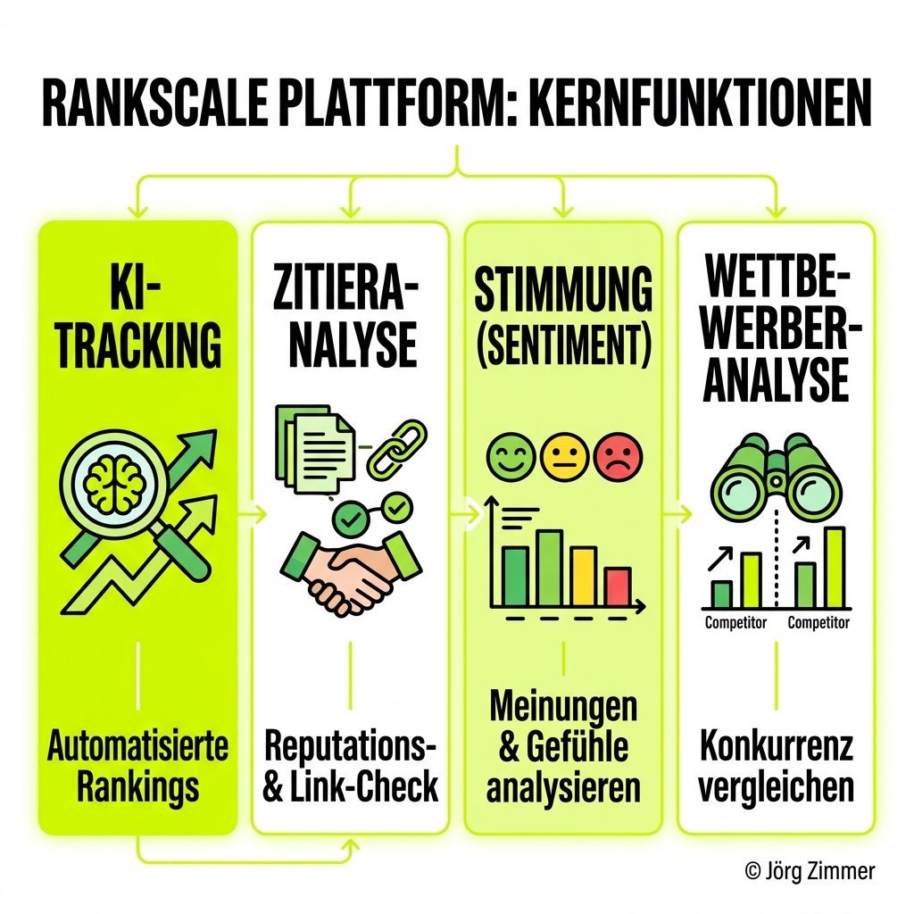
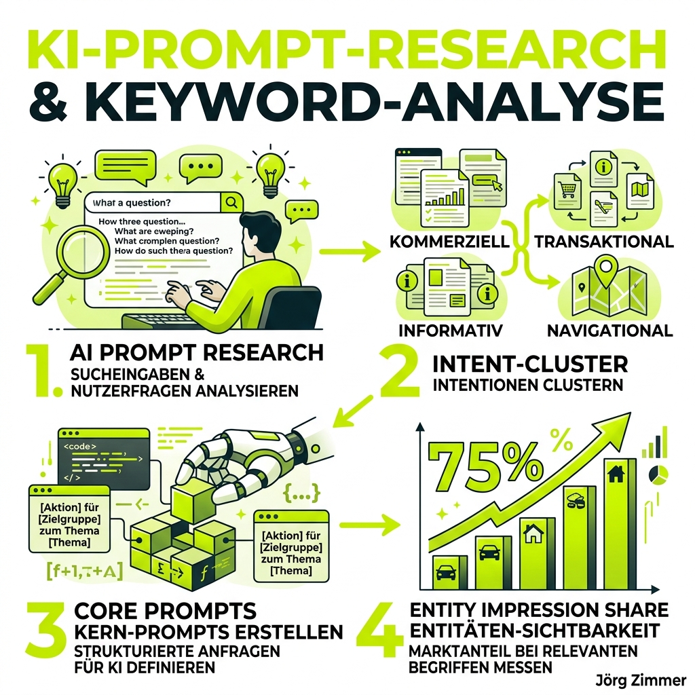
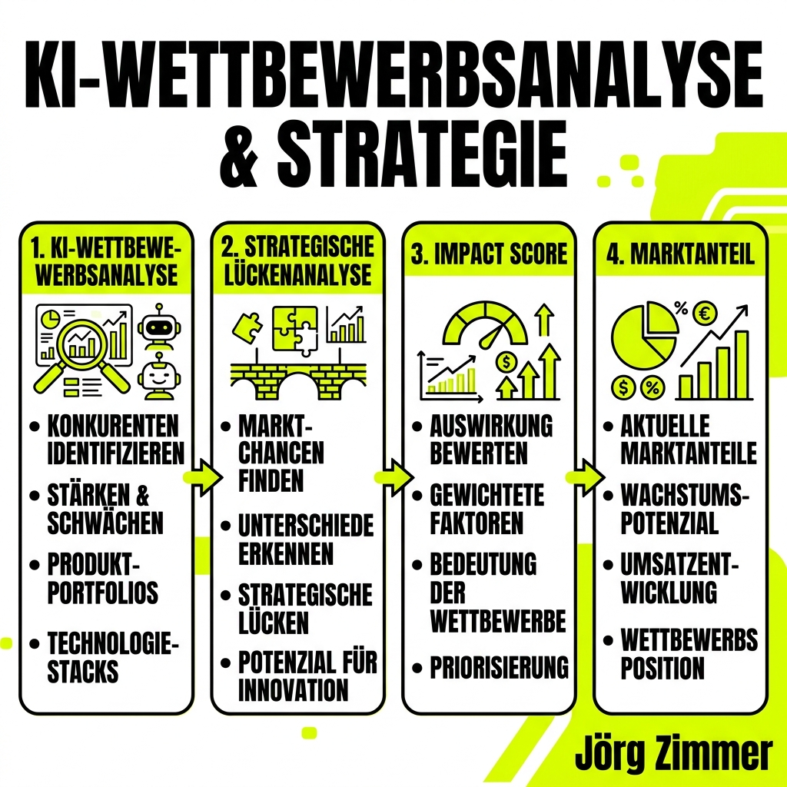

Die Transformation der klassischen Suchmaschine hin zu **generativen KI-Antworten** erfordert ein völlig neues Verständnis von Sichtbarkeitsmessung. Während in der Vergangenheit statische Positionen von blauen Links getrackt wurden, generieren Answer Engines wie ChatGPT oder Perplexity individuelle, dialogbasierte Ergebnisse. **Rankscale** positioniert sich exakt an dieser Schnittstelle und liefert Marken, Agenturen und E-Commerce-Unternehmen die notwendige Dateninfrastruktur, um nicht im Blindflug zu agieren. Die Plattform bündelt acht hochspezialisierte Kernfunktionen, die den gesamten Prozess der *Generative Engine Optimization (GEO)* messbar und steuerbar machen.

## 1. AI Rank Tracker: Die Basis der KI-Sichtbarkeit

Der Einstieg in die KI-Optimierung beginnt mit der lückenlosen Überwachung der eigenen Markenpräsenz. Manuelle Stichproben in ChatGPT sind weder skalierbar noch repräsentativ. Der AI Rank Tracker von Rankscale automatisiert diesen Prozess vollständig und erhebt Sichtbarkeitsdaten über mehr als **17 verschiedene AI Engines**.

Diese Datenerhebung erfolgt hochgradig granular. Das System berücksichtigt regionale und sprachliche Nuancen (z.B. Suchanfragen aus den USA vs. Deutschland). Der zentrale Messwert ist dabei der *Visibility Score*, der die generelle Dominanz der Marke im KI-Ökosystem quantifiziert. 

*   **Multichannel-Fokus:** Überwachung von ChatGPT, Claude, Perplexity und Google AI Mode in einem einzigen Dashboard.
*   **Stabilitätsanalyse:** Das Tool deckt die Volatilität von Suchbegriffen auf. *Du erkennst sofort, ob eine KI deine Marke konsistent empfiehlt oder ob das Ergebnis bei jeder Anfrage schwankt.*
*   **Sample Evidence:** Bei kritischen Nachfragen von Stakeholdern liefert die Software den exakten Wortlaut (Beweis) der von der KI generierten Antwort.

Durch diese strukturierte Datenerfassung reduzieren Marketing-Teams den manuellen Rechercheaufwand drastisch und können Budgetentscheidungen auf echten, reproduzierbaren Beweisen aufbauen, anstatt auf Vermutungen zu basieren.

👉 **Mehr Details:** [Alles zum AI Rank Tracker lesen](/glossar/ai-rank-tracker/)

👉 **Direkt zum Tool:** [AI Rank Tracker auf Rankscale testen](https://rankscale.ai/features/ai-rank-tracker?via=offer)

## 2. AI Citation Tracking: Die Währung des Vertrauens

Im Bereich der Answer Engines ist eine bloße Namensnennung (Mention) der erste Schritt. Die wahre Währung für Traffic und Autorität ist jedoch die **Zitation (Citation)** – der anklickbare Link, der den Nutzer direkt auf die eigene Website führt.

Das Citation & Pattern Analysis Dashboard analysiert exakt, welche Domains in den Antworten der Modelle als Quelle herangezogen werden. Die Plattform berechnet den sogenannten *Citation Share* und schlüsselt diesen auf mehreren Ebenen auf:

| Metrik | Beschreibung der Analyse |
| :--- | :--- |
| **Citation Volume** | Die absolute Anzahl der Zitationen einer Domain über alle 17+ Modelle hinweg. |
| **Citation Attribution** | Die qualitative Unterscheidung, ob die KI nur den Domainnamen referenziert oder einen direkten Link setzt. |
| **Category Breakdown** | Die Segmentierung der Zitationen nach inhaltlichen Clustern (z.B. Produktseiten vs. redaktionelle Ratgeber). |

Ein besonders mächtiges Werkzeug sind die **Domain Leaderboards**. Sie zeigen die Top 20 der am häufigsten zitierten Domains für ein spezifisches Thema. *Findest du hier Branchenforen oder Fachmagazine auf den vorderen Plätzen, sind dies exakt die Plattformen, auf denen du durch PR und Gastbeiträge präsent sein musst.* Die historischen Trendanalysen (Monthly Mentions) machen zudem sofort sichtbar, wenn ein Algorithmus-Update die Gewichtung von Quellentypen verschiebt.

👉 **Mehr Details:** [Alles zur AI Citation Analysis lesen](/glossar/ai-citation-analysis/)

👉 **Direkt zum Tool:** [AI Citation Tracking auf Rankscale testen](https://rankscale.ai/features/ai-citation-tracking?via=offer)

## 3. Prompt Research: Nutzerabsichten entschlüsseln

Klassische Suchvolumen-Tools stoßen bei der Analyse von KI-Prompts an ihre Grenzen. Nutzer tippen nicht mehr "laufschuhe kaufen", sondern formulieren komplexe Anweisungen ("Ich brauche leichte Laufschuhe für Überpronierer unter 150 Euro"). Die **Prompt Research** Funktion von Rankscale entschlüsselt diese neuen Verhaltensmuster durch die exklusive Methodik des *Prompt Decoding*.

Diese Methodik basiert nicht auf Nutzer-Tracking (Telemetry), sondern auf **semantischer Rekonstruktion** und internen Modell-Simulationen der KIs. Die Ergebnisse wurden laut Anbieter durch externe Studien (z.B. Harvard/NBER) validiert und liefern ein konstantes Bild über Modelle wie ChatGPT und Gemini hinweg.

*   **Intent-Cluster:** Das System gruppiert abertausende Einzel-Prompts in logische Absichten (Intents), um die wahren Bedürfnisse des Marktes sichtbar zu machen.
*   **Core Prompts:** Rankscale identifiziert die zentralen Fragestellungen, die eine Branche antreiben, inklusive historischer Trendverläufe.
*   **Entity Impression Share:** Diese Metrik misst, wie dominant deine Marken-Entität im Vergleich zu Wettbewerbern innerhalb der gesamten Antworten zu einem bestimmten Cluster platziert wird.

Das Verständnis dieser Core Prompts ist essenziell, um den eigenen Content exakt auf die Fragen auszurichten, die den Answer Engines tatsächlich gestellt werden.

👉 **Mehr Details:** [Alles zur AI Prompt Research lesen](/glossar/ai-prompt-research/)

👉 **Direkt zum Tool:** [Prompt Research auf Rankscale testen](https://rankscale.ai/features/prompt-research?via=offer)

## 4. Brand Visibility Dashboard: Die Kommandozentrale

Für Agenturen und Enterprise-Unternehmen, die ein Portfolio an Marken betreuen, wird die Fragmentierung der Daten schnell zum Problem. Das Brand Visibility Dashboard löst diese Herausforderung als zentraler *Command Center*.

Es aggregiert alle Messwerte – Rankings, Mentions, Zitationen und Sentiment – über alle 17+ KI-Modelle in einer einzigen, aufgeräumten Oberfläche. Die Notwendigkeit, sich durch dutzende Tabs und Einzel-Tools zu klicken, entfällt komplett. 

> Die Konsolidierung der Daten ermöglicht es Teams, abteilungsübergreifend auf einer identischen Datenbasis (Single Source of Truth) zu operieren.

Besonders für das Reporting an das Management (C-Level) bietet das Dashboard sofort exportierbare Präsentationsdaten. Wenn Stakeholder nach dem ROI der GEO-Maßnahmen fragen, liefert die Kommandozentrale die aggregierten Entwicklungen der Markenpräsenz auf Knopfdruck.

👉 **Mehr Details:** [Alles zum Brand Visibility Dashboard lesen](/glossar/brand-visibility-dashboard/)

👉 **Direkt zum Tool:** [Brand Visibility Dashboard auf Rankscale testen](https://rankscale.ai/features/brand-visibility-dashboard?via=offer)

## 5. GEO Page Audit: Die Architektur der Sichtbarkeit

Die besten Prompts und Sichtbarkeits-Metriken sind wertlos, wenn die eigene Website technisch nicht in der Lage ist, von den KI-Modellen verarbeitet (geparst) zu werden. Das **GEO Page Audit** ist ein streng regelbasierter Prüfmechanismus (ohne Blackbox-LLMs), der URLs auf ihre KI-Tauglichkeit durchleuchtet.

Im ersten Schritt klassifiziert die Engine die URL in einen von acht Seitentypen (z.B. *Local Business*, *YMYL*, *E-Commerce* oder *SaaS*). Dies ist entscheidend, da eine lokale Handwerkerseite nicht für fehlende akademische Zitate abgestraft werden darf, während eine Gesundheitsseite (YMYL) extrem hohe E-E-A-T-Anforderungen erfüllen muss.

Nach der Klassifizierung durchläuft die Seite mehrere Module:
1.  **AI Crawlability:** Prüfung auf Blockaden für wichtige Crawler (wie GPTBot).
2.  **Schema Engine:** Abgleich, ob die sichtbaren Inhalte mit den strukturierten Daten (JSON-LD) exakt übereinstimmen.
3.  **Subjectivity Filter:** Das System erkennt inhaltsleere Marketing-Floskeln ("cutting-edge", "world-class") und straft reinen "Fluff" ab.
4.  **Contextual Autonomy:** Prüfung, ob einzelne Textabschnitte in sich geschlossen und verständlich sind (wichtig für die Extraktion durch RAG-Systeme).

Das Ergebnis ist eine priorisierte Liste an konkreten Reparaturmaßnahmen, mit denen Entwickler und Redakteure die Seite sowohl für klassische Suchmaschinen (Human Trust) als auch für Answer Engines (AI Citation) optimal aufstellen.

👉 **Mehr Details:** [Alles zum GEO Page Audit lesen](/glossar/geo-page-audit/)

👉 **Direkt zum Tool:** [GEO Page Audit auf Rankscale testen](https://rankscale.ai/features/page-audit?via=offer)

## 6. AI Sentiment Analysis: Reputation sichern

Sichtbarkeit ist nur dann wertvoll, wenn die Tonalität positiv ist. Die AI Sentiment Analysis fungiert als Brand Perception Engine und deckt auf, welche Geschichte die Sprachmodelle über ein Unternehmen erzählen.

Jede Erwähnung der Marke wird mit Natural Language Processing analysiert und als **positiv, neutral oder negativ** klassifiziert. Das System geht dabei tief in die semantische Analyse: Es extrahiert exakt die Keywords und Adjektive, mit denen das LLM die Marke assoziiert. 

*Macht ChatGPT dein Produkt regelmäßig zur "teuren, aber leistungsstarken Alternative"? Oder warnt Perplexity vor "bekannten Sicherheitsproblemen"?*

Die Gruppierung dieser Sentiment-Deskriptoren auf Marken-Ebene ermöglicht einen direkten Abgleich der Reputation mit der Konkurrenz. Werden negative Narrative (oft basierend auf veralteten Trainingsdaten) frühzeitig erkannt, können PR-Teams gezielt gegensteuern – etwa durch neue Fallstudien oder optimierte Pressemitteilungen, die bei der nächsten Trainings-Iteration der KI in den Korpus einfließen.

👉 **Mehr Details:** [Alles zur AI Sentiment Analysis lesen](/glossar/ai-sentiment-analysis/)

👉 **Direkt zum Tool:** [AI Sentiment Analysis auf Rankscale testen](https://rankscale.ai/features/ai-sentiment-analysis?via=offer)

## 7. AI Shopping Analysis: E-Commerce Dominanz

Für den Handel gelten in der generativen Suche völlig eigene Spielregeln. Nutzer suchen hier nach konkreten Kaufempfehlungen und Preisvergleichen. Die AI Shopping Analysis ist exakt auf diese transaktionalen Anfragen zugeschnitten und überwacht spezifische Oberflächen wie *ChatGPT Shopping*, den *Google AI Mode* und *Bing Copilot Shopping*.

Der Fokus liegt hier nicht auf abstrakten Marken-Erwähnungen, sondern auf harter **Product Discovery**. Das Modul beantwortet zentrale E-Commerce-Fragen:
*   Welche Produkte aus dem eigenen Katalog werden tatsächlich empfohlen?
*   Welche Händler (Merchants) verlinkt die KI? Führt der Link in den eigenen Shop oder zu Amazon?
*   Gibt es Lücken im Sortiment, bei denen die KI konsequent auf Konkurrenzprodukte ausweicht?

### Sponsored Ads Überwachung
Ein massiver Hebel ist das Tracking von bezahlten Platzierungen in KI-Antworten. Da Google AI Overviews und ChatGPT zunehmend Sponsored Ads in die Antworten mischen, liefert Rankscale hier volle Transparenz. Das System trackt, welche Werbetreibenden (Advertiser) für die lukrativsten Shopping-Prompts Anzeigen schalten. Anhand von Leaderboards können Performance-Marketing-Teams ihre eigenen Paid-Kampagnen präzise aussteuern und strategische Lücken der Mitbewerber ausnutzen.

👉 **Mehr Details:** [Alles zur AI Shopping Analysis lesen](/glossar/ai-shopping-analysis/)

👉 **Direkt zum Tool:** [AI Shopping Analysis auf Rankscale testen](https://rankscale.ai/features/shopping-analysis?via=offer)

## 8. AI Competitor Analysis: Die Lücken der Konkurrenz

Im KI-Ökosystem sind deine Konkurrenten oft nicht deckungsgleich mit deinen Wettbewerbern in den klassischen Google-SERPs. Die **AI Competitor Analysis** deckt diese verborgenen Rivalen durch eine automatisierte Konkurrenzerkennung (Auto-Detected Competitors) auf.

Über das detaillierte *Side-by-Side Benchmarking* lassen sich die eigenen Metriken (Visibility, Mentions, Citations, Sentiment) direkt mit den stärksten Kontrahenten vergleichen. Das wertvollste Werkzeug ist dabei die **Strategic Gap Analysis**:
Das Modul listet exakt die Prompts und Suchbegriffe auf, bei denen ein Konkurrent zitiert wird, die eigene Marke aber unsichtbar bleibt. 

Um blinden Aktionismus zu vermeiden, nutzt die Plattform eine **Impact-basierte Priorisierung**. Rankscale berechnet aus Suchvolumen und Klickpotenzial einen Impact-Score für jede identifizierte Lücke. Das Team weiß somit exakt, welche inhaltlichen Gaps den höchsten Return on Investment (ROI) liefern und sofort geschlossen werden müssen.

👉 **Mehr Details:** [Alles zur AI Competitor Analysis lesen](/glossar/ai-competitor-analysis/)

👉 **Direkt zum Tool:** [AI Competitor Analysis auf Rankscale testen](https://rankscale.ai/features/ai-competitor-analysis?via=offer)

---

Die Analyse und Steuerung der eigenen Sichtbarkeit in LLMs ist längst keine optionale Zukunftsdisziplin mehr, sondern geschäftskritische Realität. Wer diese Entwicklung ignoriert, überlässt seine Reputation und seinen Traffic vollständig dem Wettbewerb und unkontrollierten Algorithmen.

  
💬 Hol dir die Kontrolle über deine KI-Sichtbarkeit!

  <a href="https://rankscale.ai?via=offer" target="_blank" rel="noopener noreferrer" class="inline-block bg-dark text-white font-bold py-2 px-6 rounded-full hover:bg-gray-800 transition-colors">
    Rankscale Plattform jetzt testen
  </a>

