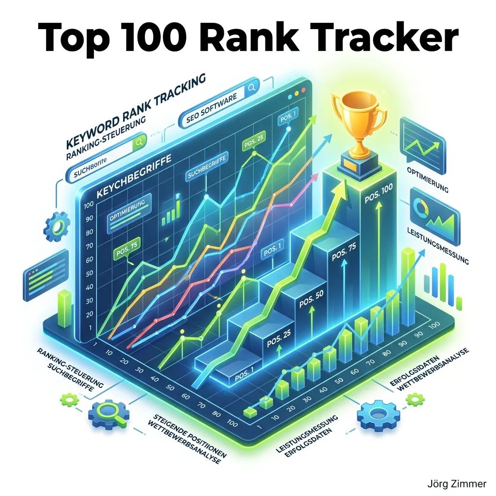

Im Kern jeder datengetriebenen Suchmaschinenoptimierung steht eine fundamentale Frage: Werden unsere Webseiten für die Begriffe gefunden, die für das Geschäft unserer Kunden tatsächlich Umsatz generieren? Während Metriken wie Impressionen oder Sichtbarkeitsindizes wertvolle Makro-Trends widerspiegeln, bleibt das präzise **Keyword-Rank-Tracking** das unverzichtbare Mikroskop für den operativen SEO-Alltag. 

Hier positioniert sich der **SE Ranking Keyword Rank Tracker** als eines der ausgereiftesten und verlässlichsten Werkzeuge auf dem europäischen Markt. In meinem detaillierten [SE Ranking Testbericht 2026](/blog/se-ranking-test-2026/) hebe ich regelmäßig hervor, dass SE Ranking dort weitermacht, wo viele Wettbewerber den Rotstift ansetzen: bei der kompromisslosen Überwachung der **gesamten Top 100 Suchergebnisse**.

<figure class="my-8 bg-neutral-50 border border-neutral-200 p-6 md:p-8 rounded-2xl shadow-sm">
  

    
    

      <h4 class="font-bold text-base md:text-lg text-dark mb-0">Jörg Zimmer</h4>
      
Senior SEO & AI Search Consultant

    

  

  <blockquote class="text-base md:text-lg text-dark leading-relaxed italic border-l-4 border-lime-accent pl-4 my-4 font-normal">
    „Wer nur die ersten 20 oder 50 Plätze scannt, agiert im Blindflug. Wenn ich eine frische Content-Kampagne starte, will ich sehen, ob Google den Inhalt auf Position 88 indexiert hat – denn das ist der Beweis, dass der Algorithmus die Relevanz verstanden hat. Wer diesen Funken nicht sieht, kann das Feuer auf Seite 1 nicht entfachen.“
  </blockquote>
  <figcaption class="mt-4 pt-3 border-t border-neutral-200/60 flex flex-wrap items-center justify-between gap-2 text-xs text-neutral-500">
    Experten-Zitat • <cite class="not-italic font-semibold text-neutral-700">Jörg Zimmer</cite>
    <a href="https://www.linkedin.com/in/joerg-zimmer-seo-sea-freelancer-berlin-spandau/" target="_blank" rel="noopener noreferrer" class="font-bold text-lime-700 hover:underline inline-flex items-center gap-1">
      Jörg Zimmer auf LinkedIn folgen →
    </a>
  </figcaption>
</figure>

  

    30-Sekunden Inhaber-Check
  

  <h3 class="text-lg font-bold text-dark mb-2">Jörgs Praxistipp aus der SEO-Sprechstunde</h3>
  

    Gruppiere deine Keywords in SE Ranking konsequent mit Tags nach Conversion-Phasen (z.B. <em>Brand</em>, <em>Transaktional</em>, <em>Informational</em>). Analysiere die Rankings niemals als unstrukturierte Gesamtliste, sondern bewerte den Visibility Score isoliert für deine umsatzstarken Produkt-Cluster.
  

  

    
🔍 Dein schneller Ranking-Effizienz-Check:

    
1. Kontrolliere, ob deine Rankings getrennt für Desktop und Mobile erhoben werden – Diskrepanzen weisen auf technische Mobile-UX-Schwächen hin.

    
2. Prüfe im SERP-Features-Filter, ob Wettbewerber dir mit Featured Snippets Klicks vor der eigentlichen Position 1 abgreifen.

    
<strong>Kontrollfrage an deine Agentur:</strong> <em>„Nutzen wir in SE Ranking bereits das Mitbewerber-Tracking auf Keyword-Ebene, um SERP-Verluste direkt gegen spezifische Konkurrenz-URLs abzugleichen?“</em>

  

---

## Das Top-100-Prinzip: Warum Tiefe im SEO den Unterschied macht

In den letzten Jahren haben diverse große Tool-Anbieter (wie in meinem [Sistrix vs SE Ranking Vergleich](/blog/sistrix-vs-se-ranking/) detailliert beleuchtet) ihr Tracking aus Kostengründen beschnitten. Oft werden nur noch die Positionen 1 bis 20 oder 1 bis 50 kontinuierlich abgefragt. Für etablierte Branchenriesen mag das genügen – für wachsende Unternehmen, Relaunches oder neue Produktkategorien ist es fatal.

### 1. Das Early-Stage-Signal bei neuen Inhalten
Wenn eine neue Landingpage online geht, katapultiert Google sie selten am ersten Tag in die Top 10. Typischerweise tastet sich der Algorithmus über Position 80 bis 95 heran:
*   **Mit Top-50-Tracking:** Das Tool meldet „Nicht in den Suchergebnissen gefunden“. Der SEO-Manager vermutet ein Indexierungsproblem oder zieht falsche Schlüsse.
*   **Mit SE Ranking Top-100-Tracking:** Du siehst sofort: Einstieg auf Position 84. Google hat das Keyword verstanden. Jetzt greifen gezielte Maßnahmen wie interne Verlinkung, Snippet-Tuning oder Aktualisierungen im [SE Ranking Website Audit](/glossar/se-ranking-website-audit/), um die URL schrittweise nach vorne zu schieben.

### 2. Volatilitäts-Erkennung bei Core Updates
Bei größeren Google-Algorithmus-Updates rutschen betroffene Seiten häufig nicht schlagartig von Seite 1 auf Seite 10, sondern fallen stufenweise über Position 30, 60 bis 90 ab. Durch die historische Top-100-Historie erkennst du algorithmische Abstürze bereits in der Entstehungsphase und kannst gegensteuern, bevor der organische Umsatz einbricht.

---

## Über 35 SERP-Features im Visier: Mehr als nur blaue Links

Die moderne Google-Suche besteht längst nicht mehr aus einer schlichten Liste blauer Links. Ein scheinbarer Platz 1 organisch kann durch bezahlte Google Ads, Local Packs, Bilderleisten und KI-Antworten weit unter den sichtbaren Bildschirmrand („Below the Fold“) rutschen.

Der Rank Tracker von SE Ranking überwacht **rund 35 verschiedene SERP-Features** und markiert für jedes Keyword präzise zwei Zustände:
1.  **Gibt es das Feature in der SERP?** (z.B. Ein Local Pack mit drei Karteneinträgen oder eine Fragebox).
2.  **Besitzt deine Website dieses Feature?** (Wirst du in der Box zitiert oder taucht dein Firmeneintrag auf?).

| SERP-Feature | Erkennung in SE Ranking | Strategischer Hebel |
| :--- | :--- | :--- |
| **Featured Snippet (Position 0)** | Markiert mit speziellem Text-Icon | Durch gezielte Tabellen- oder Definitionsstrukturen im Content erobern und Wettbewerber von Platz 1 verdrängen. |
| **Google Local Pack (Maps)** | Karten-Pin Symbol | Steuerung über gezielte Unternehmensdaten und [Local SEO](/glossar/local-seo/). |
| **People Also Ask (PAA)** | Fragezeichen-Icon | Lieferant für Long-Tail-Fragen im Content-Ausbau und für FAQ-Abschnitte. |
| **Sitelinks** | Verzweigungs-Symbol | Indikator für hohe Brand-Autorität und Klickraten-Maximierung auf transaktionalen Seiten. |
| **AI Overviews / KI-Modus** | AI-Icon / Kennzeichnung | Signalisiert KI-generierte Zusammenfassungen (weiterführend: [KI-Sichtbarkeit messen](/glossar/ki-sichtbarkeit/)). |
| **Video- & Bild-Karussells** | Media-Icons | Hebel für strukturierte Video-Markups und Bild-SEO. |

Durch diesen granularen Einblick verhinderst du Fehlinterpretationen: Wenn deine Klickrate trotz stabiler Position 2 sinkt, zeigt dir SE Ranking sofort, dass Google oberhalb deines Ergebnisses ein massives Featured Snippet oder ein neues Local Pack ausgespielt hat.

---

## Granulare Segmentierung: Mobile vs. Desktop & Geolocation

Suchergebnisse sind heute hochgradig personalisiert und ortsabhängig. Ein Suchbegriff wie „SEO Agentur“ liefert auf einem iPhone in Berlin-Mitte völlig andere Treffer als auf einem Desktop-Rechner in München.

### 1. Echtes Mobile-First-Tracking
Google bewertet Websites ausnahmslos nach dem Mobile-First-Index. SE Ranking ermöglicht es, für jedes Projekt getrennte Abfragen für **Desktop und Mobilgeräte** einzurichten:
*   Erkenne Ranking-Diskrepanzen: Wenn ein Keyword auf Desktop stabil auf Platz 3 steht, auf Mobile jedoch auf Platz 14 abfällt, deutet dies auf mobile Usability-Schwächen, suboptimale LCP-Werte oder aggressive Popups auf Smartphones hin.
*   Separate SERP-Features: Mobile SERPs blenden häufig andere Rich Snippets ein als Desktop-Versionen.

### 2. Lokale Präzision bis auf Postleitzahlen-Ebene
Für lokale Handwerker, Filialisten oder Kanzleien ist ein bundesweites Ranking irrelevant. In den Tracker-Einstellungen kannst du jede beliebige Stadt, Region oder spezifische Postleitzahl als Standort hinterlegen. SE Ranking simuliert den Standort exakt über lokale IP-Adressen und GPS-Koordinaten.

---

## Der Local Grid Rank Tracker: Die Google Maps Matrix

Eine der innovativsten Weiterentwicklungen der Plattform ist der **Local Grid Rank Tracker**. Während herkömmliche Tools für eine Stadt nur einen einzigen Rankingwert liefern, spiegelt dies nicht die Realität von Google Maps wider. In der Praxis rankt ein lokales Geschäft direkt vor der eigenen Haustür auf Platz 1, doch schon drei Straßen weiter übernimmt ein Mitbewerber die Führung.

Der Grid Tracker löst dieses Phänomen visuell:
*   Du definierst ein Raster (z.B. 5x5, 7x7 oder 9x9 Messpunkte) über deinem Einzugsgebiet.
*   Das System sendet zeitgleich Abfragen von jedem Rasterpunkt an Google Maps.
*   Das Ergebnis ist eine farbcodierte Heatmap: Grüne Pins (Positionen 1–3) zeigen deine lokalen Hochburgen, während gelbe und rote Pins exakt aufdecken, in welchen Stadtteilen deine lokale Sichtbarkeit abreißt.

Dieses Werkzeug spart Stunden manueller Recherche und liefert handfeste Argumente für gezielte lokale Landingpages oder Citations-Aufbau.

---

## Tagging, Filter & Wettbewerber-Head-to-Head

In professionellen Setups überwacht man selten nur zehn Keywords. Bei Portalen mit 500 bis 10.000 Begriffen ist eine strikte Daten-Hygiene unerlässlich:

1.  **Dynamisches Tagging:** Versehe Keywords mit Tags wie `Kategorie:Schuhe`, `Funnel:TOFU`, `Intent:Kauf` oder `Priorität:P1`. SE Ranking berechnet für jedes Tag-Cluster automatisch einen eigenen Sichtbarkeits-Index.
2.  **Keyword-Gruppierung:** Strukturiere Begriffe in Ordnern, die exakt deiner Website-Hierarchie entsprechen.
3.  **Head-to-Head Mitbewerber-Tracking:** Trage bis zu 5 (in höheren Tarifen bis zu 20) direkte Konkurrenten ein. Das System zieht die Rankings deiner Konkurrenz bei jedem täglichen Crawl automatisch mit ab. Im Tab *Wettbewerber* siehst du auf einen Klick, welche Konkurrenten bei welchen Suchbegriffen an dir vorbeigezogen sind.

Wie sich SE Ranking im direkten Vergleich mit anderen Tool-Schwergewichten schlägt, erfährst du in meinen detaillierten Duellen [SE Ranking vs Semrush](/glossar/se-ranking-vs-semrush/) sowie [SE Ranking vs Ahrefs](/glossar/se-ranking-vs-ahrefs/).

---

  

    

      🤖
      
Arbeitsanweisung für deinen KI-Agenten (Cursor / Claude / Antigravity)

    

    <button type="button" class="copy-agent-btn px-2.5 py-1 bg-lime-accent text-dark hover:bg-lime-600 hover:text-white text-[11px] font-bold uppercase rounded border border-lime-500 hover:border-lime-600 transition-all flex items-center gap-1 shadow-md cursor-pointer shrink-0 ml-auto" title="Prompt kopieren">
      <svg class="w-3.5 h-3.5" fill="none" stroke="currentColor" viewBox="0 0 24 24"><path stroke-linecap="round" stroke-linejoin="round" stroke-width="2" d="M8 16H6a2 2 0 01-2-2V6a2 2 0 012-2h8a2 2 0 012 2v2m-6 12h8a2 2 0 012-2v-8a2 2 0 01-2-2h-8a2 2 0 01-2 2v8a2 2 0 012 2z" /></svg>
      Kopieren für Agent
    </button>
  

  

    Kopiere diesen Prompt direkt in deinen KI-Coding-Assistenten, um Keyword-Rankings automatisiert via API oder MCP-Schnittstelle abzufragen und Ranking-Schwankungen zu isolieren:
  

  

    
# Prompt: Ranking-Volatilitäts-Analyse & Gewinner/Verlierer-Extraktion

    
<strong>Rolle:</strong> Du bist ein hochspezialisierter SEO Data Analyst.

    
<strong>Aufgabe:</strong> Rufe über die SE Ranking API oder die MCP-Tools die aktuellen Keyword-Positionen für das hinterlegte Webprojekt ab. Vergleiche die heutigen Positionen mit dem Stand vor 7 Tagen.

    
<strong>Schritte & Validierung:</strong>

    <ul class="list-disc pl-4 space-y-1 text-gray-300">
      <li>Identifiziere alle Keywords mit einem Positionsverlust von mehr als 3 Rängen innerhalb der Top 20.</li>
      <li>Prüfe für diese Verlierer-Keywords, ob sich die rankende Ziel-URL verändert hat (Signal für Keyword-Kannibalisierung).</li>
      <li>Gleiche ab, ob für die betroffenen Keywords neue SERP-Features (z.B. AI Overviews oder Featured Snippets) ausgespielt werden, die Klicks verdrängen.</li>
      <li>Generiere einen präzisen Aktionsplan mit URLs, die sofortige On-Page-Überarbeitung oder interne Link-Stärkung erfordern.</li>
    </ul>
  

---

## Praxiseinschätzung aus dem Agenturalltag

Der Keyword Rank Tracker von SE Ranking überzeugt durch seine Verlässlichkeit, Schnelligkeit und faire Bepreisung. Während andere Plattformen für tägliche Updates astronomische Aufpreise verlangen, gehört die tägliche Prüfung bei SE Ranking zum Standard-Repertoire. 

Besonders die Kombination aus voller Top-100-Tiefe, präziser Erkennung von SERP-Features und dem visuellen Local Grid Tracker macht das Werkzeug sowohl für anspruchsvolle E-Commerce-Brands als auch für lokale Dienstleister zur ersten Wahl. Wer seine Rankings nicht nur passiv verwalten, sondern proaktiv steuern will, findet hier die perfekte Datenbasis. Weiterführende Details zur Gesamtsuite findest du in unserem zentralen Überblick zu [SE Ranking Funktionen & Tools](/glossar/se-ranking/).

<!-- CTA Box -->

  <h3 class="text-xl md:text-2xl font-bold text-white mb-3 !mt-0 !border-none !pb-0">
    SE Ranking Rank Tracker 14 Tage kostenlos testen
  </h3>
  

    Überwache Keyword-Positionen in den Top 100 bei Google & Bing auf Desktop und Mobile – tagesaktuell, lokal bis auf PLZ-Ebene und ohne Kreditkarte.
  

  <a href="https://seranking.com/de/ranking-check.html?ga=4169588&source=rank-tracker" target="_blank" rel="noopener noreferrer nofollow sponsored" class="btn-primary">
    <svg class="w-4 h-4 fill-current" viewBox="0 0 24 24"><path d="M12 2L2 7l10 5 10-5-10-5zM2 17l10 5 10-5M2 12l10 5 10-5"/></svg>
    Jetzt Rank Tracker kostenlos testen
    →
  </a>

