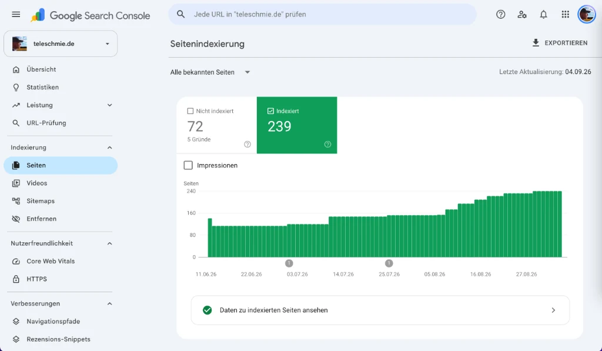

Im Gespräch mit Gründern, mittelständischen Unternehmern und Einsteigern im Online-Marketing begegnet mir eine Haltung immer wieder: **„Warum soll ich jeden Monat Geld für eine SEO-Software ausgeben? Ich habe doch die Google Search Console – und die ist komplett kostenlos!“**

Auf den ersten Blick ist diese Argumentation absolut nachvollziehbar. Die **[Google Search Console](/glossar/google-search-console/)** (GSC) ist das offizielle Sprachrohr des Suchmaschinen-Giganten. Sie kostet keinen einzigen Cent, liefert echte Klick- und Impressionsdaten direkt aus dem Google-Rechenzentrum und schlägt sofort Alarm, wenn der Googlebot auf Serverfehler stößt oder eine manuelle Maßnahme verhängt wurde. Für das absolute Basis-Fundament ist die Search Console schlichtweg konkurrenzlos und für jeden Webmaster Pflicht.

Doch wer sein Business ernst meint, Kundenprojekte betreut oder gegen etablierte Marktführer im E-Commerce und Dienstleistungsbereich antritt, bemerkt sehr schnell das schwere Handicap einer reinen Null-Euro-Strategie: **Mit der Search Console siehst du immer nur dich selbst – und das auch nur durch eine stark verzerrte, lückenhafte Google-Brille.**

Genau hier setzt eine professionelle All-in-One-Suite wie **[SE Ranking (Partnerlink)](https://seranking.com/de/?ga=4169588&source=link)** an. Wo die Search Console schweigt, liefert SE Ranking den 360-Grad-Blick: Wie stark ist deine Konkurrenz? Welche Keywords bringen deinen Mitbewerbern den meisten Umsatz? Wie entwickeln sich deine tatsächlichen Positionen von Tag zu Tag auf Smartphone und Desktop?

In diesem Praxis-Vergleich analysieren wir ohne Fachjargon, wo die kostenlose Google Search Console unschlagbar ist, an welchen strategischen Engpässen sie dich im Stich lässt und warum der Schritt zu SE Ranking für wachsende Webseiten die logische Weichenstellung darstellt. Wer vor dieser Investitionsentscheidung steht, sollte vorab auch einen Blick auf meinen umfassenden [SE Ranking Test 2026](/blog/se-ranking-test-2026/) sowie die detaillierte [SE Ranking Preisübersicht](/blog/se-ranking-preise/) werfen.

<figure class="my-8 bg-neutral-50 border border-neutral-200 p-6 md:p-8 rounded-2xl shadow-sm">
  

    
    

      <h4 class="font-bold text-base md:text-lg text-dark mb-0">Jörg Zimmer</h4>
      
Senior SEO & AI Search Consultant

    

  

  <blockquote class="text-base md:text-lg text-dark leading-relaxed italic border-l-4 border-lime-accent pl-4 my-4 font-normal">
    „Falsch eingestellt? Fehler sitzt immer vierzig  Zentimeter vor dem Bildschirm. Nein, nein, ich sage jetzt, ich bin der Fehler. Gucken wir  mal, was bei Consulting geht, da hast du auch kein Ranking, zumindest nach dem Tool, wir können ja  mal in die Google Search Console gucken, du hast mir Zugang gegeben. Aber stehst du für irgendwas  mit Seminar oben? PHP-Seminare haben wir schon.“
  </blockquote>
  <figcaption class="mt-4 pt-3 border-t border-neutral-200/60 flex flex-wrap items-center justify-between gap-2 text-xs text-neutral-500">
    

      Experten-Zitat • <cite class="not-italic font-semibold text-neutral-700">Jörg Zimmer</cite>
      •
      <a href="https://www.youtube.com/watch?v=tD7cXuVcRPA&t=4185s" target="_blank" rel="noopener noreferrer" class="text-neutral-600 hover:text-dark underline inline-flex items-center gap-1">
        Quelle: YouTube Never Code Alone (69:45)
        <svg class="w-3 h-3 text-neutral-400" fill="none" stroke="currentColor" viewBox="0 0 24 24"><path stroke-linecap="round" stroke-linejoin="round" stroke-width="2" d="M10 6H6a2 2 0 00-2 2v10a2 2 0 002 2h10a2 2 0 002-2v-4M14 4h6m0 0v6m0-6L10 14" /></svg>
      </a>
    

    <a href="https://www.linkedin.com/in/joerg-zimmer-seo-sea-freelancer-berlin-spandau/" target="_blank" rel="noopener noreferrer" class="font-bold text-lime-700 hover:underline inline-flex items-center gap-1 shrink-0">
      Jörg Zimmer auf LinkedIn folgen →
    </a>
  </figcaption>
</figure>

---

## Die 6 fundamentalen Grenzen der Google Search Console

Um zu verstehen, warum professionelle SEOs monatliche Lizenzgebühren für Werkzeuge bezahlen, müssen wir die strukturellen Limitationen der Google Search Console offenlegen. Google stellt dieses Werkzeug nicht bereit, um dich zum perfekten SEO-Strategen auszubilden, sondern um sicherzustellen, dass Webmaster technische Fehler beseitigen und Websites im Sinne der Suchmaschine optimieren.

### 1. Die absolute Blindheit gegenüber Mitbewerbern (Zero Competitor Data)
Das mit Abstand größte Manko: In der Google Search Console kannst du ausschließlich Domains analysieren, deren Eigentümerschaft du per DNS-Eintrag oder HTML-Datei verifiziert hast. 

Du hast **keinerlei Möglichkeit**, herauszufinden:
- Für welche Suchbegriffe dein schärfster Konkurrent rankt.
- Welcher Mitbewerber dir im letzten Monat Marktanteile und Klicks abgenommen hat.
- Welche Content-Lücken (Content Gaps) zwischen deiner Website und den Top-Rankings der Branche klaffen.
- Woher deine Konkurrenten ihre wertvollsten Backlinks beziehen.

Wer nur mit der Search Console arbeitet, operiert in einer isolierten Blase. Wenn deine Klicks einbrechen, siehst du in der GSC zwar den Absturz, hast aber keine Ahnung, wer an dir vorbeigezogen ist und mit welcher Strategie er das geschafft hat.

### 2. Das 16-Monats-Dilemma & das Löschen historischer Daten
Google speichert Leistungsdaten im Leistungsbericht für exakt **16 Monate (487 Tage)**. Jeder ältere Tag wird unwiderruflich gelöscht. 

In der Praxis bedeutet das:
- Du kannst keine 2- oder 3-Jahres-Vergleiche anstellen.
- Saisonalitäten über mehrere Zyklen hinweg (z. B. Weihnachtsgeschäft über 3 Jahre) lassen sich nicht nativ auswerten.
- Wer seine Daten nicht manuell über die API in BigQuery oder aufwendige Datenbanken exportiert, verliert sein historisches Unternehmenswissen.

[SE Ranking (Partnerlink)](https://seranking.com/de/?ga=4169588&source=link) hingegen speichert alle Ranking- und Projektdaten ab dem ersten Tag der Erfassung dauerhaft. Du kannst noch nach fünf Jahren auf den Tag genau nachvollziehen, wie ein bestimmtes Keyword vor drei Jahren performt hat.

### 3. Die Tücke der „Durchschnittlichen Position“ (Average Position Trap)
Eines der am meisten missverstandenen Felder in der Search Console ist die Spalte *Position*. Viele Einsteiger glauben, die Zahl „8,4“ bedeute, dass ihre Seite auf Platz 8 bei Google steht. Das ist ein gefährlicher Trugschluss.

Google berechnet die Position als **impressionen-gewichteten Durchschnitt** über alle Anfragen im gewählten Zeitraum und über alle Endgeräte und Standorte hinweg:
- Wenn ein Nutzer aus München deine Seite auf Platz 2 sieht und ein Nutzer aus Hamburg auf Platz 16, meldet die GSC Platz 9.
- Wenn Google deine Seite kurzzeitig für irrelevante Suchanfragen auf Seite 5 testet, zieht das deinen Gesamtdurchschnitt drastisch nach unten, obwohl dein wichtigstes Money-Keyword stabil auf Platz 1 verharrt.

Für operative Entscheidungen ist ein solcher mathematischer Durchschnittswert nahezu wertlos. Was du als SEO brauchst, ist ein **exakter SERP-Snapshot**: An welchem Tag, zu welcher Uhrzeit, auf welchem Gerät (Desktop vs. Mobile) und an welchem Standort steht deine URL auf welcher exakten Position? Genau das liefert SE Ranking tagesaktuell.

### 4. Daten-Sampling & Ausblenden von Suchanfragen (Anonymized Queries)
Ein weiteres Ärgernis für Datenanalysten: Die Google Search Console zeigt nicht alle Suchbegriffe an. Aus Gründen des Nutzertatenschutzes und zur Schonung von Serverkapazitäten blendet Google sogenannte *anonymisierte Suchanfragen* aus. 

Bei Webseiten mit starkem Long-Tail-Fokus fehlen in der tabellarischen Übersicht oft **30 % bis über 50 % der tatsächlichen Klicks**. Wenn du die Summe der Klicks aller gelisteten Keywords zusammenrechnest, stimmt diese Zahl fast nie mit dem Gesamtwert der Klicks im Diagramm überein. Für exakte ROI-Berechnungen ist diese Daten-Lücke eine permanente Fehlerquelle.

### 5. Keine proaktive Backlink-Überwachung
Zwar besitzt die Search Console einen Bereich namens *Links*, doch dieser ist im Alltag kaum zu gebrauchen:
- Google zeigt nur eine unvollständige Stichprobe externer Links.
- Es gibt **keine Historie** und keine zeitliche Einordnung: Du erfährst nicht, an welchem Tag ein Link gesetzt oder gelöscht wurde.
- Es gibt **keine Alerts**: Wenn ein wichtiger Backlink offline geht oder versehentlich auf `nofollow` geändert wird, bemerkst du es nicht.
- Es gibt keine toxische Link-Bewertung zur Vorbeugung von Link-Spam.

SE Ranking betreibt einen eigenen, milliardenstarken Backlink-Crawler, der neue und verlorene Links in Echtzeit meldet und akquirierte Partnerschaften kontinuierlich überwacht. Weitere Hintergründe dazu findest du im [SE Ranking Glossar](/glossar/se-ranking/).

### 6. Mangelnde Kunden- und Management-Tauglichkeit
Die Search Console ist für Ingenieure und Webmaster gebaut. Die Benutzeroberfläche ist nüchtern, technisch und unübersichtlich. Wenn du Geschäftsführern, Abteilungsleitern oder Mandanten monatlich erklären willst, welche Fortschritte erzielt wurden, kannst du ihnen keinen Screenshot aus der GSC vorlegen. 

SE Ranking bietet ab dem Growth-Tarif einen vollautomatisierten **White-Label Report-Builder**, der professionelle PDF-Berichte im Corporate Design deiner Agentur inklusive individueller Erläuterungen generiert und zeitgesteuert versendet. Warum dieser Unterschied im Kundenkontakt Gold wert ist, erfährst du in meinem Leitfaden [10 Gründe, warum Agenturen SE Ranking lieben](/blog/se-ranking-agentur-10-gruende/).

---

## Funktions- und Datenmatrix: Google Search Console vs. SE Ranking

| Anwendungsbereich / Feature | Google Search Console (Kostenlos) | SE Ranking All-in-One Suite | Bewertung & Praxiseindruck |
| :--- | :--- | :--- | :--- |
| **Kosten & Lizenzierung** | **100 % Kostenlos (Google-Konto)** | Ab 87,20 € / Monat (Core, jährlich) | GSC unschlagbar im Preis |
| **Erfasste Datenquelle** | First-Party Klicks & Impressionen | Unabhängige Live-SERP-Scans | GSC liefert echte Klickzahlen, SE Ranking exakte SERPs |
| **Mitbewerber-Analyse** | ❌ Überhaupt nicht möglich | **Umfassend (Rankings, Ads, Backlinks)** | Klares K.O.-Kriterium für SE Ranking |
| **Keyword-Recherche (Ideenfindung)**| ❌ Nur bestehende Suchanfragen | **Milliarden Datenbank im DACH-Raum** | SE Ranking essenziell für neue Inhalte |
| **Rank-Tracking Aktualität** | 2–3 Tage Verzögerung, Durchschnitt | **Tagesaktuell Standard + On-Demand** | SE Ranking reagiert sofort auf Updates |
| **Lokales Tracking (Geo-SEO)** | Grobe Länder-Aggregation | **Postleitzahlen- & Stadtteil-Ebene** | Essenziell für regionale Dienstleister |
| **Daten-Historie** | **Maximal 16 Monate (gelöscht)** | **Unbegrenzt ab dem ersten Tag** | SE Ranking sichert langfristige Firmen-Assets |
| **Technisches Site-Audit** | Reaktiv (Meldet Fehler nach Crawl) | **Proaktiv (Cloud-Scan bis 150k Seiten)**| SE Ranking scannt vor dem Googlebot |
| **Backlink-Monitoring** | Statische Stichproben-Liste | **Tagesaktuell mit Lost-Link-Alerts** | SE Ranking für professionelles Linkbuilding |
| **Kunden-Reporting** | Rohe Tabellen, manueller Export | **Automatisierte White-Label PDFs** | SE Ranking spart dutzende Arbeitsstunden |
| **KI-Sichtbarkeit (GEO / LLMs)** | Unzureichend (keine Prompt-Scans) | **Natives Modul für Google AI Overviews**| SE Ranking bereit für die KI-Suche 2026 |

---

## Die Kernbereiche im direkten Vergleich

### 1. Keyword-Recherche: Wachsen statt nur Verwalten

Hier wird der fundamentale Unterschied in der strategischen Ausrichtung deutlich:
- **Google Search Console** ist ein reines **Verwaltungswerkzeug**. Sie zeigt dir, über welche Begriffe Suchende *bereits* auf deine Seite gelangt sind. Sie kann dir jedoch nicht sagen, nach welchen Begriffen deine Zielgruppe sucht, für die du *noch gar keinen Content* hast.
- **SE Ranking** ist ein **Wachstumswerkzeug**. Das Keyword-Recherche-Tool analysiert Milliarden Suchanfragen im DACH-Raum, ermittelt das reale Suchvolumen, den Wettbewerbsgrad (Difficulty), den Klickpreis (CPC) und die genaue Suchintention (Search Intent). Du siehst sofort, welche profitablen Themen deine Mitbewerber bereits besetzen, während deine Search Console zu diesen Themen noch vollkommen leer ist.

### 2. Technisches Audit: Proaktiver Schutz vs. Späte Benachrichtigung

Ein strukturiertes [Website SEO Audit](/glossar/se-ranking-website-audit/) schützt vor bösen Überraschungen im Ranking:
- In der **Search Console** erfährst du von technischen Problemen (wie 404-Fehlern oder fehlerhaften Canonical-Tags) meist erst dann, wenn der Googlebot bereits daran abgeprallt ist und die Seiten womöglich aus dem Index geflogen sind. Die GSC agiert rein **reaktiv**.
- Der Cloud-Crawler von **SE Ranking** agiert **proaktiv**. Du lässt das Audit jeden Montag vor Arbeitsbeginn durchlaufen. Findet das System kaputte Links, falsche Weiterleitungen, nicht optimierte WebP-Bilder oder verlangsamte Core Web Vitals, behebst du den Fehler, noch bevor Google die Seite neu besucht.

### 3. KI-Sichtbarkeit und Generative Engine Optimization (GEO)

Die Websuche befindet sich im größten Umbruch seit zwanzig Jahren. Durch Google AI Overviews, Perplexity und ChatGPT Search erhalten Nutzer fertige Antworten direkt im Browserfenster:
- Die **Search Console** differenziert Klicks aus AI Overviews bisher kaum von regulären organischen Snippets. Du hast keine Übersicht darüber, bei welchen Prompts Google eine KI-Antwort generiert und ob deine Marke darin zitiert wird.
- **SE Ranking** erfasst mit *SE Visible* gezielt das Auftauchen von AI Overviews in den Suchergebnissen. Du siehst genau, welche Konkurrenten als Quellen genannt werden und welche Textpassagen herangezogen werden. Ergänzend dazu empfehle ich für ein unternehmensweites Tracking über alle 17 führenden LLMs den Einsatz von [Rankscale](/glossar/rankscale/).

Vergleiche mit weiteren Marktführern findest du in meinen Gegenüberstellungen [SE Ranking vs. Sistrix](/glossar/se-ranking-vs-sistrix/), [SE Ranking vs. Ahrefs](/glossar/se-ranking-vs-ahrefs/), [SE Ranking vs. Semrush](/glossar/se-ranking-vs-semrush/), [SE Ranking vs. Ubersuggest](/glossar/se-ranking-vs-ubersuggest/), [SE Ranking vs. Mangools](/glossar/se-ranking-vs-mangools/) und [SE Ranking vs. Screaming Frog](/glossar/se-ranking-vs-screaming-frog/). Einen umfassenden Überblick bietet mein [Tools-Hub](/tools/).

---

## Der perfekte Hybrid-Stack: Wie Profis beide Werkzeuge verzahnen

Niemand muss sich zwischen Google Search Console und SE Ranking entscheiden – denn in Wahrheit entfalten beide Werkzeuge ihre maximale Durchschlagskraft erst im **Zusammenspiel**.

### Der 4-Schritte-Workflow in der Praxis

1. **GSC-Integration in SE Ranking aktivieren:**
   Verbinde deine Search Console per Google-OAuth direkt mit deinem SE Ranking Projekt. SE Ranking importiert deine Klick- und Impressionsdaten automatisch und stellt sie den tagesaktuellen SERP-Rankings gegenüber.
2. **Klickstarke Low-Hanging-Fruits identifizieren:**
   Filtere in SE Ranking nach Keywords, die in der Search Console tausende Impressionen verzeichnen, deren durchschnittliche Position aber zwischen Platz 8 und 15 dümpelt. Das sind deine perfekten Kandidaten für eine schnelle Onpage-Optimierung.
3. **SERP-Realitätscheck im SE Ranking Cache:**
   Öffne den gecachten SERP-Auszug in SE Ranking für genau diese Low-Hanging-Fruits. Analysiere, warum die Top 3 vor dir stehen: Haben sie ein besseres Schema-Markup? Wird ein Video-Karussell ausgespielt? Nutze diese Erkenntnisse zur Überarbeitung deiner Landing Page.
4. **Erfolgsmessung im tagesaktuellen Rank-Tracker:**
   Während die GSC Tage braucht, um veränderte Durchschnitte abzubilden, siehst du in SE Ranking bereits am nächsten Morgen, ob deine Optimierung den Sprung in die Top 3 geschafft hat.

---

## Wirtschaftliche Gesamtrechnung (ROI): Wann lohnt sich der Wechsel?

Betrachten wir die nüchterne Wirtschaftlichkeit für einen Freelancer, Berater oder Online-Shop-Betreiber:

- **Szenario A (Reine Nutzung kostenloser Tools):**
  Du verbringst jeden Monat rund 10 bis 15 Arbeitsstunden damit, Keyword-Rankings manuell zu prüfen, Tabellen aus der GSC zu exportieren, Mitbewerber per Google-Suche händisch abzugleichen und Reports mühsam in Word oder PowerPoint zusammenzukopieren. Selbst bei einem konservativen internen Stundensatz von 70 € entspricht das einem monatlichen Ressourcenverlust von **700 € bis 1.050 €**.
- **Szenario B (Das automatisierte SE-Ranking-Cockpit):**
  Du buchst den Core-Tarif von SE Ranking für **87,20 € monatlich** (bei jährlicher Zahlung). Alle Rankings aktualisieren sich täglich vollautomatisch. Das technische Audit läuft nachts in der Cloud. Professionelle Reports werden mit einem Klick generiert.

Die Software hat sich bereits amortisiert, wenn sie dir pro Monat lediglich **zwei Stunden Arbeitszeit** erspart oder verhindert, dass ein einziger profitabler Kunde durch unbemerkte technische Fehler abspringt.

---

## Entscheidungs-Kompass: Wann reicht GSC – und wann musst du wechseln?

| Dein aktueller Status & Zielsetzung | Klares Votum | Begründung & Praxissicht |
| :--- | :--- | :--- |
| **Reines Hobby-Blog ohne kommerzielles Ziel** | **Google Search Console allein** | Wenn kein Umsatz an der Seite hängt, genügt die kostenlose GSC zur gelegentlichen Orientierung. |
| **Solo-Selbstständige, Berater & lokale Anbieter** | **SE Ranking (Core-Plan)** | Unverzichtbar: Lokales Tracking auf PLZ-Ebene, Mitbewerber-Spionage und automatischer Seiten-TÜV. |
| **SEO-Freelancer & wachsende Agenturen** | **SE Ranking (Growth-Plan)** | 3 Team-Zugänge, White-Label-Berichte und 5.000 Keywords bilden das Fundament für professionelle Kundenbetreuung. |
| **Betreiber von E-Commerce-Shops** | **SE Ranking** | Die Search Console bricht bei tausenden Produkt-Keywords zusammen; tagesaktuelle SERPs sind geschäftskritisch. |
| **Tech-Teams & Inhouse-Entwickler** | **Beide Tools kombiniert** | GSC für First-Party-Crawl-Fehler, SE Ranking für die strategische Markt- und Keyword-Entwicklung. |

---

<!-- CTA Box -->

  <h3 class="text-xl md:text-2xl font-bold text-white mb-3 !mt-0 !border-none !pb-0">
    SE Ranking Tarife vergleichen & 14 Tage kostenlos testen
  </h3>
  

    Verbinde deine Search Console mit professioneller All-in-One Power: Vergleiche die fairen Tarife ab 87 €/Monat für tagesaktuelle SERPs, Wettbewerbs-Spionage und Site-Audits.
  

  <a href="https://seranking.com/de/subscription.html?ga=4169588&source=vs-gsc" target="_blank" rel="noopener noreferrer nofollow sponsored" class="btn-primary">
    <svg class="w-4 h-4 fill-current" viewBox="0 0 24 24"><path d="M12 2L2 7l10 5 10-5-10-5zM2 17l10 5 10-5M2 12l10 5 10-5"/></svg>
    Jetzt SE Ranking Tarife ansehen & testen * (Partnerlink)
    →
  </a>
  
* Hinweis: Partnerlink. Bei Buchung erhalte ich eine Provision – für dich entstehen keine Mehrkosten.

