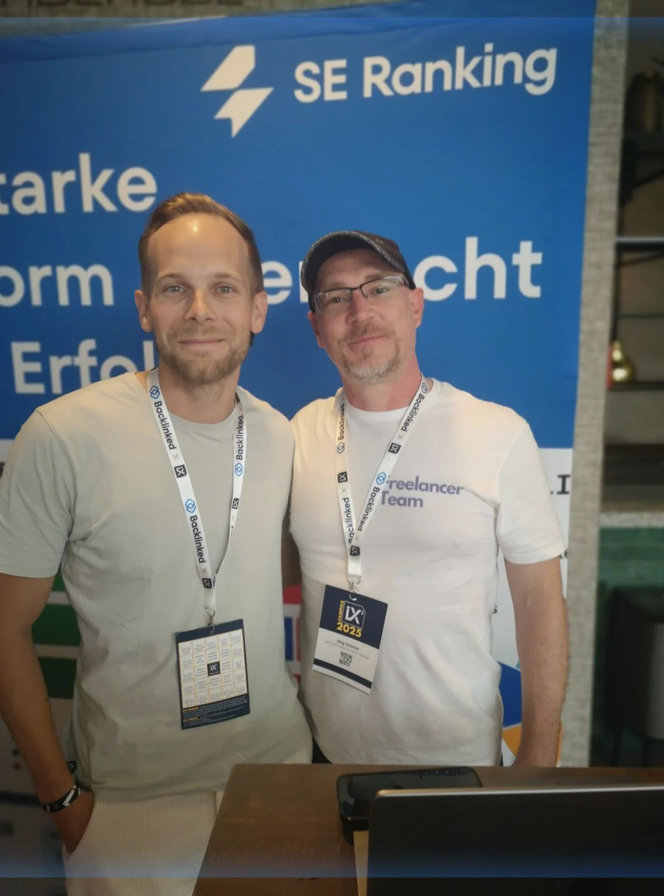
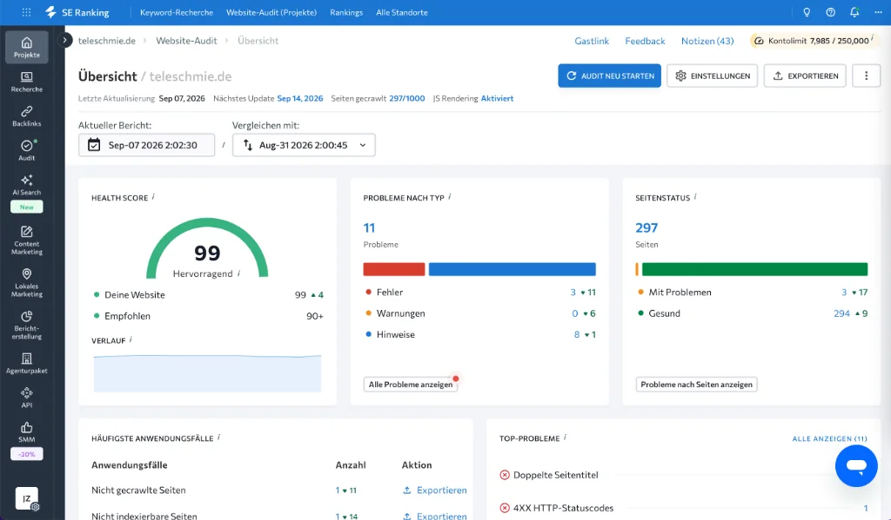

Wer im deutschsprachigen Raum professionelle Suchmaschinenoptimierung betreibt, steht bei der Wahl des primären Analyse-Werkzeugs unweigerlich vor dem klassischen Kräftemessen zweier Branchen-Schwergewichte: **Sistrix** versus **[SE Ranking](https://seranking.com/de/?ga=4169588&source=link)**. Über mehr als anderthalb Jahrzehnte hinweg war die Bonner Tool-Schmiede Sistrix der unangefochtene Goldstandard in deutschen Marketing-Etagen. Der legendäre Sistrix-Sichtbarkeitsindex wurde zur universellen Währung erhoben, anhand derer Relaunches bewertet, Google-Core-Updates analysiert und Budgets freigegeben wurden.

Doch die Realität in modernen Agenturen und agilen Inhouse-Teams hat sich massiv verschoben. Im Zeitalter von tagesaktueller Datenverarbeitung, komplexen [Website SEO Audits](/glossar/website-seo-audit/), lokalen Suchintentionen und dem rasanten Aufkommen generativer KI-Suche stellen immer mehr Entscheider eine berechtigte Frage: **Rechtfertigt der traditionelle Sichtbarkeitsindex noch immer die spürbar höheren monatlichen Modul- und Nutzergebühren – oder liefert eine moderne All-in-One-Suite wie SE Ranking heute mehr geschäftlichen Mehrwert pro investiertem Euro?**

In diesem umfassenden Praxis-Vergleich lege ich als Senior SEO Consultant die Fakten auf den Tisch. Ohne Marketing-Floskeln, basierend auf täglicher Kundenarbeit und dem direkten Einsatz beider Plattformen auf `teleschmie.de`. Wenn du wissen willst, wie sich die Suite in meinem Alltag schlägt, lies auch meinen ausführlichen Erfahrungsbericht im [SE Ranking Test & Erfahrungen 2026](/blog/se-ranking-test-2026/).

<figure class="my-8 bg-neutral-50 border border-neutral-200 p-6 md:p-8 rounded-2xl shadow-sm">
  

    
    

      <h4 class="font-bold text-base md:text-lg text-dark mb-0">Jörg Zimmer</h4>
      
Senior SEO & AI Search Consultant

    

  

  <blockquote class="text-base md:text-lg text-dark leading-relaxed italic border-l-4 border-lime-accent pl-4 my-4 font-normal">
    „Ein teurer Werkzeugkasten macht noch keinen Meister. Aber wenn du als Agentur monatlich Hunderte Euro für Nutzer-Seats und Modul-Upgrades zahlst, während andere Suiten dieselbe Datenqualität als All-Inclusive-Flatrate liefern, verbrennst du bares Geld. Der Sistrix-Sichtbarkeitsindex ist eine verlässliche Währung für DAX-Vorstände – aber im agilen Tagesgeschäft ist SE Ranking mein treues Arbeitstier.“
  </blockquote>
  <figcaption class="mt-4 pt-3 border-t border-neutral-200/60 flex flex-wrap items-center justify-between gap-2 text-xs text-neutral-500">
    Experten-Zitat • <cite class="not-italic font-semibold text-neutral-700">Jörg Zimmer</cite>
    <a href="https://www.linkedin.com/in/joerg-zimmer-seo-sea-freelancer-berlin-spandau/" target="_blank" rel="noopener noreferrer" class="font-bold text-lime-700 hover:underline inline-flex items-center gap-1">
      Jörg Zimmer auf LinkedIn folgen →
    </a>
  </figcaption>
</figure>

---

## Der persönliche Austausch auf der Campixx

Mein Urteil über Software bilde ich mir nicht im Elfenbeinturm, sondern im direkten Dialog mit den Entwicklern und Community-Kollegen. Auf der Campixx Berlin habe ich mich intensiv mit Nico Kavelar von SE Ranking über die strategische Roadmap der Plattform ausgetauscht.

Im persönlichen Gespräch wurde schnell deutlich, warum SE Ranking in den letzten zwei Jahren so rasant Marktanteile im DACH-Raum gewonnen hat: Das Team hört den Bedürfnissen von Agenturen und Freelancern extrem genau zu. Statt starre Altlasten zu verwalten, fließen neue Anforderungen – wie die native Erfassung von AI Overviews, flexible Team-Rollen ohne astronomische Seat-Preise und granulare lokale SERP-Checks – in Rekordzeit in die Produktentwicklung ein. Genau diese Dynamik beleuchte ich auch in meinem Leitfaden [10 Gründe für SE Ranking in deiner SEO-Agentur](/blog/se-ranking-agentur-10-gruende/).

---

## Das Konzept Sichtbarkeitsindex: Fluch und Segen einer Kennzahl

Um die fundamentale Divergenz beider Suiten zu verstehen, müssen wir uns mit der Kennzahl auseinandersetzen, die Sistrix berühmt gemacht hat: dem **Sichtbarkeitsindex**.

### Wie der Sistrix-Sichtbarkeitsindex funktioniert
Sistrix misst die Sichtbarkeit anhand eines repräsentativen Pools von rund einer Million Keywords für Deutschland (ergänzt um einen dynamischen Echtzeit-Index von weiteren Millionen Suchbegriffen). Für jedes rankende Keyword wird die Position ermittelt und mit der geschätzten Klickwahrscheinlichkeit sowie dem monatlichen Suchvolumen multipliziert. Das Resultat ist ein abstrakter Zahlenwert, der seit 2008 historische Trends visualisiert.

**Die unbestreitbaren Vorteile:**
1. **Historischer Kontext:** Kaum ein Tool bildet Google-Updates, Relaunch-Abstürze oder Algorithmus-Verschiebungen über 15 Jahre so sauber ab wie Sistrix.
2. **Vorstands-Tauglichkeit:** Ein Vorstand oder Marketing-Geschäftsführer versteht eine einzelne Fieberkurve sofort. Fällt die Kurve von 12,5 auf 8,2 Punkte, schlagen alle Alarmglocken.

### Die trügerische Falle für Nischenanbieter und B2B-Mittelständler
In der operativen Praxis offenbart dieser makroskopische Blick jedoch erhebliche Tücken:
- **Fehlende Relevanz für Spezialisten:** Ein B2B-Maschinenbauer oder spezialisierter Dienstleister benötigt keine Sichtbarkeit für Breiten-Keywords wie „Wetter Berlin“ oder „Kreditvergleich“. Seine Wertschöpfung entsteht über 50 hochspezifische Fachbegriffe. Wenn diese 50 Keywords auf Position 1 stehen und monatlich Millionenumsätze generieren, kann der offizielle Sistrix-Sichtbarkeitsindex dennoch bei 0,004 dümpeln.
- **Verzögerte Reaktionszeit:** Für Nischenmärkte wird der Index nicht im Minutentakt neu kalibriert. Schnelle Ranking-Verluste bei Geld-Keywords fallen im allgemeinen Rauschen oft erst Wochen später auf.

### Der Gegenentwurf: Das dynamische Projekt-Tracking bei SE Ranking
SE Ranking dreht diesen Ansatz um: Statt dich an einen starren Gesamtindex zu ketten, steht das **individuelle Projekt-Tracking** im Mittelpunkt:
- Du definierst das exakte Keyword-Set deines Mandanten.
- SE Ranking berechnet für dieses individuelle Set einen eigenen **dynamischen Sichtbarkeitsindex** (Share of Voice).
- Du siehst punktgenau, wie viel Prozent des relevanten Zielgruppen-Traffics deine Domain im Vergleich zu den fünf direkten Konkurrenten absorbiert.
- **Tagesaktuelle Aktualisierung:** Während der allgemeine Index oft wöchentlich schwankt, liefert SE Ranking jeden Morgen um 06:00 Uhr die frischen Positionen der Nacht auf den Schreibtisch.

---

## Die Preis- und Lizenzmodelle im Härtetest

Der größte Hebel bei der Wahl zwischen Sistrix und SE Ranking liegt zweifellos im Lizenz- und Abrechnungsmodell. Während beide Anbieter im Bereich professioneller SaaS-Lösungen agieren, unterscheidet sich die Philosophie grundlegend. Eine tiefgehende Aufschlüsselung aller Tarife findest du in meinem Guide zu den [SE Ranking Preisen 2026](/blog/se-ranking-preise/).

### Sistrix Preise: Das modulare Stufen-Modell

Sistrix gliedert sein Portfolio in vier feste Pakete, die monatlich kündbar sind (Preise zzgl. gesetzlicher MwSt., Stand 2026):

1. **START (119 € / Monat):** Der Einstieg für Freelancer. Beinhaltet den Sichtbarkeitsindex, ist jedoch auf 1 Nutzer beschränkt und bietet lediglich eine 3-monatige Datenhistorie. Wichtige Module wie tiefere Content-Audits oder API-Exporte sind stark reglementiert.
2. **PLUS (239 € / Monat):** Für wachsende Teams. Enthält 3 Nutzerzugänge, Content-Tools und Zugang zu Präsenz-Seminaren.
3. **PROFESSIONAL (419 € / Monat):** Das klassische Agenturpaket mit vollständiger Datenhistorie (über 11 Jahre), API-Schnittstelle und Premium-Support.
4. **PREMIUM (799 € / Monat):** Für Großkonzerne mit erweiterten Export-Credits, Single-Sign-On und dediziertem VIP-Account-Management.

Wer bei Sistrix als wachsende Agentur mehrere Mitarbeiter an Bord holt oder zusätzliche Domain-Monitoring-Slots benötigt, überschreitet sehr schnell die 400-Euro-Schwelle pro Monat.

### SE Ranking Preise: Die transparente All-in-One Flatrate

[SE Ranking](https://seranking.com/de/?ga=4169588&source=link) verfolgt das Prinzip der vollständigen All-Inclusive-Suite. Alle Werkzeuge – vom Keyword-Tracker über den Backlink-Explorer bis hin zum Onpage-Auditor – sind in jedem Plan enthalten:

1. **Core (109 € monatlich / 87,20 € bei jährlicher Zahlung):** Beinhaltet 10 Projekte, 1 Nutzerzugang, 2.000 getrackte Keywords mit tagesaktueller Prüfung, vollständiges Site-Audit für 40.000 Seiten sowie Backlink-Monitoring.
2. **Growth (235 € monatlich / 188,00 € bei jährlicher Zahlung):** Das populärste Agenturpaket. Bietet 30 Projekte, 3 vollwertige Mitarbeiter-Seats, 5.000 Keywords, unbegrenzte historische Daten und White-Label-Reports.
3. **Enterprise (Individuell):** Skalierbar auf zehntausende Keywords, maßgeschneiderte API-Kontingente und dedizierte Server-Infrastrukturen.
4. **Agency Pack Add-on (ca. 59 € / Monat):** Schaltet unbegrenzte White-Label-Kundenportale und ein automatisiertes Lead-Generierungs-Widget für die Agentur-Website frei.

| Kriterium | Sistrix (START / PLUS) | SE Ranking (Core / Growth) | Bewertung für die Praxis |
| :--- | :--- | :--- | :--- |
| **Einstiegspreis (Monat)** | 119 € (START, 1 User) | **87,20 €** (Core jährlich, 1 User) | Punkt für SE Ranking (über 25 % Ersparnis) |
| **Agentur-Tarif (3 User)** | 239 € (PLUS) bis 419 € (PRO) | **188,00 €** (Growth jährlich) | Deutlicher Kostenvorteil für SE Ranking |
| **Rank-Tracking Frequenz** | Wöchentlich / täglicher Zusatz | **Tagesaktuell Standard** | Höhere Reaktionsgeschwindigkeit bei SE Ranking |
| **Datenhistorie** | 3 Monate (START) / 11+ Jahre | **Vollständig in allen Plänen** | Sistrix START ist historisch stark beschnitten |
| **Technisches Site-Audit** | Inkludiert (Projekt-Limits) | **Umfangreich & visuell top (40k–150k)** | Gleichstand auf hohem Niveau |
| **White-Label Reporting** | Erst in hohen Tarifen | **Voll integriert ab Growth** | Schnellerer ROI für Dienstleister |

---

## Datenqualität & Analyse-Schwerpunkte im Vergleich

Preisvorteile nützen wenig, wenn die Datengrundlage nicht überzeugt. Wie schneiden beide Suiten in den Kernbereichen der täglichen SEO-Arbeit ab?

### 1. Granulares Rank-Tracking und SERP-Features

Im operativen Alltag entscheidet nicht die Theorie, sondern wie schnell ein Berater Verschiebungen im Google-Suchergebnis erkennt. SE Ranking glänzt hier mit einer Reihe von Funktionen, die das tägliche Arbeiten massiv beschleunigen:

- **SERP-Caching:** SE Ranking cacht für jeden Keyword-Check den vollständigen HTML-Schnappschuss der ersten 100 Positionen. Wenn ein Kunde anruft und fragt, warum er von Platz 2 auf Platz 5 abgerutscht ist, klickst du auf das SERP-Symbol und siehst exakt, welches Snippet der Konkurrent ausgespielt hat.
- **Lokale SERP-Präzision:** Während viele Tools Positionsabfragen nur auf Länderebene simulieren, erlaubt SE Ranking das Hinterlegen präziser Postleitzahlen und GPS-Koordinaten. Du kannst exakt messen, wie ein Berliner Notar in Charlottenburg im Vergleich zu Spandau rankt – inklusive Local 3-Pack-Auswertung.
- **SERP-Feature-Tracking:** Beide Plattformen erfassen Rich Snippets, Sitelinks, Video-Vorschauen und People Also Ask. SE Ranking visualisiert diese Elemente jedoch direkt in der Haupt-Tabelle jedes Projekts, sodass du mit einem Filter alle Keywords isolieren kannst, bei denen ein Featured Snippet existiert.

### 2. Technisches Onpage-Audit & Health Score

Ein erstklassiges Site-Audit gehört zu den wichtigsten Pflichtbausteinen jeder Optimierung. Beide Werkzeuge analysieren HTTP-Statuscodes, Canonical-Tags, Broken Links und Hreflang-Fehler.

Auf `teleschmie.de` nutze ich das Onpage-Audit von SE Ranking als permanente Qualitäts-Kontrollinstanz:

Der visuelle Aufbau bei SE Ranking überzeugt durch eine übersichtliche Segmentierung in Fehlerkategorien, konkrete Behebungshinweise und eine automatische Verknüpfung mit den Core Web Vitals und [Pagespeed](/glossar/pagespeed/)-Werten. Sistrix liefert im Optimizer ebenfalls fundierte Prüfungen, wirkt in der Benutzerführung jedoch traditioneller und weniger intuitiv für Mandanten-Präsentationen.

### 3. Backlink-Analyse & Monitoring

Bei der Backlink-Erfassung hat Sistrix in den letzten Jahren durch Kooperationen und eigene Crawler stark nachgebessert. SE Ranking greift auf einen eigenen, kontinuierlich wachsenden Backlink-Index zurück, der toxische Verlinkungen identifiziert, verlorene Links meldet und das Linkprofil von Mitbewerbern transparent aufschlüsselt. 

Besonders wertvoll im Alltag: Die automatisierte Benachrichtigung über neu gewonnene oder verlorene Verlinkungen. Wenn ein wichtiger Redaktions-Link eines Mandanten offline geht, schlägt das System sofort Alarm, sodass du den Webmaster kontaktieren kannst, bevor der Linkjuice versiegt.

---

## Die Benutzeroberfläche: Aufgeräumter Minimalismus vs. Feature-Cockpit

Ein oft diskutierter Punkt ist das UI-Design. Wer jahrelang mit Sistrix gearbeitet hat, schätzt die ruhige, vertraute Navigation: Eine Eingabeleiste, ein Suchschlitz, klare Navigationsleiste links. Man findet sofort, was man sucht.

[SE Ranking](https://seranking.com/de/?ga=4169588&source=link) hingegen wirkt auf Einsteiger im ersten Moment wie das Cockpit eines modernen Airbus A380. Durch die enorme Funktionsdichte – von Keyword-Recherche über Mitbewerber-Ads, Content-Editor, Local Marketing, Social Media bis hin zu KI-Trackern – gibt es hunderte Menüpunkte und Schalter. 

In meiner Beratungspraxis bezeichne ich das gerne als das „Onboarding im Kopf“: Es dauert einige Wochen, bis man jeden Handgriff automatisiert hat. Doch sobald die Workflows sitzen, eröffnet die Plattform eine Arbeitseffizienz, die man bei rein statischen Tools schmerzlich vermisst. Weitere Grundlagen findest du in meinem [SE Ranking Glossar-Eintrag](/glossar/se-ranking/).

---

## Der Wechsel-Leitfaden: Von Sistrix zu SE Ranking in 5 Schritten

Wer sich für einen Tool-Wechsel entscheidet, fürchtet oft den Verlust historischer Daten und den Aufwand der Neukonfiguration. In der Praxis gelingt der Umstieg jedoch überraschend reibungslos:

1. **Keyword-Listen und Tags exportieren:**  
   Exportiere deine aktiven Keyword-Sets aus Sistrix als CSV-Datei inklusive aller zugeordneten Projekt-Tags.
2. **Projekt in SE Ranking anlegen:**  
   Erstelle deine Kundendomains in SE Ranking und lade die CSV-Dateien per 1-Klick-Import hoch. Vergib direkt die passenden Suchmaschinen (Google Mobile, Desktop) und die Zielregionen (Land, Stadt, PLZ).
3. **Wettbewerber-Tracking aktivieren:**  
   Hinterlege bis zu 5 direkte Mitbewerber pro Projekt. SE Ranking beginnt sofort mit dem täglichen Parallel-Tracking aller Konkurrenz-Rankings.
4. **Automatisches Site-Audit planen:**  
   Richte einen wöchentlichen Crawl-Zeitplan ein (z. B. jeden Montag um 03:00 Uhr), um technische Regressionen sofort per E-Mail zu erhalten.
5. **White-Label Mandanten-Reports konfigurieren:**  
   Nutze den visuellen Drag-and-Drop Report-Builder in SE Ranking. Lade dein Agentur-Logo hoch, wähle deine Firmenfarben und plane den automatisierten Versand monatlicher Performance-Berichte an deine Kunden.

---

## Moderne KI-Sichtbarkeit: Vorbereitung auf GEO & AI Overviews

Die Suchlandschaft wandelt sich rasant. Mit der Einführung von Google AI Overviews und KI-Antwortmaschinen wie ChatGPT, Perplexity und Claude reicht es nicht mehr aus, lediglich blaue Zeilen zu überwachen.

- **Sistrix** visualisiert AI Overviews mittlerweile in den SERP-Auszügen und zeigt, welche URLs als Snippet-Quellen zitiert werden.
- **SE Ranking** hat das Thema unter dem Label *SE Visible* nativ in die Suite integriert und bietet ein direktes Monitoring für Markennennungen in LLMs. Erfahre mehr dazu in meinem Fachbeitrag über [KI-Sichtbarkeits-Features (AI Tracker)](/blog/se-ranking-ai-tracker/).

Wer seine Marke ganzheitlich auf Generative Engine Optimization vorbereiten möchte, kombiniert SE Ranking in der Praxis am besten mit spezialisierten Plattformen wie [Jörgs kuratiertem Tools-Hub](/tools/).

---

## Entscheidungsmatrix: Welches Tool passt zu dir?

| Dein Profil & Anforderungsprofil | Empfohlenes Werkzeug | Rationale |
| :--- | :--- | :--- |
| **DAX-Konzern, Großkunde & Reporting-Tradition** | **Sistrix** | Der Sistrix-Sichtbarkeitsindex ist als Währung gesetzt und wird von Stakeholdern erwartet. |
| **Wachsende SEO-Agentur (3–10 Mitarbeiter)** | **SE Ranking** | Massive Ersparnis bei Nutzer-Seats, erstklassiges White-Labeling und tagesaktuellen Rankings. |
| **Freelancer, Berater & Inhouse-SEOs** | **SE Ranking** | Unschlagbares Preis-Leistungs-Verhältnis ab 87 € monatlich mit vollwertigem All-in-One-Stack. |
| **E-Commerce & Nischen-Affiliates** | **SE Ranking** | Exaktes Tracking kommerzieller Keyword-Sets auf lokaler Ebene statt ungenauer Gesamtindizes. |

---

  <h3 class="text-xl md:text-2xl font-bold text-white mb-3 !mt-0 !border-none !pb-0">
    SE Ranking 14 Tage kostenlos testen
  </h3>
  

    Überzeuge dich selbst von der Datenqualität, den tagesaktuellen SERP-Checks und dem starken Website-Audit – unverbindlich und ohne Kreditkarte.
  

  <a href="https://seranking.com/de/?ga=4169588&source=link" target="_blank" rel="noopener noreferrer nofollow sponsored" class="btn-primary">
    <svg class="w-4 h-4 fill-current" viewBox="0 0 24 24"><path d="M12 2L2 7l10 5 10-5-10-5zM2 17l10 5 10-5M2 12l10 5 10-5"/></svg>
    Jetzt 14 Tage gratis testen
    →
  </a>

