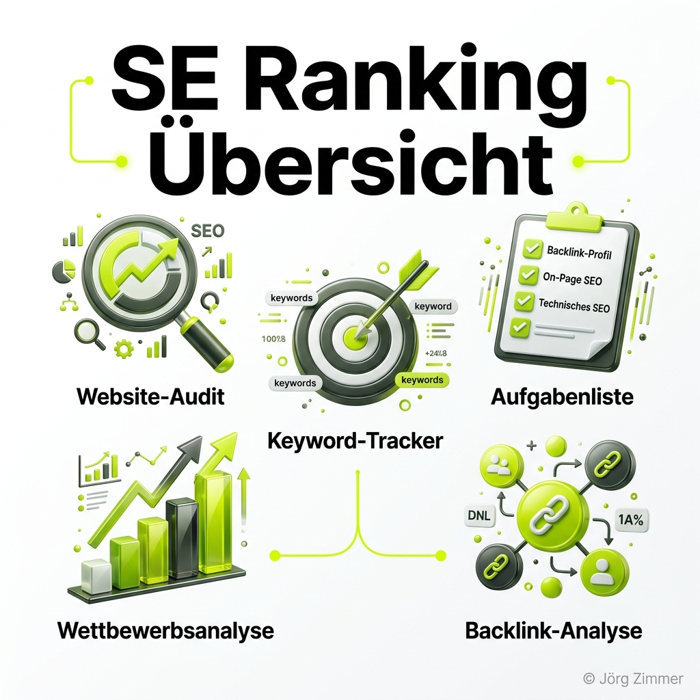
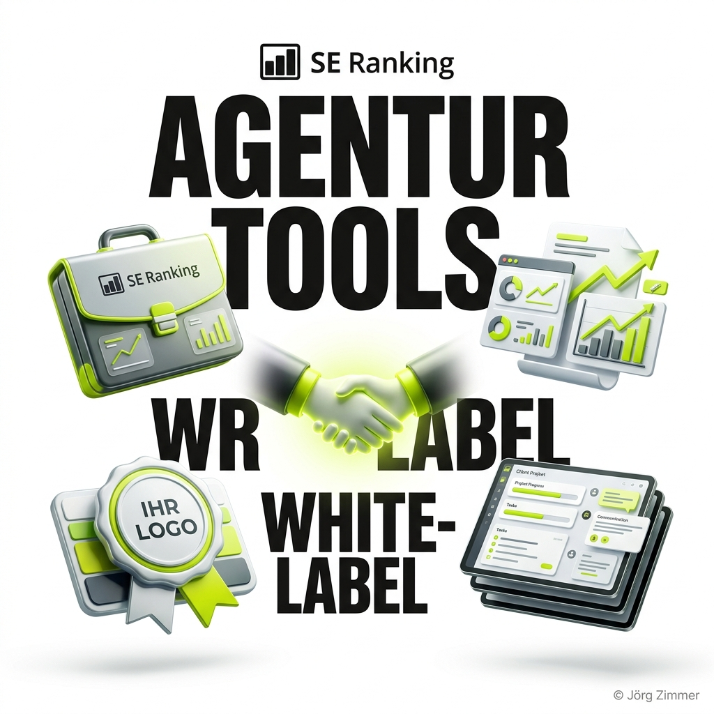

In der Welt der Suchmaschinenoptimierung gibt es unzählige Tools, die genau *eine* Sache gut können. Das Problem: Wer Rankings tracken, Backlinks überwachen, den Wettbewerb analysieren und technische Fehler auf der Website finden will, muss oft drei oder vier verschiedene Software-Abos abschließen. 

**SE Ranking** verfolgt einen fundamental anderen Ansatz. Es positioniert sich als echte **All-in-One SEO-Plattform**. Das Ziel ist es, den gesamten Workflow eines SEO-Managers, einer Agentur oder eines Inhouse-Teams in einer einzigen, aufgeräumten Benutzeroberfläche abzubilden. In diesem Übersichtsartikel schauen wir uns detailliert an, welche Werkzeuge und Module die Plattform ([SE Ranking ansehen](https://seranking.com/de/se-ranking-for-agencies.html?ga=4169588&source=link) *(Affiliate)*) unter der Haube hat und wie sie dir im SEO-Alltag helfen.

<figure class="my-8 bg-neutral-50 border border-neutral-200 p-6 md:p-8 rounded-2xl shadow-sm">
  

    
    

      <h4 class="font-bold text-base md:text-lg text-dark mb-0">Jörg Zimmer</h4>
      
Senior SEO & AI Search Consultant

    

  

  <blockquote class="text-base md:text-lg text-dark leading-relaxed italic border-l-4 border-lime-accent pl-4 my-4 font-normal">
    „Wer im SEO-Alltag zwischen fünf verschiedenen Einzellösungen für Rank-Tracking, Backlinks und Audits hin- und herspringt, verbrennt unnötig Budget und Zeit. SE Ranking vereint diese Disziplinen nicht nur pragmatisch unter einem Dach, sondern schlägt mit nativer KI-Sichtbarkeit und MCP-Schnittstellen für Coding-Agenten die Brücke in die moderne Ära der Generative Engine Optimization.“
  </blockquote>
  <figcaption class="mt-4 pt-3 border-t border-neutral-200/60 flex flex-wrap items-center justify-between gap-2 text-xs text-neutral-500">
    Experten-Zitat • <cite class="not-italic font-semibold text-neutral-700">Jörg Zimmer</cite>
    <a href="https://www.linkedin.com/in/joerg-zimmer-seo-sea-freelancer-berlin-spandau/" target="_blank" rel="noopener noreferrer" class="font-bold text-lime-700 hover:underline inline-flex items-center gap-1">
      Jörg Zimmer auf LinkedIn folgen →
    </a>
  </figcaption>
</figure>

  

    30-Sekunden Inhaber-Check
  

  <h3 class="text-lg font-bold text-dark mb-2">Jörgs Praxistipp aus der SEO-Sprechstunde</h3>
  

    Verbinde SE Ranking nicht nur mit Google Analytics und Search Console, sondern aktiviere das Modul <em>SE Visible</em> für deine Kern-Suchbegriffe. Überwache wöchentlich den Unterschied zwischen deiner organischen Klick-Position auf Seite 1 und deinem tatsächlichen <em>Citation Share</em> in den Google AI Overviews.
  

  

    
🔍 Dein schneller Tool-Effizienz-Check:

    
1. Prüfe, wie viele isolierte SEO-Tools in deinem Unternehmen parallel bezahlt werden (z. B. getrennter Crawler, Rank-Tracker, Backlink-Checker).

    
2. Kontrolliere, ob deine Agentur dir standardisierte Roh-PDFs schickt oder verständliche Dashboards mit klaren Prioritäten bereitstellt.

    
<strong>Kontrollfrage an deine Agentur:</strong> <em>„Nutzen wir in unserer SEO-Tool-Suite bereits automatisierte KI-Sichtbarkeitsanalysen und MCP-Schnittstellen von SE Ranking, um Daten direkt in agile Redaktions- und Entwicklerprozesse einzuspeisen?“</em>

  

---

## 1. Keyword- und Ranking-Analyse

Das historische Herzstück von SE Ranking, wie der Name schon sagt, ist die Überwachung von Suchbegriffen. Doch das Modul geht mittlerweile weit über eine einfache Positionsabfrage hinaus.

### Der Rank-Tracker
Der Keyword-Rank-Tracker ist das Kontrollzentrum für deine Sichtbarkeit. Er liefert dir nicht nur Momentaufnahmen, sondern historische Verlaufsdaten. Du siehst genau, wann ein [Google Core Update](/glossar/google-core-update/) deine Rankings durcheinandergewirbelt hat.
*   **Präzision:** Die Daten werden täglich (oder auf Wunsch wöchentlich) aktualisiert.
*   **Segmentierung:** Du kannst Rankings nicht nur global, sondern heruntergebrochen auf Desktop- und Mobile-Geräte sowie auf spezifische Suchmaschinen (Google, Bing, Yahoo, YouTube) tracken.
*   **SERP-Features:** Das Tool zeigt dir an, ob dein Keyword ein Rich Snippet, ein Featured Snippet oder ein Video-Karussell auslöst – und ob du dort vertreten bist.

### Keyword-Recherche
Bevor du ranken kannst, musst du wissen, wonach gesucht wird. Die Keyword-Recherche von SE Ranking liefert dir alle essenziellen Metriken:
*   **Suchvolumen & Keyword-Difficulty:** Wie oft wird ein Begriff gesucht und wie schwer ist es, die Top 10 zu knacken?
*   **Ideen-Generierung:** Das Tool schlägt dir Tausende von semantisch verwandten Suchbegriffen und Long-Tail-Keywords vor.
*   **Keyword-Lücken:** Du kannst deine Domain mit deinen härtesten Konkurrenten vergleichen und sofort sehen, für welche lukrativen Begriffe sie ranken, du aber noch nicht.

## 2. Technische SEO & On-Page-Optimierung

Die besten Backlinks und Inhalte bringen dir nichts, wenn Google deine Seite aufgrund von technischen Fehlern nicht lesen kann. SE Ranking bietet hierfür starke Diagnose-Werkzeuge.

### Das Website-Audit
Dieses Modul kriecht (crawlt) wie ein Suchmaschinen-Bot über deine gesamte Domain. Es durchleuchtet die Architektur und listet technische Blocker auf.
*   Das Audit findet **defekte Links (404-Fehler)**, die das Crawl-Budget verschwenden und die Usability zerstören.
*   Es prüft [Core Web Vitals](/glossar/core-web-vitals/) und Ladezeiten (Pagespeed).
*   Es warnt vor **Duplicate Content**, fehlenden Meta-Tags, falschen Hreflang-Attributen oder Problemen mit der Indexierung (z.B. blockierte Ressourcen in der `robots.txt`).
Das Beste daran: Das Tool sagt dir nicht nur, *was* kaputt ist, sondern priorisiert die Fehler nach Dringlichkeit und gibt konkrete Handlungsempfehlungen zur Behebung.

### On-Page SEO-Checker
Während das Audit die ganze Domain prüft, nimmt der On-Page Checker **eine spezifische URL** und ein dazugehöriges Ziel-Keyword unter die Lupe. Die Software gleicht über 110 Parameter deiner Seite mit den aktuellen Top-10-Ergebnissen ab. Du erhältst eine detaillierte Checkliste, was du an deiner H1, der Keyword-Dichte oder den [Strukturierten Daten (Schema.org)](/glossar/schema-org-markup/) verbessern musst, um die Konkurrenz zu überholen.

### Seitenänderungs-Monitor
Ein oft unterschätztes Feature: Der Monitor schlägt Alarm, wenn sich auf deinen wichtigsten URLs (oder denen der Konkurrenz) etwas ändert. Ob ein Kollege aus Versehen den Title-Tag gelöscht hat oder der Konkurrent seine Preise anpasst – du erfährst es sofort.

## 3. Backlinks & Competitive Research

SEO findet nie in einem Vakuum statt. Um zu gewinnen, musst du wissen, was deine Mitbewerber tun.

### Wettbewerbsanalyse (Organisch & Paid)
Gib eine beliebige Domain in SE Ranking ein, und die Plattform entkleidet die SEO-Strategie des Wettbewerbers.
*   **Organischer Traffic:** Du siehst, welche Keywords dem Konkurrenten den meisten Traffic bringen und welche seiner URLs am stärksten sind.
*   **PPC & Ads:** Das Tool deckt sogar auf, für welche Keywords die Konkurrenz bei Google Ads Geld ausgibt und wie deren Anzeigentexte (historisch) aussahen. So kannst du dir teure A/B-Tests sparen und funktionierende Paid-Strategien adaptieren.

### Backlink-Checker & Monitor
Ein starkes [Linkprofil](/glossar/linkbuilding/) ist nach wie vor ein Ranking-Faktor. Mit dem Backlink-Tool kannst du die verweisenden Domains jeder beliebigen Website auslesen.
*   **Lücken finden:** Finde heraus, wer auf deine drei stärksten Konkurrenten verlinkt, aber noch nicht auf dich. Das sind deine perfekten Outreach-Ziele.
*   **Toxizität:** Der Monitor überwacht deine bestehenden Links. Er warnt dich vor "Spam-Links" (hoher Toxicity Score), die deinem E-E-A-T-Profil schaden könnten, und meldet sofort, wenn ein wertvoller Backlink gelöscht wurde (Lost Links).

## 4. Content Marketing & Generative AI

Die Art und Weise, wie Content erstellt und konsumiert wird, hat sich durch LLMs (Large Language Models) drastisch verändert. SE Ranking hat seine Plattform massiv in Richtung KI aufgerüstet.

### Content Editor & AI Article Writer
Der Content Editor hilft Textern dabei, [KI-Sichtbarkeit (GEO)](/glossar/geo/) mit klassischem SEO zu verbinden. Er analysiert die SERPs und gibt vor, welche Begriffe, Entitäten und LSI-Keywords in einem Text vorkommen müssen, um thematische Autorität aufzubauen. Der integrierte AI Writer kann zudem Textpassagen entwerfen oder den "Tone of Voice" anpassen. Eingebaute Plagiatsprüfungen stellen sicher, dass der Content einzigartig bleibt.

### SE Visible (KI-Ergebnis-Tracker)
Dies ist die Antwort auf die neue [Sichtbarkeit in der KI-Suche](/glossar/ki-sichtbarkeit/). Während der klassische Rank-Tracker "blaue Links" misst, trackt SE Visible, ob und wie deine Marke in generativen Antworten auftaucht (z.B. in Google AI Overviews, ChatGPT oder Perplexity).
*   Das Tool misst den Anteil der Marken-Zitationen (Citation Share).
*   Es führt eine Sentiment-Analyse durch, um zu bewerten, ob die KI positiv oder negativ über dein Unternehmen "spricht".
*   *(Tipp: Einen umfassenden Marktüberblick mit Vor- und Nachteilen findest du in meinem [Vergleich der Top 9 AI Visibility Tools](/blog/top-9-ai-visibility-tools/) oder im Deep-Dive zum [Rankscale AI Visibility Tool](/blog/rankscale-ai-visibility-tool/)).*

## 5. Local SEO & Maps

Für lokale Dienstleister, Handwerker oder Filialisten ist die Optimierung auf Google Maps oft wichtiger als die bundesweite organische Suche.

### Local Rank Tracking
SE Ranking erlaubt es, Keyword-Positionen extrem granular zu messen. Du kannst einstellen, dass du dein Ranking exakt für eine bestimmte Postleitzahl, eine Stadt oder sogar ein bestimmtes Viertel überprüfen willst.

### Google Business Profile Management
Du kannst dein lokales Google-Profil direkt mit der Plattform verknüpfen. Das erlaubt dir, Unternehmensdaten zentral zu steuern und vor allem Kundenbewertungen (Reviews) aus einem einzigen Dashboard heraus zu überwachen und zu beantworten – ein massiver Effizienzgewinn für Filialunternehmen.

## 6. Agentur-Tools (B2B Features)

SE Ranking ist extrem beliebt bei SEO-Agenturen. Das liegt an den integrierten B2B-Funktionen, die den Umgang mit Kunden professionalisieren. ([Hier SE Ranking für Agenturen ansehen](https://seranking.com/de/se-ranking-for-agencies.html?ga=4169588&source=link) *(Affiliate)*).

### White-Label-Berichte
Du kannst die gesamte Plattform "branden". Die URLs, die Logos und das Farbschema lassen sich auf dein Agentur-Design anpassen. So kannst du Kunden einen Gast-Zugang geben, und es sieht aus, als hätten sie Zugriff auf ein von dir selbst entwickeltes SEO-Dashboard. Die automatisierten PDF-Reports (die z.B. jeden Montag an den Kunden geschickt werden) runden das White-Label-Erlebnis ab.

### Lead-Generator
Dieses Widget kannst du auf deiner eigenen Agentur-Website einbinden. Besucher können dort ihre Domain eintragen und erhalten ein kostenloses, rudimentäres SEO-Audit. Im Gegenzug erhältst du ihre Kontaktdaten (Lead) und weißt sofort, wo ihre Website Schwächen hat – der perfekte Aufhänger für ein Vertriebsgespräch.

### API-Zugriff & Automatisierung
Für Enterprise-Kunden bietet SE Ranking eine mächtige API. Das bedeutet, du kannst alle Rohdaten (Rankings, Suchvolumina, Audit-Scores) über Schnittstellen abgreifen und in eigene Systeme (z.B. Google Looker Studio, PowerBI oder sogar in [Agentic Workflows](/glossar/ki-seo/)) speisen. Wie das in der Praxis mit KI aussieht, zeige ich dir in meinem Praxis-Test zur [SE Ranking API mit Claude Code](/blog/se-ranking-api-claude-code-praxis-test/).

  

    

      🤖
      
Arbeitsanweisung für deinen KI-Agenten (Cursor / Claude / Antigravity)

    

    <button type="button" class="copy-agent-btn px-2.5 py-1 bg-lime-accent text-dark hover:bg-lime-600 hover:text-white text-[11px] font-bold uppercase rounded border border-lime-500 hover:border-lime-600 transition-all flex items-center gap-1 shadow-md cursor-pointer shrink-0 ml-auto" title="Prompt kopieren">
      <svg class="w-3.5 h-3.5" fill="none" stroke="currentColor" viewBox="0 0 24 24"><path stroke-linecap="round" stroke-linejoin="round" stroke-width="2" d="M8 16H6a2 2 0 01-2-2V6a2 2 0 012-2h8a2 2 0 012 2v2m-6 12h8a2 2 0 012-2v-8a2 2 0 01-2-2h-8a2 2 0 01-2 2v8a2 2 0 012 2z" /></svg>
      Kopieren für Agent
    </button>
  

  

    Kopiere diesen Prompt direkt in deinen KI-Coding-Assistenten, um SE Ranking über die REST-API oder den nativen MCP-Server automatisiert anzubinden:
  

  

    
# Prompt: Automatisierte SE Ranking Audit & Ranking-Abfrage via MCP/API

    
<strong>Rolle:</strong> Du bist ein erfahrener SEO Automation Engineer.

    
<strong>Aufgabe:</strong> Richte ein Skript ein, das via SE Ranking API oder MCP-Server aktuelle Keyword-Rankings und Website-Audit-Issues für das Projekt abruft und als strukturiertes Markdown ausgibt.

    
<strong>Schritte & Validierung:</strong>

    <ul class="list-disc pl-4 space-y-1 text-gray-300">
      <li>Authentifiziere dich über den API-Schlüssel oder MCP-Server gegen das SE Ranking Projekt.</li>
      <li>Rufe die Top-Gewinner- und Verlierer-Keywords der letzten 30 Tage inklusive Suchvolumen und SERP-Features ab.</li>
      <li>Filtere im Website-Audit nach kritischen Fehlern (Statuscode 4xx/5xx, fehlende Canonicals, robots.txt-Blocker).</li>
      <li>Generiere einen priorisierten Handlungsplan im Markdown-Format für Entwickler und Content-Manager.</li>
    </ul>
  

---

## Abschließende Bewertung: Lohnt sich SE Ranking?

Wer seine SEO-Daten nicht strukturiert erhebt, fliegt blind. SE Ranking löst das Problem des "Tool-Zoos", indem es alle wichtigen Disziplinen – von der technischen Basis bis zur modernen KI-Sichtbarkeit – an einem Ort vereint. Durch die faire Preisgestaltung, die sich nach der Anzahl der getrackten Keywords richtet, skaliert das Tool hervorragend mit: Es ist erschwinglich für Freelancer, bietet aber gleichzeitig die Enterprise-Features, die große Agenturen fordern.

  
    Aus Jörgs LinkedIn-Feed
  
  <blockquote class="text-base md:text-lg text-gray-200 italic max-w-2xl mx-auto mb-4 border-none font-normal">
    „Es gibt tausende SEO Tools, die die Arbeit der Suchmaschinenoptimierer nicht überflüssig machen. Sie zeigen dir nur die Möglichkeiten und erleichtern das Leben.“
  </blockquote>
  

    Diskutiere mit Jörg Zimmer und der SEO-Community auf LinkedIn über diesen Beitrag.
  

  <a href="https://www.linkedin.com/feed/update/urn:li:activity:7055143807113129984" target="_blank" rel="noopener noreferrer" class="btn-primary">
    <svg class="w-4 h-4 fill-current" viewBox="0 0 24 24"><path d="M20.447 20.452h-3.554v-5.569c0-1.328-.027-3.037-1.852-3.037-1.853 0-2.136 1.445-2.136 2.939v5.667H9.351V9h3.414v1.561h.046c.477-.9 1.637-1.85 3.37-1.85 3.601 0 4.267 2.37 4.267 5.455v6.286zM5.337 7.433c-1.144 0-2.063-.926-2.063-2.065 0-1.138.92-2.063 2.063-2.063 1.14 0 2.064.925 2.064 2.063 0 1.139-.925 2.065-2.064 2.065zm1.782 13.019H3.555V9h3.564v11.452zM22.225 0H1.771C.792 0 0 .774 0 1.729v20.542C0 23.227.792 24 1.771 24h20.451C23.2 24 24 23.227 24 22.271V1.729C24 .774 23.2 0 22.222 0h.003z"/></svg>
    Beitrag auf LinkedIn öffnen
    →
  </a>

---

## 📚 Der große SE Ranking Hub: Alles, was du wissen musst

Du willst noch tiefer einsteigen? Ich habe in der Vergangenheit intensiv mit SE Ranking gearbeitet, eigene Tools gebaut und Skripte programmiert. Hier findest du mein gesamtes Inventar an Fachartikeln, Vergleichen und Tutorials rund um die Plattform:

### Grundlagen & Strategie
*   [10 Gründe, warum SE Ranking die beste Wahl für SEO Agenturen ist](/blog/se-ranking-agentur-10-gruende/)
*   [SE Ranking Preise: Welches Paket lohnt sich?](/blog/se-ranking-preise/)
*   [Sistrix vs. SE Ranking: Der große Vergleich](/blog/sistrix-vs-se-ranking/)

### KI & AI Visibility
*   [SE Ranking bringt KI-Sichtbarkeit in die Software](/blog/se-ranking-ki-sichtbarkeit/)
*   [Der neue AI Tracker von SE Ranking im Detail](/blog/se-ranking-ai-tracker/)

### Entwicklung, API & Claude Code Integration
*   [Endpunkte-Kompass: Die SE Ranking API verstehen](/blog/se-ranking-api-endpunkte-kompass/)
*   [Setup-Guide: SE Ranking API mit Claude Code verbinden](/blog/se-ranking-api-claude-code-setup/)
*   [Praxis-Test: Claude Code schreibt Skripte für die SE Ranking API](/blog/se-ranking-api-claude-code-praxis-test/)
*   [App-Entwicklung: Eine SE Ranking App mit ChatGPT bauen](/blog/se-ranking-chatgpt-app/)

### Verwandte Glossar-Einträge
* [SEO-Audit im Detail](/glossar/seo-audit/)
* [Technisches SEO für moderne Websites](/glossar/technisches-seo/)
* [Core Web Vitals & PageSpeed](/glossar/core-web-vitals/)
* [Schema.org Markup implementieren](/glossar/schema-org-markup/)
* [Generative Engine Optimization (GEO)](/glossar/geo/)
* [Linkbuilding Strategien](/glossar/linkbuilding/)
* [KI-Sichtbarkeit messen](/glossar/ki-sichtbarkeit/)
