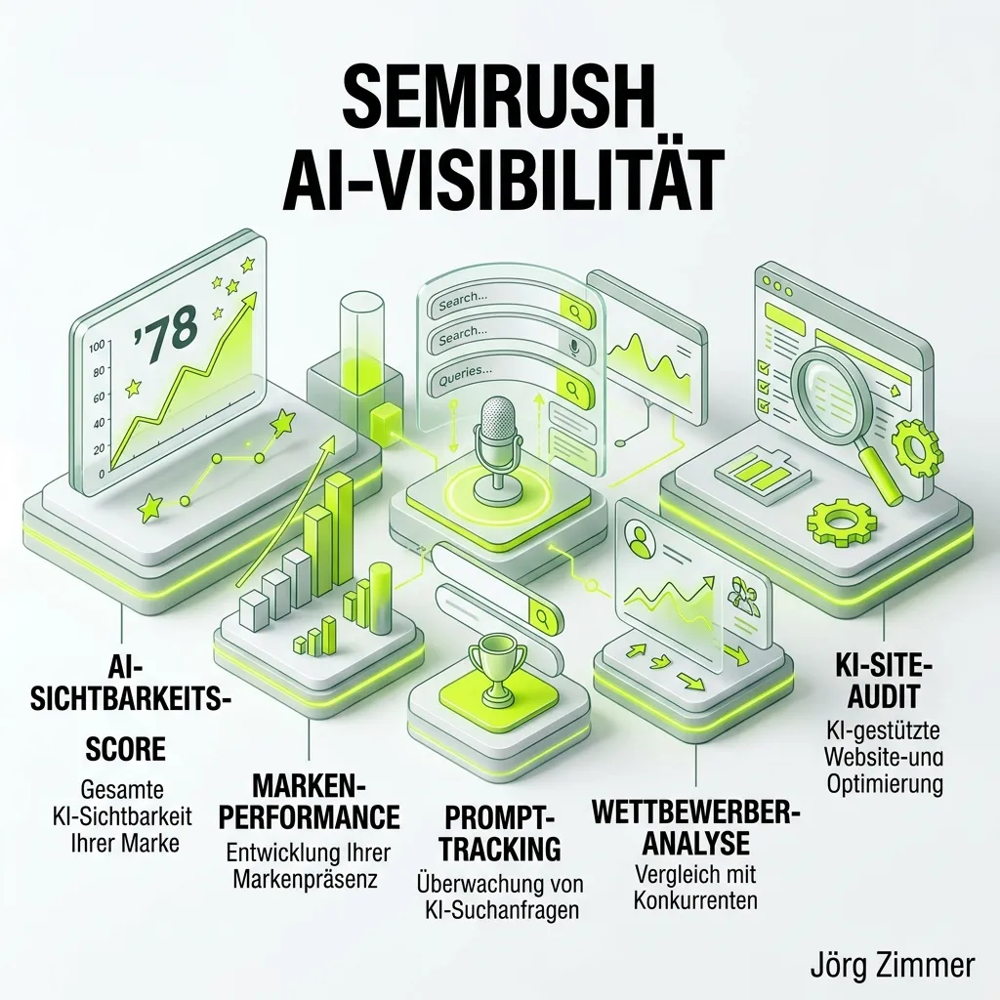

Die klassische organische Google-Suche ist nicht mehr der einzige Weg, über den Nutzer Antworten finden. Sprachmodelle (LLMs) und AI Answer Engines verändern das Informationsverhalten radikal. Wer in ChatGPT, Perplexity oder den Google AI Overviews nicht als autoritäre Quelle empfohlen wird, verliert massiv an Relevanz.

Genau hier setzt **Semrush** an. Der Branchen-Gigant aus Boston, der seit Jahren die All-in-One-Infrastruktur für tausende Marketing-Teams weltweit stellt, hat mit seinem **AI Visibility Toolkit** den nächsten logischen Schritt vollzogen. 

In diesem Übersichtsartikel analysieren wir die Kernfunktionen von Semrush im Bereich [AI Search Monitoring](/glossar/ki-sichtbarkeit/) und zeigen, wie sich klassisches Keyword-Tracking in die Ära der generativen Suche wandelt.

## Die Kernfunktionen des Semrush AI Visibility Toolkits

Künstliche Intelligenz nutzt keine starren Keyword-Listen. Sie generiert dynamische Antworten basierend auf komplexen Nutzer-Prompts. Um diesen Wandel messbar zu machen, hat Semrush eine völlig neue Tracking-Architektur aufgebaut.

### 1. Der AI Visibility Score
Das Fundament des neuen Moduls ist der *AI Visibility Score*. Diese Benchmark-Metrik (von 0 bis 100) aggregiert die Sichtbarkeit deiner Marke über verschiedene Sprachmodelle hinweg.
Sie beantwortet die wichtigste Frage auf einen Blick: **Wie stark dominiert meine Brand die Antworten der KI im Vergleich zur Konkurrenz?** Ein hoher Score bedeutet, dass deine Marke nicht nur häufig erwähnt, sondern aktiv als vertrauenswürdige Lösung für Nutzerprobleme zitiert wird.

### 2. Brand Performance & Sentiment Analyse
Nicht jede Erwähnung ist eine gute Erwähnung. Semrush trackt den *Share of Voice* (Marktanteil) deiner Marke innerhalb der KI-Antworten und koppelt diese Daten mit einer starken Sentiment-Analyse.
Das System wertet vollautomatisch aus, ob die künstliche Intelligenz im Kontext positiv, neutral oder negativ über dein Produkt spricht. Diese Funktion ist nicht nur für SEOs, sondern vor allem für PR-Abteilungen ein absoluter Gamechanger.

### 3. Prompt Tracking & Research
Während man früher "Beste Laufschuhe 2026" in den Rank-Tracker eingab, trackt man heute komplexe Nutzer-Prompts.
Semrush nutzt eine gigantische Datenbank an echten User-Prompts, um zu simulieren, wie Sprachmodelle auf hochspezifische Fragen reagieren. Das Tool zeigt dir genau, durch welche Konversationen deine Marke (oder die der Konkurrenz) ausgelöst wird. Das ist die absolute Basis für jede [Generative Engine Optimization (GEO)](/glossar/geo-tool/).

### 4. Competitor Research & Gap Analyse
Im klassischen SEO suchen wir nach Keyword-Gaps. In der KI-Suche suchen wir nach *Visibility Gaps*. 
Mit der Wettbewerbsanalyse von Semrush kannst du deine eigene Domain direkt gegen deine härtesten Konkurrenten benchmarken. Das System zeigt dir schonungslos, bei welchen Themenkomplexen und Prompts die KI durchweg deinen Mitbewerber zitiert, während deine Marke komplett ignoriert wird.

### 5. Das AI Site Audit
Damit eine KI deine Inhalte überhaupt in ihre Antworten integrieren kann, muss sie diese technisch sauber extrahieren können. Das spezielle *AI Site Audit* prüft deine Website auf ihre "AI-Readiness". Es stellt sicher, dass Crawler von OpenAI, Anthropic und Co. nicht durch technische Fehler oder fehlerhafte Robots-Direktiven blockiert werden und dass deine Inhalte optimal strukturiert (z.B. durch passendes Schema Markup) vorliegen.

## Semrush vs. hochspezialisierte LLM-Tracker

Ist Semrush nun das einzige Tool, das du für die Zukunft brauchst?

Semrush punktet extrem durch seinen **All-in-One-Ansatz**. Wenn dein Team ohnehin schon die Semrush-Suite für organische Rankings, Backlink-Audits und Content-Planung nutzt, fügt sich das AI Visibility Toolkit nahtlos in diesen Workflow ein. Du hast eine zentrale Datenquelle für klassisches und generatives [SEO Tracking](/glossar/seo-visibility-tools/).

Wer jedoch eine noch tiefere, granularere Auswertung einzelner LLM-Engines sucht und gezielt in den Bereich der autonomen Content-Erstellung via KI-Agenten vordringen will, könnte sich zusätzlich spezialisierte Tools wie Profound, Peec AI oder Otterly ansehen. Für die breite Masse der Marketer liefert Semrush jedoch ein extrem robustes und mächtiges Fundament.

## Zusammenfassung: Pflichtprogramm für moderne Marketer

Die Einführung des AI Visibility Toolkits beweist, dass Semrush den massiven Umbruch der Branche nicht verschläft, sondern anführt. Wer heute noch glaubt, dass klassische Keyword-Rankings die einzige Wahrheit sind, wird von der Konkurrenz überholt, die ihre Marke längst in den Chat-Konversationen der Nutzer platziert.

  
💬 Die besten Alternativen auf dem Markt!

  
Du suchst nach einer All-in-One Alternative aus Europa oder nach einem hochspezialisierten LLM-Tracker? Hier sind meine persönlichen Empfehlungen:

  

    <a href="https://seranking.com/de/ki-sichtbarkeit-tools.html?ga=4169588&source=link" target="_blank" rel="noopener noreferrer" class="inline-block bg-dark text-white font-bold py-2 px-6 rounded-full hover:bg-gray-800 transition-colors">
      SE Ranking testen
    </a>
    <a href="https://rankscale.ai/?via=offer" target="_blank" rel="noopener noreferrer" class="inline-block bg-dark text-white font-bold py-2 px-6 rounded-full hover:bg-gray-800 transition-colors">
      Rankscale testen
    </a>
  

