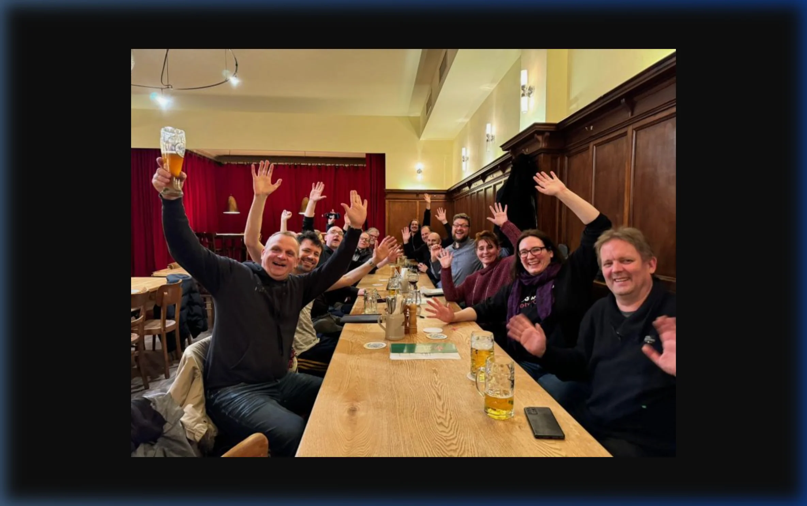
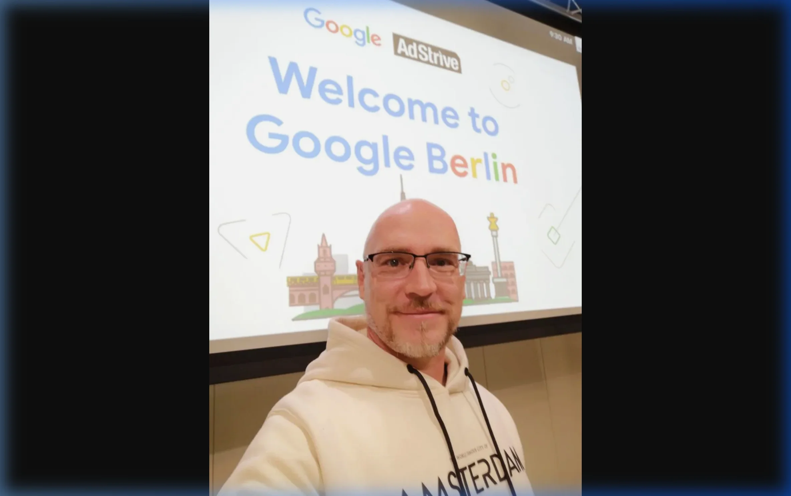

Moin!

Wer mich kennt, weiß: Ich bin kein Fan von einsamen Elfenbeintürmen. SEO passiert da draußen, im Austausch, in der Reibung mit anderen Experten. Und genau dafür ist der **SEO Stammtisch Berlin** da. 

  
 Jörgs SEO-Klartext (LinkedIn Insights)

  
"Als externer Berater spreche ich Herausforderungen in freundlichem Klartext an, ohne Angst um meinen Schreibtischstuhl zu haben."

Seit Jahren sitze ich dort regelmäßig mit Kollegen zusammen, die genauso tief im Kaninchenbau stecken wie ich. Es ist der Ort, an dem wir über die neuesten Core Updates fluchen, uns über verrückte [GEO-Experimente](/glossar/geo/) austauschen oder gemeinsam über die Tücken der [Search Console](/glossar/google-search-console/) lachen.

---

## Warum Networking dein stärkstes SEO-Tool ist

Viele denken bei SEO nur an Code und Content. Falsch. SEO ist ein People-Business. 
Die besten Informationen bekommst du nicht in einem Tool-Report von [Sistrix](/glossar/sichtbarkeitsindex/) oder <a href="https://seranking.com/?ga=4169588&source=link" target="_blank" rel="noopener noreferrer">SE Ranking</a>, sondern beim zweiten Bier (oder Spezi) am Stammtisch.

### 1. Der ungefilterte Wissensvorsprung
Oft flüstert man sich dort Dinge zu, die so nie in einem offiziellen Google-Blogpost stehen würden. Wer hat gerade ein Manual Action erlebt? Welche Nischen werden gerade von [KI-Crawlern](/glossar/crawler/) besonders hart rangenommen? Dieses 'Hearsay' ist oft der entscheidende Vorsprung, bevor ein offizielles Update die ganze Branche überrascht.

### 2. Die Fehler-Prävention (Fail-Sharing)
Nichts spart mehr Geld als aus den Fehlern anderer zu lernen. Am Stammtisch wird Klartext gesprochen: *"Jörg, wir haben ein Relaunch mit View Transitions gemacht und die [Sitemap](/glossar/sitemap/) vergessen – mach das bloß nicht!"*. Solche Insights sind Gold wert und bewahren dich vor teuren Sackgassen.

### 3. Emotionale Resilienz
SEO kann frustrierend sein. Man investiert Monate in [Entity SEO](/glossar/entity-seo/) und dann schiebt Google ein Update nach, das alles durcheinanderwürfelt. Zu sehen, dass gestandene Experten mit denselben Sorgen kämpfen, gibt Kraft und Perspektive.

## Meine Rolle vor Ort

Ich bin dort nicht als "Berater" unterwegs, sondern als Teil der Community. Es geht um Geben und Nehmen. Wenn jemand ein Problem mit [strukturierten Daten](/glossar/strukturierte-daten/) hat, helfe ich. Wenn ich bei einem komplexen [SEO-Audit](/glossar/seo-audit/) an meine Grenzen stoße, frage ich die Runde.

Das ist genau mein Spirit: Ehrlich, direkt und immer auf Augenhöhe. Ich bringe diese bodenständige Berliner Art in jedes meiner Projekte.

  <h4 class="text-xl font-bold text-dark mb-2 mt-0">Dabei sein ist alles</h4>
  
Wenn du in Berlin im Bereich SEO unterwegs bist, ist dieser Stammtisch Pflicht. Es ist der beste Weg, um aus dem 'Home-Office-Trott' auszubrechen und echte Impulse zu bekommen. Such auf LinkedIn nach den aktuellen Terminen oder schreib mir einfach.

## Community in Zeiten von KI

Man könnte meinen, in Zeiten von ChatGPT bräuchten wir keinen menschlichen Austausch mehr. Das Gegenteil ist der Fall. Je mehr KI-Einerlei das Netz flutet, desto wertvoller wird die echte, menschliche Expertise ([E-E-A-T](/glossar/e-e-a-t/)). 

Am Stammtisch validieren wir, was die KIs uns vorgaukeln. Wir besprechen, wie wir die [Grounding-Page](/glossar/grounding-page/) Konzepte in der Praxis umsetzen oder wie wir mit der [LLMs.txt](/glossar/llms-txt/) die KI-Bots steuern. Das ist 'Expertise aus erster Hand' – und die kann man nicht simulieren.

## Mein Tacheles-Rat für dich

Der SEO Stammtisch Berlin ist mein persönliches Kraftwerk. Wer wachsen will, muss sich mit Leuten umgeben, die schon weiter sind. Keine steifen Vorträge, sondern echte Gespräche. So wie ich es mag.

ALOHA 🌻 

---

  <h3 class="text-2xl font-bold mb-4">Lust auf einen echten Austausch?</h3>
  
Komm zum nächsten Stammtisch oder lass uns direkt in einer SEO-Sprechstunde über dein Projekt reden. Ich bringe die Erfahrung aus der Community direkt in deine Strategie.

  <a href="/seo-sprechstunde/" class="btn-primary inline-flex">SEO-Sprechstunde buchen </a>

* [Warum ich die Campixx Berlin liebe](/glossar/campixx-berlin/)
* [Die Überstunde Berlin – Netzwerken mal anders](/glossar/ueberstunde-berlin/)
* [Was ist Sichtbarkeit?](/glossar/sichtbarkeit/)
