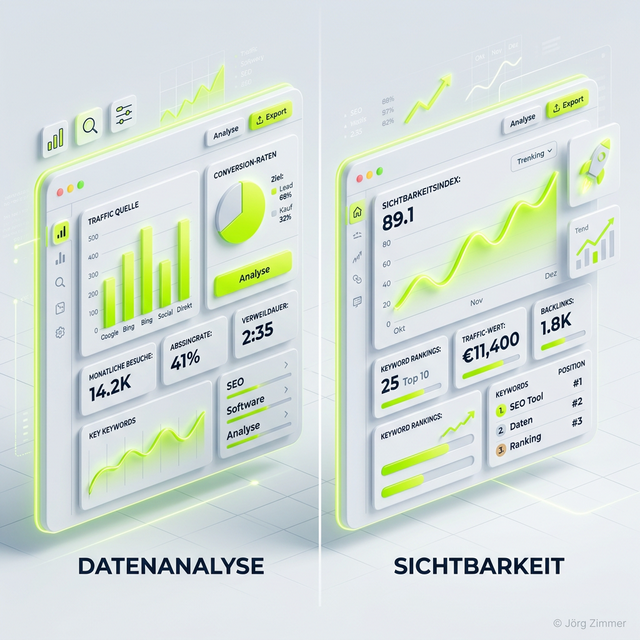

Wenn in der SEO-Szene, in Vorstandsetagen oder unter Marketingmanagern über den Erfolg einer Website gesprochen wird, fällt zwangsläufig der Begriff des **Sichtbarkeitsindexes**.

Im DACH-Raum ist dieser Begriff historisch extrem eng mit dem SEO-Tool *Sistrix* verwurzelt, welches diesen Index als "Goldstandard" der SEO-Währung etabliert hat. Dennoch haben mittlerweile fast alle professionellen SEO-Tools (wie *SE Ranking*, *Ahrefs* oder *Semrush*) ähnliche Sichtbarkeits-Metriken entwickelt, die der exakt gleichen Logik folgen. Warum insbesondere SE Ranking oft eine wirtschaftlich extrem charmante Alternative ist, beleuchte ich detailliert in meinem Tool-Vergleich: [Sistrix vs. SE Ranking](/blog/sistrix-vs-se-ranking/).

## Wie berechnet sich ein Sichtbarkeitsindex?

Der Index misst nicht den realen Traffic (den tatsächlichen Website-Besucherverkehr). Den realen Traffic deiner Seite kennst nur du selbst über deine *Google Search Console* oder *Google Analytics*. 

Stattdessen ist der Sichtbarkeitsindex eine mathematische Annäherung, ein relativer Marktanteil. Die Tools berechnen ihn vereinfacht in drei Schritten:

1.  **Das Keyword-Set:** Das Tool prüft wöchentlich oder täglich ein riesiges, fixes Set an Suchbegriffen (oft Millionen repräsentative Keywords) ab.
2.  **Das Suchvolumen:** Jedem Keyword im Set ist zugeordnet, wie oft es monatlich in einem bestimmten Land gesucht wird (z. B. "Schuhe kaufen" wird 200.000 mal gesucht, "Schuhe kaufen Spandau" nur 50 mal).
3.  **Die Position und Klickwahrscheinlichkeit (CTR):** Das Tool ermittelt, auf welchem Platz deine Domain zu diesen Keywords rankt. Platz 1 bekommt statistisch ca. 30-40% der Klicks. Platz 5 bekommt noch rund 5%. Platz 11 (Seite 2) kriegt so gut wie nichts mehr.

Der fertige Sichtbarkeitsindex ist die Summe der Klickwahrscheinlichkeiten aller Keywords, zu denen deine Domain platziert ist, gewichtet nach deren jeweiligem Suchvolumen. 

  <h4 class="text-xl font-bold text-dark mb-2 mt-0">Info-Box: Warum Traffic != Sichtbarkeit ist</h4>
  
Ein stetig steigender Sichtbarkeitsindex bedeutet nicht zwingend mehr Umsatz. Rankst du plötzlich auf Platz 1 für das High-Volume-Keyword "Kostenlose Bilder", schießt dein Sichtbarkeitsindex durch die Decke. Verkaufst du auf deiner Seite aber Industriekrane, wird dir diese Sichtbarkeit exakt 0 Euro Umsatz einbringen. Sichtbarkeit zeigt nur die "Masse der Berührungspunkte" an, nicht unbegingt die Qualität der Konversion.

## Sichtbarkeit als Benchmark gegen Wettbewerber

Die wahre Stärke des Sichtbarkeitsindexes liegt in der **Wettbewerbsanalyse**. Da Tools wie Sistrix oder SE Ranking den Index anhand eines einheitlichen Crawler-Setups für *alle* Seiten des gesamten Internets gleich berechnen, machst du Äpfel mit Äpfeln vergleichbar.

Stell dir vor, dein Traffic aus der Google Search Console bricht im Sommer um 20% ein. 
*   **Ist dein SEO schlecht geworden?** 
*   **Wurdest du von einem Core-Update abgestraft?** 
*   **Oder ist einfach nur Sommerloch?**

Der Blick in den Sichtbarkeitsindex gibt sofort Antwort. Bleibt die Kurve des Indexes komplett stabil (horizontal), während dein Traffic sinkt, weißt du sicher: Du hast keine Rankings verloren, die Leute suchen einfach gerade im Sommerflug nicht nach deinem Produkt. Fällt deine Kurve hingegen wie ein Stein ins Bodenlose ab, und die Kurve deines härtesten Konkurrenten steigt extrem an, wurdest du überholt (oder von einem Google-Update verbrannt, z. B. durch fehlerhaftes technisches SEO wie kaputte [Robots.txt](/glossar/robots-txt/)-Weichen).

## Das Problem von Nischen-Seiten

Der allgemeine Sichtbarkeitsindex hat einen blinden Fleck: **Ultra-spezifische B2B Nischen**.

Produzierst du Kugelrollenlager für Flugzeugtriebwerke, wird dein relevanter Traffic extrem rentabel, das Suchvolumen deiner Keywods liegt aber oft nur bei 10 Suchen pro Monat weltweit. Da die großen SEO-Tools in ihrem Milliarden-Set solche sogenannten "Longtail-Mini-Keywords" oft gar nicht statistisch abfragen, wird dein Sistrix-Index oder SE Ranking Visibility Score fast flach auf Null liegen (0.001) – selbst wenn du absoluter Marktführer bist.

Für Nischenseiten ist die einzige Lösung, eigene Keywords (ein Eigene-Keywords-Projekt) ins Tool hochzuladen und einen maßgeschneiderten, isolierten Nischen-Sichtbarkeitsindex berechnen zu lassen. Genau deshalb liebe ich die Skalierbarkeit von Projekten in SE Ranking, bei denen du hunderte eigene Suchbegriffe tagesaktuell tracken kannst.

## Die Evolution: Sichtbarkeit im KI-Zeitalter (GEO)

Der klassische Index misst die 10 blauen Links in der traditionellen Google-Suche. Heute ändert sich jedoch die Darstellung radikal.

Wenn Google bei einer Suchanfrage keinen blauen Link, sondern primär einen fetten Text-Block der *AI Overviews (SGE)* ausspielt, wird sich die Klickverteilung (Click Through Rate) dramatisch verändern. Gleiches gilt für Systeme wie Perplexity oder ChatGPT, auf die Nutzer zunehmend zur Informationsbeschaffung ausweichen. Die klassische Sichtbarkeit verliert hier An Zugkraft, wenn wir nicht lernen, wie man Entitäten in Sprachmodelle füttert (siehe hierzu: [Generative Engine Optimization (GEO)](/glossar/geo/)).

Wer sich an die Spitze setzt, nutzt moderne Tracking-Möglichkeiten, die genau diese Cites und AI-Antworten mit auslesen und protokollieren. Umfassende Berichte dazu findet ihr auf meinem Blog – wie wichtig dieses Umdenken ist, zeigen gerade die teils katastrophalen [Fehler in meinen täglichen Sprechstunden](/blog/80-prozent-seo-fehler-sprechstunde/).

### Fazit

Der Sichtbarkeitsindex ist nicht dein KPI (Key Performance Indicator) für den Unternehmensgewinn, aber er ist der mit Abstand beste Frühindikator für die Gesundheit deiner SEO-Strategie. Steile Abstürze deuten auf technische Defekte, Hacks oder Abstrafungen hin. Stetiges Wachstum zeigt, dass dein Content und dein Backlinkaufbau ([Linkjuice](/glossar/linkjuice/)) vom Algorithmus positiv belohnt wird. Ein erfahrener SEO bettet diesen Index immer sauber in die Analyse von Konversionsraten und hartem Analytics-Traffic ein.

---

  <h3 class="text-2xl font-bold mb-4">Nichts mehr verpassen?</h3>
  
Folge mir auf LinkedIn für tägliche SEO-Nuggets und diskutiere mit über 5.000 anderen Experten.

  <a href="https://www.linkedin.com/in/joerg-zimmer-seo-sea-freelancer-berlin-spandau/" target="_blank" rel="noopener noreferrer" class="btn-primary inline-flex">LinkedIn-Profil besuchen →</a>

