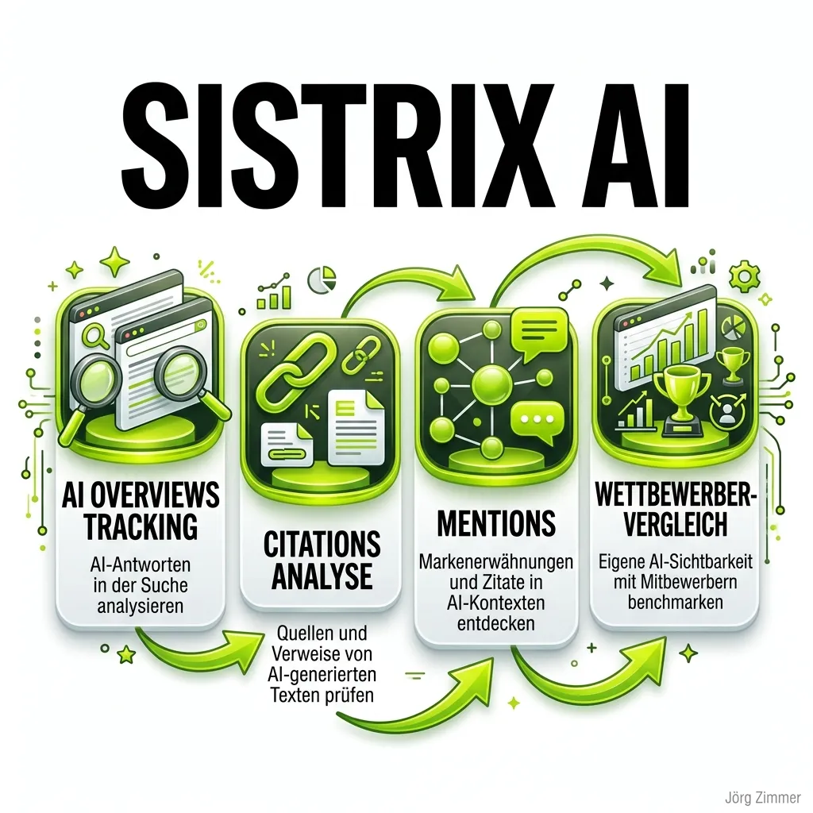

Der digitale Suchmarkt befindet sich in einem tektonischen Wandel. Doch während jeden Monat neue, KI-fokussierte Startups aus dem Boden schießen, beweist ein etablierter Dinosaurier aus dem Rheinland, dass man den Anschluss nicht verpasst hat. **Sistrix**, der absolute Branchenstandard für klassische Suchmaschinenoptimierung im DACH-Raum, hat sein Werkzeugkasten drastisch erweitert.

Die Geschichte der Plattform ist tief in der deutschen SEO-DNA verwurzelt. Gegründet von Johannes Beus in Bonn, revolutionierte das Unternehmen vor über 15 Jahren den Markt mit der Erfindung des *Sichtbarkeitsindex*. Was damals der Goldstandard für das Ranking in den zehn blauen Links von Google war, wird nun konsequent auf die Ära der Sprachmodelle und Answer Engines portiert. Sistrix wählt dabei einen extrem kundenfreundlichen Weg: Statt teurer Zusatzmodule baut das Team die neuen KI-Metriken nahtlos in die bestehende Infrastruktur ein.

In dieser Übersicht analysieren wir, welche Funktionen Sistrix für das [AI Search Monitoring](/glossar/ki-sichtbarkeit/) bereithält und wie sich die rheinische Lösung gegen reine AEO-Plattformen schlägt.

## Die Kernfunktionen von Sistrix AI

Die Entwickler in Bonn haben verstanden, dass die klassische organische Suche nicht verschwindet, sondern sich mit generativen KI-Antworten vermischt. Genau an dieser Schnittstelle setzen die neuen Features an.

### 1. AI Mentions & Citations
Wenn ChatGPT oder Perplexity eine Antwort generieren, greifen sie auf externe Quellen zurück. Das Feature *Mentions & Citations* trackt exakt diese Nennungen.
Du siehst nicht nur, *dass* deine Marke erwähnt wurde, sondern auch, welche spezifischen URLs als autoritäre Quelle (Citation) herangezogen wurden. Diese Source Analysis ist entscheidend, um zu verstehen, welche Inhalte von den Algorithmen der großen Sprachmodelle (LLMs) als vertrauenswürdig eingestuft werden.

### 2. Google AI Overviews (AIO) Tracking
Googles "AI Overviews" schieben sich bei vielen informativen Suchanfragen direkt über die klassischen Suchergebnisse und saugen massiv Traffic ab. Sistrix hat diese Bedrohung direkt in seine stärkste Waffe – die gigantische Keyword-Datenbank – integriert.
In den bekannten Ranking-Tabellen gibt es nun spezielle Filter. Ein kleines blaues KI-Icon zeigt sofort an, welche deiner rankenden Keywords ein AI Overview triggern. Dies ermöglicht eine präzise Risiko- und Chancen-Analyse für das eigene Keyword-Portfolio.

### 3. Competitive Benchmarking
Der Sichtbarkeitsindex wurde groß, weil man sich mit einem Klick mit jedem Mitbewerber vergleichen konnte. Diese Logik überträgt Sistrix auf die künstliche Intelligenz. Das Tool ermöglicht es, die eigene KI-Sichtbarkeit direkt gegen die Konkurrenz zu benchmarken. Wer wird in den KI-Antworten häufiger empfohlen? Wer liefert die zitierten Fakten? Die Antworten liegen nun direkt im Sistrix-Dashboard.

### 4. Contextual Understanding (Sentiment)
Die Nennung einer Marke ist nur die halbe Miete. Sistrix wertet den Kontext der KI-Antworten aus. Wird dein Produkt als "beste Lösung auf dem Markt" empfohlen, oder taucht es im Rahmen einer kritischen Antwort zu Sicherheitsproblemen auf? Das Tracking des Sentiments hilft PR- und Marketing-Teams, die narrative Deutungshoheit innerhalb der KI-Blackbox zu behalten.

## Die Preisstruktur: Das faire Bonner Modell

Während amerikanische AEO-Startups oft komplexe Preismodelle mit "Prompt-Credits" und extremen Monatsgebühren aufrufen, bleibt Sistrix seiner transparenten und fairen Preispolitik treu. **Alle AI Visibility Features sind fester Bestandteil der Standard-Pläne.**

Es gibt keine versteckten Add-ons. Wer Sistrix bereits nutzt, hat automatisch Zugriff auf die neuen KI-Werkzeuge.
- **Start (119 € / Monat):** Der Einstieg für Freelancer und kleine Teams. Voller Zugriff auf SEO, Links und die neuen AI-Daten in einem Projekt.
- **Plus (249 € / Monat):** Für Mittelständler und kleine Agenturen. Erweiterte Limits und tiefere historische Daten.
- **Professional (399 € / Monat):** Für etablierte Teams mit komplexeren Anforderungen und API-Bedarf.
- **Enterprise (899 € / Monat):** Für große Konzerne und globale Agenturen, die massive Datenmengen verarbeiten müssen.

*(Alle Preise verstehen sich zzgl. der gesetzlichen Mehrwertsteuer).*

## Abgrenzung: Sistrix vs. reine AEO-Plattformen

Ist Sistrix nun der direkte Konkurrent zu Plattformen wie Profound, Finseo oder Otterly? Die Antwort ist ein klares Jein.

Sistrix operiert aus der Position eines ganzheitlichen [SEO Visibility Tools](/glossar/seo-visibility-tools/). Der große Vorteil ist die zentrale Datenhaltung: SEO-Teams müssen nicht zwischen fünf verschiedenen Tools springen. Die KI-Metriken ergänzen die organischen Rankings, die Backlinks und die Onpage-Daten perfekt. Wer SEO strategisch und ganzheitlich betrachtet, wird die nahtlose Integration in Bonn lieben.

Reine AEO-Plattformen hingegen gehen oft einen Schritt weiter in die Automatisierung (z.B. durch KI-Agenten, die direkt optimierten Content generieren) oder fokussieren sich extrem auf sehr nischige Prompt-Volumina.

## Abschließende Bewertung: Die Evolution des Sichtbarkeitsindex

Johannes Beus und sein Team haben bewiesen, dass sie Marktentwicklungen nicht nur beobachten, sondern aktiv gestalten können. Anstatt in Panik vor den generativen Sprachmodellen zu verfallen, hat Sistrix genau die Werkzeuge geliefert, die SEO-Manager jetzt dringend brauchen, um den ROI ihrer Content-Maßnahmen weiterhin messbar zu machen.

Die Integration der KI-Sichtbarkeit in das Kernprodukt ohne Aufpreis ist ein starkes Signal an den Markt. Sistrix bleibt damit das Schweizer Taschenmesser für alle, die in Google – egal ob klassisch oder generativ – gefunden werden wollen.

  
💬 Jetzt an der Diskussion teilnehmen!

  <a href="https://www.linkedin.com/in/joerg-zimmer-seo-sea-freelancer-berlin-spandau/" target="_blank" rel="noopener noreferrer" class="inline-block bg-dark text-white font-bold py-2 px-6 rounded-full hover:bg-gray-800 transition-colors">
    Beitrag auf LinkedIn öffnen
  </a>

