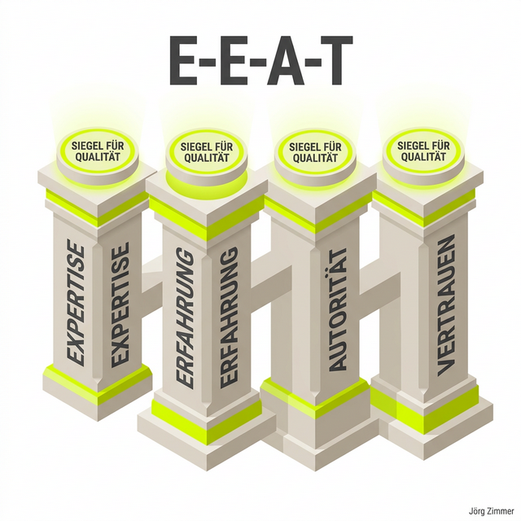

Moin! 🌻

Vergiss klassische Keyword-Rankings. Wer im Jahr 2026 glaubt, mit ein paar zusammengeklauerten Blog-Beiträgen und gekauften Backlinks eine Nische zu dominieren, lebt in einer gefährlichen Illusion. Wir befinden uns mitten in der größten Umwälzung der Suchmaschinengeschichte: Der Wandel von der Keyword-basierten Indexierung hin zu semantischen Vektorräumen und RAG-Pipelines (Retrieval-Augmented Generation).

Egal ob Google AI Overviews, Perplexity oder ChatGPT – moderne Antwort-Engines bewerten Websites nach einem einzigen brutalen Kriterium: **Topical Authority (thematische Autorität)**. 

Besitzt deine Plattform die notwendige Tiefe und Expertise, um als unumstrittener Experte zu einem Fachthema zu gelten? Oder betreibst du einen sprachlichen Bauchladen, der von allem ein bisschen, aber nichts richtig versteht?

## Was ist Topical Authority genau?

Topical Authority beschreibt den Reifegrad und die Vollständigkeit, mit der deine Domain ein spezifisches Themenfeld abdeckt. 

Früher konntest du mit einem einzelnen, 3.000 Wörter langen Monster-Artikel für ein umkämpftes Keyword ranken, selbst wenn der Rest deiner Website aus völlig fremden Themen bestand. Das ist vorbei. Wenn Suchmaschinen heute bewerten, ob sie deinem Artikel zum Thema "Technisches KI-SEO" vertrauen können, scannen sie dein **gesamtes Themen-Cluster**.

Sie stellen fest:
1. Hat diese Website weitere tiefe Fachartikel zu verwandten Begriffen wie MCP, A2A Protocol oder Canonical Tags?
2. Wie logisch und konsistent sind diese Artikel untereinander verlinkt?
3. Bietet der Autor echten **Information Gain** oder wiederkäut er nur das, was vor drei Jahren auf Wikipedia stand?

### Die Säulen der Topical Authority im Vergleich:

| Säule | Altes Keyword-SEO (Pre-2024) | Modernes Topical Authority SEO (2026) |
| :--- | :--- | :--- |
| **Fokus** | Einzelne Keywords & Suchvolumen | Vollständige Abdeckung eines Fachgebiets |
| **Verlinkung** | Arbiträre Ankertexte für PageRank | Semantisch geschachtelte Themencluster |
| **Content-Tiefe** | Wörteranzahl & Keyword-Dichte | Information Gain, E-E-A-T & eigene Daten |
| **Bewertung** | Backlinks & Domain Rating | Share of Model & Zitationsrate in LLMs |

💬 **Jörgs SEO-Klartext (LinkedIn Insights):**
> "Rankings sind Vanity-Metriken. Was nützt dir Platz 3 für ein Keyword mit 100 Suchanfragen, wenn ChatGPT dich in 90% aller Nutzeranfragen komplett ignoriert? Bau Vertrauen in deiner Nische auf. Werde die unbestrittene Anlaufstelle, und die Autorität kommt von ganz allein."

## Wie du ein unschlagbares Themencluster aufbaust

Um Topical Authority aufzubauen, musst du in Themenclustern denken. Ein Themencluster besteht aus drei Kernkomponenten:

1. **Die Pillar-Page (Hauptseite):** Ein umfassender Leitfaden, der das Überthema breit beleuchtet (z.B. [Agent Readiness Level](/glossar/agent-readiness-level/)).
2. **Die Cluster-Content-Seiten:** Vertiefende Fachartikel zu spezifischen Unterthemen (z.B. [A2A Protocol](/glossar/a2a-protocol/) oder [agent-card.json](/glossar/agent-card-json/)).
3. **Die interne Verlinkung:** Der semantische Klebstoff, der alle Seiten logisch miteinander verbindet.

  <h3 class="text-2xl font-bold mb-4">Deine Website hat Wissenslücken und verliert KI-Traffic?</h3>
  
Ich analysiere deinen Themenraum, identifiziere fehlende Cluster-Bausteine und erstelle eine maßgeschneiderte Topical-Authority-Strategie für maximale Zitierfähigkeit.

  <a href="/kontakt/" class="btn-primary inline-flex">Jetzt Strategie-Audit bei Jörg buchen 🌻</a>

## Topical Authority in der Praxis bei Teleschmiede

Auf unserer Plattform [teleschmie.de/](/ueber-mich/) setzen wir exakt dieses Prinzip um. Wir schreiben nicht über Blumenpflege oder Gebrauchtwagen – wir fokussieren uns zu 100% auf SEO, SEA und Generative Engine Optimization.

Jeder Glossar-Beitrag ist ein Mosaikstein unseres Gesamtwissens:
* Vertiefe deine Expertise mit [E-E-A-T](/glossar/e-e-a-t/).
* Biete eigenen Mehrwert durch [Information Gain](/glossar/information-gain/).
* Verbinde deine Inhalte über [interne Verlinkung](/glossar/interne-verlinkung/).

## Unterm Strich

Hör auf, Einzel-Keywords nachzujagen. Werde zum unangefochtenen Branchen-Experten für dein Thema. Bau tiefe Themencluster, biete echten Information Gain und sichere dir deinen Platz in den RAG-Engines der Zukunft.

Habe fertig! 

ALOHA! 🌻✌️
