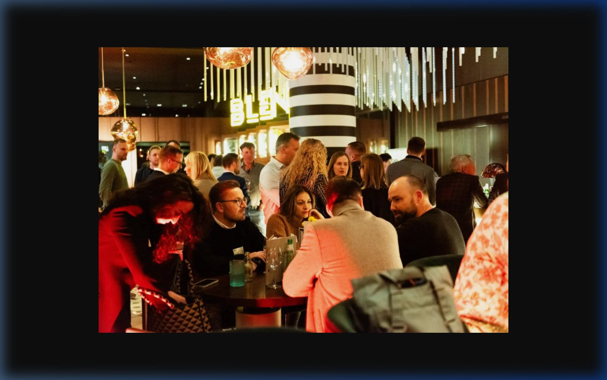
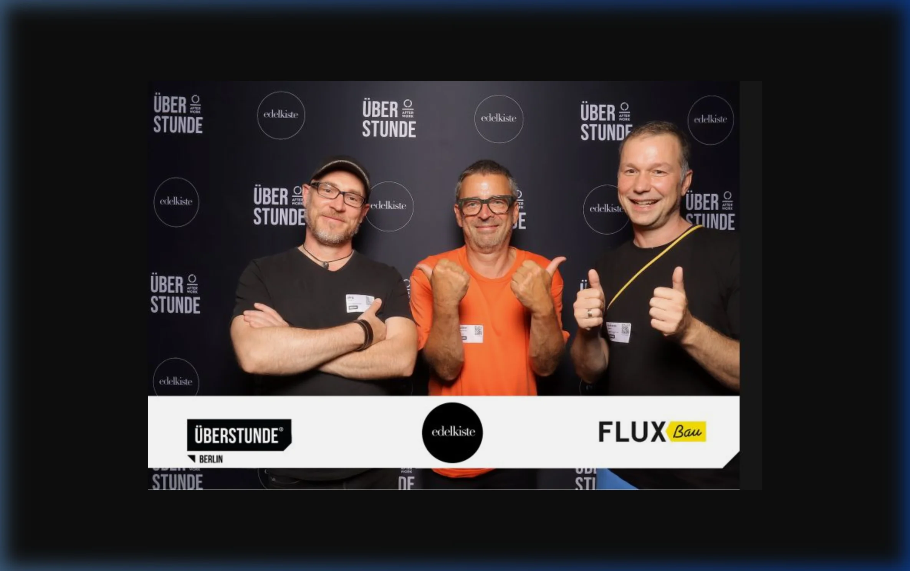

Moin!

Ich liebe SEO. Keine Frage. Aber manchmal tut es verdammt gut, den Kopf aus den [SERPs](/glossar/title-tag/) und den RAG-Vektorräumen zu nehmen und über den Tellerrand zu schauen. Die **Überstunde Berlin** ist für mich genau dieser Ort.

  
 Jörgs SEO-Klartext (LinkedIn Insights)

  
"Ein SEO-Audit, der als 100-seitiges PDF in der Schublade verstaubt, ist wertlos. Was müssen wir MORGEN ändern, damit es besser wird? Dafür musst du die Probleme der Leute verstehen. Und die verstehst du nicht vor dem Bildschirm, sondern beim echten Netzwerken."

Hier treffe ich nicht nur andere Tech-Nerds, sondern die Leute, für die wir das alles eigentlich machen: Unternehmer, CMOs, Gründer und Kreative. Es ist der Schmelztiegel der Berliner Macher-Szene im Jahr 2026.

---

## Warum "fachfremdes" Netzwerken Gold wert ist

Wer nur in der eigenen SEO-Blase bleibt, verpasst oft den Blick für das große Ganze. Bei der Überstunde lerne ich, welche Probleme Geschäftsführer *wirklich* haben. Meistens ist das nicht "fehlendes Schema-Markup", sondern schlichtweg "zu wenig qualifizierte Leads für das Sales-Team" oder "wir verstehen nicht, wie KI unseren Markt umkrempelt".

Dieses tiefere Verständnis hilft mir, meine Arbeit als [SEO-Experte](/seo-freelancer-berlin/) nicht nur technisch perfekt, sondern unternehmerisch wertvoll zu machen. 

### Meine Learnings von der Überstunde:
*   **Andere Blickwinkel:** Wie sieht ein UX-Designer eine Landingpage? Was braucht ein Sales-Profi, um den hochqualifizierten [Traffic](/glossar/traffic/) tatsächlich abzuschließen?
*   **Synergien nutzen:** Hier entstehen oft echte Kooperationen zwischen PR-Agenturen und SEOs, die für beide Seiten einen massiven [Linkjuice](/glossar/linkjuice/) Vorteil bringen.
*   **Echtes Feedback:** Wenn ich einem Nicht-SEO erkläre, was ich tue, merke ich sofort, ob meine Sprache zu kompliziert ist. Wenn die Leute abschalten, habe ich meinen Pitch vermasselt.

## Meine Präsenz in Berlin

Ich bin fest davon überzeugt: Die digitale Welt braucht ein knallhartes analoges Fundament. Gerade im Jahr 2026, in Zeiten von KI-Schwemme und anonymen Agenten-Ökonomien, ist das persönliche Treffen unersetzbar. Wenn ich bei der Überstunde stehe, bin ich Jörg Zimmer – nicht irgendein anonymer Prompt-Engineer oder ein Name in einem [SEO-Audit](/glossar/seo-audit/).

Das baut exakt das Vertrauen auf, das für eine langfristige Zusammenarbeit essenziell ist ([E-E-A-T](/glossar/e-e-a-t/)). Wer mich dort trifft, merkt schnell: Ich brenne für das Thema, aber ich bin auch realistisch und pragmatisch. Ein echter Teleschmie.de Partner eben.

  <h4 class="text-xl font-bold text-dark mb-2 mt-0">Macher-Tipp</h4>
  
Die Überstunde ist kein Ort für Hard-Selling. Lass die Verkaufspräsentation zu Hause. Sei einfach ehrlich interessiert an den Menschen. Die Aufträge folgen ganz organisch, wenn die Chemie stimmt und du zeigst, dass du Ahnung von deinem Fach hast.

## Netzwerken 2.0: Die Formate der Überstunde im Jahr 2026

Die Überstunde ist nicht einfach nur *ein* Event. Es ist ein lebendiges Ökosystem für echtes Networking in Städten wie Berlin, Leipzig und München.

*   **ÜBERSTUNDE Afterwork:** Das klassische, offene Format. Wechselnde Top-Locations (oft kurzfristig bekanntgegeben) und der absolute Fokus auf den lockeren Austausch.
*   **ÜBERSTUNDE KLUB:** Das Modell für Mitglieder, die exklusivere Vorteile oder einen noch tiefergehenden Austausch suchen. Kleinere Runden, spannende Locations und intensiviertes Networking.
*   **ÜBERSTUNDE CONFERENCE:** Ja, die Überstunde kann auch die ganz große Bühne. So fand die Conference im April 2026 beispielsweise am legendären EUREF-Campus statt – ein Pflichttermin für die Berliner Wirtschaft.

Weitere Infos und die nächsten Termine (oft erst kurz vorher enthüllt) findest du am besten direkt auf der offiziellen Website unter [ueberstunde.com](https://ueberstunde.com). Melde dich dort kostenlos für das Community-Profil an, um die Einladungen zu erhalten.

## Jörgs Action-Plan

Wenn du mich das nächste Mal bei der Überstunde siehst (vielleicht beim nächsten Event in einer coolen Rooftop-Bar oder auf dem EUREF-Campus): Sprich mich einfach an. Lass uns über deine Vision reden, über den Berliner Startup-Markt oder meinetwegen auch über das letzte krasse KI-Update von Google. Hauptsache auf Augenhöhe und mit einem echten Interesse an der Lösung.

ALOHA 🌻 

---

  <h3 class="text-2xl font-bold mb-4">SEO-Problem nach Feierabend?</h3>
  
Keine Sorge, ich helfe dir auch dann, wenn andere schon schlafen. Wir nutzen modernste KI-Tools für den Status-Quo und sichern deine Sichtbarkeit für die Zukunft.

  <a href="/kontakt/" class="btn-primary inline-flex">Jetzt Hilfe anfordern </a>

* [Lokal sichtbarer werden mit Local SEO](/glossar/local-seo/)
* [Was sind Citations?](/glossar/citation/)
