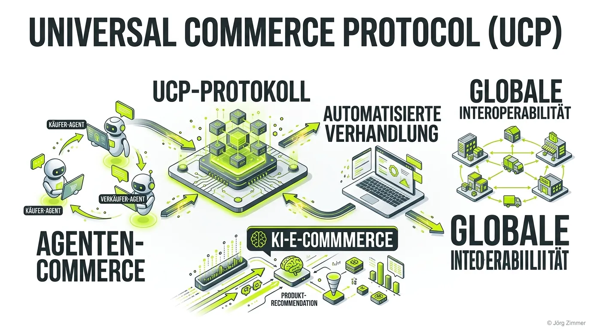

Moin! 🌻

Erinnerst du dich an die Zeiten, als wir für jeden kleinen Online-Shop ein eigenes Kundenkonto anlegen mussten und der Checkout-Prozess länger dauerte als eine Fahrt mit der Deutschen Bahn? Diese Zeiten sind endgültig vorbei. Willkommen in der Ära des Agenten-Commerce, angetrieben durch das **Universal Commerce Protocol (UCP)**.

Seit Google diesen Open-Source-Standard im Januar 2026 auf den Tisch geknallt hat, steht die E-Commerce-Welt Kopf. Und das aus gutem Grund: Wir reden hier nicht von einem weiteren bunten Button im Checkout, sondern vom fundamentalen Fundament dafür, wie Maschinen künftig für uns einkaufen.

## Was ist das Universal Commerce Protocol (UCP) überhaupt?

Das Universal Commerce Protocol ist im Grunde die Muttersprache für autonome KI-Assistenten, Online-Shops und Payment-Anbieter. Stell dir vor, du sagst zu deinem KI-Agenten: *"Besorg mir die besten Laufschuhe für meine Marathon-Vorbereitung in Größe 43, Budget 150 Euro."*

Früher hätte dir die KI zehn blaue Links ausgespuckt und gesagt: "Hier, mach selbst." 

Heute nutzt der Agent UCP, um im Hintergrund mit hunderten Shops (von Shopify bis Walmart) zu kommunizieren. Er vergleicht Preise, checkt die Lagerbestände, legt den passenden Schuh in deinen "Universal Cart" und führt – dank Integrationen mit Stripe oder Adyen – den Kauf direkt aus. Du verlässt deinen Chat nie. Das ist die Magie von UCP. 

### Schluss mit der N×N-Tracking-Hölle

Vor UCP hatten wir ein massives Problem, das ich gerne als "Pfusch am Bau" der Schnittstellenarchitektur bezeichne: Das N×N-Problem. Jeder Händler musste für jeden Chatbot, jede KI-Suche und jede Plattform eigene APIs stricken. Ein logistischer Albtraum.

UCP löst das, indem es als zentraler Vermittler auftritt. Es ist die Brücke, die sicherstellt, dass ein Shop-System mit allen UCP-fähigen KI-Agenten kommunizieren kann, ähnlich wie es das [Model Context Protocol (MCP)](/glossar/model-context-protocol-mcp/) für lokale Datenquellen tut oder das [Agent2Agent (A2A) Protokoll](/glossar/a2a-protocol/) für die direkte Kommunikation zwischen verschiedenen KIs. Einmal sauber integriert, bist du für den gesamten Agenten-Commerce gewappnet.

> [!IMPORTANT]
> **Kontrolle bleibt beim Händler:** Bei all der Automatisierung bleibst du als Händler der "Merchant of Record". Die KI fungiert nur als extrem effizienter Concierge. Deine Geschäftslogik, Rabatte und Versandbedingungen bleiben unantastbar in deiner Hand.

## AEO: Wenn der Goldfisch auf Espresso einkauft

Der moderne Nutzer hat die Aufmerksamkeitsspanne von einem Goldfisch auf Espresso. Er hat keine Lust mehr, sich durch überladene Kategorien-Bäume zu klicken. Er will das fertige Ergebnis. 

Deshalb ist UCP der letzte Sargnagel für reines Keyword-SEO der alten Schule. Willkommen in der Welt der **Agent Engine Optimisation (AEO)**.

KI-Agenten kaufen keine Produkte, weil der Banner so hübsch blinkt. Sie scannen strukturierte Daten, semantische Zusammenhänge und maschinenlesbare Feeds. Wenn deine Datenqualität Mist ist, dann sieht dich der Agent nicht. Und wenn dich der Agent nicht sieht, existierst du im Checkout-Prozess des Jahres 2026 schlichtweg nicht. 

💬 **Jörgs SEO-Klartext (LinkedIn Insights)**
> *"Wer 2026 noch glaubt, dass Rankings die einzige Währung sind, hat den Knall nicht gehört. Rankings sind Vanity-Metriken. Im Agenten-Commerce geht es um Daten-Interoperabilität. Wenn dein Shop nicht UCP-ready ist, kann die KI dein Produkt nicht kaufen. So einfach ist das. Wer CEO-Sprache spricht, bekommt Budgets – und die Botschaft lautet jetzt: Wir verlieren Umsatz, weil Maschinen unseren Shop nicht verstehen."*

### Die Checkliste: Bist du bereit für den Agenten-Commerce?

Wenn du nicht willst, dass dein Shop zum digitalen Geisterhaus mutiert, während die Konkurrenz über KI-Agenten die Warenkörbe füllt, musst du an deine [Agent Readiness](/glossar/agent-readiness/) ran. 

1. **Strukturierte Daten perfektionieren:** Keine halbgaren Schema.org-Implementierungen mehr. Jede Produktvariante, jeder Preis und jede Verfügbarkeit muss in Echtzeit für Maschinen auslesbar sein.
2. **API-First denken:** Weg vom klassischen Monolithen-Shop. Dein System muss headless und bereit sein, strukturierte UCP-Requests blitzschnell zu beantworten.
3. **Produktdaten-Hygiene:** Der Agent ist gnadenlos. Fehlerhafte EANs, unvollständige Attribute oder fehlende Versandinfos führen zum sofortigen Abbruch der automatisierten Verhandlung.

## Unterm Strich

Das Universal Commerce Protocol ist nicht bloß eine neue Schnittstelle – es ist das Rückgrat des modernen E-Commerce. Wer sich jetzt noch als Bauchladen-Agentur auf "Wir optimieren Ihre Meta-Descriptions" ausruht, wird gnadenlos überrollt. Es geht darum, Transaktionen reibungslos für Maschinen zu gestalten. Das ist der neue Hebel für echten, messbaren Umsatz. Habe fertig.

ALOHA! 🌻✌️
