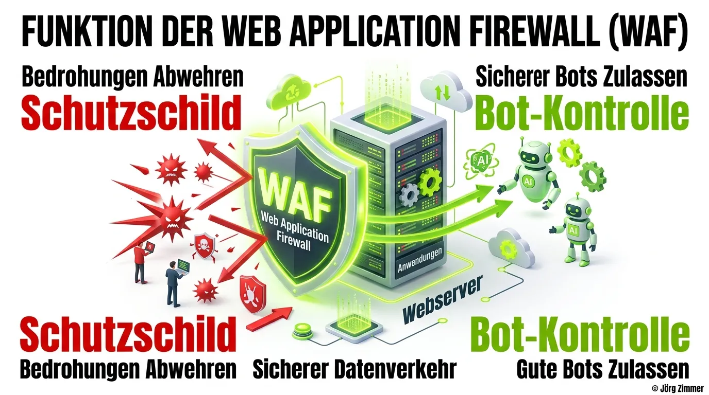

Sicherheit und Auffindbarkeit stehen im modernen Webdesign in einem permanenten Spannungsverhältnis. Auf der einen Seite sehen sich Website-Betreiber einer Flut automatisierter Angriffe, bösartiger Scraper und ressourcenhungriger Bots ausgesetzt. Auf der anderen Seite ist die organische Reichweite darauf angewiesen, dass Suchmaschinen-Crawler und generative KI-Agenten uneingeschränkten und schnellen Zugriff auf alle relevanten Inhalte erhalten. Im Zentrum dieses Konflikts steht die **Web Application Firewall (WAF)**.

Im Jahr 2026 entfällt mehr als die Hälfte des weltweiten Web-Traffics auf automatisierte Systeme. Eine unbedacht konfigurierte Firewall fungiert nicht selten als unsichtbarer SEO-Killer: Sie blockiert legitime Crawler, liefert JavaScript-Challenges an Headless-Browser aus und erzeugt HTTP-Fehlercodes, die im Monitoring traditioneller CMS-Systeme unbemerkt bleiben. Wer nachhaltiges [Technisches SEO](/glossar/technisches-seo/) und zukunftssichere [Generative Engine Optimization (GEO)](/glossar/geo/) betreiben will, muss seine Firewall-Architektur als strategischen Erfolgsfaktor begreifen.

<figure class="my-8 bg-neutral-50 border border-neutral-200 p-6 md:p-8 rounded-2xl shadow-sm">
  <div class="flex items-center gap-4 mb-4">
    
    <div>
      <h4 class="font-bold text-base md:text-lg text-dark mb-0">Jörg Zimmer</h4>
      <p class="text-xs md:text-sm text-neutral-600 mb-0">Senior SEO & AI Search Consultant</p>
    </div>
  </div>
  <blockquote class="text-base md:text-lg text-dark leading-relaxed italic border-l-4 border-lime-accent pl-4 my-4 font-normal">
    „Ich habe miterlebt, wie ein großer Shop über Nacht 70 Prozent seines organischen Traffics verlor, weil die IT eine neue WAF-Regel gegen Scraper scharfstellte – und den Googlebot aussperrte. Eine Firewall darf niemals isoliert von SEO konfiguriert werden. Wer Bots pauschal blockt, sperrt sich selbst aus den Suchergebnissen aus.“
  </blockquote>
  <figcaption class="mt-4 pt-3 border-t border-neutral-200/60 flex flex-wrap items-center justify-between gap-2 text-xs text-neutral-500">
    <span>Experten-Zitat • <cite class="not-italic font-semibold text-neutral-700">Jörg Zimmer</cite></span>
    <a href="https://www.linkedin.com/in/joerg-zimmer-seo-sea-freelancer-berlin-spandau/" target="_blank" rel="noopener noreferrer" class="font-bold text-lime-700 hover:underline inline-flex items-center gap-1">
      Jörg Zimmer auf LinkedIn folgen →
    </a>
  </figcaption>
</figure>

<div class="bg-lime-accent/15 rounded-2xl border border-lime-accent/30 p-6 shadow-sm not-prose my-8">
  <div class="flex items-center gap-2 mb-3">
    <span class="text-xs font-bold uppercase tracking-wider bg-lime-accent text-dark px-2.5 py-1 rounded-full">30-Sekunden Inhaber-Check</span>
    <span class="text-xs font-semibold text-neutral-600">Sicherheitsarchitektur & Bot-Management</span>
  </div>
  <h3 class="text-lg font-bold text-dark mb-2">Jörgs Praxistipp aus der SEO-Sprechstunde</h3>
  <p class="text-sm text-neutral-800 leading-relaxed mb-4">
    Prüfe in Cloudflare oder deiner WAF regelmäßig das Sicherheits-Event-Log auf HTTP-Status 403 bei bekannten User-Agents. Viele WAFs stufen Suchmaschinen- und KI-Crawler bei aktivierten Anti-DDoS-Regeln als verdächtig ein, weil sie von globalen Cloud-IPs mit hoher Frequenz anfragen.
  </p>
  <div class="p-3 bg-white/80 rounded-xl border border-lime-accent/20 text-xs text-neutral-700">
    <strong>Kontrollfrage an deine Webagentur oder IT-Abteilung:</strong> „Haben wir in unserer Web Application Firewall eine explizite Bypass-Regel für verifizierte Bots ('cf.client.bot' bzw. Verified Bot Allowlists) an oberster Stelle vor allen Challenge- und Blockier-Regeln platziert?“
  </div>
</div>



## 1. Funktionsweise und Aufgaben einer Web Application Firewall

Während traditionelle Netzwerk-Firewalls lediglich IP-Adressen und Ports auf Transportebene (Layer 4) überwachen, arbeitet eine WAF auf der Anwendungsebene (Layer 7 des OSI-Modells). Sie analysiert den vollständigen HTTP/HTTPS-Datenstrom in Echtzeit:

*   **Erkennung von Angriffsmustern:** Filterung von SQL-Injections, Cross-Site Scripting (XSS) und Zero-Day-Exploits in Webanwendungen.
*   **DDoS-Mitigation:** Drosselung von Spitzenlasten und automatische Abwehr verteilter Denial-of-Service-Angriffe.
*   **Bot-Management:** Klassifizierung eingehender Requests anhand von Fingerprinting, TLS-Parametern und Verhaltensmustern.

Viele moderne Webprojekte nutzen WAF-Lösungen führender Cloud-Provider. Diese Gateways sitzen direkt zwischen dem anfragenden Client und dem Hosting-Server. Erkennt die WAF eine Anomalie, bricht sie die Verbindung sofort mit einem HTTP 403 Forbidden ab oder schaltet eine Challenge-Seite (z. B. ein interaktives Captcha) vor. Was Cyberkriminelle abwehrt, wird für automatisierte [Crawler](/glossar/crawler/) jedoch zur unüberwindbaren Hürde.

## 2. Die Differenzierung der Bot-Klassen im KI-Zeitalter

Das größte Missverständnis bei der WAF-Konfiguration ist die binäre Einteilung in „Mensch“ und „Bot“. Im Jahr 2026 existieren drei völlig unterschiedliche Kategorien von automatisiertem Datenverkehr:

| Bot-Kategorie | Typische Vertreter | Zweck & Funktionsweise | Empfohlene WAF-Aktion |
| :--- | :--- | :--- | :--- |
| **Verifizierte Suchmaschinen** | Googlebot, Bingbot | Indexierung für klassische SERPs & Rich Results | **Allow / Bypass** (Höchste Priorität) |
| **Generative Live-Agenten** | OAI-SearchBot, PerplexityBot | Retrieval-Augmented Generation für direkte KI-Antworten | **Allow** (Sichert Zitationsanteile) |
| **Reine AI-Trainingsbots** | CCBot, Bytespider, GPTBot | Massenhafter Datenabzug für künftige Modellgenerationen | **Rate-Limit / Block** (Ressourcenschutz) |
| **Bösartige Scraper & Spammer** | Vulnerability Scanner, Form-Spam | Ausnutzen von Sicherheitslücken, Daten-Scraping | **Block** (Sofortige Sperre) |

Wird die [AI Crawlability](/glossar/ai-crawlability/) durch pauschale Blockaden beschnitten, schneidet sich ein Unternehmen von der rasant wachsenden Nutzerschaft generativer Antwortmaschinen ab. Suchmaschinenbetreiber wie Google und Microsoft nutzen zudem sogenannte „Mixed-Purpose-Crawler“, die sowohl für die Webindexierung als auch für KI-Modelltrainings eingesetzt werden. Wird hier ein pauschaler Schalter für „Block AI Training“ umgelegt, verweigert die WAF auch dem Googlebot den Zugriff – katastrophale Rankingverluste sind die direkte Konsequenz.

## 3. Best Practices für WAF-Regeln: Legitime Bots priorisieren

Eine saubere WAF-Architektur arbeitet nach dem Prinzip der gestaffelten Regelführung. Regeln zur Freigabe legitimer Suchsysteme müssen in der Hierarchie stets an oberster Stelle platziert werden, bevor restriktive Sicherheitsfilter greifen.

Das nachfolgende Regelbeispiel illustriert eine typische WAF-Expression (wie sie bei modernen Cloud-Providern zum Einsatz kommt), um verifizierte Bots von nachgelagerten Sicherheits-Challenges auszunehmen:

```text
# Regel 1: Verifizierte Suchmaschinen und GEO-Search-Bots immer erlauben
(cf.client.bot) or (http.user_agent contains "OAI-SearchBot") or (http.user_agent contains "PerplexityBot")
=> Action: Bypass / Allow

# Regel 2: Bekannte aggressive Scraping-Dienste drosseln
(http.user_agent contains "Bytespider") and not (cf.client.bot)
=> Action: Block

# Regel 3: Sicherheits-Challenge für verdächtige Anfragen aktivieren
(cf.threat_score gt 40) and not (cf.client.bot)
=> Action: Managed Challenge
```

Durch diese Konfiguration wird verhindert, dass legitime Crawler an Captchas scheitern. Da Suchmaschinen-Bots keine interaktiven JavaScript-Prüfungen lösen können, führen vorgeschaltete Challenges unweigerlich zum Abbruch des Crawling-Prozesses.

## 4. Typische Praxisfehler bei der Firewall-Konfiguration

In technischen Audits stoßen wir regelmäßig auf Konfigurationsfehler, die gravierende SEO-Schäden verursachen:

1. **Pauschales Geo-Blocking von Hosting-Regionen:** Viele Administratoren sperren Zugriffe aus fremden Ländern. Da Google, Microsoft und OpenAI Rechenzentren weltweit betreiben, werden verifizierte Crawler versehentlich ausgesperrt.
2. **Die Annahme, dass die robots.txt genügt:** Eine [Robots.txt](/glossar/robots-txt/) ist eine freiwillige Richtlinie für Suchmaschinen, stellt jedoch keine Sicherheitsbarriere dar. Böswillige Bots ignorieren sie. Umgekehrt schützt eine Robots.txt nicht davor, dass eine übervorsichtige WAF den Googlebot blockiert.
3. **Mangelnde Überwachung in den Webmaster-Tools:** Wenn die WAF Crawler sporadisch blockt, melden Google und Bing verzögerte Crawling-Fehler. Regelmäßige Checks über die [Google Search Console](/glossar/google-search-console/) sind unverzichtbar.

### Notfallprotokoll: Das Break-Glass-Verfahren bei Bot-Aussperrungen
Wird im Monitoring ein rapider Einbruch von Impressionen oder ein sprunghafter Anstieg von 403-Fehlern in der Google Search Console festgestellt, muss sofort ein standardisiertes Notfallprotokoll greifen:

1. **WAF-Regeln temporär entschärfen:** Verdächtige Bot-Challenge-Regeln werden sofort in den Monitoring-Modus (Log only) versetzt, anstatt Anfragen hart zu blockieren.
2. **Reverse-DNS-Verifikation durchführen:** Echte Suchmaschinen-Crawler weisen verifizierbare Hostnamen auf (z. B. `crawl-***.googlebot.com`). Über automatisierte rDNS-Prüfungen lässt sich sicherstellen, dass nur gefälschte User-Agents geblockt werden.
3. **URL-Prüfung und Re-Indexing anstoßen:** In der Search Console wird der Live-Test für zentrale Einstiegsseiten ausgeführt. Bestätigt das Tool den erfolgreichen Zugriff, wird das Crawling wie im Leitfaden [Crawling vs. Indexing](/glossar/crawling-vs-indexing/) beschrieben reaktiviert.

## 5. Monitoring und kontinuierliche Optimierung

Um Ausfälle zu verhindern, sollten WAF-Logfiles wöchentlich analysiert werden. Filtere nach Statuscodes wie `403 Forbidden` und prüfe, ob IPs verifizierter Suchsysteme betroffen sind. Kombiniere dies mit einer automatisierten Crawling-Überwachung über [SE Ranking](https://seranking.com/de/?ga=4169588&source=link) und überwache deine generative Sichtbarkeit mit [Rankscale](https://rankscale.ai/?via=offer), um Blockaden von Antwortmaschinen sofort zu erkennen. Zudem sichert eine performante WAF-Konfiguration optimale [PageSpeed](/glossar/pagespeed/)-Werte, da Serverressourcen für echte Nutzer und wertvolle Bots geschont werden.

<div class="my-8 bg-dark text-white p-6 rounded-2xl border-l-4 border-lime-accent shadow-md">
  <div class="flex flex-wrap items-center justify-between gap-2 mb-3">
    <div class="flex items-center gap-3">
      <span class="text-lime-accent text-2xl">🤖</span>
      <p class="font-bold text-lg text-lime-accent mb-0">Arbeitsanweisung für deinen KI-Agenten (Cursor / Claude / Antigravity)</p>
    </div>
    <span class="text-xs bg-lime-accent/20 text-lime-accent px-2.5 py-1 rounded-full font-mono font-bold">Copy & Paste Task</span>
  </div>
  <p class="text-gray-300 text-sm mb-4 leading-relaxed">
    Kopiere diesen Prompt direkt in deinen KI-Coding-Assistenten oder DevOps-Agenten, um deine WAF-Regeln auditiert und suchmaschinenfreundlich zu konfigurieren:
  </p>
  <div class="bg-black/60 p-4 rounded-xl border border-white/10 text-xs font-mono text-gray-200 overflow-x-auto space-y-2">
    <p class="text-lime-accent font-bold mb-1"># Prompt: WAF Bot-Management & Verified-Crawler-Bypass Audit</p>
    <p><strong>Rolle:</strong> Du bist ein erfahrener Cloud-Security-Ingenieur und Technical SEO Consultant.</p>
    <p><strong>Aufgabe:</strong> Analysiere die Firewall- und Bot-Management-Konfiguration unseres Webprojekts (z. B. Cloudflare WAF, AWS WAF oder Fastly) und implementiere ein Regelwerk, das Cyberangriffe abwehrt, aber Suchmaschinen (Googlebot, Bingbot) sowie KI-Suchagenten (OAI-SearchBot, PerplexityBot) uneingeschränkten Durchgang gewährt.</p>
    <p><strong>Schritte &amp; Validierung:</strong></p>
    <p>1. Erstelle eine Prioritätsregel (Order 1), die bei 'cf.client.bot' oder verifizierter Reverse-DNS-Auflösung von Google/Bing alle Sicherheits-Challenges und Rate-Limits umgeht (Bypass).</p>
    <p>2. Konfiguriere separate Ausnahmen für Live-Retrieval-Agenten (User-Agents OAI-SearchBot und PerplexityBot), sodass keine JavaScript-Challenges oder Captchas vorgeschaltet werden.</p>
    <p>3. Setze Rate-Limits und Blockaden gezielt für unautorisierte KI-Scraper und bösartige Scraping-Tools ein, ohne pauschales Geo-Blocking für amerikanische IP-Ranges zu aktivieren.</p>
    <p>4. Validierung: Führe einen Curl-Test mit gefälschtem User-Agent von einer externen IP durch (sollte geblockt werden) und teste den Googlebot-Zugriff über die URL-Prüfung der Google Search Console (muss HTTP 200 liefern).</p>
  </div>
</div>

<div class="my-10 bg-dark text-white p-8 rounded-3xl border border-white/10 text-center shadow-md not-prose">
  <span class="text-xs uppercase tracking-widest text-lime-accent font-mono font-bold mb-3 block">
    Aus Jörgs LinkedIn-Feed
  </span>
  <blockquote class="text-base md:text-lg text-gray-200 italic max-w-2xl mx-auto mb-4 border-none font-normal">
    „Wenn wir von Anfang an an alle Aspekte denken, können wir sicherstellen, dass unsere Websites nicht nur schön aussehen, sondern auch technisch optimal aufgestellt sind, um im Wettbewerb um die Spitzenpositionen in den Suchergebnissen erfolgreich zu sein.“
  </blockquote>
  <p class="text-gray-300 text-sm max-w-xl mx-auto mb-6">
    Diskutiere mit Jörg Zimmer und der SEO-Community auf LinkedIn über diesen Beitrag.
  </p>
  <a href="https://www.linkedin.com/feed/update/urn:li:activity:7064573888449392640" target="_blank" rel="noopener noreferrer" class="btn-primary">
    <svg class="w-4 h-4 fill-current" viewBox="0 0 24 24"><path d="M20.447 20.452h-3.554v-5.569c0-1.328-.027-3.037-1.852-3.037-1.853 0-2.136 1.445-2.136 2.939v5.667H9.351V9h3.414v1.561h.046c.477-.9 1.637-1.85 3.37-1.85 3.601 0 4.267 2.37 4.267 5.455v6.286zM5.337 7.433c-1.144 0-2.063-.926-2.063-2.065 0-1.138.92-2.063 2.063-2.063 1.14 0 2.064.925 2.064 2.063 0 1.139-.925 2.065-2.064 2.065zm1.782 13.019H3.555V9h3.564v11.452zM22.225 0H1.771C.792 0 0 .774 0 1.729v20.542C0 23.227.792 24 1.771 24h20.451C23.2 24 24 23.227 24 22.271V1.729C24 .774 23.2 0 22.222 0h.003z"/></svg>
    <span>Beitrag auf LinkedIn öffnen</span>
    <span aria-hidden="true">→</span>
  </a>
</div>

### Verwandte Glossar-Einträge
* [Crawler: Funktionsweise und Steuerung](/glossar/crawler/)
* [AI Crawlability für generative Suchmaschinen](/glossar/ai-crawlability/)
* [Generative Engine Optimization im Detail](/glossar/geo/)
* [Technisches SEO als Qualitätsbasis](/glossar/technisches-seo/)
* [Robots.txt: Steuerungsdateien verstehen](/glossar/robots-txt/)
* [Google Search Console: Fehler erkennen](/glossar/google-search-console/)
* [PageSpeed: Ladezeiten nachhaltig optimieren](/glossar/pagespeed/)

