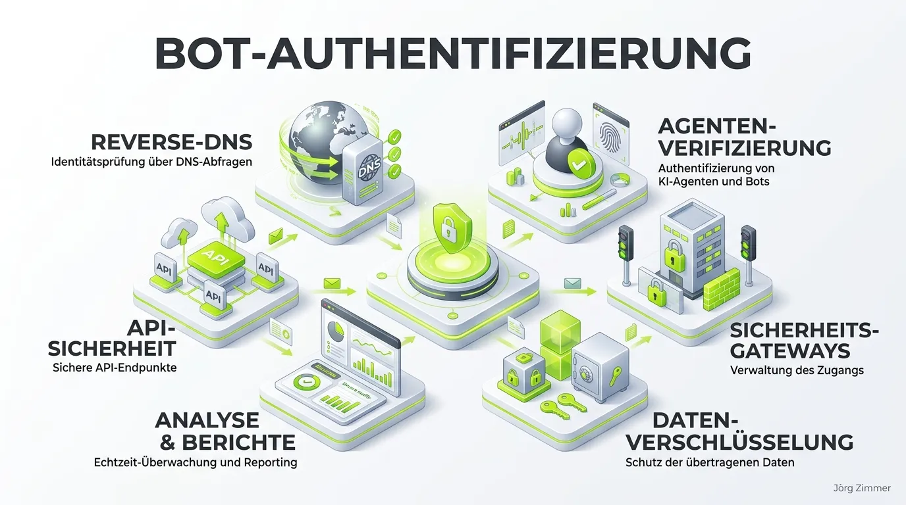

Moin! 🌻

Wer sich heute noch darauf verlässt, dass ein Bot im User-Agent artig ansagt, wer er ist, glaubt auch noch, dass die Deutsche Bahn pünktlich kommt. Wir schreiben das Jahr 2026, der Traffic besteht zu großen Teilen aus autonomen KI-Agenten, und die alten Spielregeln funktionieren einfach nicht mehr.

Es ist wie beim Pfusch am Bau: Wenn das Fundament deiner Bot-Erkennung nur aus IP-Listen und leicht fälschbaren Text-Headern besteht, reißt der nächste LLM-Scraper dein ganzes Traffic-Haus ein. Zeit für Tacheles zum Thema **Web Bot Auth** und **Agenten-Verifizierung**.

## Vom User-Agent zur kryptografischen Identität

Früher reichte es, in der Logdatei zu schauen, ob da "Googlebot" stand. Heute kann jeder dahergelaufene Python-Scraper diesen String mitsenden. Die Lösung, an der Schwergewichte wie Google, Cloudflare und OpenAI arbeiten, ist der **Web Bot Auth**-Standard.

Das Prinzip? Kryptografie statt Vertrauen. Anstatt nur einen Namen in den Raum zu rufen, signieren legitime Bots ihre HTTP-Requests nach dem **RFC 9421 (HTTP Message Signatures)**-Standard. Das ist ihr digitaler Reisepass, der fälschungssicher belegt, wer da gerade an die Tür klopft.

💬 **Jörgs SEO-Klartext (LinkedIn Insights)**
> "Rankings sind Vanity-Metriken. SEO muss Umsatz treiben. Und wenn deine Server-Ressourcen von getarnten Schrott-Scrapern aufgefressen werden, weil du sie nicht von legitimen Agenten unterscheiden kannst, verlierst du nicht nur Crawl-Budget, sondern bares Geld."

## Das Mindestmaß: Reverse DNS (rDNS) und Forward Confirmation

Nicht jedes System ist schon voll auf kryptografische Signaturen umgestellt. Das Minimum – das absolute Minimum! – um bekannte Crawler und [Agent Readiness](/glossar/agent-readiness/) abzusichern, ist der klassische, aber penibel durchgeführte DNS-Check:

1. **ASN Pre-Filtering:** Wirf alles weg, was nicht aus dem korrekten autonomen System (z. B. Google, Microsoft, AWS) kommt.
2. **Reverse DNS (PTR-Lookup):** Frag den DNS-Server, welcher Hostname hinter der aufschlagenden IP steckt.
3. **Forward Confirmation:** Das ist der Schritt, den die Bauchladen-Agenturen vergessen. Lös den gefundenen Hostnamen wieder in eine IP auf. Nur wenn die IPs matchen, hast du Gewissheit.

Wer das auf seiner Infrastruktur nicht sauber implementiert hat, hat schlichtweg die Kontrolle über seine [DNS-AID](/glossar/dns-aid/) verloren.

## Know Your Agent (KYA): Laufzeit-Verifizierung ist das neue Normal

Die Zeiten, in denen eine simple [Auth-MD](/glossar/auth-md/) als Türsteher gereicht hat, sind vorbei. Es reicht nicht mehr zu wissen, *dass* da eine Maschine anklopft. Wir müssen wissen, *welche* Rechte sie hat und was sie treibt.

### Non-Human Identity (NHI) Management

Moderne Setups weisen jedem KI-Agenten spezifische Identitäts-Credentials und strikte Scopes zu. Ein Agent, der Preise für das A2A-Commerce sammeln soll, bekommt keinen Zugriff auf den Checkout-Prozess. Punkt. 

Das [A2A-Protocol](/glossar/a2a-protocol/) standardisiert, wie Agenten miteinander sprechen. Aber ohne ein knallhartes Identity-Framework verkommt das zur Tracking-Hölle, in der du nicht mehr weißt, wer an welchen Daten saugt.

### Praxis-Check: Die Teleschmiede als Referenz

Wir preisen das hier nicht nur an, wir bauen das auch. Auf `teleschmie.de` läuft das Traffic-Filtering nach genau diesen Maßgaben. Wenn ein Bot versucht, unsere Inhalte zu indexieren, prüfen wir zuerst via Reverse-DNS seine Legitimität. Scraper, die sich als Suchmaschinen ausgeben, fliegen hochkant raus. Gleichzeitig experimentieren wir in unseren Staging-Umgebungen bereits mit kryptografischen Signaturen, um für die breite Einführung von Web Bot Auth gerüstet zu sein.

Unterm Strich: IP-Allowlisten waren gestern. Wer 2026 keinen sauberen Prozess zur Agenten-Verifizierung hat, überlässt seine Server-Infrastruktur dem Zufall – und seinen Content den Datendieben.

Habe fertig.

ALOHA! 🌻✌️

## Lese-Tipps & Verwandte Themen
- [Agent Readiness: So machst du deine Seite fit für KIs](/glossar/agent-readiness/)
- [A2A-Protocol: Wenn Maschinen mit Maschinen verhandeln](/glossar/a2a-protocol/)
- [Auth-MD: Authentifizierung im Markdown-Zeitalter](/glossar/auth-md/)
