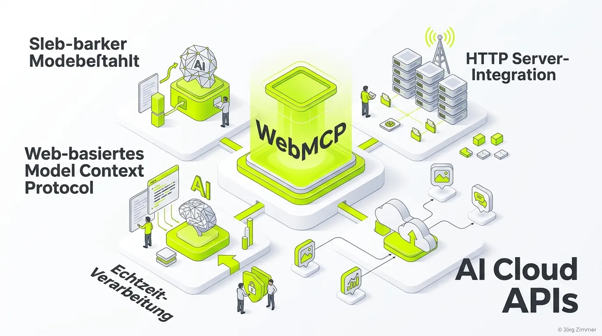

Moin! 🌻

Hier ist der freundliche Klartext zur neuesten Entwicklung im KI-Sektor: **WebMCP**. Seit wir 2024 die ersten Schritte des Model Context Protocols gesehen haben, war klar, dass das Frontend nicht unangetastet bleiben würde. Jetzt, im Juli 2026, reden wir über das Web Model Context Protocol – und warum es die Art und Weise verändert, wie unsere Seiten mit KI interagieren.

## Schluss mit Pfusch am Bau: Screen Scraping war gestern

Früher (und damit meine ich noch vor gut einem Jahr) mussten KI-Agenten mühsam das DOM auslesen oder visuelle Screenshots interpretieren, um eine Website zu verstehen. Das war im Grunde Pfusch am Bau. Ein kleines CSS-Update, und der Agent wusste nicht mehr, wo der Button war. Wie die Deutsche Bahn – du konntest nie sicher sein, dass der Zug (oder die Aktion) auch ankommt. 

Mit **WebMCP** ändert sich das. Es handelt sich um einen aufkommenden Webstandard (aktuell im W3C inkubiert), der es Webseiten erlaubt, strukturierte JavaScript-Funktionen sicher direkt an den Client-Agenten zu übergeben. Keine Ratespiele mehr. Wenn du eine Agent-fähige Website aufbauen willst, gehört dies in dein Handwerkszeug, genau wie eine saubere [Agent-Readiness](/glossar/agent-readiness/).

## Die Teleschmiede Best-Practice: WebMCP in Aktion

Wir predigen das nicht nur, wir setzen es auch ein. Auf teleschmie.de experimentieren wir bereits mit Polyfills, um die Interaktion zwischen Suchmaschinen-Agenten und unserem Frontend zu optimieren. Was bringt dir ein geiles Backend-Protokoll wie das [A2A-Protocol](/glossar/a2a-protocol/), wenn das Frontend die Daten nicht sauber an den User-Agent zurückspielen kann? 

WebMCP ist die Brücke. Es funktioniert als Progressive Enhancement – Browser, die es noch nicht nativ unterstützen, crashen nicht, sie ignorieren es einfach. Genau das macht es so elegant.

## Klartext: Umsatztreiber statt Vanity-Metric

Lass uns Tacheles reden: Wer CEO-Sprache spricht, bekommt auch Budgets. Die Implementierung von WebMCP oder auch begleitenden Sicherheitsmechanismen wie [Auth-MD](/glossar/auth-md/) ist kein nettes Gimmick für Freitagnachmittag. Es bedeutet, dass autonome Systeme ohne Abbruch Fehler beheben oder Käufe in deinem Shop tätigen können.

Unterm Strich ist WebMCP der nächste logische Schritt. Es macht das Web für KI maschinenlesbar *und* maschinenschreibbar, und zwar direkt über den Browser. Wer heute noch auf Döner-SEO setzt und hofft, dass Agenten seine Button-Klassen erraten, wird langfristig abgehängt. Habe fertig.

ALOHA! 🌻✌️

### Verwandte Artikel
- [Agent-Readiness für dein Business](/glossar/agent-readiness/)
- [Die Rolle von Auth-MD im modernen Web](/glossar/auth-md/)
- [A2A-Protocol verständlich erklärt](/glossar/a2a-protocol/)
