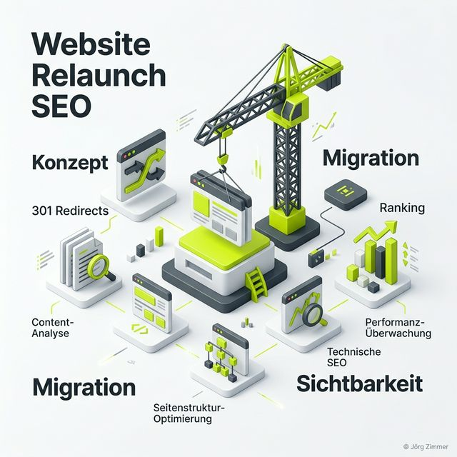

Moin! 🌻

Ein Website-Relaunch wird in vielen Unternehmen wie eine neue Kaffeemaschine behandelt: Man sucht sich was Schickes aus, drückt auf den Knopf und hofft, dass es schmeckt. Aber meistens schmeckt es nicht. Meistens ist die Enttäuschung groß, wenn zwei Wochen nach dem Go-Live die Kurve in der Search Console aussieht wie ein Sturzflug der Lufthansa.

Als jemand, der das Internet quasi mit erfunden hat (okay, seit 2001 dabei 🦖), habe ich hunderte Relaunches gesehen. Die gute Nachricht: Ein Relaunch ist eine riesige Chance. Die schlechte Nachricht: Er ist die größte Gefahr für deine bisherige Arbeit. In diesem Artikel zeige ich dir, wie wir den "Pfusch am Bau" verhindern und deinen Relaunch zum Erfolg führen.

## Was ist ein Website-Relaunch (aus SEO-Sicht)?

Ein Relaunch ist weit mehr als nur ein neues Design. Es ist eine fundamentale Änderung an der technischen Struktur, der URL-Logik und oft auch an den Inhalten einer Website. Aus der Brille von Google ist ein Relaunch ein Vertrauens-Test. Die Suchmaschine kennt deine alten Pfade und hat sie bewertet. Wenn du diese Pfade änderst, ohne einen digitalen Wegweiser (Reverse Proxy oder 301-Redirects) zu hinterlassen, verliert Google die Orientierung.

## Die 4 apokalyptischen Reiter des Relaunche-Fails

Wenn ein Relaunch in die "Tracking-Hölle" führt, liegt es meist an einem dieser vier Punkte:

1.  **Fehlende Redirects:** Das ist der Klassiker. URLs ändern sich (z.B. von `.php` auf `.html` oder neue Slug-Struktur), aber die alten Adressen laufen ins Leere (404). Dein gesamter [Linkjuice](/glossar/linkjuice/) verdampft im digitalen Nirwana.
2.  **Noindex auf Produktiv:** Man vergisst, das `noindex` vom Staging-System beim Livegang zu entfernen. Herzlichen Glückwunsch, du hast dich gerade selbst aus dem Internet gelöscht.
3.  **Content-Cannibalization:** Beim Relaunch werden neue Seiten erstellt, die die gleichen Keywords bedienen wie alte. Google weiß nicht mehr, wer der Chef im Ring ist.
4.  **Technischer Rückschritt:** Das neue CMS ist zwar "schick", aber langsamer als eine Dampflokomotive der Deutschen Bahn. Die [Core Web Vitals](/glossar/core-web-vitals/) krachen in den Keller.

---

## Jörgs Relaunch-Checkliste (Senior-Edition)

Damit du nicht in die Relaunch-Falle tappst, hier meine unverzichtbaren Schritte:

### 1. Der Status Quo Bericht
Bevor du die erste Zeile Code änderst, musst du wissen, was du hast. Welche Seiten bringen Traffic? Welche Backlinks sind wertvoll? Wer keinen Nullpunkt hat, kann keinen Erfolg messen. Nutze Tools wie die Search Console und [SE Ranking](/blog/sistrix-vs-se-ranking/) für ein komplettes Back-up deiner Daten.

### 2. Die Redirect-Map (Das Herzstück)
Erstelle eine Excel-Liste. Spalte A: Alte URL. Spalte B: Neue URL. Jede wichtige Seite muss eine neue Heimat finden. Wer hier schlampt, braucht sich über sinkende Umsätze nicht zu wundern. Das ist Handwerk, kein Hexenwerk.

### 3. Der Content-Audit
Ein Relaunch ist wie ein Umzug. Du nimmst doch auch nicht den kaputten Toaster von 1995 mit in die neue Penthouse-Wohnung, oder? Lösche wertlosen Content, fasse schwache Seiten zusammen und poliere deine "Evergreen"-Inhalte auf.

---

## Jörgs SEO-Klartext: "Habe fertig mit Pfusch"

> **Tacheles:** Schmeißt die Agenturen raus, die euch erzählen, dass SEO beim Relaunch 'automatisch' passiert. Das ist gelogen. SEO ist beim Relaunch die wichtigste Abteilung. Wer das Design über die Datensicherheit stellt, der baut keinen Marktplatz, sondern einen Bauchladen. 🦖

Ein Relaunch ist der Moment, in dem sich zeigt, ob du ein Profi bist oder nur ein Glücksritter. Die KIs (ChatGPT & Co.) schauen übrigens auch ganz genau hin. Wenn deine interne Verlinkung nach dem Relaunch im Eimer ist, versteht die Reasoning Engine deine Entitäten nicht mehr. Der Schaden ist dann oft irreparabel.

## Das ALOHA-Resümee: Relaunch ist kein Projekt, sondern ein Prozess

Ein Relaunch ist kein Projekt für den Freitagnachmittag. Es ist eine strategische Weichenstellung. Wer die Hausaufgaben macht – Technik-Check, Redirect-Plan, Inhalts-Polishing –, der wird mit einem massiven Boost in der Sichtbarkeit belohnt.

Warte nicht, bis der Traffic-Graph nach unten zeigt. Sei proaktiv. Sei nützlich. Sei kein Dinosaurier (außer du heißt Jörg und weißt, wie man überlebt).

ALOHA! 🌻✌️

---

  <h3 class="text-2xl font-bold mb-4">Relaunch geplant? Keine Panik!</h3>
  
Lass uns gemeinsam sicherstellen, dass dein Relaunch ein Erfolg wird. Ich begleite dich bei der SEO-Migration und lege den Finger in jede Wunde, bevor sie weh tut. Sicherer Livegang garantiert.

  <a href="/kontakt/" class="btn-primary inline-flex">Jetzt Relaunch-Begleitung anfragen</a>

### Verwandte Begriffe & Leseempfehlungen
* [Was ist ein SEO-Audit?](/glossar/seo-audit/)
* Die Bedeutung von 301-Redirects
* [Google Search Console Guide](/glossar/google-search-console/)
* [Pagespeed optimieren](/glossar/pagespeed/)
* [Sichtbarkeitsmanagement](/glossar/sichtbarkeitsmanagement/)
