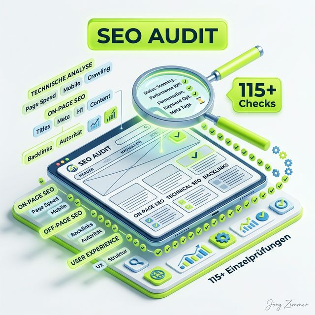

Wenn du im heutigen SEO-Alltag ernsthaft erfolgreich sein willst, brauchst du ein massives, absolut fehlerfreies technisches Fundament. Du kannst den besten Content der Welt schreiben und die genialsten Backlinks aufbauen – wenn deine Seite unter der Haube technische Fehler aufweist, die das Crawling oder die Indexierung blockieren, verpuffen deine gesamten SEO-Bemühungen. Genau hier kommt ein tiefgreifendes **Website SEO Audit** ins Spiel. 

<figure class="my-8 bg-neutral-50 border border-neutral-200 p-6 md:p-8 rounded-2xl shadow-sm">
  

    
    

      <h4 class="font-bold text-base md:text-lg text-dark mb-0">Jörg Zimmer</h4>
      
Senior SEO & AI Search Consultant

    

  

  <blockquote class="text-base md:text-lg text-dark leading-relaxed italic border-l-4 border-lime-accent pl-4 my-4 font-normal">
    „Ein Website-Audit ist kein PDF-Friedhof für die Schublade. Es ist der digitale TÜV für dein gesamtes Geschäftsmodell. Wer technische Fehler ignoriert, verbrennt jeden Tag bares Geld und wird von Suchmaschinen und KI-Agenten gnadenlos abgestraft.“
  </blockquote>
  <figcaption class="mt-4 pt-3 border-t border-neutral-200/60 flex flex-wrap items-center justify-between gap-2 text-xs text-neutral-500">
    Experten-Zitat • <cite class="not-italic font-semibold text-neutral-700">Jörg Zimmer</cite>
    <a href="https://www.linkedin.com/in/joerg-zimmer-seo-sea-freelancer-berlin-spandau/" target="_blank" rel="noopener noreferrer" class="font-bold text-lime-700 hover:underline inline-flex items-center gap-1">
      Jörg Zimmer auf LinkedIn folgen →
    </a>
  </figcaption>
</figure>

  

    30-Sekunden Inhaber-Check
    Audit-Hygiene & Crawl-Tiefe
  

  <h3 class="text-lg font-bold text-dark mb-2">Jörgs Praxistipp aus der SEO-Sprechstunde</h3>
  

    Verlasse dich nie auf oberflächliche Health Scores von 95 %+, wenn deine wichtigsten Konversionsseiten nicht gecrawlt werden können. Prüfe im ersten Schritt die Crawl-Tiefe und die Disallow-Direktiven in der robots.txt: Liegen deine umsatzstärksten Leistungsseiten in Ebene 4 oder tiefer, verhungern sie beim Crawling trotz scheinbar grünem Gesamt-Audit.
  

  

    <strong>Kontrollfrage an deine Webagentur oder IT-Abteilung:</strong> „Werden bei unserem monatlichen SEO-Crawl verwaiste Seiten (Orphan Pages) und JavaScript-generierte DOM-Links mitgerendert oder prüft ihr nur statisches HTML?“
  

In meiner täglichen Arbeit als [SEO-Freelancer in Berlin](/seo-freelancer-berlin/) verlasse ich mich für diese kritische Aufgabe auf eine ganz spezifische Lösung: Das **Website Audit von SE Ranking**. In diesem ausführlichen Guide zeige ich dir exakt, warum ich dieses Tool nutze, wie du damit die verborgenen technischen Baustellen deiner Domain aufdeckst und wie du die Ergebnisse in messbaren Traffic verwandelst. Egal ob du eine kleine Nischenseite oder einen gigantischen E-Commerce-Shop betreust: Die Kontrolle über die Technik ist der allererste Schritt zu mehr Sichtbarkeit. Falls du noch nach dem richtigen Setup suchst, lies gerne meinen [SE Ranking Test 2026](/blog/se-ranking-test-2026/), wo ich das Tool-Ökosystem genauer beleuchte.

## Warum jedes SEO-Projekt mit einem Website Audit beginnen MUSS

Stell dir vor, du baust ein millionenschweres Hochhaus auf einem schlammigen Sumpf. Egal wie wunderschön die gläserne Fassade glänzt und wie teuer die Inneneinrichtung ist – das Haus wird brutal absacken, wenn das Fundament nicht hält. Im Internet ist das [Technisches SEO](/glossar/technisches-seo/) dein Fundament. 

Ein Website Audit prüft heute nicht mehr nur, ob der Googlebot deine Seiten irgendwie finden kann. Es prüft gnadenlos, ob Suchmaschinen und moderne KI-Systeme deine Daten so sauber und strukturiert erhalten, dass sie diese als zitierfähigen Fakt ranken können. Wenn eine URL aufgrund eines falschen Canonical-Tags ignoriert wird, nützt dir das beste Webdesign der Welt rein gar nichts.

Das SE Ranking Website Audit nimmt dir genau diese Sorge ab. Es fungiert als dein digitaler TÜV-Prüfer, der sich durch jede einzelne Zeile Code, jeden internen Link und jedes Bild gräbt, um sicherzustellen, dass deine Website zu 100 % konform mit den aktuellen Richtlinien von Google und Bing ist.

## Was ist das SE Ranking Website Audit Tool?

Das SE Ranking Website Audit ist ein leistungsstarker, cloudbasierter Crawler, der jede Seite deiner Domain nach über 115 verschiedenen On-Page- und technischen SEO-Parametern scannt. Anstatt hunderte von Unterseiten manuell überprüfen zu müssen, übernimmt der Crawler diese mühsame Aufgabe in Minutenschnelle und liefert dir ein interaktives Dashboard mit allen Problemen. **Das Tool ist extrem schnell: Es kann bis zu 1.000 Seiten in unter 2 Minuten crawlen.**

Sobald du ein neues Projekt in SE Ranking anlegst, kannst du das Audit automatisch starten lassen. Der Crawler simuliert das Verhalten eines echten Suchmaschinen-Bots (wie dem Googlebot). Er folgt den Links auf deiner Seite, liest den HTML-Code, parst das JavaScript und sammelt dabei riesige Mengen an Daten. Am Ende des Prozesses destilliert SE Ranking diese Daten in klare, umsetzbare Handlungsempfehlungen.

### Dein Audit, deine Regeln: Benutzerdefinierte Parser-Einstellungen
Eines der größten Highlights des Tools ist die extreme Flexibilität in den **Parser-Einstellungen**:
- **JavaScript Rendering:** Wenn du eine moderne JS-basierte Website betreibst (z. B. React, Angular, Vue), kannst du das JS-Rendering im Crawler aktivieren, um sicherzustellen, dass versteckte Elemente und dynamisch geladener Content sauber erkannt werden.
- **Benutzerdefinierte Regeln erstellen:** Du kannst gezielte Regeln festlegen, um spezifische SEO-Insights für deine Strategie zu filtern.
- **Einzelne Seiten prüfen:** Du musst nicht immer die ganze Domain scannen. Du kannst das Audit auf einzelne URLs beschränken, um isolierte Landingpages einem schnellen Check zu unterziehen.
- **Audit-Parameter filtern:** Dir sind aktuell nur Core Web Vitals wichtig? Dann wähle die spezifischen Audit-Kategorien aus, die für dich im Moment die größte Relevanz haben.

## Die 6 Hauptkategorien des SE Ranking Audits im Detail

Damit du verstehst, wie tiefgreifend das Tool arbeitet, werfen wir einen detaillierten Blick auf die wichtigsten Untersuchungsbereiche. Ein professioneller [Crawler](/glossar/crawler/) wie der von SE Ranking ist darauf trainiert, genau hinzusehen.

### 1. Indexierbarkeit und Crawlability
Das ist der absolute Kernbereich. Wenn Google deine Seite nicht crawlen kann, existierst du nicht.
- **Robots.txt & Meta-Robots:** Das Audit prüft, ob die robots.txt-Datei vorhanden ist und ob versehentlich das X-Robots-Tag oder Robots-Meta-Tags deine wichtigsten Verzeichnisse blockieren.
- **Sitemap.xml:** Ist eine gültige [Sitemap](/glossar/sitemap/) hinterlegt? Enthält sie URLs, die auf "noindex" stehen? 
- **Noindex & Canonical-Tags:** Sehr oft werden bei Relaunches "noindex"-Tags auf der Live-Umgebung vergessen. Das Tool flaggt diese Probleme sofort als kritische Errors.

### 2. HTTP-Statuscodes und Server-Fehler
- **4xx Fehler (z. B. 404 Not Found):** Tote Links frustrieren Nutzer und verbrennen das Crawl-Budget.
- **3xx Weiterleitungen:** Hast du endlose Weiterleitungsketten gebaut? Solche Ketten verwässern den Linkjuice extrem.
- **5xx Server-Fehler:** Wenn dein Server überlastet ist, bekommt Google einen 500er Fehler.

### 3. Core Web Vitals und Page Speed
Die Integration der [Core Web Vitals](/glossar/core-web-vitals/) in das SE Ranking Audit ist essenziell:
- **LCP (Largest Contentful Paint):** Wann sieht der menschliche Nutzer den Hauptinhalt?
- **INP (Interaction to Next Paint):** Reagiert die Seite auf Klicks sofort?
- **CLS (Cumulative Layout Shift):** Misst die visuelle Stabilität.

### 4. Meta-Tags und Content-Hygiene
Selbst wenn die Technik steht, muss der Onpage-Inhalt sauber ausgezeichnet sein. **Das Tool prüft hier alle denkbaren HTML-Tags:** Title, Meta Description, H1 bis H6, Hreflang, Viewport und X (Twitter) Cards.
- **Title Tags & Descriptions:** Sind sie zu lang, zu kurz oder Duplikate?
- **H-Überschriften (H1 bis H6):** Hast du mehrere H1-Tags auf einer URL?
- **Text-to-HTML-Ratio:** Ist zu viel Code und zu wenig echter Text auf der Seite?

### 5. Interne und Externe Verlinkung
Die Verlinkung ist die Architektur deiner Seite. Ohne saubere Links fließt kein Pagerank.
- **Orphan Pages:** SE Ranking analysiert verwaiste Seiten ohne eingehende interne Links.
- **Dofollow / Nofollow:** Wie ist das Verhältnis deiner ausgehenden Links?

### 6. Bilder, Medien und Lokalisierung (Hreflang)
- **Fehlende ALT-Attribute:** Bilder ohne Alt-Text sind für Suchmaschinen unsichtbar.
- **Hreflang-Konflikte:** Für internationale Seiten ist Hreflang der Endgegner. Das Audit deckt hier jeden kleinsten Fehler sicher auf.

## Das Herzstück: Der Website Health Score

Wenn du das Dashboard des SE Ranking Website Audits öffnest, springt dir zuerst eine große Zahl ins Auge: Der **Health Score**. Dieser Wert von 0 bis 100 ist eine geniale Metrik, um den Gesamtzustand deiner Domain auf einen Blick zu erfassen.

- **90 bis 100:** Exzellent. Deine Seite ist technisch hervorragend aufgestellt.
- **70 bis 89:** Gut, aber mit Luft nach oben. 
- **Unter 70:** Kritisch. Hier brennt es an mehreren Ecken und Enden.

Der Health Score ist besonders in der Kommunikation wertvoll. SE Ranking berechnet diesen Score dynamisch basierend auf der Schwere und Anzahl der gefundenen Fehler.

## Fehler-Priorisierung: So gehst du strukturiert vor (Triage)

SE Ranking glänzt durch sein Triage-System. Es unterteilt alle Funde in drei übersichtliche Kategorien:

### 🔴 Errors (Kritische Fehler)
Diese Fehler haben massiven, direkten Einfluss auf deine Rankings und müssen sofort behoben werden (z. B. 5xx Serverfehler, komplett blockierte CSS/JS-Dateien, Endlos-Weiterleitungen).

### 🟡 Warnings (Warnungen)
Diese Probleme hindern deine Seite daran, ihr volles Potenzial auszuschöpfen (z. B. fehlende Alt-Tags, zu lange Meta-Descriptions).

### 🔵 Notices (Hinweise)
Hinweise sind Best-Practice-Empfehlungen (z. B. Thin Content, sehr lange URLs).

## Automatisierung, Mitbewerber-Audits und Agentur-Features

SE Ranking bietet eine vollständige Automatisierungs-Suite für den modernen SEO-Alltag:

**Automatisierte Scheduled Crawls & Berichte:**
Richte automatische Überprüfungen (wöchentlich oder monatlich in GMT) ein und lass dir die fertigen Audit-Berichte direkt in dein Postfach schicken. So erkennst du sofort, ob ein Relaunch etwas kaputt gemacht hat.

**Mitbewerber Auditieren:**
Ja, richtig gelesen! Du kannst das Tool auch über die Domains deiner Konkurrenten jagen. So findest du exakt heraus, wo deren technische Schwachstellen liegen, vergleichst die Metriken und sicherst dir einen echten Wettbewerbsvorteil.

**Volumen nach Tarif (Essential, Pro, Business):**
Egal wie groß deine Seite ist, das Tool skaliert mit: Im Essential-Tarif scannst du bis zu 15.000 Seiten pro Projekt. Im Pro-Tarif bereits 40.000 Seiten, und im Business-Tarif gibt es absolut **keine Limits** pro Projekt (bis zu 1.000.000 Seiten pro Account).

**White-Label für Agenturen:**
Ersetze das SE Ranking Logo durch dein eigenes Agentur-Logo und erstelle Reports für Kunden, die auf dein Corporate Design abgestimmt sind.

  

    

      🤖
      
Arbeitsanweisung für deinen KI-Agenten (Cursor / Claude / Antigravity)

    

    Copy & Paste Task
  

  

    Kopiere diesen Prompt in deinen KI-Coding-Assistenten (Cursor, Claude, Antigravity), um die kritischen Audit-Fehler deiner Website automatisiert zu isolieren und strukturierte Fixes zu implementieren:
  

  

    
# Prompt: Technischer Website-Audit Crawler-Fix &amp; Triage

    
<strong>Rolle:</strong> Du bist ein erfahrener Technical SEO Engineer und Web-Performance-Spezialist.

    
<strong>Aufgabe:</strong> Analysiere die exportierten Fehler unseres Website-Audits (z. B. aus SE Ranking) und behebe systematisch die kritischen technischen Mängel im Codebase.

    
<strong>Schritte &amp; Validierung:</strong>

    
1. Identifiziere alle 4xx- und 5xx-Statuscodes sowie Redirect-Ketten (> 1 Hop) und erstelle eine saubere 301-Rewrite-Map für .htaccess / Nginx.

    
2. Finde alle internen Links ohne Trailing Slash auf Verzeichnisebene und ersetze sie direkt im Quellcode durch kanonische Pfade mit abschließendem Slash.

    
3. Überprüfe alle Canonical-Tags und Meta-Robots-Angaben auf Selbstreferenz und Inkonsistenzen (kein noindex auf kanonisierten Zielen).

    
4. Validierung: Führe einen Curl-Check durch und stelle sicher, dass alle internen URLs mit HTTP 200 ohne Redirect-Umwege antworten.

  

## Ohne Audit kein SEO-Wachstum

Ein Website SEO Audit mit SE Ranking ist absolut essenziell, um im kompetitiven Markt zu überleben. Wenn Ladezeiten schlecht sind oder intern blockiert wird, verschenkst du wertvollen Traffic. 

Hol dir die Kontrolle über deinen Code zurück und baue ein Fundament, das jedem Algorithmus-Update standhält. Du kannst das Website-Audit von SE Ranking übrigens mit der 14-tägigen Testversion komplett **kostenlos** ausprobieren.

  
    Aus Jörgs LinkedIn-Feed
  
  <blockquote class="text-base md:text-lg text-gray-200 italic max-w-2xl mx-auto mb-4 border-none font-normal">
    „Durch die Verwendung von Analyse-Tools kann man die Leistung der einzelnen Kampagnen und Maßnahmen messen und optimieren.“
  </blockquote>
  

    Diskutiere mit Jörg Zimmer und der SEO-Community auf LinkedIn über diesen Beitrag.
  

  <a href="https://www.linkedin.com/feed/update/urn:li:activity:7019828915183452160" target="_blank" rel="noopener noreferrer" class="btn-primary">
    <svg class="w-4 h-4 fill-current" viewBox="0 0 24 24"><path d="M20.447 20.452h-3.554v-5.569c0-1.328-.027-3.037-1.852-3.037-1.853 0-2.136 1.445-2.136 2.939v5.667H9.351V9h3.414v1.561h.046c.477-.9 1.637-1.85 3.37-1.85 3.601 0 4.267 2.37 4.267 5.455v6.286zM5.337 7.433c-1.144 0-2.063-.926-2.063-2.065 0-1.138.92-2.063 2.063-2.063 1.14 0 2.064.925 2.064 2.063 0 1.139-.925 2.065-2.064 2.065zm1.782 13.019H3.555V9h3.564v11.452zM22.225 0H1.771C.792 0 0 .774 0 1.729v20.542C0 23.227.792 24 1.771 24h20.451C23.2 24 24 23.227 24 22.271V1.729C24 .774 23.2 0 22.222 0h.003z"/></svg>
    Beitrag auf LinkedIn öffnen
    →
  </a>

### Verwandte Glossar-Einträge
* [Technisches SEO als Qualitätsbasis](/glossar/technisches-seo/)
* [Website Relaunch ohne Ranking-Verluste](/glossar/website-relaunch/)
* [Crawler: Funktionsweise und Steuerung](/glossar/crawler/)
* [Core Web Vitals: LCP, INP und CLS](/glossar/core-web-vitals/)
* [PageSpeed: Ladezeiten nachhaltig optimieren](/glossar/pagespeed/)
* [Google Search Console: Fehler erkennen](/glossar/google-search-console/)
* [Web Application Firewall (WAF): Schutz vs. SEO](/glossar/web-application-firewall/)
* [SE Ranking im umfassenden Test](/glossar/se-ranking/)
