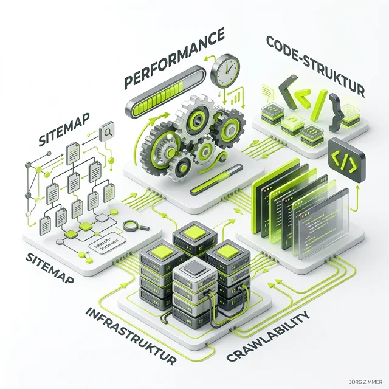

Lass uns hier mal direkt Tacheles reden, ohne das übliche Agentur-Sprech und Bullshit-Bingo: **WordPress** war über ein ganzes Jahrzehnt das absolute Nonplusultra für SEO. Es war einfach. Aber wir schreiben jetzt das Jahr 2026, und das klassische, völlig aufgeblähte WordPress-Ökosystem hat ein gewaltiges, existenzielles Problem mit der neuen Suchrealität. 

Die kuscheligen Zeiten, in denen du ein schwerfälliges 50-Euro-Theme von ThemeForest gekauft, drei fette Pagebuilder installiert und dann ein Ampel-SEO-Plugin drübergebügelt hast, um in Google auf Platz 1 zu ranken, sind endgültig und für alle Zeiten vorbei. 

<figure class="my-8 bg-neutral-50 border border-neutral-200 p-6 md:p-8 rounded-2xl shadow-sm">
  

    
    

      <h4 class="font-bold text-base md:text-lg text-dark mb-0">Jörg Zimmer</h4>
      
Senior SEO & AI Search Consultant

    

  

  <blockquote class="text-base md:text-lg text-dark leading-relaxed italic border-l-4 border-lime-accent pl-4 my-4 font-normal">
    „Wenn dein WordPress im Jahr 2026 immer noch 4 Megabyte überflüssiges HTML und blockierendes JavaScript an einen KI-Agenten schickt, fliegst du hochkant aus den AI Overviews. KI-Systeme haben keine Zeit, verschachtelte Pagebuilder-DIVs zu parsen. Du brauchst Headless-Markdown, schlanke Block-Themes und saubere Schnittstellen.“
  </blockquote>
  <figcaption class="mt-4 pt-3 border-t border-neutral-200/60 flex flex-wrap items-center justify-between gap-2 text-xs text-neutral-500">
    Experten-Zitat • <cite class="not-italic font-semibold text-neutral-700">Jörg Zimmer</cite>
    <a href="https://www.linkedin.com/in/joerg-zimmer-seo-sea-freelancer-berlin-spandau/" target="_blank" rel="noopener noreferrer" class="font-bold text-lime-700 hover:underline inline-flex items-center gap-1">
      Jörg Zimmer auf LinkedIn folgen →
    </a>
  </figcaption>
</figure>

  

    30-Sekunden Inhaber-Check
    WordPress-Performance & Caching
  

  <h3 class="text-lg font-bold text-dark mb-2">Jörgs Praxistipp aus der SEO-Sprechstunde</h3>
  

    Prüfe die Anzahl aktiver Plugins in deinem WordPress-Backend. Liegt die Zahl bei über 25 oder sind schwere Pagebuilder im Einsatz, leidet deine Time-to-First-Byte (TTFB) massiv. Aktiviere serverseitiges Redis-Object-Caching und deaktiviere alle Legacy-Plugins, die nicht zwingend für den Geschäftsbetrieb erforderlich sind.
  

  

    <strong>Kontrollfrage an deine Webagentur oder IT-Abteilung:</strong> „Haben wir in WordPress serverseitiges Object-Caching (Redis/Memcached) aktiv und liefert unser Server bei Anfragen mit 'Accept: text/markdown' schlanken Markdown-Text statt überladener HTML-Templates aus?“
  

Heute dominiert [Generative Engine Optimization (GEO)](/glossar/geo/). Es geht verdammt nochmal nicht mehr primär darum, bunte, blinkende Landingpages für menschliche Augen zu rendern. Es geht darum, dass KI-Agenten, die RAG-Backends von Perplexity, Google AI Overviews und ChatGPT, deinen wertvollen Content extrem schnell, extrem sauber und in reinem Text erfassen können. 

## Die Kern-Verschiebung: Vom Ranking zum "Information Gain"

Im Jahr 2026 zielen wir nicht mehr stur auf "Platz 1 bei den blauen Links" ab. Das neue Ziel heißt: **Citation Frequency** – also wie oft du in KI-Zusammenfassungen als Quelle zitiert wirst. 

KI-Systeme hassen Redundanz. Wenn dein Blogartikel das Gleiche sagt wie die zehn Ergebnisse vor dir, hast du verloren. Die Systeme suchen nach **"Information Gain"** (Informationsgewinn). Bietest du neue Perspektiven, eigene Datenerhebungen oder einzigartige Frameworks an? Wenn dein WordPress-Content nur aus generischem, recyceltem SEO-Blabla besteht, filtert dich die KI aus.

## Die einzige Lösung 2026: Headless-Markdown-Plugins & Content Negotiation

Die klassische WordPress-Architektur hat einen massiven, baulichen Fehler: Sie spuckt tonnenweise HTML aus. Für moderne KI-Systeme ist massives HTML furchtbar zu lesen, es kostet Token-Budget und massive Rechenleistung. Was ist die Lösung? **Vollständige technische KI-Optimierung** durch strikte Content Negotiation.

Du brauchst zwingend moderne Headless-Markdown-Plugins. Was machen diese Tools? Sie greifen tief in den WordPress-Core ein:
Wenn ein ganz normaler, menschlicher Browser (Chrome, Safari) deine Seite aufruft, wird das hübsche HTML-Frontend ausgeliefert. 

Klopf jedoch ein autonomer KI-Agent an (was dein Server am HTTP-Header `Accept: text/markdown` oder am User-Agent erkennt), umgeht das Plugin gnadenlos das gesamte Theme, ignoriert jeden Pagebuilder und liefert den reinen, unformatierten Post-Content als perfektes, sauberes Markdown aus.

Das ist der absolute, unschlagbare Gamechanger für Zitationen in AI Overviews. Das LLM muss sich nicht mehr durch einen gewaltigen DOM-Tree kämpfen, sondern kann direkt deine pure Expertise ingestieren.

## WordPress auf vollständige technische KI-Optimierung bringen

Um in der erbarmungslosen KI-Suche 2026 überhaupt zu bestehen, musst du dein WordPress radikal umbauen. Das bedeutet ganz konkret:

### 1. Plugin-Bloat killen und CWV maximieren
Jedes zusätzliche Plugin macht dein System langsamer. Die **Core Web Vitals (CWVs)** sind 2026 der ultimative Gatekeeper. LCP (Largest Contentful Paint) und INP (Interaction to Next Paint) müssen perfekt sein. Wirf alle Plugins raus, die nicht überlebenswichtig sind. Nutze High-Performance-Hosting (Kinsta, SiteGround) und blockierendes CSS/JS muss rigoros entfernt werden.

### 2. Maschinenlesbare Endpunkte & llms.txt einrichten
KI-Agenten brauchen klare Spielregeln. Du musst in deinem WordPress-Verzeichnis **maschinenlesbare Endpunkte** bereitstellen. Dazu gehört zwingend die Bereitstellung einer sauberen `/llms.txt` im Root-Verzeichnis. Sie erklärt den KI-Crawlern klipp und klar, wer du bist und wo dein härtester, bester Content liegt.

### 3. KI-Crawler-Protokolle & extrem tiefes Schema.org
Nutze **KI-Crawler-Protokolle**, um dein WordPress zu einem offiziell ansprechbaren Knotenpunkt im globalen Agenten-Netzwerk zu machen. 
Kombiniere das mit extrem tief verschachtelten Strukturierten Daten (JSON-LD). Wenn ein KI-Agent dein Markdown liest, braucht er den JSON-LD Graph, um die Entitäten zu verstehen. Baue Relationen auf. Sag der KI, wer den Artikel geschrieben hat (Author-Entität, E-E-A-T) und warum diese Person eine absolute Autorität auf dem Gebiet ist.

### 4. Trailing Slashes im WordPress Core fixen!
Ich kann es nicht oft genug sagen, weil es 90% der WordPress-Admins kolossal falsch machen: Achte penibel auf deine Trailing Slashes! WordPress tendiert dazu, bei falschen Konfigurationen interne Redirects zu erzeugen. Wenn du auf `teleschmie.de/meine-leistung/` verlinkst, muss der Slash am Ende stehen. Vergiss ihn, und WordPress macht einen unnötigen 301-Redirect. Ein Mensch merkt das nicht. Ein KI-Crawler, der über maschinenlesbare Endpunkte reinkommt, bricht wegen Verschwendung seines Token-Budgets sofort ab. Fixe das!

### 5. Abschied von der grünen Ampel (Yoast & Co.)
Die klassischen SEO-Plugins rudern momentan stark zurück. Wer heute WordPress professionell betreibt, nutzt Plugins wie Rank Math primär noch für das Schema.org-Markup und die schnelle IndexNow-Anbindung. Die alten Content-Analysen, wo du versucht hast, Keywords auf eine bestimmte Prozentzahl zu pushen, um eine dämliche grüne Ampel zu bekommen, kannst du ignorieren. Die Ampeln verstehen keine Entitäten-Semantik. Spar dir die Zeit.

## Mein Tacheles-Rat für dich

Hör endlich auf, dein WordPress wie eine digitale Hochglanzbroschüre aus dem Jahr 2010 zu behandeln. Behandle es ab heute als hochperformante, datenliefernde API für KI-Agenten! 

Wenn du ein neues Projekt startest, bau es so unfassbar schlank wie nur irgend möglich. Verzichte auf diese monströsen Pagebuilder, die dein System in die Knie zwingen. Setze stattdessen auf den nativen Gutenberg-Editor (Block-Themes), auf saubere Strukturierte Daten und installiere zwingend ein System für strukturierte Datenaufbereitung für KIs. 

Wer seine Daten 2026 nicht über KI-Crawler-Protokolle und maschinenlesbare Endpunkte zur Verfügung stellt, wird von den LLMs schlichtweg ignoriert. Und glaub mir: Wo die KI dich nicht zitiert, findet dich auch schon bald kein Nutzer mehr. Du bist dann digital unsichtbar.

  

    

      🤖
      
Arbeitsanweisung für deinen KI-Agenten (Cursor / Claude / Antigravity)

    

    <button type="button" class="copy-agent-btn px-2.5 py-1 bg-lime-accent text-dark hover:bg-lime-600 hover:text-white text-[11px] font-bold uppercase rounded border border-lime-500 hover:border-lime-600 transition-all flex items-center gap-1 shadow-md cursor-pointer shrink-0 ml-auto" title="Prompt kopieren">
      <svg class="w-3.5 h-3.5" fill="none" stroke="currentColor" viewBox="0 0 24 24"><path stroke-linecap="round" stroke-linejoin="round" stroke-width="2" d="M8 16H6a2 2 0 01-2-2V6a2 2 0 012-2h8a2 2 0 012 2v2m-6 12h8a2 2 0 012-2v-8a2 2 0 01-2-2h-8a2 2 0 01-2 2v8a2 2 0 012 2z" /></svg>
      Kopieren für Agent
    </button>
  

  

    Kopiere diesen Prompt direkt in deinen KI-Coding-Assistenten, um deine WordPress-Instanz auf moderne Performance- und Content-Negotiation-Standards umzustellen:
  

  

    
# Prompt: WordPress Performance-Audit &amp; Markdown Content Negotiation

    
<strong>Rolle:</strong> Du bist ein erfahrener WordPress Core Developer und Technical SEO Engineer.

    
<strong>Aufgabe:</strong> Optimiere unsere WordPress-Installation für Core Web Vitals und moderne KI-Crawlability. Implementiere Content Negotiation für Markdown-Endpunkte und reduziere überflüssigen Plugin-Overhead.

    
<strong>Schritte &amp; Validierung:</strong>

    
1. Erstelle ein leichtgewichtiges Must-Use-Plugin (mu-plugin), das bei anfragendem Header 'Accept: text/markdown' den Beitragsinhalt bereinigt und als reines Markdown zurückgibt.

    
2. Konfiguriere die Permalink-Struktur strikt mit trailing slash ('/%postname%/') und eliminiere interne 301-Redirect-Schleifen.

    
3. Überprüfe die Redis-Object-Cache-Verbindung und deaktiviere ungenutzte Skripte (wp-embed, Dashicons, block-library-CSS auf Seiten ohne Blocks).

    
4. Validierung: Teste eine URL mit 'curl -H "Accept: text/markdown" https://teleschmie.de/blog-post/' und verifiziere, dass reiner Markdown-Text mit Status 200 ausgeliefert wird.

  

  
    Aus Jörgs LinkedIn-Feed
  
  <blockquote class="text-base md:text-lg text-gray-200 italic max-w-2xl mx-auto mb-4 border-none font-normal">
    „Das grundsätzliche Problem ist die unsichtbare Welt hinter der Website. Ob eine Website gut oder schlecht ist. Gut oder schlecht programmiert. Schnell oder langsam. Selbst das Prüfen, ob sie gut oder schlecht rankt, ist von außen schwer zu beurteilen.“
  </blockquote>
  

    Diskutiere mit Jörg Zimmer und der SEO-Community auf LinkedIn über diesen Beitrag.
  

  <a href="https://www.linkedin.com/feed/update/urn:li:activity:7083056707148374016" target="_blank" rel="noopener noreferrer" class="btn-primary">
    <svg class="w-4 h-4 fill-current" viewBox="0 0 24 24"><path d="M20.447 20.452h-3.554v-5.569c0-1.328-.027-3.037-1.852-3.037-1.853 0-2.136 1.445-2.136 2.939v5.667H9.351V9h3.414v1.561h.046c.477-.9 1.637-1.85 3.37-1.85 3.601 0 4.267 2.37 4.267 5.455v6.286zM5.337 7.433c-1.144 0-2.063-.926-2.063-2.065 0-1.138.92-2.063 2.063-2.063 1.14 0 2.064.925 2.064 2.063 0 1.139-.925 2.065-2.064 2.065zm1.782 13.019H3.555V9h3.564v11.452zM22.225 0H1.771C.792 0 0 .774 0 1.729v20.542C0 23.227.792 24 1.771 24h20.451C23.2 24 24 23.227 24 22.271V1.729C24 .774 23.2 0 22.222 0h.003z"/></svg>
    Beitrag auf LinkedIn öffnen
    →
  </a>

### Verwandte Glossar-Einträge
* [Generative Engine Optimization (GEO) im Detail](/glossar/geo/)
* [Agent Readiness Levels für KI-Schnittstellen](/glossar/agent-readiness-level/)
* [PageSpeed: Ladezeiten nachhaltig optimieren](/glossar/pagespeed/)
* [Core Web Vitals: LCP, INP und CLS](/glossar/core-web-vitals/)
* [Strukturierte Daten nach Schema.org](/glossar/strukturierte-daten/)
* [Google Search Console: Fehler erkennen](/glossar/google-search-console/)
* [Trailing Slashes richtig setzen](/glossar/trailing-slashes/)
* [Bing Webmaster Tools als RAG-Backend](/glossar/bing-webmastertools/)
