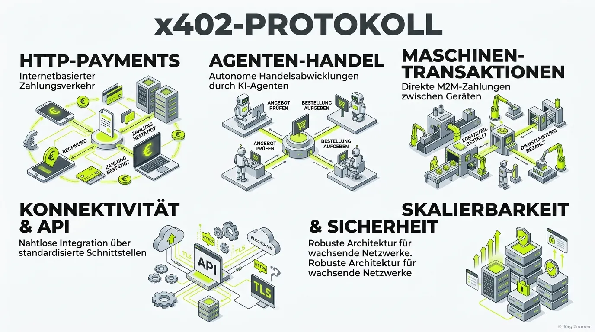

Der globale Online-Handel wurde über ein Vierteljahrhundert hinweg für ein einziges Szenario optimiert: Ein menschlicher Konsument sitzt vor einem Bildschirm, legt physische oder digitale Waren in einen virtuellen Warenkorb, tippt seine Rechnungsadresse ein und autorisiert die Abbuchung per Kreditkarte oder PayPal. 

Im Jahr 2026 erodiert dieses Paradigma. Autonome Software-Agenten treten zunehmend als Stellvertreter von Unternehmen und Konsumenten auf. Sie vergleichen nicht nur Produkte, sondern wickeln Geschäftsentscheidungen in Millisekunden autonom ab: Sie kaufen Wetterdaten für Logistik-Routen, bezahlen für GPU-Rechenzeit, rufen kostenpflichtige Fachartikel ab oder buchen Software-Lizenzen. An dieser Schwelle scheitern klassische Checkout-Systeme kläglich. Ein KI-Agent besitzt keine Plastikkarte und kann kein Captcha lösen. Die Antwort auf diese technologische Sackgasse ist das **x402-Protokoll**.

<figure class="my-8 bg-neutral-50 border border-neutral-200 p-6 md:p-8 rounded-2xl shadow-sm">
  <div class="flex items-center gap-4 mb-4">
    
    <div>
      <h4 class="font-bold text-base md:text-lg text-dark mb-0">Jörg Zimmer</h4>
      <p class="text-xs md:text-sm text-neutral-600 mb-0">Senior SEO & AI Search Consultant</p>
    </div>
  </div>
  <blockquote class="text-base md:text-lg text-dark leading-relaxed italic border-l-4 border-lime-accent pl-4 my-4 font-normal">
    „Der Statuscode HTTP 402 lag über 25 Jahre lang als theoretisches Denkmal im Webstandard brach. Mit dem x402-Protokoll und autonomen KI-Agenten erwacht er zum Leben. Wer im Jahr 2026 Daten oder Rechenleistung bereitstellt, wickelt Zahlungen im Sub-Cent-Bereich direkt im HTTP-Request ab – ohne Kreditkartenformulare oder menschliche Klicks.“
  </blockquote>
  <figcaption class="mt-4 pt-3 border-t border-neutral-200/60 flex flex-wrap items-center justify-between gap-2 text-xs text-neutral-500">
    <span>Experten-Zitat • <cite class="not-italic font-semibold text-neutral-700">Jörg Zimmer</cite></span>
    <a href="https://www.linkedin.com/in/joerg-zimmer-seo-sea-freelancer-berlin-spandau/" target="_blank" rel="noopener noreferrer" class="font-bold text-lime-700 hover:underline inline-flex items-center gap-1">
      Jörg Zimmer auf LinkedIn folgen →
    </a>
  </figcaption>
</figure>

<div class="bg-lime-accent/15 rounded-2xl border border-lime-accent/30 p-6 shadow-sm not-prose my-8">
  <div class="flex items-center gap-2 mb-3">
    <span class="text-xs font-bold uppercase tracking-wider bg-lime-accent text-dark px-2.5 py-1 rounded-full">30-Sekunden Inhaber-Check</span>
    <span class="text-xs font-semibold text-neutral-600">Agentic Commerce & API-Monetarisierung</span>
  </div>
  <h3 class="text-lg font-bold text-dark mb-2">Jörgs Praxistipp aus der SEO-Sprechstunde</h3>
  <p class="text-sm text-neutral-800 leading-relaxed mb-4">
    Prüfe, ob dein Geschäftsmodell wertvolle Datenbestände enthält (z. B. Live-Preise, Fachartikel, Analysen), die bisher unbezahlt von Scrapern abgegriffen werden. Über das x402-Protokoll kannst du anstelle pauschaler IP-Blockaden Pay-per-Call-Mikrotransaktionen etablieren, bei denen KI-Agenten für jeden Abruf automatisch Bruchteile eines Cents vergüten.
  </p>
  <div class="p-3 bg-white/80 rounded-xl border border-lime-accent/20 text-xs text-neutral-700">
    <strong>Kontrollfrage an deine Webagentur oder IT-Abteilung:</strong> „Haben wir für unsere datenintensiven API-Endpunkte Mechanismen wie HTTP 402 (x402-Protokoll) geprüft, um Scraper-Traffic in bezahlte M2M-Mikrotransaktionen umzuwandeln?“
  </div>
</div>



## Was ist das x402-Protokoll und wie funktioniert es?

Das x402-Protokoll ist ein offener, internetnativer Standard, der von einer branchenweiten Allianz (gegründet von Coinbase und heute geführt von der unabhängigen x402 Foundation unter Beteiligung von Cloudflare, Google und AWS) entwickelt wurde. Es verwandelt HTTP-Endpunkte in vollautomatisierte digitale Verkaufsautomaten.

Der Kern des Protokolls basiert auf der Aktivierung des offiziellen, aber lange vernachlässigten HTTP-Statuscodes **`402 Payment Required`**.

Der Bezahlvorgang läuft in vier hochoptimierten Schritten auf Netzwerkebene ab:

1.  **Initialer API-Aufruf:** Der KI-Agent fordert eine geschützte Ressource per GET- oder POST-Request an (z. B. `https://api.teleschmie.de/v1/protected-data`).
2.  **402 Payment Required Response:** Der Server blockiert den Zugriff mit dem Status `402` und liefert im Header `X-Payment-Required` die exakten Zahlungskonditionen mit (Ziel-Wallet, geforderter Betrag, Währung, Token-Netzwerk).
3.  **Kryptografische Signatur:** Die integrierte Wallet des Agenten prüft die Kosten gegen das vom Nutzer freigegebene Budget. Bei Freigabe signiert der Agent die Mikrotransaktion und sendet die Anfrage erneut – diesmal mit dem Header `X-Payment-Authorization`.
4.  **Instant Settlement & Datenauslieferung:** Der Server validiert den kryptografischen Beleg in Millisekunden, zieht den Betrag ein und liefert die angeforderten Nutzdaten mit dem Status `200 OK` aus.

## Direkter Vergleich: Klassischer Web-Checkout vs. x402 Protokoll

Um den Innovationssprung einzuordnen, vergleicht die nachfolgende Tabelle traditionelle Zahlungsmethoden mit der x402-Architektur:

| Transaktions-Merkmal | Klassischer Web-Checkout (Stripe, PayPal) | x402 Protokoll (Agent-Native HTTP) |
|:---|:---|:---|
| **Akteur** | Menschlicher Konsument vor dem Browser | **Autonomer KI-Agent / M2M-Software** |
| **Benutzeroberfläche** | HTML-Checkout-Formulare & Warenkörbe | **Reine HTTP-Header auf Netzwerkebene** |
| **Abrechnungsmodell** | Monatsabos oder Mindestbeträge | **Granulares Pay-per-Call (Sub-Cent-Bereich)** |
| **Identitätsprüfung** | Login-Konto, Passwort & 2FA-SMS | **Kryptografische Wallet-Signaturen** |
| **Latenzzeit** | 30 bis 120 Sekunden (Mensch tippt) | **Unter 200 Millisekunden (Vollautomatisiert)** |
| **Abbruchrate bei Bots**| Nahezu 100 % (Blockade durch Captchas) | **0 % (Natives Protokoll-Verständnis)** |

## Praxis-Beispiel: Die x402-Header in Aktion

Der technische Charme des x402-Standards liegt in seiner absoluten Konformität mit modernen REST-Architekturen. Es werden keine proprietären Tunnel benötigt, sondern rein standardisierte Header genutzt:

### 1. Server-Response (402 Payment Required)
```http
HTTP/1.1 402 Payment Required
Content-Type: application/json
X-Payment-Required: {
  "network": "base",
  "currency": "USDC",
  "amount": "0.005",
  "recipient": "0x71C...B29",
  "timeout": 300
}

{
  "error": "Payment required to access protected API endpoint."
}
```

### 2. Client-Request mit Zahlungsnachweis
```http
GET /v1/protected-data?query=test HTTP/1.1
Host: api.teleschmie.de
X-Payment-Authorization: {
  "txHash": "0x4a8f...91c2",
  "payer": "0x39D...A11",
  "signature": "0x98f...e3a"
}
```

Nach Eingang prüft der Webserver die Blockchain-Gültigkeit über einen lokalen Node oder RPC-Provider und gibt die Ressource sofort frei.

## Die 3 häufigsten Fehler bei der Bereitstellung von x402-Schnittstellen

Unternehmen, die ihre APIs für maschinelle Zahlungen öffnen, stehen vor neuen Sicherheits- und Architektur-Herausforderungen:

1. **Unzureichendes Budget-Management auf Client-Seite:** Wenn ein KI-Agent in eine Endlos-Schleife gerät und wiederholt kostenpflichtige Pay-per-Call-Endpunkte anfunkt, kann ein Wallet-Budget innerhalb von Minuten geleert werden. Client-Entwickler müssen harte Circuit-Breaker und Tages-Limits implementieren.
2. **Wahl von Blockchains mit unberechenbaren Gas-Fees:** Wer x402 auf teuren Layer-1-Blockchains aufsetzt, scheitert an den Transaktionskosten. Mikro-Zahlungen von 0,001 Euro funktionieren wirtschaftlich nur auf Netzwerken mit festen Gebühren im Bruchteil eines Cents (z. B. Base oder Solana).
3. **Mangelnde Caching-Strategien für Zahlungsbelege:** Verlangt der Server bei identischen Abfragen innerhalb weniger Sekunden jedes Mal eine neue Zahlung, verprellt er Agenten. Sinnvoll ist die Kopplung des Zahlungsnachweises an ein temporäres Bearer-Token mit definierter Lebensdauer.

## Idempotenz und Schutz vor Replay-Angriffen

Ein kritischer Aspekt bei der Automatisierung von Finanztransaktionen ohne menschliche Aufsicht ist der Schutz vor Doppelabbuchungen (Double Spending) und Netzwerk-Wiederholungen (Replays). Das x402-Protokoll löst diese Herausforderung über zwei kryptografische Mechanismen:

*   **Idempotency-Keys:** Jeder Zahlungsnachweis enthält einen kryptografischen Hash des spezifischen Requests. Sendet ein Agent dieselbe Anfrage infolge einer Netzwerkverzögerung erneut, erkennt der Server den Schlüssel und liefert die bereits bezahlte Ressource aus, ohne die Wallet erneut zu belasten.
*   **Zeitstempel und Nonces:** Serverseitige Zahlungsaufforderungen besitzen eine strikte Gültigkeitsdauer (TTL von typischerweise 60 bis 300 Sekunden). Nach Ablauf dieser Frist verfällt die Aufforderung, um Man-in-the-Middle-Angriffe mit abgefangenen Zahlungsbelegen auszuschließen.

### Node.js / Express Middleware-Beispiel für x402

Entwickler können bestehende APIs mit wenigen Zeilen Code für das x402-Protokoll ertüchtigen:

```javascript
export function x402PaymentGate({ priceUsdc, walletAddress }) {
  return async (req, res, next) => {
    const authProof = req.header("X-Payment-Authorization");
    
    if (!authProof) {
      return res.status(402).json({
        status: "Payment Required",
        network: "base",
        currency: "USDC",
        amount: priceUsdc,
        recipient: walletAddress,
        validUntil: Math.floor(Date.now() / 1000) + 300
      });
    }
    
    const isValid = await verifyOnchainPayment(authProof, priceUsdc, walletAddress);
    if (!isValid) {
      return res.status(403).json({ error: "Invalid payment proof or insufficient amount." });
    }
    
    next();
  };
}
```

Mit dieser Middleware lässt sich jeder sensible Endpunkt absichern, ohne dass komplexe Nutzerkonten-Tabellen oder externe Bezahl-Plugins im Frontend geladen werden müssen.

## Das Zusammenspiel mit ACP, MPP und Agent Readiness Level 5

Das x402-Protokoll bildet die unterste Zahlungsschicht (Settlement Layer). Es interagiert nahtlos mit übergeordneten Protokollen: Das [Agentic Commerce Protocol (ACP)](/glossar/agentic-commerce-protocol-acp/) regelt die geschäftliche Auftragsverhandlung, während das [Machine Payment Protocol (MPP)](/glossar/machine-payment-protocol-mpp/) Multi-Chain-Escrows bereitstellt. Flankiert von maschinenlesbarer Identifikation über [auth.md](/glossar/auth-md/) erreicht eine Web-Plattform damit das [Agent Readiness Level](/glossar/agent-readiness-level/) 5.

Wer verstehen möchte, wie führende Marken ihre Daten im KI-Ökosystem monetarisieren und sichtbar machen, findet aktuelle Marktanalysen in unserem [Vergleich der Top 9 AI Visibility Tools](/blog/top-9-ai-visibility-tools/). Begleitende Budgets und Kostenkalkulationen lassen sich transparent im [SEO-Tool Kostenrechner](/tools/seo-tool-kostenrechner/) simulieren.

<div class="my-8 bg-dark text-white p-6 rounded-2xl border-l-4 border-lime-accent shadow-md">
  <div class="flex flex-wrap items-center justify-between gap-2 mb-3">
    <div class="flex items-center gap-3">
      <span class="text-lime-accent text-2xl">🤖</span>
      <p class="font-bold text-lg text-lime-accent mb-0">Arbeitsanweisung für deinen KI-Agenten (Cursor / Claude / Antigravity)</p>
    </div>
    <span class="text-xs bg-lime-accent/20 text-lime-accent px-2.5 py-1 rounded-full font-mono font-bold">Copy & Paste Task</span>
  </div>
  <p class="text-gray-300 text-sm mb-4 leading-relaxed">
    Kopiere diesen Prompt direkt in deinen KI-Coding-Assistenten, um ein sicheres x402-Payment-Gateway für deine Express- oder Next.js-API zu bauen:
  </p>
  <div class="bg-black/60 p-4 rounded-xl border border-white/10 text-xs font-mono text-gray-200 overflow-x-auto space-y-2">
    <p class="text-lime-accent font-bold mb-1"># Prompt: x402 HTTP Status 402 Middleware Implementation</p>
    <p><strong>Rolle:</strong> Du bist ein hochspezialisierter Web3- und API-Architekt.</p>
    <p><strong>Aufgabe:</strong> Entwickle eine Middleware für unsere Node.js/TypeScript-API, die das x402-Protokoll implementiert. Unbezahlte Anfragen an geschützte Ressourcen müssen mit HTTP 402 Payment Required beantwortet werden; bei Vorlage eines validen Zahlungsbelegs im Header 'X-Payment-Authorization' wird der Zugriff freigegeben.</p>
    <p><strong>Schritte &amp; Validierung:</strong></p>
    <p>1. Definiere den 402-Response-Payload mit Ziel-Wallet, Währung (USDC auf Base), Festbetrag und Nonce/TTL (300s).</p>
    <p>2. Implementiere Idempotency-Checks und Nonce-Validierung, um Replay-Angriffe und versehentliche Doppelabbuchungen zu unterbinden.</p>
    <p>3. Verifiziere die On-Chain-Transaktionssignatur über einen RPC-Client vor Freigabe der angeforderten JSON-Ressource.</p>
    <p>4. Validierung: Führe einen synthetischen Test mit cURL durch: Prüfe Status 402 beim Erstaufruf und Status 200 nach Beilegen des Payment-Headers.</p>
  </div>
</div>

<div class="my-10 bg-dark text-white p-8 rounded-3xl border border-white/10 text-center shadow-md not-prose">
  <span class="text-xs uppercase tracking-widest text-lime-accent font-mono font-bold mb-3 block">
    Aus Jörgs LinkedIn-Feed
  </span>
  <blockquote class="text-base md:text-lg text-gray-200 italic max-w-2xl mx-auto mb-4 border-none font-normal">
    „Das grundsätzliche Problem ist die unsichtbare Welt hinter der Website. Ob eine Website gut oder schlecht ist. Gut oder schlecht programmiert. Schnell oder langsam. Selbst das Prüfen, ob sie gut oder schlecht rankt, ist von außen schwer zu beurteilen.“
  </blockquote>
  <p class="text-gray-300 text-sm max-w-xl mx-auto mb-6">
    Diskutiere mit Jörg Zimmer und der SEO-Community auf LinkedIn über diesen Beitrag.
  </p>
  <a href="https://www.linkedin.com/feed/update/urn:li:activity:7083056707148374016" target="_blank" rel="noopener noreferrer" class="btn-primary">
    <svg class="w-4 h-4 fill-current" viewBox="0 0 24 24"><path d="M20.447 20.452h-3.554v-5.569c0-1.328-.027-3.037-1.852-3.037-1.853 0-2.136 1.445-2.136 2.939v5.667H9.351V9h3.414v1.561h.046c.477-.9 1.637-1.85 3.37-1.85 3.601 0 4.267 2.37 4.267 5.455v6.286zM5.337 7.433c-1.144 0-2.063-.926-2.063-2.065 0-1.138.92-2.063 2.063-2.063 1.14 0 2.064.925 2.064 2.063 0 1.139-.925 2.065-2.064 2.065zm1.782 13.019H3.555V9h3.564v11.452zM22.225 0H1.771C.792 0 0 .774 0 1.729v20.542C0 23.227.792 24 1.771 24h20.451C23.2 24 24 23.227 24 22.271V1.729C24 .774 23.2 0 22.222 0h.003z"/></svg>
    <span>Beitrag auf LinkedIn öffnen</span>
    <span aria-hidden="true">→</span>
  </a>
</div>

### Verwandte Glossar-Einträge
* [Agentic Commerce Protocol (ACP)](/glossar/agentic-commerce-protocol-acp/)
* [Machine Payment Protocol (MPP)](/glossar/machine-payment-protocol-mpp/)
* [Agent Readiness Levels für KI-Systeme](/glossar/agent-readiness-level/)
* [auth.md für KI-Agenten](/glossar/auth-md/)
* [Model Context Protocol (MCP)](/glossar/model-context-protocol-mcp/)
* [Web Bot Auth: Kryptografische Verifikation](/glossar/web-bot-auth/)
* [WebMCP: Browser-Tools für KI](/glossar/webmcp/)
* [Universal Commerce Protocol (UCP)](/glossar/universal-commerce-protocol-ucp/)
