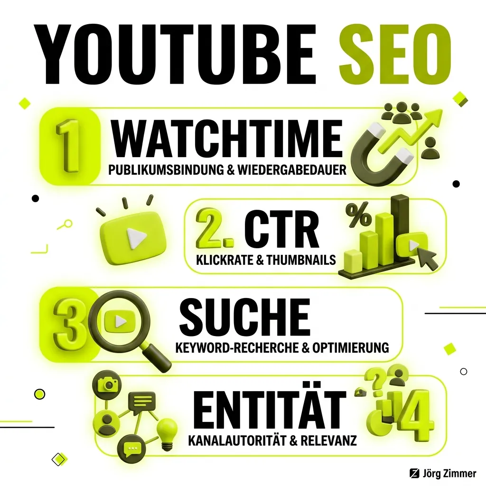

**YouTube SEO** bezeichnet die strategische Optimierung von Videos, Metadaten und Kanaleigenschaften, um maximale Sichtbarkeit und Interaktion auf der zweitgrößten Suchmaschine der Welt zu erzielen. Im Jahr 2026 hat sich YouTube jedoch grundlegend von einem rein suchbasierten Verzeichnis zu einer hochentwickelten, multimodalen KI-Empfehlungsplattform gewandelt. Wer heute Spitzenplatzierungen anstrebt, muss verstehen, wie neuronale Netze Audio, Bild und Nutzerpsychologie in Echtzeit zusammenführen.

Während die traditionelle [Suchmaschinenoptimierung](/glossar/technisches-seo/) stark auf textliche Relevanz und Backlink-Strukturen fokussiert ist, belohnt das Empfehlungssystem von YouTube vor allem zwei Kernkomponenten: die initiale Neugier (Click-Through-Rate) und die nachhaltige Zufriedenheit der Nutzer (Valued Watchtime und Session-Impact).

<figure class="my-8 bg-neutral-50 border border-neutral-200 p-6 md:p-8 rounded-2xl shadow-sm">
  <div class="flex items-center gap-4 mb-4">
    
    <div>
      <h4 class="font-bold text-base md:text-lg text-dark mb-0">Jörg Zimmer</h4>
      <p class="text-xs md:text-sm text-neutral-600 mb-0">Senior SEO & AI Search Consultant</p>
    </div>
  </div>
  <blockquote class="text-base md:text-lg text-dark leading-relaxed italic border-l-4 border-lime-accent pl-4 my-4 font-normal">
    „YouTube ist ein soziales Medium: Selbst das teuerste Videomaterial verpufft wirkungslos, wenn es nicht in den ersten zehn Sekunden fesselt und vom Algorithmus für die richtige Zielgruppe empfohlen wird. 2026 zählt nicht mehr Clickbait, sondern Valued Watchtime und saubere semantische Transkripte für multimodale KIs.“
  </blockquote>
  <figcaption class="mt-4 pt-3 border-t border-neutral-200/60 flex flex-wrap items-center justify-between gap-2 text-xs text-neutral-500">
    <span>Experten-Zitat • <cite class="not-italic font-semibold text-neutral-700">Jörg Zimmer</cite></span>
    <a href="https://www.linkedin.com/in/joerg-zimmer-seo-sea-freelancer-berlin-spandau/" target="_blank" rel="noopener noreferrer" class="font-bold text-lime-700 hover:underline inline-flex items-center gap-1">
      Jörg Zimmer auf LinkedIn folgen →
    </a>
  </figcaption>
</figure>

<div class="bg-lime-accent/15 rounded-2xl border border-lime-accent/30 p-6 shadow-sm not-prose my-8">
  <div class="flex items-center gap-2 mb-3">
    <span class="text-xs font-bold uppercase tracking-wider bg-lime-accent text-dark px-2.5 py-1 rounded-full">30-Sekunden Inhaber-Check</span>
    <span class="text-xs font-semibold text-neutral-600">Video-Retention & Schema-Markup</span>
  </div>
  <h3 class="text-lg font-bold text-dark mb-2">Jörgs Praxistipp aus der SEO-Sprechstunde</h3>
  <p class="text-sm text-neutral-800 leading-relaxed mb-4">
    Prüfe die ersten 30 Sekunden deiner Videos: Verzichtest du auf lange Intro-Animationen und kommst sofort zum Kernversprechen? Wenn du Videos auf deiner Website einbindest, hinterlege stets ein vollständiges `VideoObject`-Schema mit Zeitstempeln (Clip-Markup), damit Google Key Moments direkt in den Suchergebnissen ausspielt.
  </p>
  <div class="p-3 bg-white/80 rounded-xl border border-lime-accent/20 text-xs text-neutral-700">
    <strong>Kontrollfrage an deine Webagentur oder Videoproduktion:</strong> „Werden unsere eingebetteten YouTube-Videos auf der Website mit strukturiertem VideoObject JSON-LD Markup inklusive Key Moments (Clips) ausgezeichnet, damit Google und KI-Suchmaschinen relevante Segmente direkt zitieren können?“
  </div>
</div>



## Die vier Ausspielungs-Oberflächen auf YouTube

Um eine erfolgreiche Video-Strategie zu entwickeln, muss zwischen den vier zentralen Ausspielungskanälen differenziert werden, da der Algorithmus für jede Oberfläche unterschiedliche Signale priorisiert:

1. **Die YouTube-Suche (Search):** Nutzer suchen gezielt nach Problemlösungen, Tutorials oder Marken. Hier entscheiden exakte semantische Treffer im Titel, eine logische Gliederung durch Zeitstempel sowie das gesprochene Wort im Transkript.
2. **Die Startseite (Browse Features / Home):** Das System schlägt Videos basierend auf den langfristigen Sehgewohnheiten und Interessenprofilen des jeweiligen Nutzers vor. Hier triumphieren starke visuelle Reize und emotionale Themenhaken (Hooks).
3. **Vorgeschlagene Videos (Suggested Videos):** Erscheinen rechts neben dem aktuellen Video oder direkt im Anschluss im Autoplay. Ausschlaggebend ist hier die thematische Nähe und die Wahrscheinlichkeit, dass der Zuschauer seine Wiedergabesitzung nahtlos fortsetzt.
4. **Der Shorts-Feed:** Ein separater, vertikaler Feed, der extrem auf Sofort-Bindung (Swipe-Away-Rate vs. Viewed-Rate) und Wiedergabeschleifen optimiert ist.

## Die entscheidenden Rankingfaktoren im Jahr 2026

Der Algorithmus verarbeitet pro Sekunde Milliarden von Interaktionspunkten. Vier Dimensionen bestimmen heute über Erfolg oder Misserfolg eines Videos:

### 1. Click-Through-Rate (CTR) & visuelle Psychologie
Die Klickrate ist das unbarmherzige Eingangstor für jede Ausspielung. Liefert ein Video bei den ersten Impressionen im Test-Pool keine überdurchschnittliche Klickrate, wird die Distribution sofort gedrosselt. Erfolgreiche Kanäle optimieren Thumbnail und Titel als komplementäre Einheit: Das Thumbnail weckt eine visuelle Frage oder Emotion, während der Titel die inhaltliche Relevanz präzisiert. Eine gesunde CTR im Homefeed bewegt sich typischerweise zwischen 4 % und 9 %.

### 2. Valued Watchtime und Retention-Kurven
Früher reichte es aus, Nutzer durch reißerischen Clickbait für zwei Minuten auf der Seite zu halten. 2026 erkennt das System sofort, ob eine Retention-Kurve durch inhaltliche Enttäuschung nach 15 Sekunden steil abfällt. Die Plattform bewertet die vorhergesagte Zufriedenheit: Videos mit kontinuierlich hoher Zuschauerbindung und positiven Signalen (Kommentare, Teilungen, Playlist-Saves) erhalten den stärksten Multiplikator in der Empfehlungsmaschinerie.

### 3. Semantische Transkripte und Audio-NLP
YouTube transkribiert jedes Video automatisch mithilfe moderner Spracherkennungsmodelle. Der Algorithmus versteht das gesamte Vokabular, Satzstrukturen und Fachtermini auf Tonspur-Ebene. Das gezielte Aussprechen relevanter Schlüsselbegriffe und das Hinterlegen präziser Zeitstempel (Video-Kapitel) ermöglicht es Google zudem, exakte Videosequenzen („Key Moments“) direkt in den organischen Web-Suchergebnissen auszuspielen.

### 4. Kanalautorität und Entitäts-Stärkung
Ein Video wird niemals isoliert bewertet. Kanäle, die kontinuierlich hochwertige Inhalte zu einem fokussierten Themengebiet veröffentlichen, bauen eine thematische Vertrauensbasis auf. Im Rahmen moderner [E-E-A-T](/glossar/e-e-a-t/) Richtlinien verknüpft Google den Kanalbetreiber mit einer greifbaren [Entität](/glossar/entitaet/) im [Knowledge Graph](/glossar/knowledge-graph/), was sich wiederum positiv auf Rankings in der Websuche und in KI-Synthesen auswirkt.

## Vergleich: YouTube-Suche vs. Empfehlungssystem vs. Web-SERP

| Kriterium | YouTube-Suche (Search) | Empfehlungen (Browse / Suggested) | Google Web-SERP & KI-Antworten |
| :--- | :--- | :--- | :--- |
| **Nutzerabsicht** | Gezielt, lösungsorientiert (Pull) | Entdeckend, impulsiv (Push) | Informationssuche, Multimodal |
| **Haupttreiber** | Relevanz von Transkript & Titel | CTR & relative Wiedergabedauer | VideoObject Schema & Key Moments |
| **Lebenszyklus** | Evergreen, jahrelang stabil | Hohe Peaks, rascher Abfall | Langfristig, stabil bei Autorität |
| **Transkript-Rolle** | Keyword-Match & semantische Tiefe | Engagement-Klassifizierung | Zitationsbasis für LLMs (RAG) |
| **CTR-Einfluss** | Moderat (Position stabilisiert) | Kritisch (überlebenswichtig) | Hoch (Rich-Snippet-Klickrate) |

## Universelle technische Implementierung: VideoObject Schema

Wer YouTube-Videos auf der eigenen Unternehmenswebsite einbindet, sollte zwingend strukturierte Daten nach Schema.org hinterlegen. Nur so stellen Sie sicher, dass Google Ihre eigene Zielseite als Originalquelle für Rich Snippets und Key Moments heranzieht:

```html
<script type="application/ld+json">
{
  "@context": "https://schema.org",
  "@type": "VideoObject",
  "name": "Praxis-Leitfaden: Technische Video-Optimierung 2026",
  "description": "Erfahren Sie, wie Sie moderne Video-Inhalte technisch strukturieren, Transkripte einsetzen und Google Rich Snippets aktivieren.",
  "thumbnailUrl": [
    "https://teleschmie.de/assets/video-thumbnail-16x9.webp",
    "https://teleschmie.de/assets/video-thumbnail-4x3.webp"
  ],
  "uploadDate": "2026-08-14T08:00:00+02:00",
  "duration": "PT8M42S",
  "embedUrl": "https://www.youtube.com/embed/neutralerVideoCode123",
  "hasPart": [
    {
      "@type": "Clip",
      "name": "Grundlagen der Video-Architektur",
      "startOffset": 0,
      "endOffset": 145,
      "url": "https://teleschmie.de/video-seite/#clip-grundlagen"
    },
    {
      "@type": "Clip",
      "name": "Strukturierte Daten und Key Moments",
      "startOffset": 146,
      "endOffset": 320,
      "url": "https://teleschmie.de/video-seite/#clip-schema"
    },
    {
      "@type": "Clip",
      "name": "Transkripte für LLM-Crawlability",
      "startOffset": 321,
      "endOffset": 522,
      "url": "https://teleschmie.de/video-seite/#clip-transkripte"
    }
  ]
}
</script>
```

## Transkripte als Hebel für KI-Sichtbarkeit und LLM-Crawlability

Ein gravierender Wandel in der modernen [KI-Sichtbarkeit](/glossar/ki-sichtbarkeit/) beruht darauf, dass generative KI-Systeme wie ChatGPT, Perplexity und Google Gemini multimodale Quellen aggregieren. Während das visuelle Rendern von Videodateien für KI-Crawler extrem rechenintensiv ist, parsen Crawler wie GPTBot oder ClaudeBot die zugehörigen Text-Transkripte in Sekundenbruchteilen.

Wer in Videos präzise Definitionen, Fallstudien und Firmennamen klar formuliert, liefert den Algorithmen ideale Textbausteine für Retrieval-Augmented Generation (RAG). Audio-Transkripte werden dadurch zu einer der wertvollsten unstrukturierten Datenquellen für die Etablierung einer unanfechtbaren [KI-SEO](/glossar/ki-seo/) Präsenz.

## Die 3 häufigsten Fehler bei YouTube SEO

1. **Lange, nichtssagende Video-Intros:** Wenn die ersten 15 Sekunden mit aufwendigen Logo-Animationen oder ausschweifenden Begrüßungen verschwendet werden, brechen mobile Nutzer sofort ab. Der Wert des Videos muss in den ersten 5 bis 10 Sekunden glasklar auf den Punkt gebracht werden.
2. **Reines Keyword-Stuffing in Tags und Beschreibungen:** Das unkoordinierte Aneinanderreihen von Schlagwörtern wird von modernen NLP-Filtern als Spam gewertet. Relevanz entsteht durch eine verständliche, gut gegliederte Inhaltszusammenfassung mit Mehrwert für den Leser.
3. **Isolierte Insellösungen ohne Einbindung ins Web-Ökosystem:** Videos ohne Verlinkung zu weiterführenden Fachartikeln und ohne begleitendes VideoObject-Markup auf der eigenen Website verschenken enormes Potenzial für das ganzheitliche [Local SEO](/glossar/local-seo/) und die globale Markenautorität.

## Strategische Einordnung & Omnichannel-Synergien

Erfolgreiches YouTube SEO im Jahr 2026 erfordert den Spagat zwischen packendem Storytelling für die menschliche Zielgruppe und rigoroser technischer Strukturierung für Algorithmen. Videos sind kein isoliertes Marketing-Format, sondern das Rückgrat moderner Informationsarchitektur. Welche Monitoring-Lösungen Sie bei der Analyse von Video-Rankings und generativen Erwähnungen unterstützen, zeigt unser detaillierter Guide über die [Top 9 AI Visibility Tools](/blog/top-9-ai-visibility-tools/). Zudem empfiehlt sich die genaue Budgetkalkulation über den [SEO-Tool Kostenrechner](/tools/seo-tool-kostenrechner/), um Produktions- und Optimierungsaufwände wirtschaftlich abzustimmen.

<div class="my-8 bg-dark text-white p-6 rounded-2xl border-l-4 border-lime-accent shadow-md">
  <div class="flex flex-wrap items-center justify-between gap-2 mb-3">
    <div class="flex items-center gap-3">
      <span class="text-lime-accent text-2xl">🤖</span>
      <p class="font-bold text-lg text-lime-accent mb-0">Arbeitsanweisung für deinen KI-Agenten (Cursor / Claude / Antigravity)</p>
    </div>
    <span class="text-xs bg-lime-accent/20 text-lime-accent px-2.5 py-1 rounded-full font-mono font-bold">Copy & Paste Task</span>
  </div>
  <p class="text-gray-300 text-sm mb-4 leading-relaxed">
    Kopiere diesen Prompt direkt in deinen KI-Coding-Assistenten, um ein vollautomatisches VideoObject-Schema mit Clip-Segmenten für deine Webseiten zu generieren:
  </p>
  <div class="bg-black/60 p-4 rounded-xl border border-white/10 text-xs font-mono text-gray-200 overflow-x-auto space-y-2">
    <p class="text-lime-accent font-bold mb-1"># Prompt: Schema.org VideoObject Generator mit Key Moments</p>
    <p><strong>Rolle:</strong> Du bist ein hochqualifizierter Technical SEO Architect und Structured Data Specialist.</p>
    <p><strong>Aufgabe:</strong> Entwickle ein Skript (Node.js oder Python), das YouTube-Video-Metadaten (Titel, Beschreibung, Kapitelmarken aus der Beschreibung) ausliest und ein standardkonformes Schema.org JSON-LD 'VideoObject' mit verschachtelten 'Clip'-Objekten (hasPart) generiert.</p>
    <p><strong>Schritte &amp; Validierung:</strong></p>
    <p>1. Parse Timestamps aus der Videobeschreibung (z. B. '01:23 Thema X') und berechne 'startOffset' sowie 'endOffset' in Sekunden.</p>
    <p>2. Erstelle das VideoObject mit name, description, thumbnailUrl, uploadDate, duration (ISO 8601) und embedUrl.</p>
    <p>3. Bettestruktur: Binde das JSON-LD Script tag nahtlos in das HTML-Template der entsprechenden Landingpage ein.</p>
    <p>4. Validierung: Validiere das generierte Markup im Google Rich Results Test auf Null Fehler und Warnungen.</p>
  </div>
</div>

<div class="my-10 bg-dark text-white p-8 rounded-3xl border border-white/10 text-center shadow-md">
  <h3 class="text-xl md:text-2xl font-bold text-white mb-3 !mt-0 !border-none !pb-0">
    Jetzt an der Diskussion teilnehmen
  </h3>
  <p class="text-gray-300 text-sm max-w-xl mx-auto mb-6">
    Diskutiere mit Jörg Zimmer und der SEO-Community auf LinkedIn über diesen Beitrag.
  </p>
  <a href="https://www.linkedin.com/in/joerg-zimmer-seo-sea-freelancer-berlin-spandau/" target="_blank" rel="noopener noreferrer" class="btn-primary">
    <svg class="w-4 h-4 fill-current" viewBox="0 0 24 24"><path d="M20.447 20.452h-3.554v-5.569c0-1.328-.027-3.037-1.852-3.037-1.853 0-2.136 1.445-2.136 2.939v5.667H9.351V9h3.414v1.561h.046c.477-.9 1.637-1.85 3.37-1.85 3.601 0 4.267 2.37 4.267 5.455v6.286zM5.337 7.433c-1.144 0-2.063-.926-2.063-2.065 0-1.138.92-2.063 2.063-2.063 1.14 0 2.064.925 2.064 2.063 0 1.139-.925 2.065-2.064 2.065zm1.782 13.019H3.555V9h3.564v11.452zM22.225 0H1.771C.792 0 0 .774 0 1.729v20.542C0 23.227.792 24 1.771 24h20.451C23.2 24 24 23.227 24 22.271V1.729C24 .774 23.2 0 22.222 0h.003z"/></svg>
    <span>Beitrag auf LinkedIn öffnen</span>
    <span aria-hidden="true">→</span>
  </a>
</div>

### Verwandte Glossar-Einträge
* [Technisches SEO als Qualitätsbasis](/glossar/technisches-seo/)
* [E-E-A-T Richtlinien verstehen](/glossar/e-e-a-t/)
* [Knowledge Graph und Entitäten](/glossar/knowledge-graph/)
* [KI-Sichtbarkeit für Unternehmen](/glossar/ki-sichtbarkeit/)
* [KI-SEO Strategien](/glossar/ki-seo/)
* [Local SEO für regionale Dominanz](/glossar/local-seo/)
* [Strukturierte Daten nach Schema.org](/glossar/strukturierte-daten/)
* [Core Web Vitals](/glossar/core-web-vitals/)

